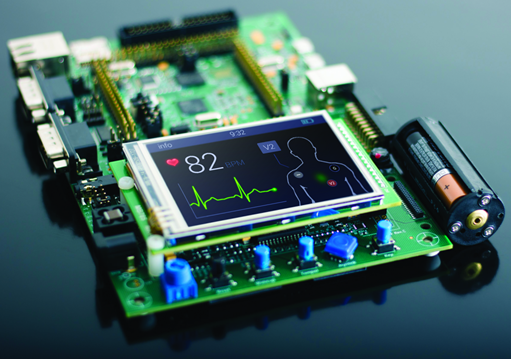
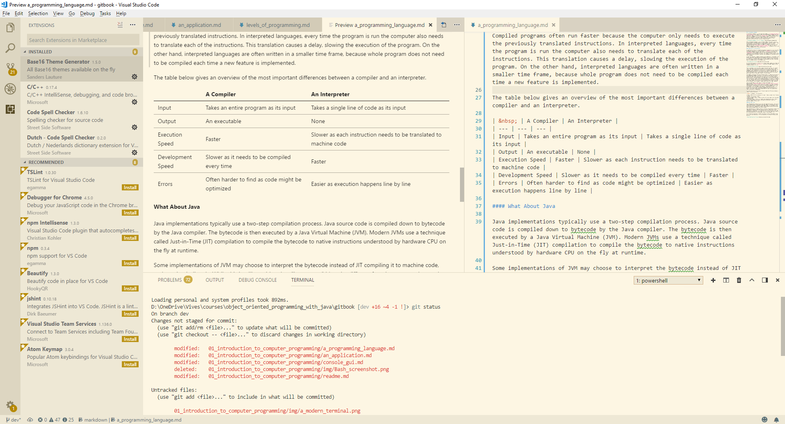

# **Introduction to Computer Programming**

## Chapter 01

### Introduction


---


---


---



---


---


---


---


---

## Common Factor?

---


---

## Introduction

- Most people don't actually know how a computer works
- They can interact with a computer
- Impossible to know how everything works
  - Do you know internal working of car?
  - Does not mean we can't drive


<!-- Source: https://www.buyautoinsurance.com/how-do-car-engines-work/ -->

---

### Writing Software

- As a programmer you will need to know a bit how a computer works
- Writing software = 
  - **describing processes and procedures**
  - **authoring of algorithms**
  - **developing lists of instructions**
  - = source code
  - = instructions that manipulate different types of data

---

### Some Definitions

> **proc-ess / Noun:** A series of actions or steps taken to achieve an end.

> **pro-ce-dure / Noun:** A series of actions conducted in a certain order.

> **al-go-rithm / Noun:** An ordered set of steps to solve a problem.

---

### Clarity of Expression

- Learning to programming is valuable
  - Even if you don't make a career out of it
  - Will help you to learn the importance of **clarity of expression**
- Why ?
  - **A computer is very dumb, but obedient**

---

### Teaching

> It has often been said that a person does not really understand something until he teaches it to someone else. Actually a person does not really understand something until after teaching it to a computer, i.e., express it as an algorithm.
> 
> *(Donald Knuth, in "American Mathematical Monthly," 81)*


---

### Fun Fun Fun

- But, most of all, **it can be lots of fun**!
- Computer = your own little entity you get to boss around all day to do all kinds of neat stuff for you.


---

## An Application

- A computer is a tool for solving problems
- An application is a **sequence of instructions** that tell a computer how to do a certain task.
- When a computer follows the instructions in a program, it is said **it executes the program**.

---

### A Spoken Language

- Before we start programming
- Use a language such as the English language to d**escribe how to do something as a series of steps**
  - Making a ham-and-cheese grilled sandwich
  - Washing a car
  - Doing laundry
  - ...

---

### A Spoken Language

- Was that easy ?
  - Did you remember all the steps?
- Useful exercise
  - Can become very complex
- Computers are just not ready for it yet
- Heck, most humans aren't even ready for it yet.

---

### Don't Blame the Computer

- Don't blame the Computer, blame the programmer
- Instead ask yourself:
  - Did I tell the computer how to do the job correctly?
  - Did I forget something?
  - Did I misinterpret the problem
  - Do I have the solution wrong?

---

### The Binary Language

- Computer don't understand recipes written on paper
- Computers are machines
  - a collection of electronic switches
  - 1 represents "on" and 0 represents "off".
- Everything that a computer does is implemented in this most basic of all numbering systems - **binary**.


---

### Machine Code

- Want to really tell a computer what to do ?
- You'd have to talk to it in binary, giving it coded sequences of 1s and 0s
  - Tell it which instructions to execute - **machine code**
- In practice, we use a programming language.


---

## A Programming Language

- A language developed to express programs
- All computers have native programming language = **machine code**
  - Tell the processor what to do
  - Impractical for us humans
  - Unique to a particular computer architecture (x86, ARM, PowerPC, ...)
  - Processor instruction set


---

### Abstraction is Key

- Abstraction is the process of hiding complex things behind a simpler interface
- **Higher level programming languages** do exactly this
  - BASIC
  - Java, C\#, C++
  - ...
- Easier for us to understand
- Less dependent on actual hardware

---

### Abstraction is Key


---

### Abstraction is Key

- These higher-level languages are said to abstract away the complexity of the underlying system.
- Higher level programming languages still need to be **translated into machine code**.
  - Compiled
  - Interpreted
  - (hybrid)

---

### Compilation

- Tool = compiler
- Translation of higher language in **architecture dependant machine code**
- Input = full source code
- Output = executable binary file that is permanently stored

---

### Compilation

- Analogy: book in different languages
- Compiler
  - Transforms source code that was written in a specific programming language into another
  - Not just machine code


---

### Interpretation

- Tool = interpreter
- Translation of higher language in **architecture dependant machine code** @ runtime
- Input = partial source code
- Output = machine code to be run at that moment

---

### Interpretation

- Analogy: human interpreter
- Interpreter
  - At no point is a complete, discrete, machine code version of the program produced


---

### Compile or Interpret

- Not always your choice
- Depends on the programming language / tool you are using
- Many are hybrid forms these days
- General
  - Compiled programs are faster to run but slower to develop
- Architecture dependency

---

#### Transpile

- Transpiler = Translate compiler
- Taking source code written in one language and transforming into another language that has a similar level of abstraction.
  - Output still has to go through another compiler or interpreter to be able to run on a machine.
- Some examples of transpilers are:
  - `tsc` or TypeScript compiler, transpiles TypeScript into JavaScript
  - `babel`, Transpiles ES6+ code to ES5 (ES6 and ES5 are different versions or generations of the JavaScript language)

---

### Let's See a Demo

- Compiled: C++
- Interpreted: JavaScript
- Transpiled: TypeScript

---

### What About C\#

- @Compile Time
  - Code is compiled to **Common Intermediate Language (CIL)**
  - Language specific C\# compiler
  - Result is executable binary: `.exe` (or `.dll` in case of a library)
- @Runtime
  - Binary can be run on system  with .NET runtime installed
  - The Just-In-Time (JIT) compiler takes CIL code as input and **transforms it into the processor specific machine code**

---


---

## Levels of Programming Languages

- Low level programming languages
  - Closer to machine code
- High level programming languages
  - Closer to natural language

---

### Assembly Language

- Most basic level
- Direct translation of the binary instructions
- Each assembly language instruction directly relates to one instruction in machine code
- So each processor architecture has its own instruction set with accompanying assembly language

---

### An assembly example

```asm
LUI  R1, #1
LUI  R2, #2
DADD R3, R1, R2
```

- Calculation `1 + 2 = 3`
- First two lines load the numbers "1" and "2" into the computer's memory
- Third instruction tells the computer to add the values together and store the result

---

### High Level Languages

- Assembly language is quite dissimilar to natural languages
  - Ultimate flexibility and performance, at the expense of complexity and development time.
- Higher level languages get closer to natural languages
  - More efficient to express
  - Look more like natural language with mathematical operations thrown in

```csharp
int x = 1 + 2;
```

---

### Graphical Programming Languages

- More than 15 years ago, Scratch was invented
  - By Mitchel Resnick and friends at MIT
  - New approach to teaching computer programming
  - Graphical programming language
  - Programs are constructed by connecting blocks
- Fun way to get started in programming
  - Not a way to create professional applications

---


---

## Applications

- Applications come in many different kinds and flavors.
  - **service in the background**: ex. webserver
  - **in a terminal**: ex. git
  - **graphical application**: ex. Visual Studio
  - **inside a browser**: ex. Scratch editor

---

### Console Applications

- Designed to be used via a **text-only computer interface**, such as
  - a text terminal, the command line interface of some operating systems (Unix, DOS, etc.)
  - or the text-based interface included with most Graphical User Interface (GUI) operating systems, such as the Win32 console in Microsoft Windows, the Terminal in Mac OS X, and xterm in Unix.
  - **Interaction happens using keyboard**

---


---

### Console Applications

- Use of console applications has greatly diminished, but not disappeared
- Some users simply prefer console based applications
- Some organizations still rely on existing console applications to handle key data processing tasks.

---

### Console Applications

- Another huge advantage of working with console applications compared to a GUI application is the **ability to automate certain tasks**.
  - Can be chained
  - Easily used in automation scripts
- Still best te develop when learning to program

---

### GUI Applications

- GUI or Graphical User Interface applications
- Require interaction with mouse and keyboard
- Not so easy to automate
- Not best choice to learn to program

---



---

## How to Become a Programmer

- Understand the problem
  - Define an appropriate solution
  - Express that solution in a computer programming language
- Practice is essential
- Don't be afraid to make mistakes
- Learn to work in team

> An expert is a man who has made all the mistakes which can be made, in a narrow field.  - *Niels Bohr*
