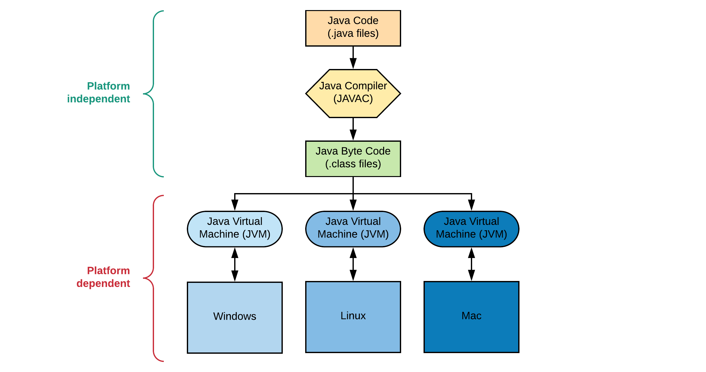
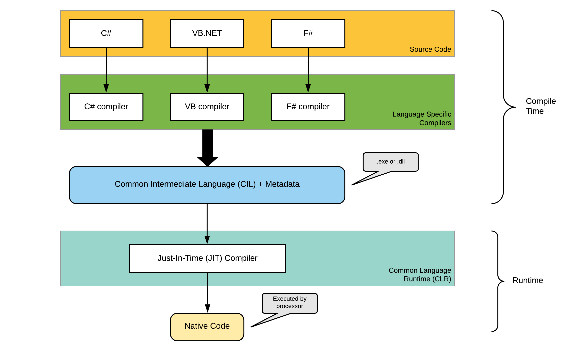

<slides link="/slides/slides-chapter-01" />

# Chapter 01 - Introduction to Computer Programming


Today, most people don't need to know how a computer works. Most people can simply turn on a computer or a mobile phone and point at some little graphical object on the display, click a button or swipe a finger or two, and the computer does something. How to interact with a computer program is all the average person needs to know.

As a human it is **impossible to know how everything works**. While people may have a deep understanding of certain things, there will always be other things they don't know or understand. Do you know how a TV actually works? Or do you know the internal workings of a car? However that does not mean we cannot watch TV or drive a car.

Since you are going to learn how to write computer programs, you will need to know a little bit about how a computer works. Your job will be trying to instruct the computer to do things you want it to do.

Basically, writing software (computer programs, commonly called applications) involves **describing processes and procedures**; it involves the **authoring of algorithms**. Computer programming involves **developing lists of instructions** - the source code representation of software. The stuff that these instructions manipulate are different types of data, e.g., numbers, words, images, sounds, etc... It has been argued that in its current state, software development is less engineering and more of an art.

> **proc-ess / Noun:** A series of actions or steps taken to achieve an end.
>
> **pro-ce-dure / Noun:** A series of actions conducted in a certain order.
>
> **al-go-rithm / Noun:** An ordered set of steps to solve a problem.

An important reason to consider learning about how to program a computer is that the concepts underlying this will be valuable to you, regardless of whether or not you go on to make a career out of it. One thing that you will learn quickly is that **a computer is very dumb, but obedient**. It does exactly what you tell it to do, which may not necessarily be what you wanted. **Programming will help you learn the importance of clarity of expression**.

> It has often been said that a person does not really understand something until he teaches it to someone else. Actually a person does not really understand something until after teaching it to a computer, i.e., express it as an algorithm.
>
> *(Donald Knuth, in "American Mathematical Monthly," 81)*

<!-- How to break this? -->

> Computers have proven immensely effective as aids to clear thinking. Muddled and half-baked ideas have sometimes survived for centuries because luminaries have deluded themselves as much as their followers or because lesser lights, fearing ridicule, couldn't summon up the nerve to admit that they didn't know what the Master was talking about. A test as near foolproof as one could get of whether you understand something as well as you think is to express it as a computer program and then see if the program does what it is supposed to. Computers are not sycophants and won't make enthusiastic noises to ensure their promotion or camouflage what they don't know. What you get is what you said.
>
> *(James P. Hogan in "Mind Matters")*

But, most of all, **it can be lots of fun**! You can think of a computer as your own little entity you get to boss around all day to do all kinds of neat stuff for you.

## An Application

A computer is a tool for solving problems with data. A program or an application is a **sequence of instructions** that tell a computer how to do a certain task. When a computer follows the instructions in a program, it is said **it executes the program**.

Before we see what a computer programming language looks like, let's use a spoken language such as the English language to describe how to do something as a series of steps. A common exercise that really gets you thinking about what computer programming can be like is to **describe a process** you are familiar with.

Try for example to come up with a sequence of instructions to tell someone how to clean a car. Don't leave out any steps, or put them in the wrong order.

Was that easy? Did you remember all the steps? Maybe you forgot to tell me to use a sponge to rub the soap on the car. Now I might be rubbing a car with my bare hands. Of course, you say, a person wouldn't be that dumb. But a computer is that dumb. A computer will only do what you tell it to do. This might make programming frustrating at first, but it's also relieving in a way: if you do everything right, you know exactly what the computer is going to do, because you told it to.

While this is certainly a useful exercise you can already feel that programming in a natural language can become very complex and computers are just not ready for it yet. Heck, most humans aren't even ready for it yet.

> So what will be the result? I expect natural language programming will eventually become ubiquitous as a way of telling computers what to do. People will be able to get started in doing programming-like tasks without learning anything about official "programming" and programming languages: they'll just converse with their computers as they might converse with another person.
>
> *Stephen Wolfram*

::: warning 😱 Don't blame the Computer, blame the programmer
As a future programmer you should never state that the computer is doing something wrong when your application fails, crashes or does something unexpected. You should instead ask yourself, did I tell the computer how to do the job correctly? Did I forget something? Did I misinterpret the problem or do I have the solution wrong?
:::

Of course, computers don't understand recipes written on paper. Computers are machines, and at the most basic level, they are a collection of switches - where 1 represents "on" and 0 represents "off". Everything that a computer does is implemented in this most basic of all numbering systems - **binary**. If you really wanted to tell a computer what to do directly, you'd have to talk to it in binary, giving it coded sequences of 1s and 0s that tell it which instructions to execute - called **machine code**).


However, this is nearly impossible. In practice, we use a programming language.


## A Programming Language

A programming language is, as the name would suggest, **a language developed to express programs**. All computers have a native programming language that they understand, commonly referred to as **machine code**. However, machine code is a difficult language for us to follow: amongst a number of difficulties, it is typically expressed in the binary number system, and it is unique to a particular computer architecture (thus two different computers could potentially use two different versions of machine code).


Machine code is not really easy to read is it? Machine codes tell the processor what to do, where to read and write data and what operations to perform on this data. Every instruction is represented by a number. To complicate things, the machine codes differ among processor architectures (x86, ARM, PowerPC, ...).

To avoid all this complexity, some smart people started to create **abstractions** that allowed other programmers to write software in higher level languages.


Other programming languages, such as Assembly, BASIC, Java, C\# and C++ exist to provide a better interface between us, the programmers, and the computer. They allow programs to be expressed in a language that is easier for us to understand and potentially common to a number of computer architectures, but which can still be **translated into machine code**. These higher-level languages are said to abstract away the complexity of the underlying system. In order for this to happen, a computer must either **compile or interpret** programs written in one of these languages before they can be executed.

### Compilation vs Interpretation

An application written in a compiled programming language has to be translated into machine code before it can be executed. A **compiler** translates the programming language to machine code, which is then permanently stored as an **executable**. As an analogy, think of a novel that was written in one language and then translated into another. For example, the Harry Potter novels were written in British English, and were then subsequently translated into 67 other languages.

In much the same way, a computer program can be compiled (or "translated") into machine code, and it may potentially be compiled into different architectures (or "dialects") of machine code to suit different computers. Each translation will be a unique version of the program, in the same way that each translated book is a unique version of the original novel.


::: tip 🤹 About a Compiler
A compiler is an application that actually transforms source code that was written in a specific programming language into another - not just into machine code. Some compilers transform the input source code into for example an intermediate language (IL) that is later interpreted or compiled into machine code.
:::

An interpreted program is stored in it's original human-readable form. When the program is executed, an **interpreter** translates the human-readable content to machine code as it is run.


This is analogous to the role that a human interpreter performs. For example, rather than translating the British English version of Harry Potter into Latvian and then providing the Latvian version to someone who understands the language, (as per compilation), we could hire a translator who knows both British English and Latvian. The translator may choose to read each line from the British English novel, translate each line (one at a time) into Latvian, and, as each line is translated, relate it to the listener.

The computer interpreter performs the same function: it reads an instruction in one programming language, translates it into machine code, and then executes the machine code version. Once that instruction is out of the way it moves along to the next, performing exactly the same task, in much the same way that the interpreter of the Harry Potter novel would move on to the next line once the first has been related. Unlike compiled programs, at no point is a complete, discrete, machine code version of the program produced: at any point in time only a small number of instructions exist as machine code versions, and these will be removed from the computer's memory when they are no longer required.

There are advantages for both types of software development. As a generalization, **compiled programs are faster to run but slower to develop**. Compiled programs often run faster because the computer only needs to execute the previously translated instructions. In interpreted languages, every time the program is run, the computer also needs to translate all of the instructions. This translation causes a delay, slowing the execution of the program. On the other hand, interpreted languages are often written in a smaller time frame, because the whole program does not need to be compiled each time a new feature is implemented.

Below is an overview of the most important differences between a compiler and an interpreter.


#### Transpilers

Transpilers of translate compilers are also known as source-to-source compilers. In essence they are a subset of compilers which take in a source code file and convert it to another source code file in some other language or a different version of the same language. The output is generally understandable by a human. This output still has to go through another compiler or interpreter to be able to run on a machine.

**Transpiling** is a specific term for taking source code written in one language and transforming into another language that has a similar level of abstraction.

Some examples of transpilers are:

* `tsc` or TypeScript compiler, transpiles TypeScript into JavaScript
* `babel`, Transpiles ES6+ code to ES5 (ES6 and ES5 are different versions or generations of the JavaScript language)

#### What About Java

Java implementations typically use a two-step compilation process. Java source code is compiled down to bytecode by the Java compiler. Originally the bytecode was then interpreted by a Java Virtual Machine (JVM). These days, the modern JVMs use a technique called **Just-in-Time** (JIT) compilation to compile the bytecode to native instructions understood by hardware CPU's on the fly at runtime.

Older implementations of JVM may choose to interpret the bytecode instead of JIT compiling it to machine code, and running it directly. While this is still considered an "interpreter", it's quite different from interpreters that read and execute the high level source code (i.e. in this case, Java source code is not interpreted directly, the bytecode, output of Java compiler, is.)

It is technically possible to compile Java down to native code **ahead-of-time** and run the resulting binary. This is the case with applications running on smartphones. The compilation process takes place after the package is downloaded from the store.



#### What About C\#

The C\# compilation process consists of two different phases before the machine code can be executed by a processor.

* In a first step (at compile time) your code is transformed **from C\# to the Common Intermediate Language (CIL)** by the language specific C\# compiler. The result is an executable binary `.exe` (or `.dll` in case of a library). The same happens when you write your code in for example VB.net, but then the VB compiler is used to generate the CIL code.
* This binary can then be used on another system that has the required .NET runtime installed. The Just-In-Time (JIT) compiler will take the CIL code as input and **transform it into the processor specific machine code** on which the binary is being executed.



::: tip 📃 The .NET Compilation Process
A nice article about this whole process can be found at [Understanding .NET Just-In-Time Compilation](https://www.telerik.com/blogs/understanding-net-just-in-time-compilation) or if you rather watch a small video fragment (first 10 minutes) about this process [.NET Framework - Compilation Process by Tutorials Point (India) Pvt. Ltd.](https://www.youtube.com/watch?v=6oYcZ-D8Fyw).
:::

## Levels of Programming Languages

Programming languages are described in levels. **Low-level languages** are close to machine code, **high-level programming languages** are closer to natural languages. At the most basic level (or "lowest level") is **assembly language**. This language is just a direct translation of the binary instructions the computer executes - each assembly language instruction directly relates to one instruction in machine code. Thus just as every kind of processor architecture has its own machine code, each processor architecture also has its own assembly language.

An assembly example:

```asm
LUI  R1, #1
LUI  R2, #2
DADD R3, R1, R2
```

This just did the calculation `1 + 2 = 3`. Very roughly, the first two lines load the numbers "1" and "2" into the computer's memory, and the third instruction tells the computer to add the values together and store the result.

As you can see from the example, assembly language is quite dissimilar to natural languages. **Higher level languages** both get closer to natural languages and provide more efficient methods of expressing the instructions - thus to implement a given feature for a program in assembly language almost always requires more code than implementing the same feature in a higher level language such as C, C++, C\# or Java. Assembly language gives the programmer the ultimate flexibility and performance, at the expense of complexity and development time.

High-level languages look more like natural language with mathematical operations thrown in. These languages require more translation before the computer will understand them, but they are much easier to write. Here's what the same program might look like in a high-level language such as C\#:

```csharp
int x = 1 + 2;
```

The variation between different programming languages can be quite extensive.

### Graphical Programming Languages

A little less than fifteen years ago, Mitchel Resnick and friends at MIT introduced a programming environment called Scratch. It provides a new approach to teaching computer programming through a graphical user interface that eliminates the possibility of making certain mistakes common in text-based programming.

Programs are constructed by connecting blocks, each representing some functionality available in the system.


One of Scratch's strengths is the ease with which students can construct games and animated simulations and stories. Another strength is the Scratch website itself which provides access to many tutorials and a community of users with programs they've written.

Block-based programming is a great way to get started. But, as the size of the programs you want to write grows or you need a feature not available in Scratch, it's time to get your hands dirty and switch to text-based programming.

## Console and GUI Applications

Applications come in many different kinds and flavors. Some application run as a **service in the background** (take for example a webserver). Some run **in a terminal** (take for example GIT). Other run as **graphical application** (take for example Visual Studio Code) or **inside a browser** (take for example the Scratch editor).

A console application is a computer program designed to be used via a text-only computer interface, such as

* a text terminal, the command line interface of some operating systems (Unix, DOS, etc.)
* or the text-based interface included with most Graphical User Interface (GUI) operating systems, such as the Win32 console in Microsoft Windows, the Terminal in Mac OS X, and xterm in Unix.

A user typically interacts with a console application using only a keyboard and display screen, as opposed to GUI applications, which normally require the use of a mouse or other pointing device. Many console applications such as command line interpreters are command line tools, but numerous text-based user interface (TUI) programs also exist.


As the speed and ease-of-use of GUI (Graphical User Interface) applications have improved over time, the use of console applications has greatly diminished, but not disappeared. Some users simply prefer console based applications, while some organizations still rely on existing console applications to handle key data processing tasks.

The ability to create console applications is kept as a feature of modern programming environments such as Visual Studio and the .NET Framework on Microsoft Windows because it greatly simplifies the learning process of a new programming language by removing the complexity of a graphical user interface.

::: tip 👨‍🏭 Task Automation
Another huge advantage of working with console applications compared to a GUI application is the **ability to automate certain tasks**. Command line tools and applications can easily be automated and chained to other tasks. It is very easy to create a small script to automate certain processes. One could for example schedule a task that automatically backups our system every few days. Automating GUI applications is not always easy.
:::

For data processing tasks and computer administration, these programming environments represent the next level of operating system or data processing control after scripting. If an application is only going to be run by the original programmer and/or a few colleagues, there may be no need for a pretty graphical user interface, leaving the application leaner, faster and easier to maintain.


## How to Become a Programmer

A programmer is generally tasked with producing a **solution to a problem** via a computer program, which can be reused as various particular instances of that problem arise. To accomplish this task, the programmer therefore must be able to **understand the problem**, derive an **appropriate solution**, and then be able to effectively **express that solution in a computer programming language**.

The first prerequisite to becoming a programmer is to develop a strong background in **problem solving** as is often required in fields such as mathematics and engineering. The ability to formally, concisely, and clearly state a problem and then derive its solution is a fundamental skill that precedes the process of any computer coding. The study of computer algorithms focuses on the generalized problem solving approaches often applicable in computer science. Techniques such as programming design patterns provide practical templates which often help frame solutions in an understandable, reusable manner. In general, there are many different classes of problems in computer science that require different techniques to solve effectively: having a strong repertoire of approaches aids in finding good solutions.

The second prerequisite to becoming a programmer is **knowing a programming language** with which to express a particular solution to a problem. A programming language is a tool, which practice will help form into expertise. Learning multiple languages can often be helpful as the process will demonstrate the particular strengths of different approaches to solving particular classes of problems.

In both these areas, **practice is essential**. Exposure to a wide variety of problems and tools to solve them will increase your understanding of the field as a whole, to judge for yourself the relative merit of techniques in the field, as well as to discover unique, new approaches to addressing the problems of computer science. As with the practice of any new skill, do not be afraid to make mistakes, to redo earlier work, or to stumble along the way to expertise.

**Don't be afraid to make mistakes** because you will make them - constantly and for the rest of your career. Even the best programmers make mistakes regularly (if they try to say differently then they are either lying or deluded). Making mistakes is really part of the programming process. Someone said, to find a solution to a problem you must partly solve the problem. So you'll probably end up rewriting parts of your programs several times. Part of what distinguishes better programmers is their ability to catch at least some mistakes before they become a problem. Nobody can catch them all without help. Well, nobody can catch them all: there is no bug-free program.

> An expert is a man who has made all the mistakes which can be made, in a narrow field.
>
> *Niels Bohr*

Learn to work with others in a **team** environment. People have different strengths and weaknesses and a good team can bring together people whose strengths and weaknesses are complementary. The members of a team can teach each other. Most importantly, teams can tackle problems that would be too big for an individual. Beware, though, teams are not easy to lead and you can easily make a project a disaster by just gathering as many people as you can. If you want to work with a team, come with a solid design and a strong vision of what the project should look like when it's finished. If other members of the team suggest new ideas, take them with consideration but do not fall in the feature-greed pitfall, e.g. your project is never finished because the final goal grows beyond all proportions.
