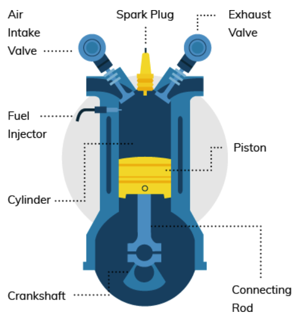
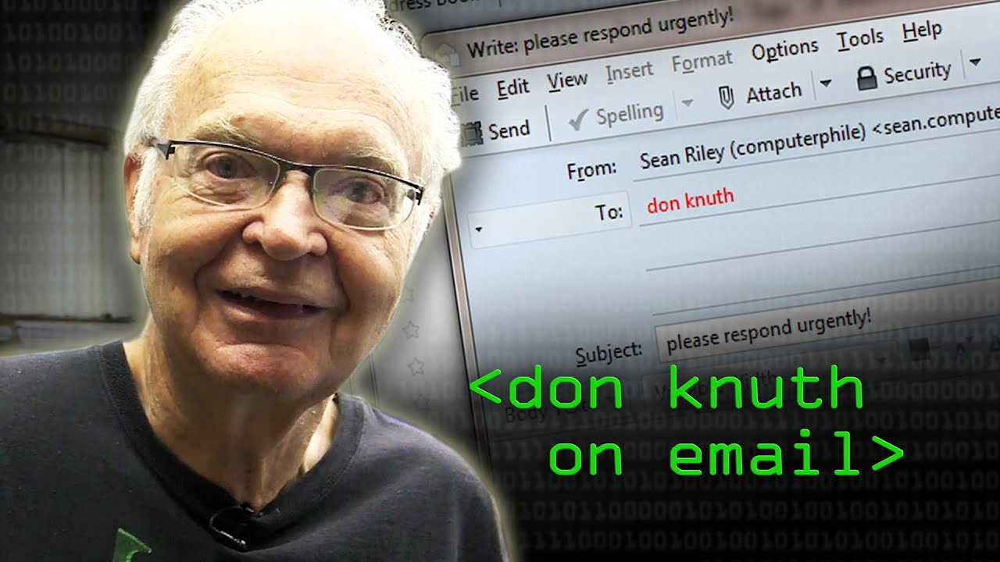
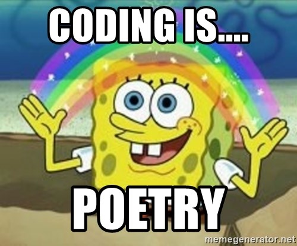
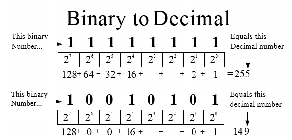

# **Introduction to Computer Programming**

## Chapter 01

---

## Introduction

- Most people don't actually know how a computer works
- They can interact with a computer
- Impossible to know how everything works
  - Do you know internal working of car?
  - Does not mean we can't drive

<!-- Source: https://www.buyautoinsurance.com/how-do-car-engines-work/ -->

---

### Writing Software

- As a programmer you will need to know how a computer works
- Writing software = 
  - **describing processes and procedures**
  - **authoring of algorithms**
  - **developing lists of instructions**
  - = source code
  - = instructions that manipulate different types of data

---

### Some Definitions

> **proc-ess / Noun:** A series of actions or steps taken to achieve an end.

> **pro-ce-dure / Noun:** A series of actions conducted in a certain order.

> **al-go-rithm / Noun:** An ordered set of steps to solve a problem.

---

### Clarity of Expression

- Learning to programming is valuable
  - Even if you don't make a career out of it
  - Will help you to learn the importance of clarity of expression
- Why ?
  - **A computer is very dumb, but obedient**

---

### Teaching

> It has often been said that a person does not really understand something until he teaches it to someone else. Actually a person does not really understand something until after teaching it to a computer, i.e., express it as an algorithm.
> 
> *(Donald Knuth, in "American Mathematical Monthly," 81)*

---

### Fun Fun Fun

- But, most of all, **it can be lots of fun**!
- Computer = your own little entity you get to boss around all day to do all kinds of neat stuff for you.

---

## An Application

- A computer is a tool for solving problems
- An application is a **sequence of instructions** that tell a computer how to do a certain task.
- When a computer follows the instructions in a program, it is said **it executes the program**.

---

### A Spoken Language

- Before we start programming
- Use a language such as the English language to d**escribe how to do something as a series of steps**
  - Making a ham-and-cheese grilled sandwich
  - Washing a car
  - Doing laundry
  - ...

---

### A Spoken Language

- Was that easy ?
  - Did you remember all the steps?
- Useful exercise
  - Can become very complex
- Computers are just not ready for it yet
- Heck, most humans aren't even ready for it yet.

---

### Don't Blame the Computer

- Don't blame the Computer, blame the programmer
- Instead ask yourself:
  - Did I tell the computer how to do the job correctly?
  - Did I forget something?
  - Did I misinterpret the problem
  - Do I have the solution wrong?

---

### The Binary Language

- Computer don't understand recipes written on paper
- Computers are machines
  - a collection of electronic switches
  - 1 represents "on" and 0 represents "off".
- Everything that a computer does is implemented in this most basic of all numbering systems - **binary**.

---

### Machine Code

- Want to really tell a computer what to do ?
- You'd have to talk to it in binary, giving it coded sequences of 1s and 0s
  - Tell it which instructions to execute - **machine code**
- In practice, we use a programming language.

---

