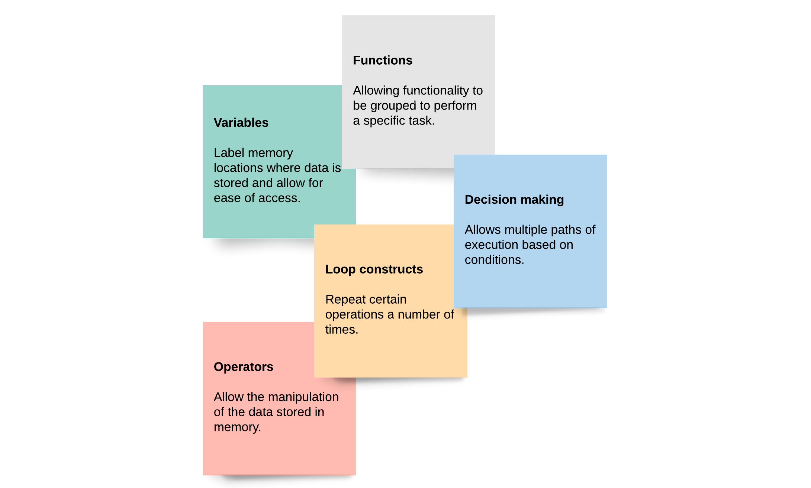
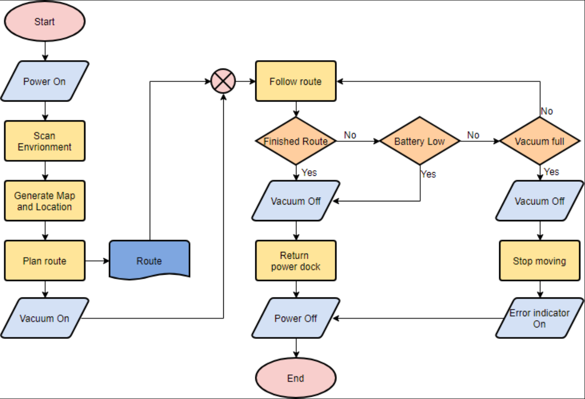
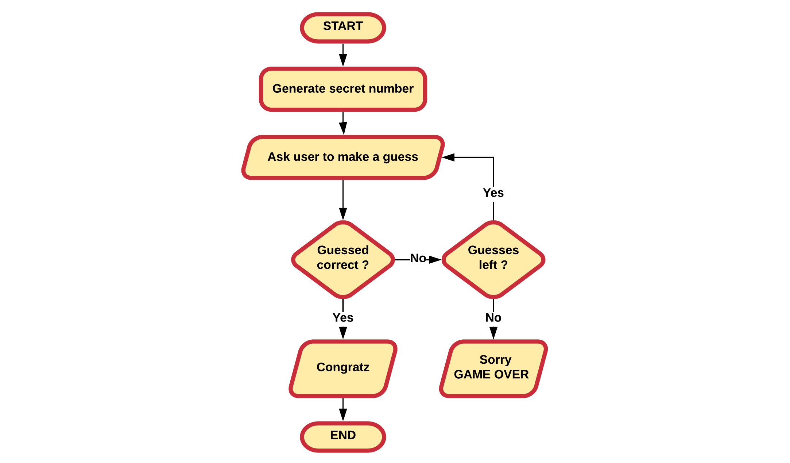
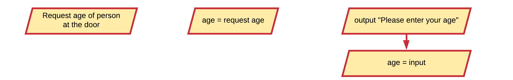
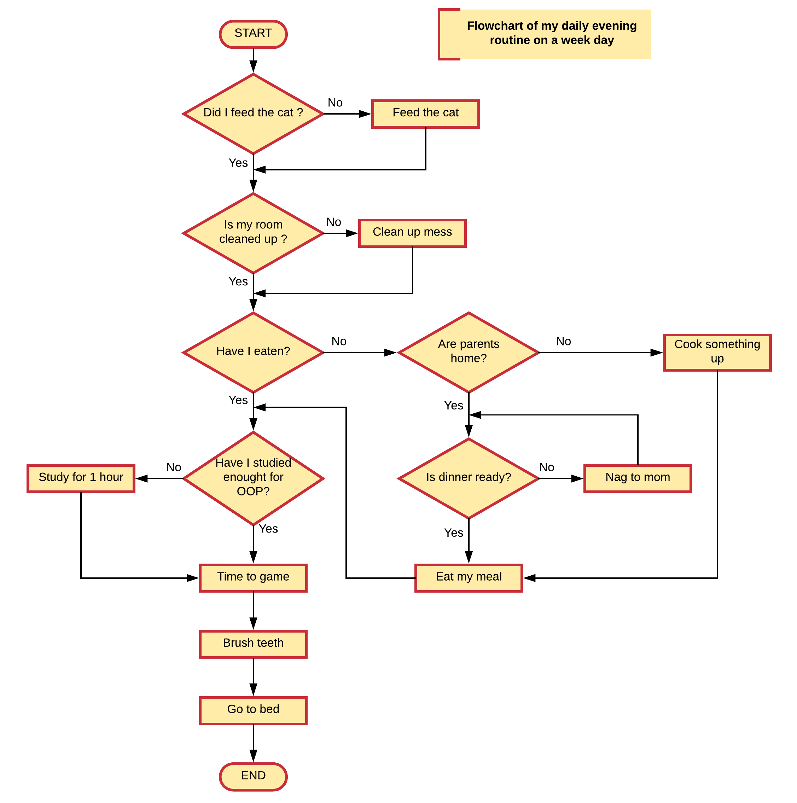
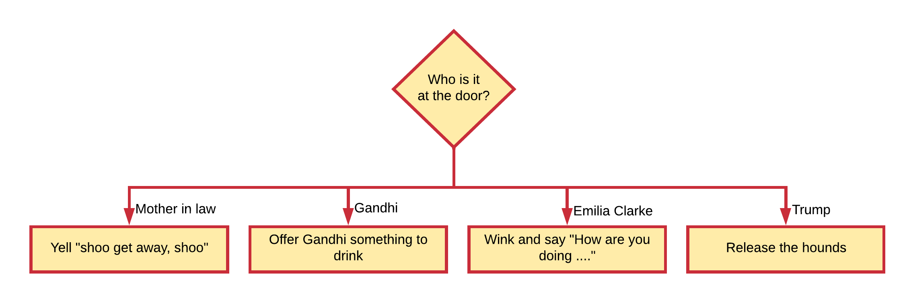
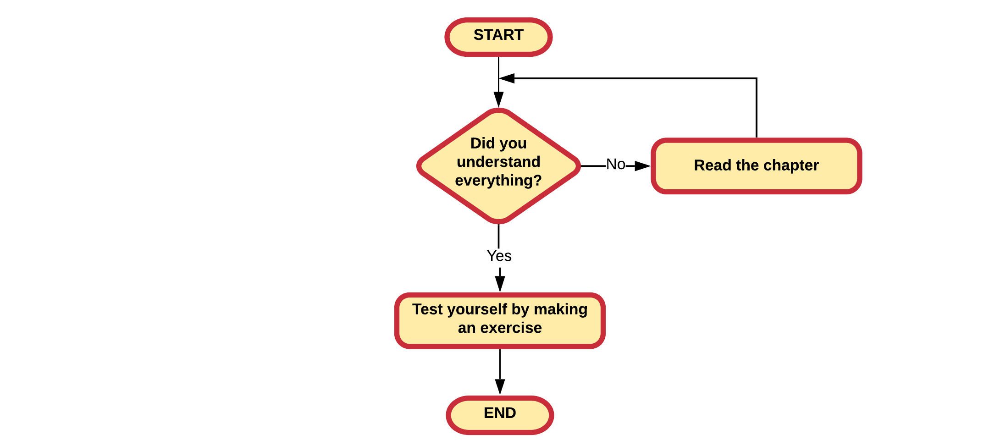
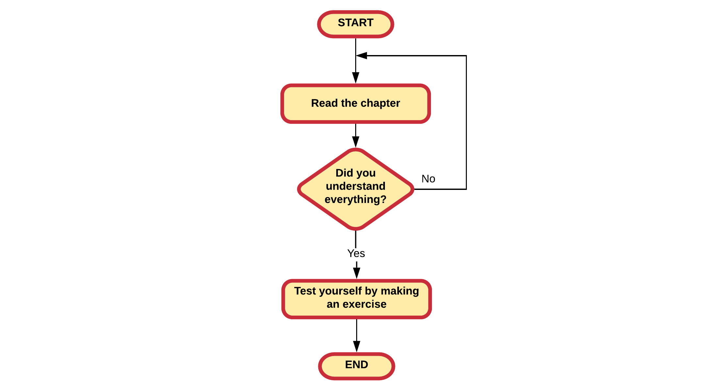
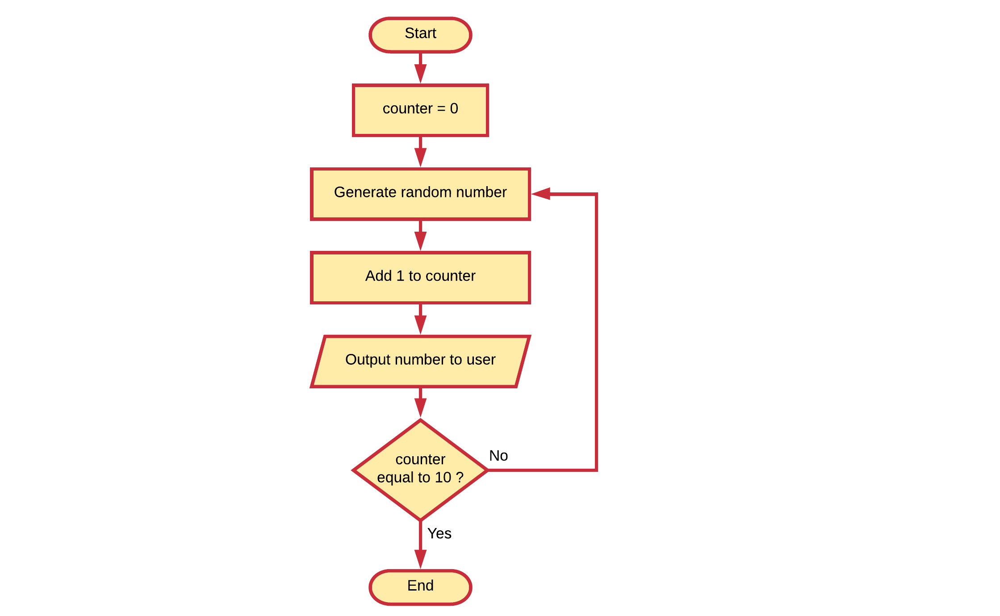
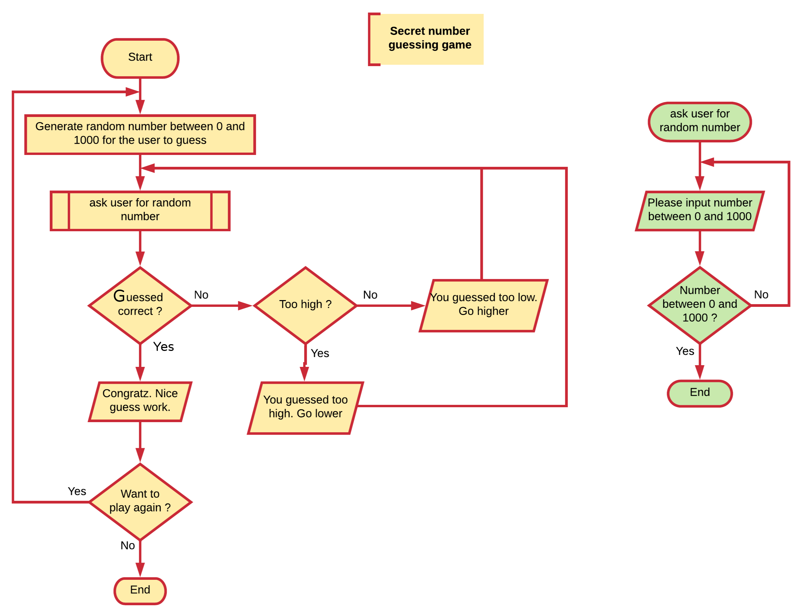

<!-- <slides link="/slides/slides-chapter-02" /> -->

# Chapter 02 - Basic Building Blocks



Almost every programming language out there has a number of basic building blocks required to solve problems and build programs.

* **Variables** label memory locations where data is stored and allow for ease of access.
* **Operators** allow the manipulation of the data stored in memory.
* **Decision making** allows multiple paths of execution based on conditions.
* **Loop constructs** repeat certain operations a number of times.
* **Functions** allowing functionality to be grouped to perform a specific task.

More high-level programming languages introduce more advanced tools that allow a developer to create applications for more complex problems without making the application overly complex. Some common concepts are classes, inheritance, interfaces, multi-threading, collections, lambda-expressions, generics, ... Some of these will be introduced in the more advanced chapters of this course.

## Flowcharts

Flowcharts are **a structured graphical way to document process flow**. Flowcharts already exist since 1921 and were introduced by Frank and Lillian Gilbreth in the presentation "Process Charts: First Steps in Finding the One Best Way to do Work". The Gilbreths' tools quickly found their way into industrial engineering curricula. In the early 1930s, an industrial engineer, Allan H. Mogensen began to train business people in the use of some of the tools of industrial engineering.

Flowcharts allow developers to document algorithms, application logic, data flows, ... in a visual manner. Graphical representations have proven to be very useful in the software development world, even to people who don't know how to program.

**Consider an example:** an autonomous vacuum robot can automatically create a map of a room so it can build a route to vacuum that room.



Take the following computer guessing game as an example. You do not need to be a programmer to understand how it works.



### Common used Symbols

A quick overview of the most common used symbols is given below.

A **terminal** indicates the start or ending of an application, sub-process, ... It is most often represented using a rounded (fillet) rectangle. They usually contain the word "Start" or "End", or another phrase signaling the start or end of a process.


A basic rectangle is used to represent a **process step**. This is an action or operation that changes a value, takes an internal action, ...


The flow of operation is indicated using a **flowline**. This is a line connecting one symbol with another. While arrowheads are only required if the flow is not the standard top-to-bottom or left-to right, they are almost always added anyways.


A parallelogram is known as a **data input/output** node. Input can come from the terminal (console) or another source. Output can for example be printing a text to the user via the terminal, or writing something to a file. Some developers don't bother to use the parallelogram shape and just use a standard rectangle.


When multiple paths of execution can be taken based on a condition, a diamond is used to represent a **decision**. The operation is commonly a *yes/no* question or *true/false* test.


A **predefined process** shows a named process which is defined somewhere else. It is represented as a rectangle with double-struck vertical edges. The name of the predefined process is placed inside the inner rectangle bounds.


A **note** is used to clarify something in your flowchart. It can give a general description of the process or elaborate a certain action or part of your process. Use where needed.


There are more flowchart symbols, but these are the ones you will need the most.

### Not a strict standard

Flowcharts are a bit of a free-for-all tool to document a process. This means that if you let 5 developers model a process using flowcharts, you will get 5 different flowcharts. They will all model the same process and use the same symbols but the actual implementation of the blocks will be different.

Take a quick look at the examples below. They all ask the user for his/her age and store it somewhere for later processing but the actual notations inside the symbols use different approaches.



One is not more correct than the other. They are just written from a different view of the process and each developer will need to make this out for him/herself. There are only two requirements: it should be informative and understandable. There is no use in creating documentation that makes things less clear.

## Variables

The base of almost any computer program is the manipulation of data. Of course before a program can manipulate data it needs to be able to store it. For this it can use the computer memory. This computer memory is accessed via **variables**. Variables are used to access the information stored in the computer memory and allow it to be referenced and manipulated in a computer program.

Variables also provide a way of labeling data with a descriptive name, so application code can be understood more clearly by the reader and other programmers. It is helpful to think of variables as containers that hold information. Their sole purpose is to label and store data in memory. This data can then be used throughout your program.

::: tip Definition of a variable
A symbolic name associated with a memory location that stores the actual data which may be changed through the variable.
:::

### Variables in Math

As a student you actually have already been using variables for quite a while. When doing math you also use symbolic names as variables. In the example below, `x`, `y` and `p` are all variables.

```text
x = 15
y = 13

p = x * y
```

Or when defining a linear equation

```text
y = f(x) = ax + b
```

### Using variables

Variables and the data they hold are used for all sorts of things. Producing new values based on the available data, making decisions, outputting information to the user, and so on.

Consider the guessing game example again from the start of this chapter:


Several pieces of information can be identified here which are probable stored in the memory of the computer and made available through variables:

* the secret number
* the name of the player
* the number of tries left
* the number the player entered

While not directly apparent, **an application typically handles a lot of information via variables**. This is the reason why variables are a basic building block of every programming language.

## Operators

Most programs will perform all sorts of operations on data they have at their disposal. It is often stated that **applications process data**. For this processing, a programming language needs **operators**. Many of the operators you will already be familiar with from Math.

While different programming languages use different operators, the most basic math operators are most often available. These are easy to understand because they have the **same functionality as in math**. The following operators are the most common ones to do basic math operations:

| Operator | Meaning |
| --- | --- |
| `=` | Assignment operator |
| `+` | Addition operator |
| `-` | Subtraction operator |
| `*` | Multiplication operator |
| `/` | Division operator |

### Body Mass Index example

Consider a small example application that calculates the BMI (Body Mass Index) of a person. This is a measure of body fat based on height and weight that applies to adult men and women. It is an attempt to quantify the amount of tissue mass (muscle, fat, and bone) in an individual, and then categorizes that person as underweight, normal weight, overweight, or obese based on that value.

The BMI is defined as the weight divided by the square of the body height, and is universally expressed in units of `kg/m2`, resulting from mass in kilograms and height in meters.

First, one needs to identify the information required from the user:

* the weight of the person in kilograms
* the height of the person in meters

Next the BMI can be calculated using the formula `bmi = weight / (height * height)`, where `/` is the division operator and `()` are braces that group calculations just as in Math.

For this small program one would need at least three variables: `weight`, `height` and `bmi`.

This application could be modelled using the flowchart shown below:


## Decision Making

Computer programs often have different things to do based on a certain situation. At certain points in the code, a decision has to be made. This requires that a **decision making** construct is available.

This is also called **branching** (think about the branches of a tree). A branch is an instruction in a computer program that can cause a computer to begin executing a different instruction sequence and thus deviate from its default behavior of executing instructions in order.

A decision asks a question, more commonly referred to as the **condition**. The answer to the question determines which arrow you follow out of the decision shape. Always make sure to label the branch arrows coming from a decision with *yes/no* or *true/false*.

Take a good look at the example below of a possible students evening routine. Take a note on the different decisions that are shown.



Now you should have an idea where the term branching comes from.

The arrows flowing from the decision shape are usually labeled with *Yes*, *No* or *True*, *False*. But you can label them any way you want as long as the meaning is clear.

At least two arrows should emerge from a decision symbol. If your choice is not binary, add more arrows as shown in the next example.



## Loop Constructs

**Software is perfect for executing repetitive tasks** (things that have to be done multiple times). To be able to do things multiple times, a programming languages needs some sort of **loop constructs**.

Programming languages often support multiple looping constructs, such as

* for loops
* while loops
* foreach loops
* do-while loops
* ...

While these can all be modelled using flowcharts, one doesn't actually have to know them to be able to use them in a flowchart.

All one needs is a condition in a flowchart that is checked. In one of the outcomes, the loop itterates again, in the other, the loop construct is quit. Which outcome that is used to quit the loop depends on the problem at hand.

Take a look at the example below. Here the process consists of testing yourself if you understood the lesson at hand. If you did not understand everything, you should read the chapter. Once you think you understood everything, you can stop reading and complete some exercises to test yourself.



Notice how the check came before the action of reading the chapter. Now take a look at the next implementation where reading the chapter is done before the check. Basically the outcome is the same: you understood the content of the chapter and you completed some exercises. However the subtle difference here is that you may have the read the chapter while you may already have known everything inside.



In the previous two examples, the looping condition is the check if you understood the chapter. The end result to that question can be one of two things: `yes` or `no`. A condition will always need to be resolved to `yes/no` or `true/false` (in computer programming). There will never be a `maybe`.

Often loops are created using a counter mechanism. Take the next example, which will output 10 randomly generated numbers for the user.



## Functions

Every programming language lets you create **named blocks of code that perform a specific task** called **functions**. Using the name of the function, it can be **called** from other parts of the application. Calling a function is asking the compiler/interpreter to execute the code inside of the function.

Functions usually **take in data**, **process it**, and **return a result**. How the function does this is most of the time only important to the people that created the functions. Other programmers are often only interested in how to use the function and what the result will be. For this same reason, functions are often called **black-boxes**.


Ideally, a function performs a single well defined task. Functions provide better modularity for your application, make code more understandable and allow more complex tasks to be abstracted away.

Programming languages often provided libraries with many built-in functions that can be used by the developer. On the other hand, as a developer you are also able to create your own functions.

::: tip Definition of a function
A function is a named **self contained** block of code that performs a specific task.
:::

Based on the type of programming language, a distinction can be made between functions, sub-routines, procedures and methods. While each is a bit different they all have the same basic concept: a **self contained** entity of code that accomplish a specific task.

### Square Root function

A well-known example of a function is the square root math operation. Every programming language that supports math operations will have some sort of function readily available for you to calculate the square root of a value.


This example also proves the black box principle. While there are many algorithms available to determine the square root of a number, we as a user of the square root function don't care how the result is accomplished. Of course we need to know what inputs the function requires and what output it will generate.

### Functions in flowcharts

Functions in flowcharts are actually called **sub-processes**. Each sub-process is a named flowchart on itself that can be used from inside another (sub-)process. The inputs and outputs of the subprocess are of less importance when using or defining sub-processes in flowcharts. These are more language specific. Calling a sub-process is achieved by placing a rectangle with double-struck vertical edges with the name of the sub-process inside of it.

Take a look at the example flowchart below. It is a more extended version of the guessing game example introduced previously. The game generates a random number between 0 and 1000. The user is asked to guess the number, while the game states if the user should guess higher or lower.


