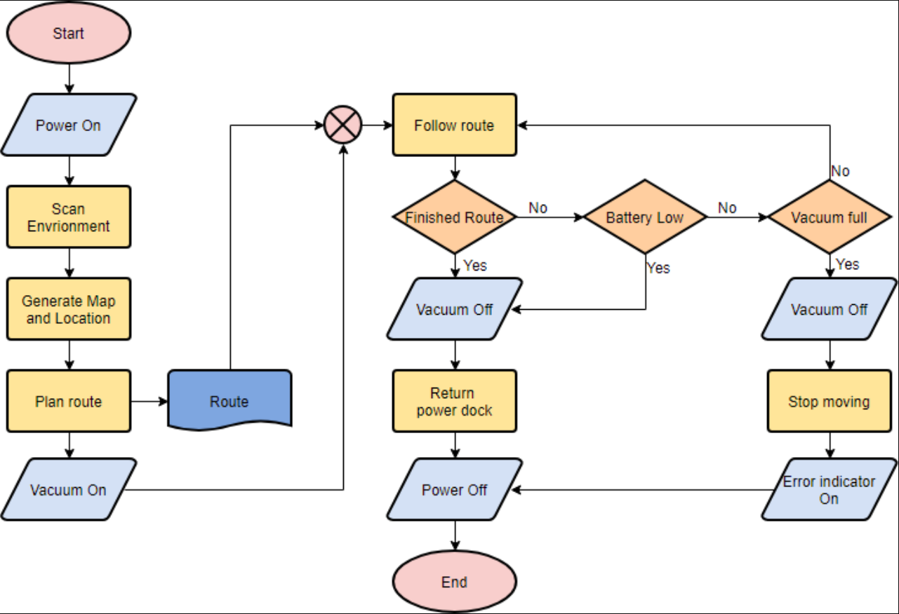
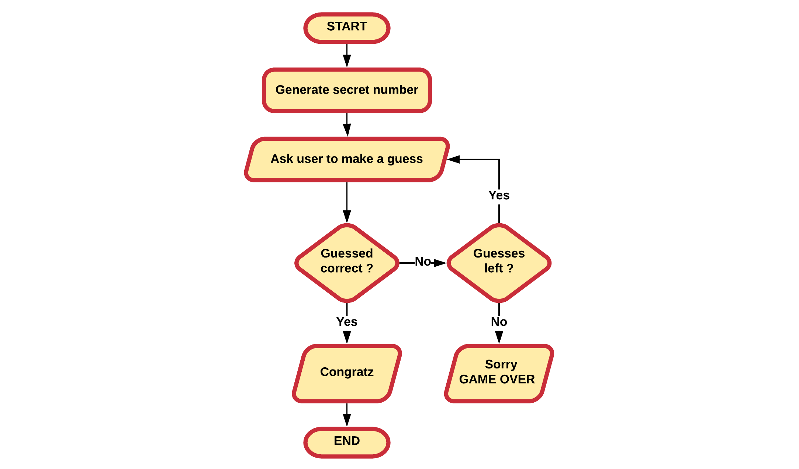

# **Introduction to Computer Programming**

## Chapter 02

### Basic Building Blocks

*These slides are not finished yet*

---

---

## Introduction

- Basic building block available in almost any programming language
  - **Variables** label memory locations where data is stored and allow for ease of access.
  - **Operators** allow the manipulation of the data stored in memory.
  - **Decision making** allows multiple paths of execution based on conditions.
  - **Loop constructs** repeat certain operations a number of times.
  - **Functions** allowing functionality to be grouped to perform a specific task.

---

## Introduction

- High-level programming languages introduce more advanced tools
  - classes
  - inheritance
  - interfaces
  - multi-threading
  - collections
  - lambda-expressions
  - generics
  - ...

---

## Flowcharts

- **A structured graphical way to document process flow**
  - Exist since 1921
- Allow us to **document things in a visual manner**
  - algorithms
  - application logic
  - data flows
- Graphical representations have proven to be very useful in the software development world

---

## Examples

- Let's take a look at some examples

---

---

---

## Examples

- You do not need to be a programmer to understand the basic of how it works.

---

### Common used Symbols

- **Terminal**
  - indicates the start or ending of an application or sub-process
  - rounded (fillet) rectangle.
  - usually contains the word "Start" or "End"

---

### Common used Symbols

- **Process step**
  - basic rectangle
  - action or operation that changes a value, takes an internal action, ...

---

### Common used Symbols

- **Flowline**
  - indicates the flow of operation
  - line connecting one symbol with another
  - arrows are optional if the flow is not the standard top-to-bottom or left-to right
    - almost always added

---

### Common used Symbols

- **data input/output**
  - parallelogram
  - Input can come from terminal or another source
  - Output can for example be
    - printing a text to the user via the terminal
    - writing something to a file
  - *Some developers just use a standard rectangle*

---

### Common used Symbols

- **decision**
  - diamond
  - multiple paths of execution can be taken based on a condition
  - commonly a *yes/no* question or *true/false* test.

---

### Common used Symbols

- **predefined process**
  - rectangle with double-struck vertical edges.
  - The name of the predefined process is placed inside the inner rectangle bounds.

---

### Common used Symbols

- **note**
  - used to clarify something in your flowchart.

- There are more flowchart symbols, but these are the ones you will need the most.
