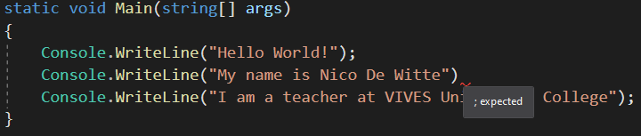

# Chapter 03 - Starting in C#

<!-- TODO
Maybe some general things about C#? -->

## Hello World

A "Hello World!" program is a computer program that outputs or displays "Hello World!" to the user. Being a **very simple program** in most programming languages, it is often used to **illustrate the basic syntax of a programming language** for a working program. It is often the very first program people write when they are new to the language.


A "Hello world!" program is often used to **introduce novice programmers to a programming language**. In general, it is simple enough to be understood easily, especially with the guidance of a teacher or a written guide.

In addition, "Hello world!" can be a **useful sanity test** to make sure that a language's compiler, development environment, and run-time environment are correctly installed. Configuring a complete programming toolchain from scratch to the point where even trivial programs can be compiled and run can involve substantial amounts of work. For this reason, a simple program is used first when testing a new toolchain.

"Hello world!" is also used by computer hackers as a **proof of concept** that arbitrary code can be executed through an exploit where the system designers did not intend code to be executed - for example, on Sony's PlayStation Portable. This is the first step in using homemade content ("home brew") on such a device.


## Hello World in C#

Let's jump right in and create a "Hello World" application in C#.

::: warning 👍 Naming Things
Naming things correctly is one of the main responsibilities of a programmer. By giving things (applications, variables, methods, ...) decent names, you will make your own life and that of fellow programmers a lot easier.
:::

Open Visual Studio and create a new project of the type `Console Application (.NET Core)`. Give it a sensible name such as `HelloWorld`.


::: tip ⌨️ Console Applications
When developing applications, a choice must be made between a GUI and a console application. As discussed earlier, a console application has no real graphical user interface and interacts with the user via the terminal (console). The default options for input and output are essentially text. This course will first focus on console applications after which it will introduce WPF allowing the creation of graphical applications.
:::

Once the wizard is finished it will automatically generate a basic "Hello World" application with the code shown below.

```csharp
using System;

namespace HelloWorld
{
  class Program
  {
    static void Main(string[] args)
    {
      Console.WriteLine("Hello World!");
    }
  }
}
```

Starting the application can be achieved by navigating to `Debug => Start Debugging` or by pressing `F5`. This will open a terminal windows and output the text `Hello World!` as shown below.

::: codeoutput
```
Hello World!

C:\Program Files\dotnet\dotnet.exe (process 12088) exited with code 0.
To automatically close the console when debugging stops,
enable Tools->Options->Debugging->Automatically close the
console when debugging stops.
Press any key to close this window . . .
```
:::

Notice that the application terminates after outputting the text to the terminal. The window of the terminal stays open for our convenience, so the developer can see what was outputted to the terminal. The terminal can be closed by pressing a key on your keyboard.

## Dissecting Hello World

While not diving into many details here, there are however a couple of things which can be clarified about the source code of the "Hello World" application.

### The Main Method

The most important part of this small C# application is the `Main()` method.

```csharp{7-8,10}
using System;

namespace HelloWorld
{
  class Program
  {
    static void Main(string[] args)
    {
      Console.WriteLine("Hello World!");
    }
  }
}
```

This piece of code needs to be in every C# application and is the start-point of your program. Without it, your program would not be able to be executed. It is often called the **entry-point of the application**.

The code previously shown is also more generally known as a **method**. A method consists of some code that can be executed by **calling** it somewhere else in your application using the name of the method. Here the name of the method is `Main()`. Most of the applications that are used as examples in this chapter will contain code that needs to be placed inside this main method, between the curly braces `{}`, which is called the **body** of the method.

Do not worry to much about the keywords such as `static` and `void`. This course will explain these later.

Sometimes the code outside of the `Main()` method might not be shown in examples in this course. This because it will mostly stay the same (apart from the actual name of the application which will change if you create a new project).

### Output to Terminal

Applications often require information from the user (input) and return back some information to the user (output). This basic hello world application does not require input, but is does output some text to the console.

In code this is achieved by using the methods `Console.Write()` and `Console.WriteLine()`. Both display text to the console window. The difference between these two methods is that `Console.WriteLine()` follows the text with a line terminator, which moves the cursor to the next line.

```csharp{9}
using System;

namespace HelloWorld
{
  class Program
  {
    static void Main(string[] args)
    {
      Console.WriteLine("Hello World!");
    }
  }
}
```

Most lines of code such as `Console.WriteLine("Hello World!");` are called **statements**. A statement is an action that is performed in code, often acting on some external piece of data or information. In the example above, the information is a text, namely "Hello World!". This piece of text is called a **string** in programming languages and they are enclosed between two quotes `"Placing some text between quotes makes it a string"`.

A statement is typically **terminated** using a semicolon `;`. By placing this at the end of a statement, the compiler knows that the line of code has ended.

The data `"Hello World!"` (in this case a piece of text) that is provided to the method `Console.WriteLine()` is called an **argument**. It is a piece of information that is **passed** to a method so it can be used inside the method - to be displayed, processed or handled in another way.

### Namespace

Basically a namespace is a **container that groups together resources**. What these resources are will be clarified later on. Namespace also allow developers to give resources the same name within different namespaces. There might for example be a resource `Rectangle` in the namespace `Geometry` as well as in the namespace `Graphics`. Without these namespaces these resource names would collide, leading to bad naming conventions to avoid these clashes.

```csharp{3-4,12}
using System;

namespace HelloWorld
{
  class Program
  {
    static void Main(string[] args)
    {
      Console.WriteLine("Hello World!");
    }
  }
}
```

To avoid collisions with the resources provided by .NET, the applications created in Visual Studio are automatically put into their own namespace, based on the name of the application. In this case, the `Program` class is put inside the namespace `HelloWorld`.

### Using

The `using System;` directive allows the usage of resources defined inside the `System` namespace.

```csharp{1}
using System;

namespace HelloWorld
{
  class Program
  {
    static void Main(string[] args)
    {
      Console.WriteLine("Hello World!");
    }
  }
}
```

By including the `System` namespace, the `Console.WriteLine()` method can be used as is. If one does not include the namespace, the **fully qualified name** would have to be used, which is `System.Console.WriteLine()`. If no collisions can arrise it is often a good idea to include the namespace for resources that are used a lot. It makes the code shorter.

### Class Program

A lot can be said about classes, as you'll see later on in this course. For the moment all you need to know is that this application defines a single class called `Program` with a single method called `Main()` and all the action is taking place in this method.

```csharp{5-6,11}
using System;

namespace HelloWorld
{
  class Program
  {
    static void Main(string[] args)
    {
      Console.WriteLine("Hello World!");
    }
  }
}
```

## Comments

Not all lines of text that are present in the source code of an application are considered code. Some are actually comments which are not executed or compiled. There are two ways in C# to indicate that some text is a comment and should be ignored in the compilation process. The first is prepending a double slash `//` before the comment. This needs to be placed before each line of comments.

```csharp
// This is a line of comments
// This is another line of comments
// Yet again some comments
```

This can be a bit of a nuisance when creating bigger blocks of comments. Therefore comments can also be placed between `/*` and `*/`. This type of comment is also called a **block-comment**. This allows a programmer to easily create a paragraph as comments.

```csharp
/*
  This is a bigger paragraph
  that consists of multiple lines.
  It is typically also called a block-comment.
  */
```

::: warning 📝 Too much Information
It is completely normal as a beginning programmer to place a lot of comments inside your code. While this is helpful when learning to program, it is also kind of dangerous. Code typically changes while the project evolves and often comments do not. They can therefore contain wrong information about the code and become useless and even misleading. A good programmer (one that takes care of his/her code) will not need a lot of comments. The best documentation is the code itself, of course provided that you take care of your naming of things and your code in general.
:::

The hello world application can be extended a bit by adding some comments as shown in the next code snippet:

```csharp
// Allows direct usage of
// resources inside of the System namespace
using System;

/*
  HelloWorld is the namespace of the application.
  It is a logical group that bundles all the
  resources created inside the project.
  It also avoid name collisions.
*/
namespace HelloWorld
{
  class Program   // Single class that contains the Main() method
  {
    /*
      The main method is the entry-point of the application.
      It is automatically called when the application is started
    */
    static void Main(string[] args)
    {
      Console.WriteLine("Hello World!");    // Write some text to the terminal
    }
  }
}
```

Note that single line comments can also be placed after code on the same line.

## Experimenting with Terminal Output

`WriteLine()` is the name of the method that prints a new line of text to the terminal every time it is used. To output multiple lines of text, one can place multiple statements below each other. Try the following code, it should output three lines of text.

```csharp
static void Main(string[] args)
{
  Console.WriteLine("Hello World!");
  Console.WriteLine("My name is Nico De Witte");
  Console.WriteLine("I am a teacher at VIVES University College");
}
```

::: codeoutput
```
Hello World!
My name is Nico De Witte
I am a teacher at VIVES University College
```
:::

Notice how every statement in the code is **terminated** (ended) with a semicolon `;`. Also note that `WriteLine()` ends with a new line every time it is called with a string to display. The string provided to `WriteLine()` is called an **argument**. It is a piece of information that is given to a method so it can be used inside that method - to be displayed, processed or handled in another way.

Forgetting to place a semicolon at the end of a statement will throw of the C# compiler and generate what is known as a **syntax error**. Take for example the code below where the second `WriteLine()` has not been terminated correctly. In this case Visual Studio will warn you, even before actually running the code.

```csharp{4}
static void Main(string[] args)
{
  Console.WriteLine("Hello World!");
  Console.WriteLine("My name is Nico De Witte")
  Console.WriteLine("I am a teacher at VIVES University College");
}
```

It will generate a message stating `; expected`. The line of code will also be marked using red squiggly lines below the code. If you hover over the red squiggly line, the message `; expected` is shown.



Strings can be **concatenated** (stitched together) in C# by placing a `+` sign (called the **concatenation operator**) between the different parts. C# can also concatenate strings with other types such as numbers. When the compiler detects that a string is required for an operation, **it will automatically try to convert the given information to a string**. The code below shows different examples of string concatenations.

```csharp
static void Main(string[] args)
{
  Console.WriteLine("It is now " + "7:44 PM");
  Console.WriteLine("My class counts " + 18 + " students");
  Console.WriteLine("I am currently about " + 980106323 + " seconds old");
  Console.WriteLine("Number of cats in my house: " + 1);
  Console.WriteLine("I am " + 1.86 + " meters tall");
}
```

::: codeoutput
```
It is now 7:44 PM
My class counts 18 students
I am currently about 980106323 seconds old
Number of cats in my house: 1
I am 1.86 meters tall
```
:::

The previous code example shows both integer numbers and floating point numbers. Floating point numbers use a point `.` as a decimal separator when specifying floating point numbers.
