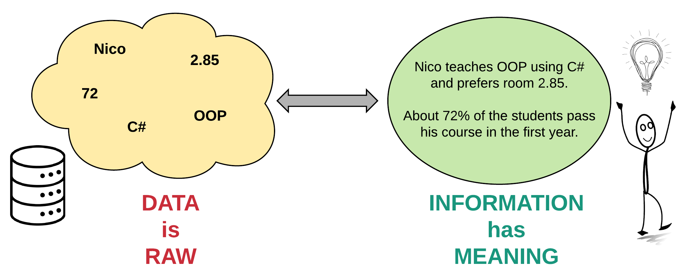
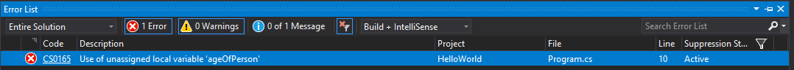

<slides link="/slides/slides-chapter-04" />

# Chapter 04 - Storing Data



The programs that we create need to store all sorts of information. From basic data such as numbers, characters and strings to complex data types that a programmer can define for himself.

| Type | Examples | Description |
| --- | --- | --- |
| integer numbers | `123`, `-12`, `0` | This is the set of all whole numbers plus all the negatives of the natural numbers. |
| floating point numbers | `0.323`, `-15.0`, `0.0001` | This includes all numbers that can be written as a decimal. |
| characters | `'a'`, `'Z'`, `'$'`, `'\n'` | Single unicode characters that are used to represent most of the written languages throughout the world. |
| strings | `"Hello World"`, `"Nico De Witte"`, `"X"` | A sequential collection of characters that represent a text. |

::: tip 🖼️ Representations
Note that integer numbers are written without a point, while floating point numbers are represented with a decimal point `.` (not a comma). Single characters are always placed between single quotes `'` while strings are placed between double quotes `"`.
:::

This data is read, stored, manipulated and outputted throughout the application. The data itself is stored inside the memory of the computer or system the program is running on. Inside the application one does not need to access the memory directly, for this the programmer can make use of variables.

## Variables

A variable is a **symbolic name** associated with a memory location that stores the actual data which may be changed through the variable. The variable's name should represent what information the variable references. They are called variables because they represent **information that can change**.

Computer memory can be thought of a huge cabinet with millions of small drawers. The content of the drawers is the information stored in memory that is used inside the application. While it is perfectly possible to refer to a drawer using its location (for example second row, third column), it is a lot harder to remember. There is also no link between the location and the actual content of the drawer. Now if a label were placed on the drawer that is descriptive enough of its content, which is the analogy of our **variable name**, it is much easier to refer to the drawer using the descriptive name (for example `count`, `age`, `name`).


Something to be aware of is that every memory cell in a computer has the same fixed size (expressed in a number of bytes) depending on the hardware architecture of that system. However, the data that is stored may be bigger than the size of single memory cell. Take for example a piece of text or a floating point number.

Basically as a programmer you need to tell the compiler what type of data you wish to store in memory. This will inform the compiler how much memory is required. This can be achieved by specifying what is called the **datatype of the variable**.

Both the datatype and the name of variable are specified when the variable is **declared**.

## Naming a Variable

Choosing a name for a variable is a big decision. Bad names will make your code less readable and maintainable. Keep in mind that other people might need to study or change your code.

::: tip 🤡 Code Readability
Always code as if the guy/girl who ends up maintaining your code will be a violent psychopath who knows where you live.
:::

Below are some best practices:

* use English variable names
* use descriptive names
* don't abbreviate
* use camelCase for local variables
* start with a letter, can start with an underscore `_` too, but only used in specific cases.
* don't use C# syntax keywords

Take a look at some examples:

| Variable Name | Good or Bad ? | Description |
| --- | :---: | --- |
| `myVariable` | ❌ | Not a descriptive name. Can be anything |
| `lineCounter` | ✔️ | Describes that it keeps track of the number of lines |
| `string` | ❌ | Keyword of C# |
| `teller` | ❌ | Not English |
| `1thStudent` | ❌ | Should not start with a number |
| `welcomeMessage` | ✔️ | Describes that it contains a welcome message |
| `user-name` | ❌ | Don't use special characters in variable names |
| `new` | ❌ | Keyword of C# |
| `newUser` | ✔️ | Perfectly legal if part of the name is keyword |
| `ListOfNames` | ❌ | Starts with a capital. Local variables should start with a lowercase letter. |
| `email address` | ❌ | Variable names should not contain spaces |
| `descriptionOfTheApplication` | ✔️ | A bit long but not a problem. |
| `usrTxtMsg` | ❌ | Don't use abbreviations. |
| `userTextMessage` | ✔️ | Good descriptive name |
| `thingyThatCountsTheUserPeoples` | ❌ | Be serious, don't use silly names. After a while it starts to annoy. |

Also keep in mind that C# and many other programming languages are case-sensitive. That means that `peopleCounter` is not the same as `PeopleCounter`.

## Declaring a Variable

Before a variable can be used inside an application, it needs be **declared**. Declaring a variable can be thought of as stating to the C# compiler that is needs to request memory for data and make it accessible using a symbolic **variable name**. Because the C# compiler needs to know how much memory to set aside, you as a programmer need to specify what **type of data** the variable will hold.

The type of the variable determines the size and layout of the variable's memory; the range of values that can be stored within that memory; and the set of operations that can be applied to the variable.

Once you provided the type and name, the variable can be used to store data.

Take a look at the following example where a variable stores the age of a person. In this case a variable can be declared of an **integral type**. In C# the data type is `int` (integer) for this, which can store **whole signed numbers**.

```csharp{5}
static void Main(string[] args)
{
  // Declaring a variable of type integer
  // and make it accessible using the symbolic name ageOfPerson
  int ageOfPerson;

  // Assign a value to the variable
  ageOfPerson = 33;

  // The variable name can also be used to retrieve the data
  Console.WriteLine("I am " + ageOfPerson + " years old ");
  Console.WriteLine("and I am a teacher at VIVES University");
}
```

::: codeoutput
```
I am 33 years old
and I am a teacher at VIVES University
```
:::

The data referred to by the variable can be changed using the **assignment operator** `=`. This is basically the same as in math. On the left hand side you have the variable which you want to assign and on the right hand side the value.

When you wish to use the content of the variable, all you need to do is state the symbolic name where you would otherwise use a value.

This also means that one variable can be used to assign a value to another.

```csharp{7}
static void Main(string[] args)
{
  int numberOfStudents;
  numberOfStudents = 36;

  int numberOfEmailAddresses;
  numberOfEmailAddresses = numberOfStudents;

  Console.WriteLine("We have " + numberOfStudents + " students"
    + " meaning we also have "
    + numberOfEmailAddresses + " email addresses");
}
```

::: codeoutput
```
We have 36 students meaning we also have 36 email addresses
```
:::

::: tip 🪓 Splitting Lines of Text
Note how the long string can be split up by concatenating it using the `+` operator. The same could of been achieved using multiple `Console.Write()` statements, but it would of been more work to type.
:::

### Declaration is Mandatory

**In C#, a variable always needs to be declared** (created by stating a type and name) before it can be used. The following code is therefore flawed and will not run. Try it for yourself.

```csharp
static void Main(string[] args)
{
  // Trying to assign a value to an undeclared variable
  ageOfPerson = 33;

  // Trying to request a value from an undeclared variable
  Console.WriteLine("I am " + ageOfPerson + " years old.");
}
```

::: warning 🚨 Declare a variable before using it
In C# you must declare a variable before it can be used. This is a rule for many programming languages but not for all. Some programming languages will automatically create variables as they are used.
:::

## Initializing a Variable

While the code below is working perfectly, you will not often see it being written like this by a more experienced programmer.

```csharp
static void Main(string[] args)
{
  int ageOfPerson;
  ageOfPerson = 33;
}
```

This because when a variable is declared, you can **immediately initialize it** with a value in a single line of code as shown in the next code snippet.

```csharp
public static void main(String[] args) {
  int ageOfPerson = 33;
}
```

The process of **initialization** is the act of **giving a variable a sensible value**. This is often done together with the declaration.

Forgetting to initialize a variable can have severe consequences and create hard to track bugs. Luckily the C# compiler and Visual Studio will not allow you to use an uninitialized variable and throw the error `Use of unassigned local variable`. This safety net is not provided by all programming languages. For example C++ will allow you to use uninitialized variables. In this case their value is undetermined and often contains garbage data.

Try running the following code:

```csharp
static void Main(string[] args)
{
  int ageOfPerson;
  Console.WriteLine("I am " + ageOfPerson + " years old.");
}
```

Visual Studio will display squiggly lines below `ageOfPerson`. Forcing to run this application will result in an error:



## Data Types

There are two kinds of data types in C#: **value types** and **reference types**. Variables of value types directly contain their data whereas variables of reference types store references to their data, the latter being known as objects.


### Simple Value Types

The most basic data types available in C# are the **simple value types**. These can store integral values, characters, floating-point values and such. The simple value types are identified through reserved words. They can be categorized in integral, floating-point, decimal and boolean types.

#### Integral Types

| Reserved Word | Description |
| --- | --- |
| `sbyte` | Signed 8-bit integers with values between -128 and 127. |
| `byte` | Unsigned 8-bit integers with values between 0 and 255. |
| `short` | Signed 16-bit integers with values between -32768 and 32767. |
| `ushort` | Unsigned 16-bit integers with values between 0 and 65535. |
| `int` | Signed 32-bit integers with values between -2147483648 and 2147483647. |
| `uint` | Unsigned 32-bit integers with values between 0 and 4294967295. |
| `long` | Signed 64-bit integers with values between -9223372036854775808 and 9223372036854775807. |
| `ulong` | Unsigned 64-bit integers with values between 0 and 18446744073709551615. |
| `char` | Unsigned 16-bit integers with values between 0 and 65535. The set of possible values for the char type corresponds to the Unicode character set. |

While there are quite a bit of integral data types available, the ones you will need the most are `int` for integral numbers and `char` for single characters.

#### Floating Point Types

C# supports two floating point types: `float` and `double`.

| Reserved Word | Description |
| --- | --- |
| `float` | 32-bit single-precision IEEE 754 format. Can represent values ranging from approximately `1.5 * 10^-45` to `3.4 * 10^38` with a precision of 7 digits. |
| `double` | 64-bit double-precision IEEE 754 format. Can represent values ranging from approximately `5.0 * 10^-324` to `1.7 × 10^308` with a precision of 15-16 digits. |

By default most programmers will use the `double` type. Computers these days are optimized to handle double precision floating point numbers.

<!-- TODO - Add some representation of floating point values here -->

#### The Decimal Type

The decimal type is a 128-bit data type suitable for **financial and monetary calculations**.

| Reserved Word | Description |
| --- | --- |
| `decimal` | Represent values ranging from `1.0 * 10^-28` to approximately `7.9 * 10^28` with 28-29 significant digits. |

#### The Boolean Type

The boolean data type has only two possible values: `true` and `false`. Use this data type for simple flags that track true/false conditions.

| Reserved Word | Description |
| --- | --- |
| `bool` | Only valid values are `true` and `false` |

### Strings - A Reference Type

A **string** in C# is a **piece of text** that is placed between **double quotes**, for example `"Hello my name is Nico"`.

Strings are not a simple data types because they are actually objects.

| Reserved Word | Description |
| --- | --- |
| `string` | Reference datatype for text |

### Some Examples

Examples of variable declarations of different data types with initialization:

```csharp
// Simple integer
int numberOfStudents = 55;

// Byte
byte startOfFrame = 0x21;
byte endOfFrame = 0;

// Characters (from the alphabet) or other symbols
char startOfAlphabet = 'a';
char dollarSign = '$';

// Floating point numbers
double averageWaterUsage = 3870.35478;

// Booleans can only be true or false
bool isOlderThanEighteen = true;
bool isStillATeenager = false;

// String literals are placed between double quotes
// and stored in string objects
string greeting = "Hello World";
string courseName = "Introduction to Programming";
string callMe = "N";
```

A single character is placed between single quotes `'`, while strings are placed between double quotes `"`. However its perfectly legal for a string to only contain a single character as shown in the previous example.

::: tip 🖍️ Literals
Literals are the values that are literally used inside source code. Examples are `"Hello World", 13, -154, 'X', 0x23`. They are mostly used for the initialization of variables. Note that the hexadecimal notation of literals can also be used when for example assigning integral values to variables.
:::

<!-- Left Overs -->
<!-- https://www.youtube.com/watch?v=PZRI1IfStY0&t=3s -->
