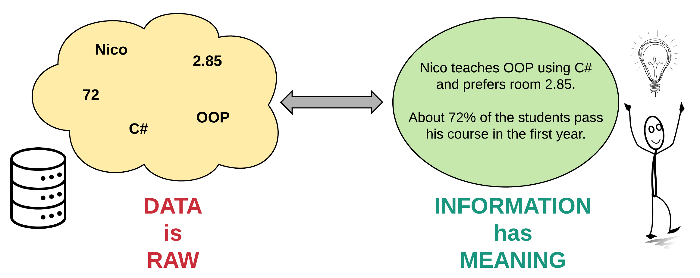
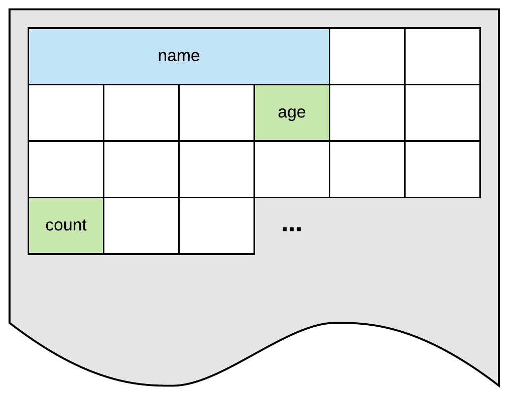
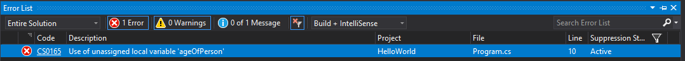
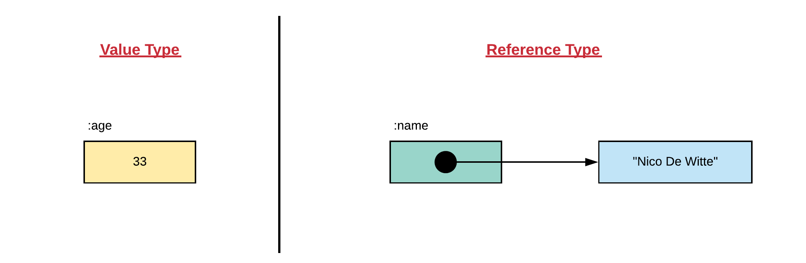

# **Introduction to Computer Programming**

## Chapter 04

### Storing Data

---
 


---

## Introduction

- Programs need to store all sort of information
- Basic data
  - numbers
  - characters
  - string
- But also complex data structures
  - Often defined by the programmer

---

### Some Basic Data Types

- integer numbers
  - natural numbers, including negative ones
  - `123`, `-12`, `0`
- floating point numbers
  - decimal values
  - `0.323`, `-15.0`, `0.0001`

---

### Some Basic Data Types

- characters
  - single letters
  - `'a'`, `'Z'`, `'$'`, `'\n'`
- text / strings
  - sequential collection of characters
  - `"Hello World"`, `"Nico De Witte"`, `"X"`

---

### Data

- Data can be read, stored, processed and outputted\
- Data is stored in the computer's memory
- In source code
  - We do not manipulate memory directly
  - Inefficient, cumbersome, ...
  - We use **variables**

---

## Variables

- A variable is a **symbolic name** associated with a memory location that stores the actual data which may be changed through the variable.
- Naming the variable correctly is important
  - Should represent what information the variable references

---

### Computer Memory

- Can be thought of as a huge cabinet with millions of small drawers.
- How do we refer to the data
  - Row/Col ?



---

### Computer Memory

- **Each cell has same size**
  - Expressed in bytes
- Data may be larger than size of single cell
- We need to tell the compiler/interpreter how much memory we need
  - Specifying **datatype of the variable**


---

### Declaring a Variable

- Declaring a variable =
  - Specifying the type
  - Giving the variable a name

---

## Naming a Variable

- Big decision
- Bad names will make your code less readable and maintainable.
- Other people might need to maintain your code

> Always code as if the guy/girl who ends up maintaining your code will be a violent psychopath who knows where you live.


---

### Some Best Practices

- use English variable names
- use descriptive names
- don't abbreviate
- use camelCase for local variables
- start with a letter, can start with an underscore `_` too, but only used in specific cases.
- don't use C# syntax keywords

---

### Some Examples

Are these good or bad variable names?

- `myVariable`
- `lineCounter`
- `string`
- `teller`
- `1thStudent`
- `welcomeMessage`

---

### Some Examples

Are these good or bad variable names?

- `user-name`
- `new`
- `newUser`
- `ListOfNames`
- `email address`

---

### Some Examples

Are these good or bad variable names?

- `descriptionOfTheApplication`
- `usrTxtMsg`
- `userTextMessage`
- `thingyThatCountsTheUserPeoples`

---

### Case Sensitive

- C\# and many other programming languages are case-sensitive.
- `peopleCounter` is not the same as `PeopleCounter`.

---

## Declaring a Variable

- Variable needs to be **declared** before it can be used
- Can be thought of as 
  - stating to the compiler that is needs to request memory for data
  - make it accessible using a symbolic **variable name**.
- Compiler needs to know how much memory to prepare
  - Programmer need to specify what **type of data** the variable will hold.

---

### Type

- The type determines
  - Size
  - Layout of the memory
  - The range of values that can be stored within that memory
  - The set of operations that can be applied to the variable.

- Once you provided the type and name, the variable can be used to store data.

---

### Example - Age of a person

- Let's store the age of a person
- Integral type
  - `int`
  - Can store **whole signed numbers**
- Good name would be `ageOfPerson`

---

### Example - Age of a person

```csharp
static void Main(string[] args)
{
  // Declaring a variable of type integer
  // and make it accessible using the symbolic name ageOfPerson
  int ageOfPerson;

  // Assign a value to the variable
  ageOfPerson = 33;

  // The variable name can also be used to retrieve the data
  Console.WriteLine("I am " + ageOfPerson + " years old ");
}
```

---

### Changing the variable value

- Variable value can be changed using **assignment operator** `=`
  - This is basically the same as in math.
  - On the left hand side you have the variable
  - On the right hand side the value.

---

### Using the variable

- Access the variable value as it were a value
  - By stating the symbolic name where you would otherwise use a value.
- Variable can also be assigned to other variable

---

### Using the variable

```csharp
static void Main(string[] args)
{
  int numberOfStudents;
  numberOfStudents = 36;

  int numberOfEmailAddresses;
  numberOfEmailAddresses = numberOfStudents;

  Console.WriteLine("We have " + numberOfStudents + " students"
    + " meaning we also have "
    + numberOfEmailAddresses + " email addresses");
}
```

---

### Declaration is Mandatory

- **In C#, a variable always needs to be declared** before it can be used.
  - Not all programming languages require this
- The following code is therefore flawed and will not run.

```csharp
static void Main(string[] args)
{
  // Trying to assign a value to an undeclared variable
  ageOfPerson = 33;

  // Trying to request a value from an undeclared variable
  Console.WriteLine("I am " + ageOfPerson + " years old.");
}
```

---

## Initializing a Variable

- Code below work perfectly
  - However, not often written as two statements

```csharp
static void Main(string[] args)
{
  int ageOfPerson;
  ageOfPerson = 33;
}
```

---

## Initializing a Variable

- Variable can be **initialized** with a value when declared

```csharp
public static void main(String[] args) {
  int ageOfPerson = 33;
}
```

- The process of **initialization** is the act of **giving a variable a sensible value**.
- This is often done together with the declaration.

---

### Forgetting to Initialize a variable

- Always initialize variables
  - Can create hard to track bugs
- Luckily C\# will not allow us to use uninitialized variable
  - Throws the error `Use of unassigned local variable`
  - Not all programming languages do this
    - Variable can then contain garbage data

---

### Forgetting to Initialize a variable

```csharp
static void Main(string[] args)
{
  int ageOfPerson;
  Console.WriteLine("I am " + ageOfPerson + " years old.");
}
```

Visual Studio will display squiggly lines below `ageOfPerson`. Forcing to run this application will result in an error:



---

## Data Types

- Two kinds of data types in C#:
- **value types**
  - directly contain their data
- **reference types**
  - store references to their data
    - being known as objects.

---

## Data Types



---

### Simple Value Types

- Most basic data types in C\# are **simple value types**
  - integral values
  - characters
  - floating-point values
  - boolean value
  - ...
-  Identified through reserved words.

---

#### Integral Types

| Reserved Word | Description |
| --- | --- |
| `sbyte` | Signed 8-bit integers with values between -128 and 127. |
| `byte` | Unsigned 8-bit integers with values between 0 and 255. |
| `short` | Signed 16-bit integers with values between -32768 and 32767. |
| `ushort` | Unsigned 16-bit integers with values between 0 and 65535. |

---

#### Integral Types

| Reserved Word | Description |
| --- | --- |
| `int` | Signed 32-bit integers with values between -2147483648 and 2147483647. |
| `uint` | Unsigned 32-bit integers with values between 0 and 4294967295. |
| `long` | Signed 64-bit integers with values between -9223372036854775808 and 9223372036854775807. |
| `ulong` | Unsigned 64-bit integers with values between 0 and 18446744073709551615. |

---

#### Integral Types

| Reserved Word | Description |
| --- | --- |
| `char` | Unsigned 16-bit integers with values between 0 and 65535. The set of possible values for the char type corresponds to the Unicode character set. |

- While there are quite a bit of integral data types available, the ones you will need the most are `int` for integral numbers and `char` for single characters.

---

#### Floating Point Types

| Reserved Word | Description |
| --- | --- |
| `float` | 32-bit single-precision IEEE 754 format. Can represent values ranging from approximately `1.5 * 10^-45` to `3.4 * 10^38` with a precision of 7 digits. |
| `double` | 64-bit double-precision IEEE 754 format. Can represent values ranging from approximately `5.0 * 10^-324` to `1.7 × 10^308` with a precision of 15-16 digits. |

- By default most programmers will use the `double` type. Computers these days are optimized to handle doubles.

---

#### The Decimal Type

- The decimal type is a 128-bit data type suitable for **financial and monetary calculations**.

| Reserved Word | Description |
| --- | --- |
| `decimal` | Represent values ranging from `1.0 * 10^-28` to approximately `7.9 * 10^28` with 28-29 significant digits. |

- Use the `m` suffix after the value when assigning a value.

---

#### The Boolean Type

- The boolean data type has only two possible values: `true` and `false`.
- Use this data type for simple flags that track true/false conditions.

| Reserved Word | Description |
| --- | --- |
| `bool` | Only valid values are `true` and `false` |

---

### Strings - A Reference Type

- A **string** in C\# is a **piece of text** that is placed between **double quotes**, for example `"Hello my name is Nico"`.

- Strings are not a simple data types because they are actually objects.

| Reserved Word | Description |
| --- | --- |
| `string` | Reference datatype for text |

---

### Some Examples

```csharp
// Simple integer
int numberOfStudents = 55;

// Byte
byte startOfFrame = 0x21;   // Hexadecimal
byte endOfFrame = 0;

// Characters (from the alphabet) or other symbols
char startOfAlphabet = 'a';
char dollarSign = '$';

// Booleans can only be true or false
bool isOlderThanEighteen = true;
bool isStillATeenager = false;
```

---

### Some Examples

```csharp
// Floating point numbers
double averageWaterUsage = 3870.35478;

// Monetary values
decimal howMuchIWouldLoveToEarn = 15328.31415m;

// String literals are placed between double quotes
// and stored in string objects
string greeting = "Hello World";
string courseName = "Introduction to Programming";
string callMe = "N";
string emptyString = "";
```

---

### Literals

- Literals are the **values that are literally used** inside source code.
- Examples are `"Hello World", 13, -154, 'X', 0x23`.
- Mostly used for the initialization of variables.
- Note that the hexadecimal notation of literals can also be used
