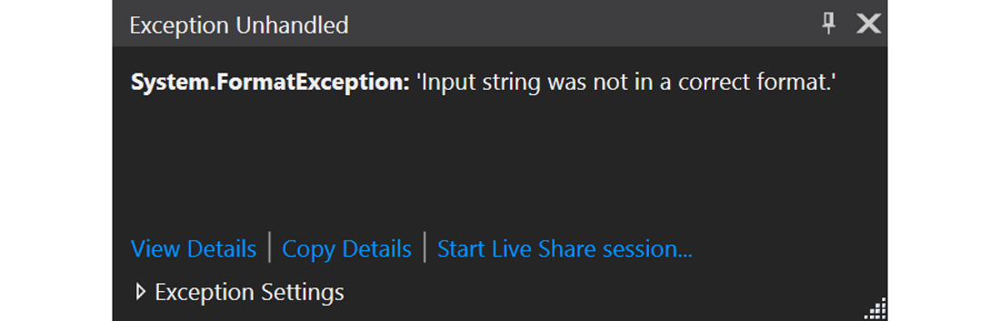

# Chapter 06 - Getting User Data


The main **goal of an application is to process data**. This data can be requested from the user, read from a file, retrieved from the Internet, be randomly generated, ...

## Requesting User Input

If requesting input from the application user, the application can be made more user-friendly and dynamic.

Requesting user input is not that hard. All one has to do is output a message to the user stating what is expected if him/her and allow the user to input the actual data.

Basically when a user enters something via the terminal, it is considered to be a `string`. If we wish to approach the data as an integer or another type of value, it needs to be **parsed** (converted). C# makes this really simple by providing some methods to convert these strings to integral of floating-point numbers.

## Requesting a String

Requesting a piece of text from the user is very simple. While the `Console.WriteLine()` method provides a way to easily write a string to the terminal, the method `Console.ReadLine()` does the opposite. It lets the user input a string which can then be programmatically be stored in a variable of type string.

The following code snippet requests the user to input his/her name. Next the input is used to output a personalized greeting to the user.

```csharp
Console.Write("Please enter your name: ");
string name = Console.ReadLine();

Console.WriteLine("Hello " + name + ". Very nice to meet you.");
```

::: codeoutput
```
Please enter your name: Nico
Hello Nico. Very nice to meet you.
```
:::

Some remarks are needed about this code example:

* Instead of `Console.WriteLine()` the snippet makes use of `Console.Write()`, allowing the user to type after the question. Nothing wrong if `Console.WriteLine()` would of been used, it just feels more natural this way.
* The variable `name` is declared when needed, not beforehand. Some people that come from the world of C-programming may have the habit to declare all variables at the top of `Main()`, but this is not needed and even discouraged.
* The method `Console.ReadLine()` is called and it returns a result (a string with the text that the user typed). By assigning the result to the variable `name` of the type `string`, it can be used later in the code.

## Requesting an Integer

When requesting an other type of data from the user, the input first needs to be parsed to the correct data type. C# cannot know from itself what kind of data the user provided.

Below is a code snippet that shows how to use the `Convert` class to **parse the input from the user as an integer** by using the `ToInt32()` method to parse the provided string as an integer.

```csharp
Console.Write("Please enter your age: ");
string ageText = Console.ReadLine();
int age = Convert.ToInt32(ageText);

Console.WriteLine("How interesting that you are " + age + " years young.");
```

::: codeoutput
```
Please enter your age: 33
How interesting that you are 33 years young.
```
:::

Take note on how the `ageText` variable is passed to the `ToInt32()` method. Again the `ToInt32()` method returns a resulting value. If we wish to save this for later processing, it needs to be stored in a variable (`age` in this case).

This example can actually be written a bit more compact. The value that is returned by the `Console.ReadLine()` can actually be passed to the `Convert.ToInt32()` method directly. This makes the code shorter and it is perfectly possible as the string value is not required anymore after the conversion.

```csharp{2}
Console.Write("Please enter your age: ");
int age = Convert.ToInt32(Console.ReadLine());

Console.WriteLine("How interesting that you are " + age + " years young.");
```

::: danger ⚡ FormatException
Do note that when entering an invalid number such as `a` or `123.23` will cause the application to crash with a `FormatException`. Feel free to test this. For the moment, fixing this is too complex. This course will return to this later.
:::



Make sure you understand the previous code example before continuing. If not, read it a couple of times or execute it in debug in Visual Studio.

## Requesting a Double

Requesting floating-point numbers from the user is very similar to requesting integral values. Instead of using the `ToInt32()` method of `Convert`, one can use the `ToDouble()` method of `Convert`.

```csharp
Console.Write("Please enter your height in meters: ");
double height = Convert.ToDouble(Console.ReadLine());

Console.WriteLine("You are quite tall with a height of " + height + "m.");
```

::: codeoutput
```
Please enter your height in meters: 1.86
You are quite tall with a height of 1.86m.
```
:::

### Generating Random Numbers

An other approach to get data is to generate it randomly. The `Random` class of C# also provides the tools to generate all sorts of random numbers.

The code snippet belows contains the necessary code to generate integral numbers between a minimum value (inclusive) and the provided maximum (exclusive) bound. If you only provide a single number it will take this as the exclusive maximum and provide a number between `0` and this maximum.

```csharp
// Object of the Random class that allows us to
// generate numbers
Random generator = new Random();

// [1, 7[
int die = generator.Next(1, 7);        // Value 1 to 6

// [0, 12[
int month = generator.Next(0, 12);     // Value 0 to 11

// [0, 21[
int examScore = generator.Next(21);    // Value 0 to 20
```

Don't worry too much about the `new` keyword and such just yet.

#### Floating Point Values

The `Random` class can also generate random floating point values between `0.0` and `1.0`. This can be achieved by calling the `NextDouble()` method. No upper limit can be provided here. You need to do this yourself.

```csharp
// Object of the Random class that allows us to
// generate numbers
Random generator = new Random();

// [0.0, 1.0[
double real = generator.NextDouble();
```
