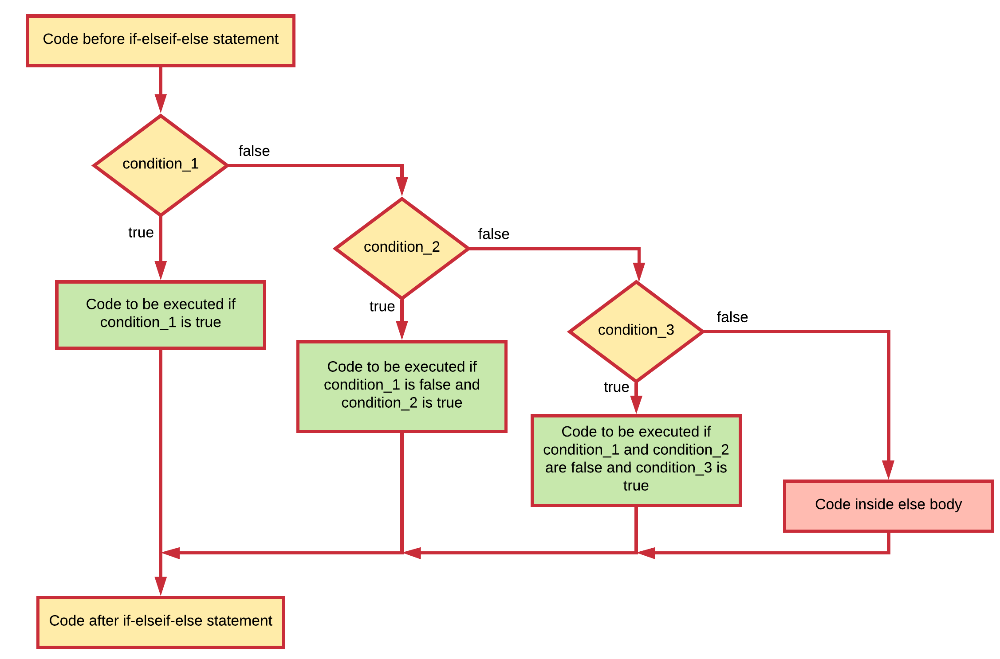

# Chapter 08 - Making Decisions

The statements inside your source files are **generally executed from top to bottom**, in the order that they appear. Control flow constructs, however, break up the flow of execution by employing **decision making**, enabling your program to **conditionally execute particular blocks of code**. This section describes the decision-making statements `if`, `if-else`, and `switch` supported by the C# programming language.

## Conditions

A computer program must often make **choices** on how to proceed, take for example:

* if the user enters invalid data give him/her a message, otherwise process the data.
* if the ball bounces the edge of the screen, change trajectory, else keep going forward.
* if all the data has been processed, end the program, else continue to the next data item.
* if the player has lives left continue the game, else show a game over screen.

In flowcharts, these decisions are easily identified by the **diamond shape** with the question inside.


Your application will make a choice based on what is called a **condition** (a representation of the question as it were). Usually this is in the form of a mathematical expression using equals, less-than, greater-than, different from, ...

A condition is some **sort of comparison** (or a combination of comparisons) that can be **evaluated** by the compiler or interpreter. After solving all comparisons and combining all the individual parts, the compiler **resolves** it to a **single resulting value** that is `true` or `false` (also keywords in C#). These are actually values that the data type `bool` can take.

::: tip 🔍 Evaluating a condition
Evaluating a condition is **the process of determining the result of that condition**. The end result of a condition after the evaluation has taken place is always `true` or `false`. The `true` and `false` values can differ from language to language, however internally in memory `false` is most of the time "0" and `true` is "not 0". Generally spoken one can state that the compiler **evaluates the condition to be true or false**.
:::

## Comparison Operators

Comparison operators allow us to **build conditional expressions** using mathematical operators. The table below shows the available comparison operators.

| Operator | Description |
|---|---|
| `==` | equal to |
| `!=` | not equal to |
| `>` | greater than |
| `>=` | greater than or equal to |
| `<` | less than |
| `<=` | less than or equal to |

Note how two equality signs `==` are used to test if two values are equal, while a single sign `=` is used for assignment. Using a single sign for a comparison is a mistake often made by beginning programmers.

Since a conditional expression actually produces a single `true` or `false` result, this result can be assigned to a variable of type `bool`.

Take a look at the code below, which contains some examples of comparison operations:

```csharp
int a = 4;
int b = 8;
bool result;
result = (a < b);   // true
result = (a > b);   // false
result = (a <= 4);  // a smaller or equal to 4 - true
result = (b >= 9);  // b bigger or equal to 9 - false
result = (a == b);  // a equal to b - false
result = (a != b);  // a is not equal to b - true
```

The parentheses are optional here but are used to make the code more clear.

While the comparison operators will not often be used in a situation as shown in the code above, they will often be used when making decisions in your program.

## The if statement

The `if` statement is the most basic of all the control flow statements. It tells your program to execute a certain section of code only if a particular condition evaluates to `true`. If the condition evaluates to `false` the execution jumps to the code after the if statement.

The general syntax of an if statement is:

```csharp
// Code before the if statement

if (condition) {
  // Code inside if statement
  // Executed when condition evaluates to true
}

// Code after the if statement
```

This can be visually represented using the next flowchart.


Take a simple example that tests if the score of the student is below 70%. If that is the case, an encouraging speech is outputted to the terminal.

```csharp
int studentScore = 30;      // Change this number to test the if statement
//...
Console.WriteLine("Your score is " + studentScore + "%");
if (studentScore < 70)
{
  Console.WriteLine("Come on buddy, you will need to work a little harder.");
  Console.WriteLine("You can do it. Still got some time till the exams.");
}
```

::: codeoutput
```
Your score is 30%
Come on buddy, you will need to work a little harder.
You can do it. Still got some time till the exams.
```
:::

If the condition evaluates to `false` (meaning that the score is equal or above 70), control jumps to the end of the if statement.

When the code block consists of **only a single line of code**, the **curly brackets `{}` can be left out**. However, for code readability reasons it is strongly advice against it.

```csharp
int studentScore = 30;      // Change this number to test the if statement
//...
Console.WriteLine("Your score is " + studentScore + "%");
if (studentScore >= 70)
  Console.WriteLine("Good job. Keep at it");
```

## The if-else statement

The `if-else` statement provides a secondary path of execution when the `if` clause evaluates to `false`. This basically means that in the `true` case something will happen and in `false` case something else will happen.

The general syntax of an if-else statement is:

```csharp
// Code before the if-else statement

if (condition) {
    // Code inside if body
    // Executed when condition evaluates to true
} else {
    // Code inside else body
    // Executed when condition evaluates to false
}

// Code after the if-else statement
```

This can be visually represented using the next flowchart.


Taking the previous example you could output a "good job" speech when the students score is equal or above 70%.

```csharp
int studentScore = 85;      // Change this number to test the if-else statement
//...
Console.WriteLine("Your score is " + studentScore + "%");
if (studentScore < 70)
{
  Console.WriteLine("Come on buddy, you will need to work a little harder.");
  Console.WriteLine("You can do it. Still got some time till the exams.");
}
else
{
  Console.WriteLine("Good job. Keep up the good work.");
}
```

::: codeoutput
```
Your score is 85%
Good job. Keep up the good work.
```
:::

## Nesting if-else statements

It is perfectly legal to nest if-else structures inside of each other. Take for example the code below where the message to the user is a bit more personalized based on the gender of the student.

```csharp
int studentScore = 30;      // Change this number to test the if-else statement
char gender = 'f';          // Change the gender to 'm' for male and 'f' for female
                            //...
Console.WriteLine("Your score is " + studentScore + "%");
if (studentScore < 70)
{
  if (gender == 'm')
  {
    Console.WriteLine("Come on buddy, you will need to work a little harder.");
  }
  else
  {
    Console.WriteLine("Come on miss, you will need to work a little harder.");
  }
  Console.WriteLine("You can do it. Still got some time till the exams.");
}
else
{
  Console.WriteLine("Good job. Keep up the good work.");
}
```

::: codeoutput
```
Your score is 30%
Come on miss, you will need to work a little harder.
You can do it. Still got some time till the exams.
```
:::

A nested if-else construct can also be used to create multiple branches (paths of execution) based on different conditions. Take for example the code below that display a more user-friendly message to the student.

```csharp
int studentScore = 30;    // Change this number to test the if-else statement
                          //...

// Example of a multi-branch if-else statement
if (studentScore >= 90)
{
  Console.WriteLine("Omg, good job. Keep up the work.");
}
else
{
  if (studentScore >= 70)
  {
    Console.WriteLine("Some room for improvement but you are on your way.");
  }
  else
  {
    if (studentScore >= 50)
    {
      Console.WriteLine("Ok. But you may want to considering studying a bit more.");
    }
    else
    {
      if (studentScore >= 30)
      {
        Console.WriteLine("Come on buddy, you will need to work a little harder.");
      }
      else
      {
        Console.WriteLine("You may want to cancel your vacation for studying.");
      }
    }
  }
}
```

The previous code is **not very clear** and **hard to read**. However, the code can be changed a bit making it much more maintainable and readable. When the body of the branch consists of a single line of code, the curly brackets are optional. Now in many programming languages the whole if-else construct is considered a single statement - an if-else statement.

Now if one were to remove the curly brackets from the else-clauses (except for the last one) this would imply that the previous code can be rewritten as:

```csharp
int studentScore = 30;      // Change this number to test the if-else statement
                              //...
Console.WriteLine("Your score is " + studentScore + "%");
if (studentScore >= 90)
{
  Console.WriteLine("Omg, good job. Keep up the work.");
}
else if (studentScore >= 70)
{
  Console.WriteLine("Some room for improvement but you are on your way.");
}
else if (studentScore >= 50)
{
  Console.WriteLine("Ok. But you may want to considering studying a bit more.");
}
else if (studentScore >= 30)
{
  Console.WriteLine("Come on buddy, you will need to work a little harder.");
}
else
{
  Console.WriteLine("You may want to cancel your vacation for studying.");
}
```

This is perfectly legal and is common-practice among developers. The above construct is actually referred to as an if-elseif-else construct and is a special form of nested if-else statements.

The if-elseif-else statement can be extended with as much elseif statements as required. **Each elseif will need a new condition** that needs to be checked. The conditions are **checked from top to bottom** and the first one that evaluates to `true` is executed, after which control jumps to the end of the if-elseif-else statement.

```csharp
// Code before the if-elseif-else statement

if (condition_1)
{
  // Code to be executed if condition_1 is true
}
else if (condition_2)
{
  // Code to be executed if condition_1 is false and
  // condition_2 is true
}
else if (condition_3)
{
  // Code to be executed if condition_1 and
  // condition_2 are false and condition_3 is true
}
else
{
  // Code to be executed if all conditions evaluate to false
}

// Code after the if-elseif-else statement
```

Note that the else-clause is optional as it is with the if-else statement.

This can be visually represented using the next flowchart.



## Conditional Operators

As long as the expression only produces a single resulting value (`true` or `false`), conditions can be **combined** using **conditional operators**. This is often necessary when creating more complex conditional expressions.

The next table provides an overview of the available conditional operators in C#.

| Operator | Description |
|---|---|
| `&&` | AND |
| `\|\|` | OR |
| `!` | NOT |

These work as you know them from the **Boolean algebra**. The `||` (**OR**) operator will return `true` if either of the operands evaluate to `true`. The `&&` (**AND**) operator will return `true` if both operands evaluate to `true`. A logical expression can be negated by placing the `!` (**NOT**) operator in front of it.

Next is the **truth table** for all three conditional operators.

| `A` | `B` | `\|\|` | `A && B` | `!A` | `!B` |
|---|---|---|---|---|---|
| `false` | `false` | `false` | `false` | `true` | `true` |
| `false` | `true` | `true` | `false` | `true` | `false` |
| `true` | `false` | `true` | `false` | `false` | `true` |
| `true` | `true` | `true` | `true` | `false` | `false` |

In the table above, `A` and `B` are the left and right operands of the conditional operators. When writing a combined expression in code these operands are most often conditional expressions with each containing a comparison operation.

Take for example an expression that checks if `number` is within a range of `[0, 100]`. The condition could be coded as `( (number >= 0) && (number <= 100>) )`.

The code example below checks if a person is a young adult based on his/her `age` (between `14` and `18` years of age).

```csharp
int age = 16;
if ((age >= 14) && (age < 18))
{
  Console.WriteLine("You are a young adult");
}
```

While the inner parentheses are optional they do contribute to the readability of the expression.

::: tip ⚖️ De Morgan's Laws
In some cases it can be useful to rewrite complex conditions using De Morgan's Laws [https://en.wikipedia.org/wiki/De_Morgan%27s_laws](https://en.wikipedia.org/wiki/De_Morgan%27s_laws). Do take note that shorter not always implies more readable or less complex.
:::

Please be aware that every sub-part of a boolean expression must be a complete boolean expression. Thus if you want to know if `A` is either `10` or `20`, you cannot state `(A == 10 || 20)`. You need to express both operands as full conditional expressions: `(A == 10 || A == 20)`.

::: warning 🥱 Lazy evaluation
These operators exhibit **"short-circuiting"** behavior, which means that the second operand is evaluated only if needed. This is also called lazy evaluation. So for example in an OR statement, if the first operand is `true`, the outcome must also be `true`. For this reason the second operand is not checked anymore.
:::


## The Switch Statement

Take a look at some code that will tell the user what the day of the week is based on its integral value (`1` to `7`). First some example code is shown using a nested if-else statement.

```csharp
int dayOfTheWeek = 3;       // Number from 1 to 7

if (dayOfTheWeek == 1)
{
  Console.WriteLine("Today it is Monday");
}
else if (dayOfTheWeek == 2)
{
  Console.WriteLine("Today it is Tuesday");
}
else if (dayOfTheWeek == 3)
{
  Console.WriteLine("Today it is Wednesday");
}
else if (dayOfTheWeek == 4)
{
  Console.WriteLine("Today it is Thursday");
}
else if (dayOfTheWeek == 5)
{
  Console.WriteLine("Today it is Friday");
}
else if (dayOfTheWeek == 6)
{
  Console.WriteLine("Today it is Saturday");
}
else if (dayOfTheWeek == 7)
{
  Console.WriteLine("Today it is Sunday");
}
else
{
  Console.WriteLine("Not a valid day of the week");
}
```

When checking a single variable for equality with an integral value using multiple if-else statements, it can be replaced with another structure called a `switch` structure. The template of the switch structure is shown below. Each case needs a single integral literal value to compare the variable against. If it matches (equals) than the code between the colon `:` and the `break;` statement is executed. The `break` is required for the switch to be stopped when a match is found.

::: tip ☣️ Single integral literal value to compare
This is not the case anymore as of C# 7.0. However generally, this is the use case most often found. More info can be found at [https://docs.microsoft.com/en-us/dotnet/csharp/language-reference/keywords/switch](https://docs.microsoft.com/en-us/dotnet/csharp/language-reference/keywords/switch).
:::

```csharp
// Code before the switch statement

switch (variable) {
  case integral_literal_1:
    // Code to be executed
    break;
  case integral_literal_2:
    // Code to be executed
    break;
  case integral_literal_3:
    // Code to be executed
    break;
  // ...
  default:
    // Code to be executed in case no match found
    break;
}

// Code after the switch statement
```

The **default case is optional**. It's use is the same as the else-clause.

This can be visually represented using the next flowchart. Notice the difference with the if-elseif-else statement where each branch contains a new condition.


Note how the condition for each branch is an automatic equality check. It is not possible to use a switch statement to check for example if a variables value is bigger than a certain value.

Replacing the if-else structure of the day-of-the-week example with a switch statement results in the following code.

```csharp
int dayOfTheWeek = 3;       // Number from 1 to 7

switch (dayOfTheWeek)
{
  case 1:
    Console.WriteLine("Today it is Monday");
    break;
  case 2:
    Console.WriteLine("Today it is Tuesday");
    break;
  case 3:
    Console.WriteLine("Today it is Wednesday");
    break;
  case 4:
    Console.WriteLine("Today it is Thursday");
    break;
  case 5:
    Console.WriteLine("Today it is Friday");
    break;
  case 6:
    Console.WriteLine("Today it is Saturday");
    break;
  case 7:
    Console.WriteLine("Today it is Sunday");
    break;
  default:
    Console.WriteLine("Not a valid day of the week");
    break;
}
```

## Which to use when

As a starting programmer you may struggle a bit in the beginning on how to express more complex decision making structures. The choice is not always easy and depends a lot on the problem you are trying to solve. If you have more than 1 option in mind, consider using the one that is more clear and readable.

No general rule exists for when to use which construct. Some programmers don't like the `switch` statement. In most cases it is a case of preference.
