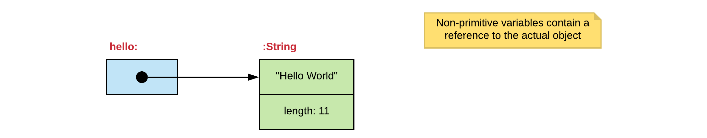
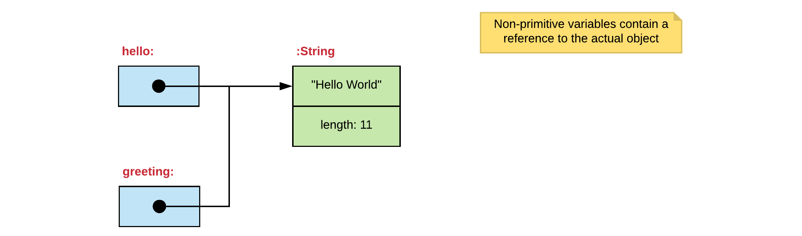
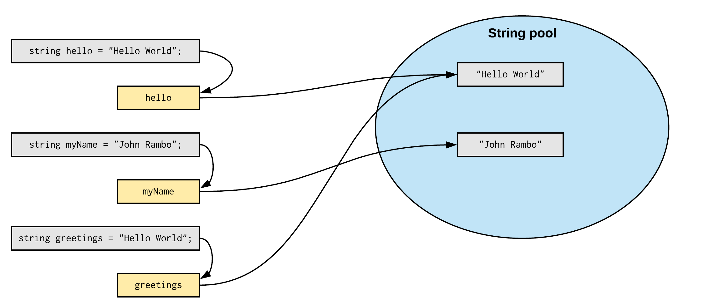
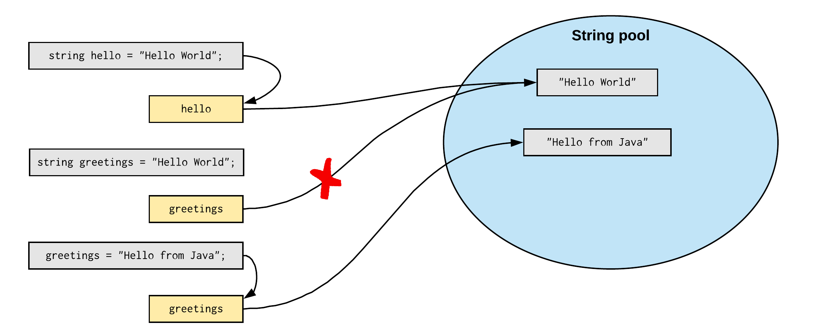

# Chapter 10 - Strings

The data type `string` is probably the most commonly used data type for variables in C#. It is so popular that you actually already have been using strings since the beginning of this course. Remember your first statement?

```csharp
Console.WriteLine("Hello World");
```

Well, this application was outputting the `string` `"Hello World"` to the terminal.

## String is a Class

Compared to most other data types you have been using, `string` is actually a **class**, where those other types (`int`, `double`, ...) are not.

Remember from [Chapter 4 - Storing Data, Simple Value Types](../04_storing_data/README.md#data-types) that C# actually has two categories of data types:

* **Simple Value Types**: char, byte, short, int, long, double, float and boolean. Simple value types are the basic types that are integrated in the language (they are most of the time keywords in the language itself).
* **Reference types**: String, Random, ... Reference data types are actually classes.

This means that when we use the `string` data type, we are actually using objects of the class `String` (notice the capital letter). The cool thing about reference data types is that we can create our own as we shall see later in this course.

::: tip Classes start with Capital letters
Class-names always start with capital letters (`Random`, `String`, ...). This is a convention used in many programming languages. Then why doesn't the datatype `string`? Well actually because `string` is an alias for `String`.
:::

All you need to know at the moment about a class is the following:

* A class is like a blueprint that is used to create objects from that class, which can then be referenced by a variable.
* The **name** of a class, in this case `String`, **acts just as a data type**. This means that we can create variables of type `String`.
* A class internally **contains data**, in the case of a `String` this is a sequence of characters.
* A class **has methods**, which are like actions that can be requested from the objects created from the class.

## Creating Strings using Literals

The most direct way to create a string is to assign a string **literal** to a variable of type `string` as shown in the next code example.

```csharp
string greetings = "Hello there. What a fascinating world we live in";

// Print the greetings String to the terminal
Console.WriteLine(greetings);
```

When C# encounters a string literal in our code (`"Hello there. What a fascinating world we live in"` in the previous example), it will automatically create an object of the class `String` and place our literal value inside of it.

### Escape Characters

Escape characters are special characters than can be used inside a string. They always are prefixed with a backslash `\`. Most programming languages have them. The code below shows examples of all these techniques.

```csharp
Console.WriteLine("There\tis\ta\ttab\tbetween\teach\tword\n");
Console.WriteLine("You can also use quotes here but they need to be escaped:\n");
Console.WriteLine("\t\"C makes it easy to shoot yourself in the foot;");
Console.WriteLine("\tC++ makes it harder,\n\tbut when you do it blows your whole leg off.\"");
Console.WriteLine("\t\t\t\t- by Bjarne Stroustrup");
```

:::codeoutput
```
There   is      a       tab     between each    word

You can also use quotes here but they need to be escaped:

        "C makes it easy to shoot yourself in the foot;
        C++ makes it harder,
        but when you do it blows your whole leg off."
                                - by Bjarne Stroustrup
```
:::

The table below lists the most used escape sequences.

| Escape Sequence | Description |
| --- | --- |
| `\t` | Insert a tab in the text at this point. |
| `\b` | Insert a backspace in the text at this point. |
| `\n` | Insert a newline in the text at this point. |
| `\'` | Insert a single quote character in the text at this point. |
| `\"` | Insert a double quote character in the text at this point. |
| `\\` | Insert a backslash character in the text at this point. |

### Verbatim Strings

Verbatim strings can be used when the literal string contains a lot of backslashes (for example path of file), new lines or quotes. Use verbatim strings for convenience and better readability. Because verbatim strings preserve new line characters as part of the string text, they can be used to initialize multiline strings. Use double quotation marks to embed a quotation mark inside a verbatim string.

Verbatim strings are created by placing an `@` symbol before the string literal.

Examples:

```csharp
string filePath = @"C:\Users\nicod\Documents\";
string whoAmI = @"My name is ""HAL""";
string multiLine = @"This is a
  multiline string which
  also contains tab characters
  at the start.";

Console.WriteLine(filePath);
Console.WriteLine(whoAmI);
Console.WriteLine(multiLine);
```

::: codeoutput
```
C:\Users\nicod\Documents\
My name is "HAL"
This is a
    multiline string which
    also contains tab characters
    at the start.
```
:::

## Values versus References

When you declare a variable of a primitive type in C#, the variable will label the memory location where the actual value is stored that you assigned via the variable.

Example:

```csharp
double pi = 3.1415;
Console.WriteLine(pi);       // Output: 3.1415
```

This can be represented using a simple diagram:


However when you create an object and assign the result of the `new` statement to a variable, the variable will not hold the object itself. It will instead hold a **reference** to the location of the object in memory.

Example:

```csharp
string hello = "Hello World";
```

This can be represented using a simple diagram:



### Copying Variables

So in other words when you copy a variable of a primitive type, you are making a copy of the value.

Example:

```csharp
int number = 15;
int secondNumber = number;
```


Changing `secondNumber` will not have any effect on the original `number`.

However the situation changes when dealing with references to objects. In this case the object is not copied, but the reference held by the variable is copied. This means that you get another reference pointing towards the same object.

```csharp
string hello = "Hello World";
string greeting = hello;
```



<!-- Note for later - Immutability of Strings again does not allow us to change the object -->

### The null value

When declaring a variable of a non-primitive type without assigning a value to it, it has nothing to reference. This is indicated in the C# language using the `null` reference.

Graphically this can be represented as:


We can later assign a reference to it by for example creating a new object and assigning it to the variable as follows:

```csharp
string hello;
//...
hello = "Greetings from OOP";
```

In C#, the CLR will not allow the usage of a local variable that has not been initialized. This because when a method is called on a null-reference, your program will crash.

## The C# string intern pool

Each time you create a string using the literal syntax shown in the following example, the CLR checks the **String Intern Pool** first.

```csharp
string hello = "Hello World";
```

The string intern pool in C# is a pool of String objects stored in memory. When a String variable is created and assigned a literal value, the CLR searches the pool for a string of equal value. If found, the CLR will simply return a reference to the existing memory address, without allocating additional memory. If the string doesn't exist in the pool, a new string object is created and placed in the pool. For example:

```csharp
string hello = "Hello World";
string myName = "John Rambo";
string greetings = "Hello World";
```

In the previous example, only two string objects will be created. First, the CLR will not find any string object with the value `"Hello World"` in the string pool, that is why it will create a new object. Again for the second statement, the CLR will not find any string object with the value `"John Rambo"` in the string pool. A new object is created and stored in the variable.

For the third statement the pool is checked again and this time a string with the value `"Hello World"` is found. The CLR will make the `greetings` variable point to the string that was found.



One of the main reasons for this is saving memory.

## Creating Strings using the new keyword

There are two options to create strings from literals. The first we have already used, which is direct assignment of a String literal. The second option is using the approach of using the `new` keyword, as we have done already with classes such as `Random`.

As with any other class, you can create objects from classes by using the `new` keyword.

```csharp
String greetings = new String("Hello there. What a fascinating world we live in");

// Print the greetings String to the terminal
Console.WriteLine(greetings);
```

This approach is the **general way of creating objects from classes**, but is rarely seen in cases of strings. This because this approach **will force the creation of new String objects and therefore not use the String pool**.

::: warning What about non-literals
What about when the string is not created using a string literal but coming for example from user input? In this case the string intern pool mechanism is not used.
:::

So why aren't all strings interned by default, then? Basically because **using the intern string pool requires CPU cycles** to check if the string exists in the pool. When not using the string pool mechanism, it's just memory that is being consumed.

## Strings are Immutable

An **object whose internal state cannot be changed after it is created** is known as **an Immutable object**. The String class is such an example. Objects of type String cannot be changed. If you assign a new value to a String variable, actually a new String object is created (of course after the pool is checked in case of literals).

So for example the following code will result in a string pool as shown in the image following the code.

```csharp
string hello = "Hello World";

string greetings = "Hello World";
greetings = "Hello from C#";
```



If one thinks about it, it's quite logical that String objects are immutable. Otherwise the string pool would not be practical if other variables would be able to modify your objects.

::: tip String Interning
The string pool is the CLR's particular implementation of the concept of **string interning**. In computer science, string interning is a method of storing only one copy of each distinct string value, which must be immutable. Interning strings makes some string processing tasks more time- or space-efficient at the cost of requiring more time when the string is created or interned. The distinct values are stored in a string intern pool.
:::

## Strings have Methods

Once an object of `String` exists, **actions can be requested from the object**. This is most often referred to as **calling methods** of the object.

To call a method of an object one can use the following syntax:

```csharp
object.nameOfMethod();
```

So, calling method is stating its name followed by parentheses `()`. However a method can only be called on an object, so this needs to be specified first by stating the name of the object variable followed by the dot `.` operator.

For example to convert a full string to lowercase, one can call the `ToLower()` method as shown in the next code snippet. The method will return a new string object which can be stored inside a variable or processed directly.

```csharp
string hello = "Hello World";

// Converting to lower case
string helloLowerCase = hello.ToLower();

Console.WriteLine($"{hello} converted to lowercase results in {helloLowerCase}");
```

::: codeoutput
```
Hello World converted to lowercase results in hello world
```
:::

Take a look at the C# API documentation to find out more about the String class. It can be found at [https://docs.microsoft.com/en-us/dotnet/csharp/programming-guide/strings/](https://docs.microsoft.com/en-us/dotnet/csharp/programming-guide/strings/).

## Accessing the Characters

As stated before, a string is internally a sequence of characters. This would suggest that each character is accessible separately. And it is, through the index operator `[]`. The index operator takes an integral value and uses it to select the element at that index (zero-based).

So to print the characters of a string to the terminal separated by a space, a for loop can be used as shown in the next snippet.

```csharp{4}
string helloWorld = "Hello World from C#!";

for (int i = 0; i < helloWorld.Length; i++) {
  char character = helloWorld[i];
  Console.Write($"{character} ");
}
```

::: codeoutput
```
H e l l o   W o r l d   f r o m   C # !
```
:::

Note how the length of the string can be accessed by using the property `helloWorld.Length`. More on properties later.

<!-- TODO: -->
<!-- $ strings -->
