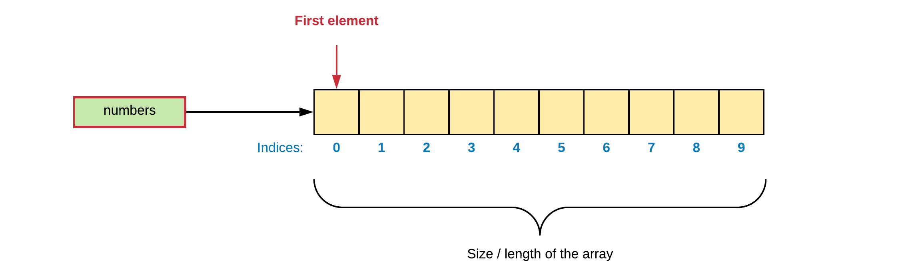
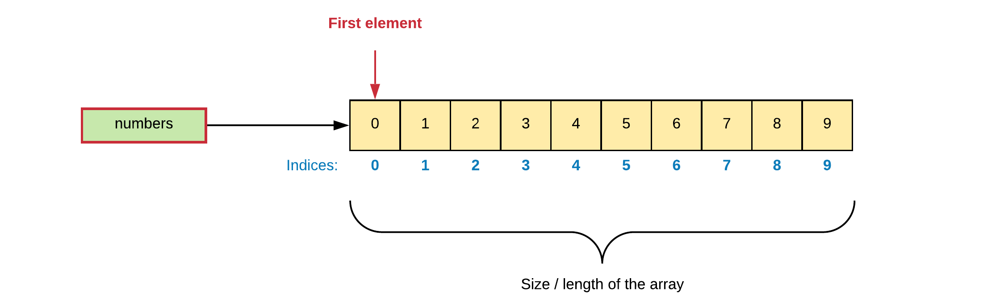

# Chapter 11 - Arrays

An array is a **data structure** consisting of a **collection of elements**, each identified by an **index** or a **key**. An array is stored so that the **position of each element can be computed from its index**. The simplest type of data structure is a linear array, also called a **one-dimensional array**.

::: tip 0️⃣ Zero-based Indexing
When information is stored in an array, individual elements are selected by an index that is usually a non-negative scalar integer. An index maps the array to the stored information. Most programming languages use **zero-based indexing** (index starts at 0). This leads to a simpler implementation where the index refers to an offset from the starting position of an array, so the first element has an offset of zero.
:::

Arrays are among the oldest and most important data structures, and are used by almost every program. They are also used to implement many other data structures, such as **lists** and **strings**. They effectively **exploit the addressing logic of computers**.

Arrays are useful mostly because the element indices can be computed at run time. Among other things, this feature allows a single iterative statement to process arbitrarily many elements of an array. For that reason, the elements of an array data structure are **required to have the same size** and **should use the same data representation**.

Take for example the following array that stores 10 integers (4 bytes each). They are indexed from `0` to `9`.


Because the mathematical concept of a matrix can be represented as a two-dimensional grid, two-dimensional arrays are also sometimes called matrices.

## One-Dimensional Arrays

An array is a **container object** that holds a **fixed number of values** of a **single type** (all elements need to be the same size in memory). The length of an array is established when the array is created. **After creation, its length is fixed.**

## Creating 1D arrays

A one-dimensional array is created using the following syntax template:

```csharp
type[] variable_name = new type[SIZE];
```

where

* `type` can be either a primitive (`int`, `double`, ...) or non-primitive datatype (class, such as `String` for example).
* `variable_name` is the name of the variable that represents the array.
* `SIZE` is a positive integral value indicating how many elements the array consists of.

Notice the square brackets `[]` that declare this variable to be an array of elements of the given type.

The example code below shows how to declare and create an array of `10` integers:

```csharp
// Creating an array numbers with 10 elements of type int.
int[] numbers = new int[10];
```

::: tip 🆕 Arrays are actually Objects
**An array is actually an object** so the actual creation needs to be done using the `new` operator, at which stage the length/size of the array also needs to be specified.
:::

A visualization of the array may look something like this:



Each item in an array is called an **element**, and each element is accessed by its numerical index. As shown in the preceding visualization, numbering begins with 0 (this is called **zero-indexed**). The 9th element, for example, would therefore be accessed at index 8.

Of course the previous statement can be split up into the declaration and creation of the array as shown in the next code snippet.

```csharp
int[] numbers;          // Declaring an array variable numbers
numbers = new int[10];  // Creating an array of 10 elements
  // numbers actually contains a reference to an object
```

::: warning ➡️ Referencing null
Do note that if you do not initialize the variable with a reference to an object (either through `new` or by copying another variable reference into it), the variable will not reference an object and contain `null`. Indexing `null` will result in a program crash.
:::

## Accessing Elements

Array elements can be accessed using the **index operator** `[]`, the element index and the array variable. The syntax is shown in the following code snippet:

```csharp
variable_name[index];
```

This syntax can both be used for **assigning a value** to it as **accessing its current value**.

Take the code example that follows. It creates an array `numbers` of 10 integers, where the elements are assigned the iterator value of the `for` loop.

```csharp
// Creating an array numbers with 10 elements of type integer.
int[] numbers = new int[10];

// Initialize the elements with the values 0 to 9
for (int i = 0; i < 10; i++) {
  // Assign the current value of i to the element at index i
  numbers[i] = i;
}
```

This would result in the following array:



The following code snippets generates 5 random integers and stores them in an array. They are then outputted to the terminal.

```csharp
// Creating an array randomNumbers with 5 elements of type integer.
int[] randomNumbers = new int[5];

// Create a Random object to generate random numbers
Random generator = new Random();

// Assign random values to the array elements
for (int i = 0; i < 5; i++)
{
  randomNumbers[i] = generator.Next(0, 101);
}

// The resulting values are then outputted to the terminal
for (int i = 0; i < 5; i++)
{
  Console.Write($"{randomNumbers[i]} ");
}
```

Of course the output will be different for you when running this code as the numbers are generated randomly.

::: codeoutput
```
61 70 28 95 48
```
:::

From the code above it can be seen that the array elements can be accessed by using the square brackets `[]` with the index specified between them.

## Initialization

While its perfectly legal to initialize an array using a `for` loop, it can also be accomplished using the following syntax:

```csharp
type[] variable_name = {
  comma_separated_list_of_values
};
```

This can be useful if the values cannot be calculated and are limited in number.

An example:

```csharp
int[] anArray = {
  25, 66, 876,
  54645, 0, -10,
  12, 914, 88, 545645
};
```

Here the length of the array is determined by the number of values provided between the curly braces `{}`. Note that it is also not necessary to create an actual array object using the `new` operator. This is done automatically by the CLR for you.

## The length of an Array

As mentioned before, the arrays created in C# are no primitive types. While an array can hold primitive types, the array itself is an object. Objects have data and methods. One of the most used data members of an array is its `Length`. By using it's length in the `for` loop condition, our code becomes cleaner and less prone to errors.

So the earlier example:

```csharp
// Creating an array numbers with 10 elements of type integer.
int[] numbers = new int[10];

// Initialize the elements with the values 0 to 9
for (int i = 0; i < 10; i++) {
  // Assign the current value of i to the element at index i
  numbers[i] = i;
}
```

can be refactored to:

```csharp
// Creating an array numbers with 10 elements of type integer.
int[] numbers = new int[10];

// Initialize the elements with the values 0 to 9
for (int i = 0; i < numbers.Length; i++) {
  // Assign the current value of i to the element at index i
  numbers[i] = i;
}
```

Which makes it easier to change. If the array size is for example increased to `20` elements, the `for` loop can remain untouched.

::: warning 📏 Length is a property
Do note that `Length` is actually a property of an array and not a method per se. That is why no parentheses are added after `Length`. This is an important distinction to make. More on properties later.
:::

## Foreach Loop

Iterating over an array or collection is often uglier than it needs to be. Consider the following example, which contains an array of five integers and calculates the average:

```csharp
int[] numbers = {1, 5, 43, 2, 0};

int sum = 0;
for (int i = 0; i < numbers.Length; i++) {
  sum += numbers[i];
}

Console.WriteLine($"Average = {1.0*sum/numbers.Length}");
```

The iteration variable `i` is just clutter. Furthermore, it is an opportunity for error. The iteration variable occurs four times in the code above: that is four chances to get it wrong. The foreach construct gets rid of the clutter and the opportunity for error. The **foreach construct** is a loop that **iterates over a list/array/iterable and loops for each element** inside of it. It follows the syntax shown next:

```csharp
foreach (var <name_of_local_variable> in <name_of_iterable>)
{
  // Here you can use <name_of_local_variable> which refers
  // to the current element of the iteration
}
```

<!-- TODO: Talk about var here -->

Here is how the previous code example looks like with the foreach construct:

```csharp
int[] numbers = { 1, 5, 43, 2, 0 };

int sum = 0;
foreach (var number in numbers)
{
  sum += number;
}

Console.WriteLine($"Average = {1.0 * sum / numbers.Length}");
```

The foreach construct makes the code a lot cleaner. It preserves all of the type safety, while removing the remaining clutter. A huge advantage is that you do not need to declare the iteration variable. The compiler does this for you behind your back, but you need not concern yourself with it.

::: tip 🤖 Enhanced For Loop
The foreach loop is also known as the **enhanced for loop** in the world of programming.
:::

### Limitations of foreach loop

So when should you use the foreach loop? Any time you can. It can make your code a lot more cleaner. Unfortunately, it cannot be used everywhere.

Consider the situations listed below where a foreach loop cannot be used.

* **A foreach loop cannot be used if you wish to modify the array itself.** The local variable used with the foreach construct is a copy of the actual element in the array, so you are only changing the copy. C# will not even allow such a construct. This also means that a foreach cannot be used to initialize an array or collection.

  ```csharp
  foreach (var number in listOfNumbers) {
    // Only changes the local `number` variable and not the actual array element
    number = number * 2;
    // Error: Cannot assign to 'number' because it is a 'foreach iteration variable'
  }
  ```

* **Foreach loops do not keep track of an iteration variable.** This means it is not possible to use an array index inside the foreach loop.

* **Foreach only iterates forward over the array in single steps.** You can't actually skip elements or move backwards.

  ```csharp
  int[] values = {1, 5, 43, 2, 0};

  // Impossible to do with a foreach
  for (int i = values.Length-1; i > 0; i--) {
    Console.Write($"{values[i]} ");
  }
  ```

* **Foreach loops are not useable when one must iterate over multiple collections/arrays at the same time.**

  ```csharp
  int[] temperatures1 = { 23, 14, 144, 23, 44 };
  int[] temperatures2 = { 23, 22, 144, 33, 44 };

  // Not possible to do with a for-each loop
  for (int i = 0; i < temperatures1.Length; i++)
  {
    if (temperatures1[i] != temperatures2[i])
    {
      Console.WriteLine($"Temperatures {i} differ: " +
        $"{temperatures1[i]} != {temperatures2[i]}");
    }
  }
  ```

These shortcomings were known by the designers, who made a conscious decision to go with a clean, simple construct that would cover the great majority of cases.

## Arrays of Strings

If arrays need to have elements of the same size, then how can one create arrays of `String`, which can be of various types. Simple, because non-primitive types are referenced. This means that the array will not hold `String` elements, but **references to `String` elements**.

Consider the example below that stores a list of funny catchphrases and outputs a random one to the user.

```csharp
String [] quotes = {
  "The best thing about a boolean is even if you are wrong, you are only off by a bit.",
  "Before software can be reusable it first has to be usable.",
  "I think Microsoft named .Net so it wouldn't show up in a Unix directory listing.",
  "Without requirements or design, programming is the art of adding bugs to an empty text file.",
  "There are two ways to write error-free programs; only the third one works.",
  "Programming today is a race between software engineers striving to build bigger and better idiot-proof programs, and the universe trying to produce bigger and better idiots. So far, the universe is winning.",
  "Don't worry if it doesn't work right. If everything did, you'd be out of a job. ",
  "There are only two kinds of programming languages: those people always bitch about and those nobody uses."
};

Random random = new Random();

Console.WriteLine("Here's a quote for you: "
  + quotes[random.Next(quotes.Length)]);
```

While each string has a difference length, the array actually stores references to `String` objects, so in other words the elements of the array are of equal size.

## 2D Arrays

To create a 2D array in C#, all you need to do is specify multiple indices as shown in the next code sample. You can also create an initialized 2D array by using an initializer list in curly braces `{}`.

```csharp
// The lengths are specified as a comma separated list
int[,] numbers =  new int[2, 3];

// Or initialize the values immediately
int[,] values = {
  { 1, 2, 3 },
  { -1, -2, -3 }
};

Console.WriteLine($"The 2D array has {values.GetLength(0)} rows "
  + $" and {values.GetLength(1)} columns");

// Nested for-loops can be used to iterate over
// a multidimensional array
for (int r = 0; r < values.GetLength(0); r++)
{
  for (int c = 0; c < values.GetLength(1); c++)
  {
    Console.Write($"{values[r,c]} ");
  }
  Console.WriteLine("");
}
```

::: codeoutput
```
The 2D array has 2 rows  and 3 columns
1 2 3
-1 -2 -3
```
:::

The same principle goes for multidimensional arrays.

::: tip 📊 Jagged Arrays
C# also supports arrays of arrays, called jagged arrays. This allows each subarray to be of different size. Basically the primary array holds a list of references to other arrays, which in term can hold references, and so on. With jagged arrays, one can store (efficiently) many rows of varying lengths. No space is wasted. Any type of data—reference or value—can be used.
:::
