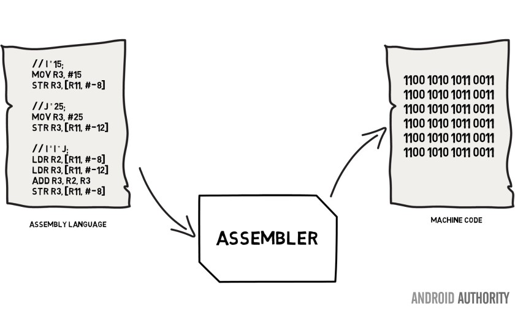
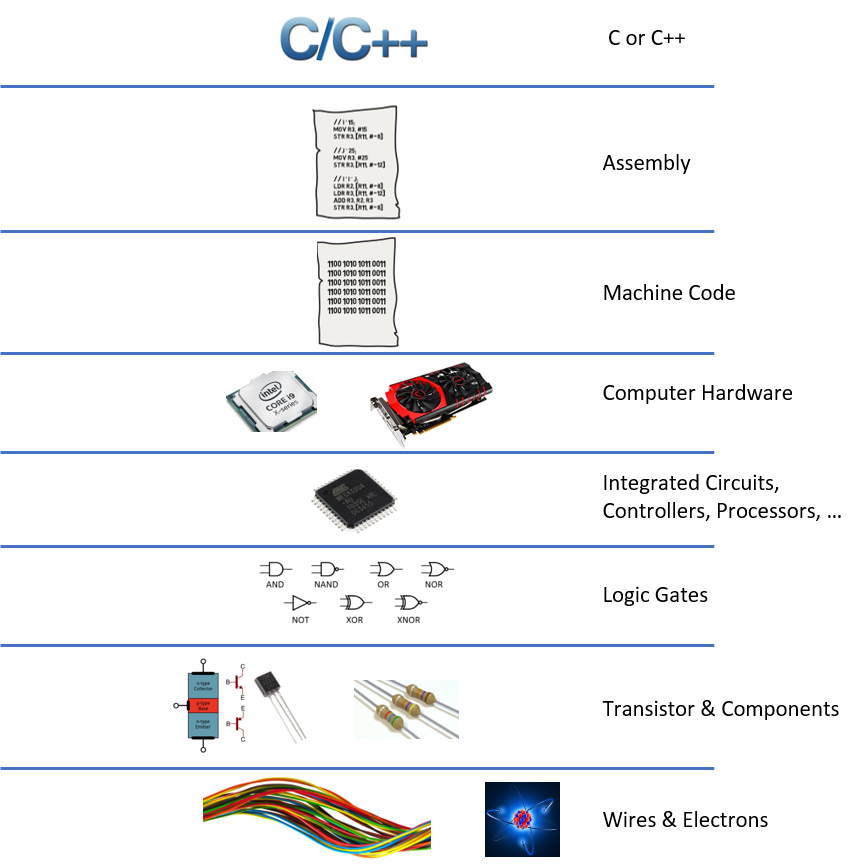

# Chapter 21 - Abstraction

Humans are curious in nature. However it is impossible for us to know every single thing that is going on.


The same is valid when designing software. More even when working in team on larger projects. It is not practical to know every little detail that is going on. It's impossible, impractical and even too time-consuming. There is actually no good reason why you should try to know every detail.

When working on projects at a certain level, it is a good idea to apply the concept of abstraction.

## What is abstraction

The concept of abstraction is to actually **know as little as possible**. All you need to know are the things that are important to you.

> The essence of abstractions is preserving information that is relevant in a given context, and forgetting information that is irrelevant in that context.
>
> John V. Guttag (2013-01-18)

Consider the real-life example of a washing machine. You can perfectly use a washing machine without understanding its internals. All you need to know is the interface it exposes:

* the hole to put the soap in
* the connection to connect the water hose to
* what buttons select the washing program
* a turning knob to select the temperature
* the extension cord to provide it with electricity

As a user of the washing machine you have no idea of the internal workings: what motor is being used, how is the machine heating the water, what microcontroller is used, what's the type of the display, how is the power supply protected, ...

Abstracting things allows us to establishing a level of complexity on which a person interacts with a system. The more complex details are hidden below the current level. The user works with an idealized interface (usually well defined) and can add additional levels of functionality that would otherwise be too complex to handle.

Take for example a programmer that is developing a calculator application. This programmer might not be interested in the way numbers are represented in the underlying hardware (e.g. whether they're 16 bit or 32 bit integers). The boundary where those details have been suppressed, we can state that they have been abstracted away. The programmer now just has numbers with which he can work.

## Programming Languages provide Abstractions

All programming languages provide abstractions. The actual quality of the abstractions will determine the complexity of the problem you are able to solve. Try writing an MMORPG game using nothing but assembler.

In fact assembly language is an abstraction for machine code which is an abstraction of the actual hardware of a computer system. Which is an abstraction of the electrons moving around.



Many imperative languages that followed (such as Fortran, C, Pascal, ...) were another level of abstraction introduced on top of the assembly language. So basically a computer application is nothing but layer upon layer upon layer of abstraction.

Nic

A nice video about abstraction can be found at Computerphile: [https://www.youtube.com/watch?v=ycl1VL0q1rs](https://www.youtube.com/watch?v=ycl1VL0q1rs).

## Advantages of Abstraction

For the most part, "knowing" in and of itself isn't necessarily bad, but "not knowing" can have its advantages. One of the main advantages of abstraction is that is let's us build complex systems much faster as we can rest our weary minds about the internals of the libraries, classes, functions, ... that can be used. If the standard libraries of C++ or the standard packages of Java were not there for us, we would still be coding on that first "hello world" program.

Another advantage of abstraction is the fact that is decouples systems from each other and makes the separate components more maintainable. If you're writing a module in a system that interacts with another, not knowing about its internals means you will only write code in accordance to the interface or API that is externally available. This means less coupling among modules, creating code that is more maintainable.

Let's say you are trying to work with a module that has some storage capability. The module provides functions for you to read and write to the storage. Because the module is open-source, you see that the underlying data structure is an array. You decide to bypass the functions given to you, and to directly manipulate the underlying array instead. Everything works just fine.

Some months later, the author of the module decides that they want to use a better data structure, say a hash table, providing faster lookup capabilities. The developer changes the underlying data structure from an array to a hash table, and updates the read and write functions so they work with the new data structure. Since most users use those functions, they don't have to change their code at all. They enjoy the benefits of the updated data structure without touching a single line of code in their program.

However, your code breaks, because it continues to assume that the internal data structure of the module is an array, which in fact no longer exists. If you still choose not to use the functions made available by the author, you'll have to find out how their hash table works, and to update your code accordingly. Of course, that might just break again when the author makes another performance breakthrough in his module.

## Pseudo Code Example

Let us consider a less abstract example (pun intended).

Take a look at the pseudo code below.

```text
create array[N]
array[0..N-1] = random(time)

i ← 1
while i < N
    j ← i
    while j > 0 and array[j-1] > array[j]
        swap array[j] and array[j-1]
        j ← j - 1
    end while
    i ← i + 1
end while
```

This piece of pseudo code is already an abstraction of an algorithm expressed in a programming language. Can you guess what it does by looking at it for a maximum time of 15 seconds?

Now what if we were to abstract some parts away in functions that we could use inside this algorithm as follows:

```text
create array[N]
initialize_with_random_values(array)
sort(ascending)
```

Now you immediately see that the pseudocode creates an array of random values that then is being sorted in ascending order. That clearness is abstraction at work.
