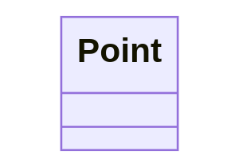
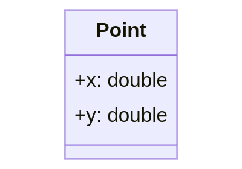
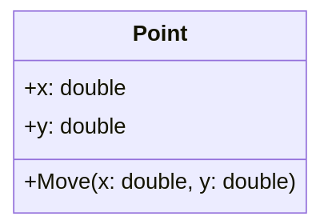

# Chapter 24 - Defining Custom Classes

Creating custom classes is one of the main responsibilities of an object oriented programmer. As stated before, an object oriented application is a **collection of objects that interact with each other**. These objects are **created based on a class** developed by a programmer. If we wish to implement some functionality that is not yet available in the language or it is not exactly what we need, we are required to build it ourselves.

Luckily even if a class is not readily available for us, we will be able to use other classes which contain partial functionality of the class we which to create. An object oriented programming language such as C# provides different mechanisms to **use already existing functionality within our own custom classes**. For example:

* Creating objects of other classes in methods where we need them and call upon their functionality using method calls. In this case we are creating **association relationships** between our class and the other classes we are using.
* Composing our own classes of already existing classes and bundling them together to build a new class. Basically the objects are composed of other objects, hence the name for this technique - **composition**.
* One can also extend an already existing class that almost does what is required but needs some small alteration or extra functionality. This mechanism is typically called **inheritance**, as one inherits state and functionality from another class.

All of these techniques will be handled thoroughly in the following chapters.

## UML Class Diagrams

When creating an application it can often be useful to put some diagrams on paper on how you are going to take on the problem. One of the most used diagrams in the world of object oriented programming is the UML (Unified Modeling Language) class diagram.

UML is a **general-purpose, modeling language** in the field of software engineering, that is intended to provide a **standard way to visualize the design of a system**.

A **class diagram** is a static diagram that **describes the data and behavior of a class and also the relationships between the different classes** in an application. Class diagrams are widely used in the modeling process of object oriented systems because they are easy to understand and map directly onto existing entities within the object oriented program.

When modeling software it's normal that not all details are available from the start. For example the type of the attributes should also be documented in the UML diagram, as are the arguments and return types of the methods. However sometimes those details haven't been decided yet. In that case we just leave them out and add them later.

As an example take a look at a partial UML class diagram of a Snake Game below.


Even if your are not an experienced programmer yet, you should be able to understand the concept of the application (not the details, only the general idea) just by looking at the diagram. If that is the case, its usefulness has just been proven.

<!-- While methods can be visualized as being private using a minus `-` symbol, often these are omitted from the UML diagram. This because most programmers find them cluttering the class diagram and they are often created as needed and not important for the outside user. -->

## Creating a Class

When creating custom classes in C#, it is convention to place the whole class and nothing but the class inside its own `cs` file. In Visual Studio this can be achieved by right clicking on your project and selecting `Add => Class`.

Consider a class that represents a point in 2D space. The class can simply be called `Point`. It is convention in C# for **class names** to be named using **Pascal Case**.

::: tip 🐫 Pascal Case and camel Case
Pascal case is a subset of *Camel Case* where the first letter is capitalized. That is, `userAccount` is written in camel case and `UserAccount` is written in Pascal case. In C# the convention is that both method names and class names are Pascal cased. It is easy to remember. Pascal is a proper noun so capitalize the first letter, while camel is a common noun, so you do not capitalize the first letter.
:::

When adding a new class `Point` in a C# project, Visual Studio will generate the following code for you:

```csharp
using System;
using System.Collections.Generic;
using System.Text;

namespace Geometry
{
  class Point
  {
  }
}
```

The first three lines are stating which libraries we wish to be able to use. Basically at the moment we only need the `System` library but you can leave it as is.

```csharp{1-3}
using System;
using System.Collections.Generic;
using System.Text;

namespace Geometry
{
  class Point
  {
  }
}
```

Next is the `namespace` to which the class belongs. **A namespace is like a container that can contain all sorts of entities such as classes.** `System` is actually also a namespace. By using these containers, collisions are avoided between class names. There can for example exist a class `Point` in the namespace `Geometry` and a class `Point` in the namespace `2DGraphics`. By placing classes in namespaces we don't have to invent unique names for our classes. Namespaces also allow developers to bundle classes together that logically belong together.

Visual Studio will automatically add all your classes to a namespace with the same name as the application. You can change the names of these namespaces as you wish.

```csharp{5,6,10}
using System;
using System.Collections.Generic;
using System.Text;

namespace Geometry
{
  class Point
  {
  }
}
```

Last but not least is the actual class definition. To define a class all you need is the keyword `class` followed by a name (in PascalCase) and curly braces for the body of the class.

```csharp{7-9}
using System;
using System.Collections.Generic;
using System.Text;

namespace Geometry
{
  class Point
  {
  }
}
```

<!-- TODO: For a class in C#, Internal is the default if no access modifier is specified. -->

### UML Class Diagram of Point

In its current state the `Point` class can be visualized using the class diagram shown next.



The class shape in a class diagram consists of a rectangle with three rows. The top row contains the **name of the class**, the middle row contains the **attributes of the class** (the data of the objects), and the bottom section expresses the **methods and/or constructors** (the behavior) that the class has. In a class diagram, classes and subclasses are grouped together to show the relationships between objects of these classes.

## Creating Objects

To create objects from the `Point` class one just needs to follow the **object creation syntax**:

```csharp
ClassName variableName = new ClassName(arguments_if_needed);
```

This creates a new object of the specified class. A reference to this object will then be stored inside the variable.

Consider the example shown below for the `Point` class. Here a new instance of the class is requested using the `new` keyword and a reference to it is stored inside of a variable called `center`.

```csharp
// Create a Point object and store its reference inside a variable
Point center = new Point();
```

Notice the similarity with creating an object of the class `Random`.

```csharp
Random generator = new Random();
```

For the moment this is all the functionality that `Point` has. Not much use for us like this.

## Adding Data

**Attributes hold the information required by the object.** They define the **data** that the object is holding or the **state** that it is in. Attributes are very similar to the variables that we already know. That is why attributes are also often referred to as **instance variables**, meaning variables of a class instance (aka object). The big difference with normal variables is that **attributes are contained within the context of an object**.

Just as variables, attributes can be of any simple data type or they can contain references to other objects. They also need a name which allows them to be used inside the methods of the objects.

Different from a normal local variable, an attribute also requires an **access modifier** to specify who can access the attribute. This can be any of the following:

* `public`: **anyone can access the attribute** - depicted with a plus sign `+` in UML.
* `private`: **only the class itself can access the attribute** - depicted with a minus sign `-` in UML.
* `protected`: **only the class itself or classes derived from this class can access the attributes** - depicted with a hashtag `#` in UML.
* `internal`: **can be accessed by any code in the same assembly, but not from another assembly**. In other words, internal types or members can be accessed from code that is part of the same compilation (project). This is the default access modifier if none is specified in C#. There is no symbol for this in UML.

::: tip 🧱 Assembly
An assembly is a `.dll` or `.exe` created by compiling one or more `.cs` files in a single compilation. This is typically mapped to a project in a solution.
:::

The **default access modifier for attributes, methods and classes** themselves in C# is `internal`. This means that if one does not specify an access modifier for the member it will be accessible from within all classes of the same assembly. This is an access modifier not found in many other object oriented programming languages. Most common access modifiers are `public`, `private` and `protected`.

::: tip 🔑 Explicit Access Modifiers
It is good practice to **always specify the access modifiers explicitly**. The defaults are language dependant and not all programmers know them by heart. By explicitly specifying the modifiers, there can be no doubt.
:::

This leads to the following syntax template for adding attributes to a class:

```csharp
class ClassName {
  // Attributes of the class
  access_modifier data_type attributeName = init_value;
}
```

Notice how the **access modifier is placed before the declaration** of the instance variable.

Consider the example below of the class `Point` that holds the two coordinate values of a point in a 2D space. For now, the attributes are made accessible from the outside of the object by declaring them `public`.

```csharp{3-4}
class Point {
  // Both x and y are attributes of the class Point
  public double x = 0;
  public double y = 0;
}
```

The declaration of attributes is very similar to the declaration of local variables. They just need to be placed inside the curly braces of the class they belong to.

It is also perfectly legal to initialize instance variables when declaring them by assigning them a value. This will make sure that when an object of the class is created, the attributes have a valid value.

Instance variables are initialized by C# to default values:

* whole numbers (`integer`, `long`, `char`, ...) default to `0`
* real numbers (`float` and `double`) default to `0.0`
* `boolean` values default to `false`
* object references default to `null`

:::warning 🔮 Initialize Attributes
While C# makes sure that all variables and instance variables are initialized, it is most of the time a good idea to do it yourself. That way you will always think about which is a sane default value for each attribute. On top of that, it is a good habit as not every programming language will initialize variables for you, take C++ for example. Do always at least make sure to **initialize object references** as calling methods on `null` will crash your application.
:::

Public attributes can be accessed from outside of the object using the member operator `.`. This means that one can create a `Point` object and access the `x` and `y` attributes as shown in the following code snippet.

```csharp{7,10-11,12}
static void Main(string[] args)
{
  // Creating a Point object and store its reference inside a variable
  Point center = new Point();

  // Output current location of the point
  Console.WriteLine($"Start location of point [{center.x}, {center.y}]");

  // Move the point to a new location and output it
  center.x = 15.66;
  center.y = -3.12;
  Console.WriteLine($"Moved the point to [{center.x}, {center.y}]");
}
```

::: codeoutput
```
Start location of point [0, 0]
Moved the point to [15.66, -3.12]
```
:::

The previous example shows that the values of attributes can both be retrieved and changed from outside of the class if they are `public`.

### UML Class Diagrams of Point

In its current state the `Point` class can be visualized using the class diagram shown below.



The second row of the class rectangle is this time populated with a list of attributes. Both attributes are `public` so they are preceded with a plus sign `+`. Also their type is specified after the name and separated by a colon `:`.

## Adding Behavior

The nice part about objects is that they **can contain both data and behavior**. This makes them **standalone entities** that have a state and a way to change or act upon that state using methods.

**A method is basically a block of code with a name.** This name can be used to invoke/call the method from another place in your application. The special thing about methods, compared to regular functions, is that they are called on objects and are therefore **executed in context of the objects**, meaning they are considered part of that object and can access the internal state of these objects.

Consider the previous code example of the `Point` class.

```csharp
static void Main(string[] args)
{
  // Creating a Point object and store its reference inside a variable
  Point center = new Point();

  // Output current location of the point
  Console.WriteLine($"Start location of point [{center.x}, {center.y}]");

  // Move the point to a new location and output it
  center.x = 15.66;
  center.y = -3.12;
  Console.WriteLine($"Moved the point to [{center.x}, {center.y}]");
}
```

Would this code not be a lot cleaner if we could request a `Move` action from the `Point` to a certain `x,y` location? This would lead to code that is cleaner and easier to read.

```csharp{10}
static void Main(string[] args)
{
  // Creating a Point object and store its reference inside a variable
  Point center = new Point();

  // Output current location of the point
  Console.WriteLine($"Start location of point [{center.x}, {center.y}]");

  // Move the point to a new location and output it
  center.Move(15.66, -3.12);
  Console.WriteLine($"Moved the point to [{center.x}, {center.y}]");
}
```

**Instead of changing the state from the outside of the object, it's better to use a method to request a change in the objects state.** This because of at least the following reasons:

* By using a method to change the object's state, we are guaranteed to only change the state that is required to change for that particular action we are requesting.
* The internal state cannot be changed in a way that would place the object in an invalid state or corrupt the object. This because the method can check incoming data values.
* The name of the method contributes to code readability as it reflects the action that is being taken.
* The method can be called from many places, adding to the DRYness of the code.
* A method also hides the complexity of the internal state from the user of that object (cfr. abstraction)
* ...

A `Move()` method also represents a logical part of the class `Point`. The advantage is also that this functionality may come in handy in other place.

### Adding a Move method to Point

Adding a `Move()` method to the `Point` class is actually not that hard. Custom methods can be added to a class by placing them between the curly braces of the class as shown next:

```csharp{3-6}
class Point {
  // A method called Move that allows us to relocate the point
  public void Move(double toX, double toY) {
    x = toX;
    y = toY;
  }

  // Both x and y are attributes of the class Point
  public double x = 0;
  public double y = 0;
}
```

::: warning ⏹️ static
Note that the methods that are being added to the class `Point` are **not** `static`. This is because these methods will **act on the object created from the class** `Point`, cfr. they will access and even change the internal data of the object. Remember that `static` methods don't require objects and are called on the classes itself, cfr they require no object state.
:::

Some important things to note about the implementation of the `Move()` method are:

* If the methods needs to be accessible from outside of the class `Point`, it needs be declared `public`. So in this case, the method will be called from `Main()`, so it needs to be made `public`.
* Attributes can be placed at the bottom of the class or at the top. Many developers prefer that they are placed at the bottom of the class. This because most of the time a user of a class only needs to know the methods.
* Two arguments, `toX` and `toY`, are defined between the parentheses `()` of the method. These will contain the new values that are passed to the method when it is called.
* `x` and `y` are the attributes of the object. If we wish to update these with the new values in the arguments, we need to assign the arguments to the attributes.
* The return type of the `Move()` method is `void`. It does not return anything, cfr. is has no actual result. It only changes the internal state of the `Point` object.

The implementation of the `Move()` method still needs some tweaking. Consider the names of the arguments, `toX` and `toY`. While not wrong, its often a bad idea to invent new named for things that are the same. These arguments contain the `x` and `y` coordinates to which the `Point` should be moved. So it would be more obvious to call them `x` and `y`. Its perfectly legal to do this, but there is a small hiccup in the implementation because if we were to change it like that, the arguments would be assigned to themselves.

```csharp{5-6}
class Point {
  // A method called Move that allows us to relocate the point
  public void Move(double x, double y) {
    // WRONG - Arguments are assigned to themselves
    x = x;
    y = y;
  }

  // Both x and y are attributes of the class Point
  public double x = 0;
  public double y = 0;
}
```

To fix this, we need to explicitly state that the left-hand side of the assignment should be the attribute. This can be achieved by using `this.` in front of the attribute name. `this` is a reference to the current object of this class and the point operator `.` allows us to access its members, even the private ones because we are using it internally in the class.

This leads to a generally accepted implementation:

```csharp{4-5}
class Point {
  // A method called Move that allows us to relocate the point
  public void Move(double x, double y) {
    this.x = x;
    this.y = y;
  }

  // Both x and y are attributes of the class Point
  public double x = 0;
  public double y = 0;
}
```

To use the `Move()` method in `Main()` all we need to do is call it with an `x` and `y` coordinate as shown in the next code example:

```csharp{10,14}
static void Main(string[] args)
{
  // Creating a Point object and store its reference inside a variable
  Point center = new Point();

  // Output current location of the point
  Console.WriteLine($"Start location of point [{center.x}, {center.y}]");

  // Move the point to a new location and output it
  center.Move(15.66, -3.12);
  Console.WriteLine($"Moved the point to [{center.x}, {center.y}]");

  // Move point again - wow it's so easy
  center.Move(12, 10);
  Console.WriteLine($"Moved the point to [{center.x}, {center.y}]");
}
```

::: codeoutput
```
Start location of point [0, 0]
Moved the point to [15.66, -3.12]
Moved the point to [12, 10]
```
:::

### UML Class Diagrams of Point

In its current state the `Point` class can be visualized using the class diagram shown below.



The third row of the class rectangle is this time populated with a list of methods.

Both methods are `public` so they are preceded with a plus sign `+`.

The `Move()` method takes two arguments. Both arguments are separated using a comma. The argument themselves are represented by their name, a colon `:` followed by their type.
