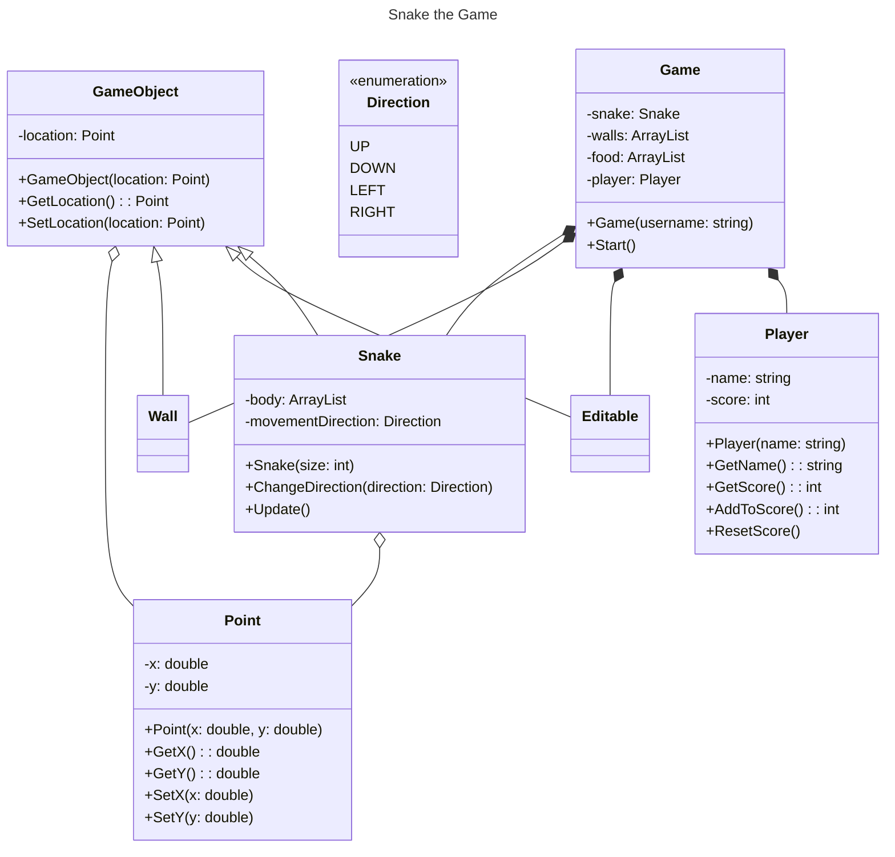

```mermaid
---
title: Snake the Game
---
classDiagram
  class Point{
    -x: double
    -y: double
    +Point(x: double, y: double)
    +GetX(): double
    +GetY(): double
    +SetX(x: double)
    +SetY(y: double)
  }
  GameObject o-- Point
  class GameObject{
    -location: Point
    +GameObject(location: Point)
    +GetLocation(): Point
    +SetLocation(location: Point)
  }
  GameObject <|-- Wall
  class Wall{
  }
  GameObject <|-- Editable
  class Editable{
  }
  class Direction{
    <<enumeration>>
    UP
    DOWN
    LEFT
    RIGHT
  }
  Snake o-- Point
  GameObject <|-- Snake
  class Snake {
    -body: ArrayList<Point>
    -movementDirection: Direction
    +Snake(size: int)
    +ChangeDirection(direction: Direction)
    +Update()
  }
  class Player{
    -name: string
    -score: int
    +Player(name: string)
    +GetName(): string
    +GetScore(): int
    +AddToScore(): int
    +ResetScore()
  }
  Game *-- Snake
  Game *-- Wall
  Game *-- Editable
  Game *-- Player
  class Game{
    -snake: Snake
    -walls: ArrayList<Wall>
    -food: ArrayList<Editable>
    -player: Player
    +Game(username: string)
    +Start()
  }
```