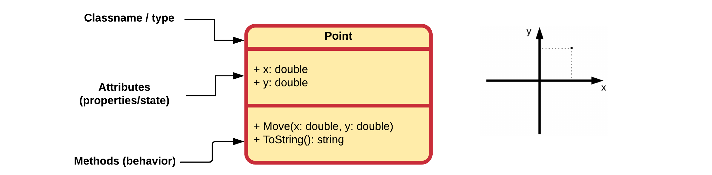
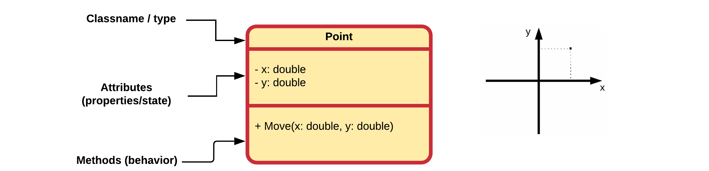

# Chapter 24 - Getters, Setters and Properties

TODO


### A ToString Method

In C# every object that is created automatically gets a number of methods that are provided by the C# language. One of these methods is the `ToString()` method which is **implicitly called when an object reference is placed inside a String context** as for example:

```csharp{7,10}
static void Main(string[] args)
{
  // Create Point object and place reference in center variable
  Point center = new Point();

  // Here an implicit call to center.ToString() is made by C#
  Console.WriteLine(center);

  // You can also explicitly call the ToString() method
  Console.WriteLine(center.ToString());
}
```

::: codeoutput
<pre>
Geometry.Point
Geometry.Point
</pre>
:::

The C# `ToString()` method is used when we need a `string` representation of an object. It is defined in the special class `Object`.

For some classes that are part of the C# library, this method generates a sensible result. However custom classes created by ourselves return the fully qualified name of the class.

The result should be a concise but informative representation of the object that is easy for a person to read. It is recommended that all classes override this method and add their own implementation.

This can be achieved by adding the following method to your class (the method signature must be exact and the `override` keyword must also be present):

```csharp{12-15}
class Point
{
  // A method called Move that allows us to relocate the point
  public void Move(double x, double y)
  {
    this.x = x;
    this.y = y;
  }

  // The ToString() method is called when an object of Point
  // is placed inside of a string context
  public override string ToString()
  {
    return "Some String representation of your object";
  }

  // Both x and y are attributes of the class Point
  public double x = 0;
  public double y = 0;
}
```

Of course the return statement `return "Some String representation of your object";` must be changed according to the representation you wish to return.

For the `Point` class the representation could be the format in which we've been outputting the points thus far: `[x, y]`. This would lead to the following implementation:

```csharp{14}
class Point
{
  // A method called Move that allows us to relocate the point
  public void Move(double x, double y)
  {
    this.x = x;
    this.y = y;
  }

  // The ToString() method is called when an object of Point
  // is placed inside of a string context
  public override string ToString()
  {
    return $"[{x},{y}]";
  }

  // Both x and y are attributes of the class Point
  public double x = 0;
  public double y = 0;
}
```

This results in a much cleaner `Main()` method:

```csharp{7,11,15}
static void Main(string[] args)
{
  // Creating a Point object and store its reference inside a variable
  Point center = new Point();

  // Output current location of the point
  Console.WriteLine(center);

  // Move the point to a new location and output it
  center.Move(15.66, -3.12);
  Console.WriteLine($"Moving the point to {center}");

  // Move point again - wow it's so easy
  center.Move(12, 10);
  Console.WriteLine($"Moving the point to {center}");
}
```

::: codeoutput
<pre>
[0,0]
Moving the point to [15.66,-3.12]
Moving the point to [12,10]
</pre>
:::

::: warning Don't print inside Classes
As a teacher, I'm already hearing you think, "Why didn't we put the `Console.WriteLine()` inside the Point class in a Print() method or something similar?" Unless you have a good reason, it's most of the time a bad idea to place `Console.WriteLine()` statements inside your custom classes. This limits their use. What if the user of your class wanted to format the output differently or output its string representation to a log file or to an API in the cloud. If you decide to send it to the terminal directly instead of returning the actual string, you are limiting the capabilities of your classes.
:::

### UML Class Diagrams of Point

In its current state the `Point` class can be visualized using the class diagram shown below.



The third row of the class rectangle is this time populated with a list of methods.

Both methods are `public` so they are preceded with a plus sign `+`.

The `Move()` method takes two arguments. Both arguments are separated using a comma. The argument themselves are represented by their name, a colon `:` followed by their type.

Notice how the return datatype of the `ToString()` method is also specified in the UML diagram, in the same way as an attribute, by placing a colon `:` after the method and then stating the datatype (`String` in this case).

## Access Modifiers - Data Hiding

While perfectly legal, in most cases it is considered blasphemy to make attributes `public` unless they are `const`.

::: tip Constant (instance) variables
Constant variables can only be assigned once. That means that they can only be initialized after which their value cannot be changed anymore. Variables and attributes can be made constant by placing the keyword `const` before the data type. So for example `public const double PI = 3.14;`.
:::

Why would one not make everything `public` and allow the user of the class access to everything? Because objects should NOT be able to directly change attributes of other objects. This is a necessity for three reasons:

* to **protect the user of the class** from himself
* to **protect the class from the user**. *Things that are hidden cannot be misused*.
* to make the code that uses the class less dependant on the internals of the class. It's better to be dependant on behavior than on data. This is one of the **SOLID** principles.
<!-- TODO: More info on this -->

Restricting access to attributes and certain methods is called **data hiding**. The attributes of a class should almost always be made `private`. A user of your class should never be able to change the inner properties directly from outside the class. If you allow users access to the inner workings of your objects they will misuse it. **Declaring an attribute as public breaks data hiding.**

Then how can one than change the state of objects? Simple, by **regulating the access to the state of the object using methods**. This allows the developer of the class to place safeguards where needed.

Take for example a class `Rectangle` which has a `width` and a `height` attribute. If these were `public`, there would be nothing to stop the user from assigning negative values to these attributes. This would be illogical. In many cases this can introduce bugs that the developer of the class never saw coming. By adding methods to set these attributes, the values can be checked for sanity.

### Refactoring Point

With **data hiding** in mind the class `Point` should actually be refactored a bit. The attributes should be made `private` instead of public. If you take a closer look at the `Main()` method, you will see that we actually don't access the attributes of a `Point` directly. This is good programming practice.

```csharp{18-19}
class Point
{
  // A method called Move that allows us to relocate the point
  public void Move(double x, double y)
  {
    this.x = x;
    this.y = y;
  }

  // The ToString() method is called when an object of Point
  // is placed inside of a string context
  public override string ToString()
  {
    return $"[{x},{y}]";
  }

  // Both x and y are attributes of the class Point
  private double x = 0;
  private double y = 0;
}
```

### UML Class Diagrams of Point

In its current state the `Point` class can be visualized using the class diagram shown below.



Notice that the attributes switched from a plus sign `+` to a min sign `-` to indicate that they are private.
