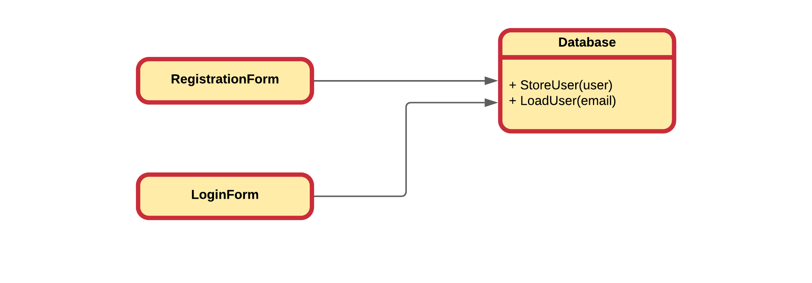
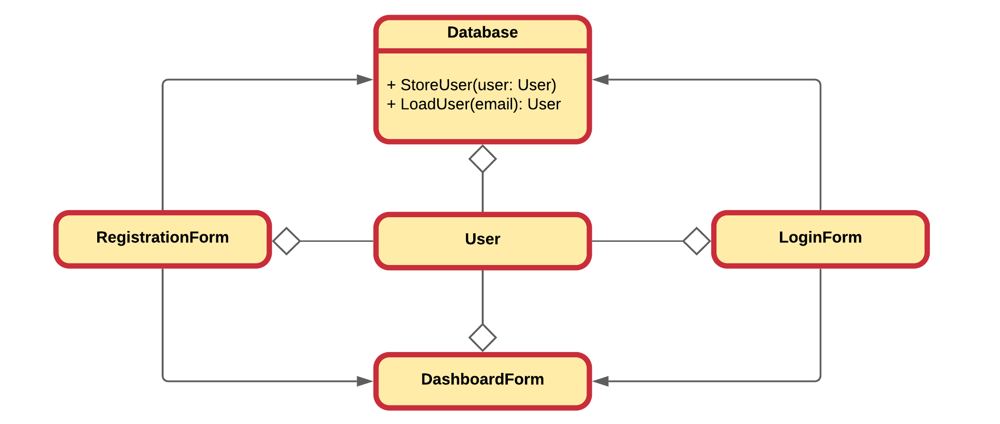
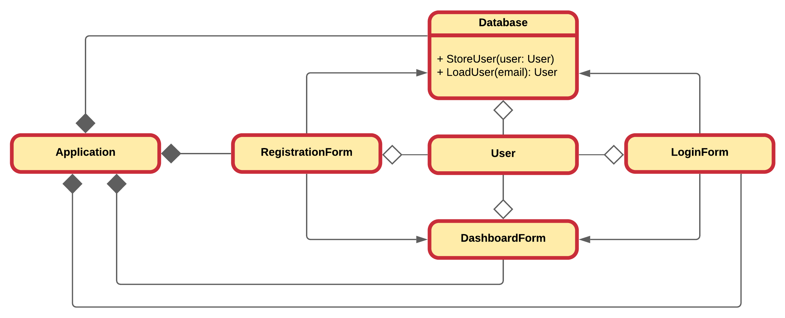

<!-- Source: https://www.visual-paradigm.com/guide/uml-unified-modeling-language/uml-aggregation-vs-composition/ -->

# Chapter 25 - Composition

By using composition one builds **objects that consist of other objects**. Think of it as creating a new type of object by packaging together other objects.

Composition also allows one to hide complexity behind the simplicity of objects. In other words, objects allow one to create new levels of abstraction.

Composition comes with a great deal of flexibility. Member objects of the new class can be made private, making them inaccessible to client programmers. This means that there can be changes without disturbing existing client code.

Because inheritance is one of the main pillars of object oriented design, it is often over-estimated and over-used. When used wrongly, it can result in awkward and overly-complicated designs. A good practice is to look at composition first when creating new classes as it is **simpler and more flexible**.

## Association

When **an object of one class may use services/methods provided by an object of another class**, the relationship between those objects is termed as an **association**. An association represents a relationship between two or more objects where all objects **have their own lifecycle** and there is **no owner**.

::: warning No Owner
Do note that when stating that there is no ownership in the context of the association, this is only true for the association itself. Other objects may, and probable will, own the objects involved in the association.
:::

The name of an association specifies the nature of relationship between the objects. An association is represented in UML by a solid line and an optional arrow indicating which object is using services of the other object.

The previous UML class diagram shows a typical association where a `RegistrationForm` object **uses** the `Database` object to store new users into. The `LoginForm` on the other hand uses the same object to load existing users from when they are trying to login. As stated before, there is no ownership in this relation. If the `RegistrationForm` instance is destroyed, it has no implications on the state of the `Database` object.

In schoolbooks, the association relationship is often explained using the `Teacher` and `Student` example. The `Student` could for example associate with a `Teacher` object by being able to ask a question to the `Teacher`. Both exist independently - there is no ownership between the objects and both have their own lifecycle.

## Composition and Aggregation

Aggregation and Composition are **subsets of association** meaning they are specific cases of association. In both aggregation and composition object of one class "own" object of another class. There is however a **subtle difference**.

### Aggregation

**Aggregation** is a **specialized form of association** between two or more objects in which each object has its **own life cycle** but there exists an **ownership** as well. Aggregation is a typical whole/part or parent/child relationship but it may or may not denote physical containment. An essential property of an aggregation relationship is that the whole or parent (i.e. the owner) can exist without the part or child and vice versa.

It's important to note that the aggregation relation does not state in any way that `Class A` exclusively owns `Class B`. Actually, quite the opposite. The aggregation link is usually used to stress the point that the `Class A` instance is not the exclusive container of the `Class B` instance, as in fact the same `Class B` instance may have another container/s.

In UML this is represented by a hollow diamond followed by a line. The hollow diamond is placed on the "owner" side of the relationship.

Building upon the `Database` application, a typical **aggregation** relationship is shown between the `LoginForm`, `RegistrationForm`, `Database` and `User` instances. A `RegistrationForm` may create a `User` object an pass it on to be stored in the `Database`. The `LoginForm` may check the user's authentication information by retrieving a `User` object from the `Database`.

Neither the `LoginForm` or `RegistrationForm` instances exclusively own the `User` object. Both of them will pass it on to the `DashboardForm` which will also act as a container for the same instance.

In schoolbooks, an aggregation relationship is often explained using the `Teacher` and `School` example. A `Teacher` may give courses in different `School` instances. However, if a `School` is closed, the `Teacher` keeps on existing and keeps teaching at the other `School` instances to which the `Teacher` belongs. Note that the relationships between objects participating in an aggregation cannot be reciprocal - i.e., a `School` may "own" a `Teacher`, but the `Teacher` does not own the `School`.

### Composition

**Composition** implies a relationship where the **child cannot exist independent of the parent**. In this relationship there is a **strong lifecycle dependency** between the child objects and the parent object. If a parent object is destroyed, its composed child objects will also be destroyed.

In UML this is represented by a solid diamond followed by a line. The solid diamond is placed on the "owner" side of the relationship.

Advancing further with the `Database` example may introduce an `Application` that owns the different form classes and the `Database`. When the `Application` instance is destroyed, so will all the form objects and the `Database` instance.

While maybe not yet apparent, but you have probable be using composition more than you imagine. Consider the `String` class which we use daily in our other classes. Everytime we add a `String` instance to our class, we are basically composing our custom class of `String` objects. Most of the time this will not be denoted in UML, as done below for educational purposes, but at its core this is composition. Delete the `User` object will also mean destroying the `String` instances `username`, `email` and `password`.

In schoolbooks, a composition relationship is often explained using the `School` and `Department` example. A `School` can consist of one or more `Departments`. Here a strong lifecycle dependency exist as the different `Department` instances cannot exist without the `School`. Closing the `School` means closing the `Departments`.

### In Practice

While a clear distinction is made here between aggregation and composition, it is not always done so in practice. In practice, one does often speak of composition even if he/she were to mean aggregation. As a result this course may also use the word composition where aggregation is meant. Of course in cases where a clear distinction is needed, the correct term will be used.

::: tip Definition - Association, Composition and Aggregation
To sum it up association is a very generic term used to represent when one class uses the functionalities provided by another class. It is sayed it's a composition if one parent class object owns another child class object and that child class object cannot meaningfully exist without the parent class object. If it can then it is called aggregation.
:::
