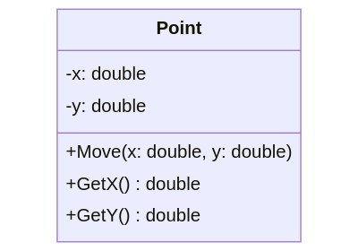
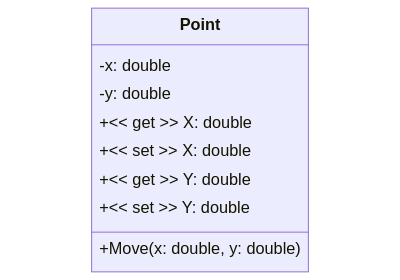

::: danger ☠️ First draft
Please note that this chapter is a first draft and may still contain errors, typo's or irregularities.
:::

# Chapter 25 - Getters, Setters and Properties

While perfectly legal, in most cases it is considered blasphemy to make attributes `public` unless they are `const`.

::: tip 🥧 Constant (instance) variables
Constant variables can only be assigned once. That means that they can only be initialized after which their value cannot be changed anymore. Variables and attributes can be made constant by placing the keyword `const` before the data type. So for example `public const double PI = 3.14;`.
:::

Why would one not make everything `public` and allow the user of the class access to everything? Because objects should NOT be able to directly change the state of other objects. This is a necessity for three reasons:

* to **protect the user of the class** from himself
* to **protect the class from the user**. *Things that are hidden cannot be misused*.
* to make the code that uses the class less dependant on the internals of the class. It's better to be dependant on behavior (read methods) than on data (read attributes).

Restricting access to attributes and certain methods is called **data hiding**. The attributes of a class should almost always be made `private`. A user of your class should never be able to change the inner properties directly from outside the class. If you allow users access to the inner workings of your objects they will misuse it. **Declaring an attribute as public breaks data hiding.**

::: tip 🔎 Definition of Data Hiding
Data hiding is a software development technique specifically used in object-oriented programming (OOP) to hide internal object details (data members). Data hiding ensures exclusive data access to class members and protects object integrity by preventing unintended or intended changes. [Techopedia](https://www.techopedia.com/definition/14738/data-hiding)
:::

Take for example a class `Rectangle` which has a `width` and a `height` attribute. If these were `public`, there would be nothing to stop the user from assigning negative values to these attributes. This would be illogical. In many cases this can introduce bugs that the developer of the class never saw coming.


Then how can one than change the state of objects? Simple, by **regulating the access to the state of the object using methods**. This allows the developer of the class to place safeguards where needed.


So basically, it makes the class more user-friendly and makes sure that objects of the class cannot be placed in an invalid state by regulating access to the state of the objects via methods. It also allows the developer of the class to change the implementation of the class without having to worry about the people using his/her class, as long as he does not alter the public methods. On top of all that it contributes to the maintainability and DRYness of our code.

## Hiding the Attributes

With **data hiding** in mind the class `Point` should actually be refactored a bit. The attributes should be made `private` instead of `public`. If you take a closer look at the `Main()` method, you will see that we actually don't access the attributes of a `Point` directly, we instead use the `Move()` method. This is good programming practice.

Of course our application does not yet use the `Point` instances for any serious processing.

```csharp{18-19}
class Point
{
  // A method called Move that allows us to relocate the point
  public void Move(double x, double y)
  {
    this.x = x;
    this.y = y;
  }

  // Both x and y are attributes of the class Point
  private double x = 0;
  private double y = 0;
}
```

### UML Class Diagrams of Point

In its current state the `Point` class can be visualized using the class diagram shown below.


Notice that the attributes switched from a plus sign `+` to a minus sign `-` to indicate that they are `private`.

## Getters

Now if the attributes need to be made `private`, then how would one access the required data from outside of the object? This is where methods such as **getters** (also called accessor methods) come into play. They allow the value of the attribute to be accessible from the outside.

Typically getters follow these conventions:

* Their name starts with `Get` followed by the name of the attribute they are making available. For example `GetRadius` for a getter of a class `Circle` that makes `radius` accessible.
* Their return data type is the same datatype as that of the attribute.
* They are typically `public`, but based on the situation can be made `internal`, `protected` or even `private` as required.
* They do not take in any arguments.
* They typically just return the attribute, however in some cases small calculations, filtering of data and such are also legal.
* And last but not least, they never change the internal state of the object !

Taking the `Point` class as an example again; adding a getter for both the `x` and `y` coordinate is fairly straight-forward if we take the previous conventions into consideration:

```csharp{11-14,17-20}
class Point
{
  // A method called Move that allows us to relocate the point
  public void Move(double x, double y)
  {
    this.x = x;
    this.y = y;
  }

  // Getter method for the x-coordinate
  public double GetX()
  {
    return x;
  }

  // Getter method for the y-coordinate
  public double GetY()
  {
    return y;
  }

  // Both x and y are attributes of the class Point
  private double x = 0;
  private double y = 0;
}
```

Of course the `Main` application will need to be refactored to take these changes into consideration:

```csharp{7,11,15}
static void Main(string[] args)
{
  // Creating a Point object and store its reference inside a variable
  Point center = new Point();

  // Output current location of the point
  Console.WriteLine($"Start location of point [{center.GetX()}, {center.GetY()}]");

  // Move the point to a new location and output it
  center.Move(15.66, -3.12);
  Console.WriteLine($"Moved the point to [{center.GetX()}, {center.GetY()}]");

  // Move point again - wow it's so easy
  center.Move(12, 10);
  Console.WriteLine($"Moved the point to [{center.GetX()}, {center.GetY()}]");
}
```

### UML Class Diagrams of Point

In its current state the `Point` class can be visualized using the class diagram shown below.



The UML class diagram has been expanded with the two getter methodes `GetX()` and `GetY()`. Note how the return types of the methods are indicated after the method name, separated with a colon `:`.

## Setters

Where getters allow attributes values to be accessed from the outside of the class, **setters** (also called mutators) **allow attributes to be changed**.

Typically setters follow these conventions:

* Their name starts with `Set` followed by the name of the attribute they are making available. For example `SetRadius` for a setter of a class `Circle` that allows `radius` to be modified.
* Setter do not return a value. So their return type is always `void`.
* They are typically `public`, but can be made `internal`, `protected` or even `private` as required.
* They take in the new value as an argument.
* They typically just assign the argument value to the attribute in question. However, if required, they can implement incoming data checks to make sure that the value of the arguments fits within the valid range of the attribute.

The `Point` example class here does not really require safe-guards for the `x` and `y` coordinates because all possible values for the `double` datatype can be considered valid. So here, both setters just need to assign the argument to the attribute.

```csharp{23-26,29-32}
class Point
{
  // A method called Move that allows us to relocate the point
  public void Move(double x, double y)
  {
    this.x = x;
    this.y = y;
  }

  // Getter method for the x-coordinate
  public double GetX()
  {
    return x;
  }

  // Getter method for the y-coordinate
  public double GetY()
  {
    return y;
  }

  // Setter method for the x-coordinate
  public void SetX(double x)
  {
    this.x = x;
  }

  // Setter method for the y-coordinate
  public void SetY(double y)
  {
    this.y = y;
  }

  // Both x and y are attributes of the class Point
  private double x = 0;
  private double y = 0;
}
```

Now we can use the setters from our `Main` application (as we made them `public`):

```csharp{18}
static void Main(string[] args)
{
  // Creating a Point object and store its reference inside a variable
  Point center = new Point();

  // Output current location of the point
  Console.WriteLine($"Start location of point [{center.GetX()}, {center.GetY()}]");

  // Move the point to a new location and output it
  center.Move(15.66, -3.12);
  Console.WriteLine($"Moved the point to [{center.GetX()}, {center.GetY()}]");

  // Move point again - wow it's so easy
  center.Move(12, 10);
  Console.WriteLine($"Moved the point to [{center.GetX()}, {center.GetY()}]");

  // Now we can also move a single coordinate of the Point
  center.SetX(66);
  Console.WriteLine($"Moved the point to [{center.GetX()}, {center.GetY()}]");
}
```

::: codeoutput
```
Start location of point [0, 0]
Moving the point to [15.66, -3.12]
Moving the point to [12, 10]
Moving the point to [66, 10]
```
:::

### UML Class Diagrams of Point

In its current state the `Point` class can be visualized using the class diagram shown below.


The UML class diagram has been expanded with the two setter methodes `SetX()` and `SetY()`. Both setters take in a single argument of type double and have no return type (implicitly `void`).

### A Setter with a Safeguard

But what if the setter had to include a safe-guard for an attribute that can be changed through that setter. Let's consider another class `Circle` which has a single attribute `radius`. A getter and setter for this attribute have already been provided.

```csharp
class Circle
{
  // A getter for the radius attribute
  public double GetRadius()
  {
    return radius;
  }

  // A setter for the radius attribute
  public void SetRadius(double radius)
  {
    this.radius = radius;
  }

  // radius is the only attribute of a Circle
  private double radius = 1;
}
```

There is however a small problem here. There is nothing preventing us from changing the radius of the circle to a negative value, which is not a valid value for a circle radius.

```csharp
static void Main(string[] args)
{
  Circle circle = new Circle();

  // Change the radius to an invalid value
  circle.SetRadius(-12);
    // OOF! We should not be able to do that

  Console.WriteLine($"The radius of the circle is {circle.GetRadius()}");
}
```

By harnessing the power of our `SetRadius()` method, we can actually safe-guard our attribute value and make sure only valid values are stored. In this case it can be as simple as making sure that the `radius` value is always mutated to a positive value. We can do this by taking the absolute value of the incoming argument.

```csharp{12}
class Circle
{
  // A getter for the radius attribute
  public double GetRadius()
  {
    return radius;
  }

  // A setter for the radius attribute
  public void SetRadius(double radius)
  {
    this.radius = Math.Abs(radius);
  }

  // radius is the only attribute of a Circle
  private double radius = 1;
}
```

Note that the chosen approach depends on the need of the application itself. Other approaches might of been:

* only assign the incoming value to the attribute if it is positive;
* throw an exception stating that an invalid argument was provided - more on this later;
* reset the radius to `1`;
* ...

Basically the worst thing we could have done, was ignore the problem.

## Properties

Providing getters and setters for internal attributes is a common practice. Because this is required so often, the C# language has introduced the **properties construct**. Properties are basically class members that provide a flexibel mechanism to read, write or compute the values of private attributes. They enable data to be accessed easily and still help promote the safety and flexibility of methods.

Properties can be used in a similar way as public attributes, but internally they are actually special methodes (getters and setters).

::: warning ✨ Properties
Not al programming languages support properties or provide a similar mechanism. It is mostly the more extensive and modern programming languages such as C# and Java that provide these sort of mechanisms.
:::

Properties come in two flavors: **properties with a backing attribute** or **automatically implemented properties**.

### Properties with a Backing Attribute

When we want full control of both the attribute and the property, we can make use of the **full property** syntax shown below:

```csharp
// The attribute field for the property
private int myVar;

// The actual property with a getter and setter
// This replaces our own getter and setter for `myVar`
public int MyProperty
{
    get { return myVar; }
    set { myVar = value; }
}
```

::: tip 🈵 propfull
You can generate the shown code snippet in Visual Studio by typing `propfull` and pressing the `TAB` key twice.
:::

The previous code snippet shows:

* the actual attribute field as we know it, `myVar` in this case.
* a `public` property called `MyProperty` of type `int`.
  * the getter returns the `myVar` value. Calculations can be made inside the body of the `get` clause.
  * the setter assigns `value` to the attribute `myVar`. `value` is a C# keyword that contains the value that was assigned via the setter. So basically this can be checked or manipulated before assigning it to the attribute. This can be achieved inside the body of the `set` clause.

The property can also be made `private`, `protected` or `internal` based on your needs. Also both `set` and `get` can be prefixed with an accessor modifier `public`, `private` or `internal` to change the accessibility level of that specific property accessor/mutator.

This way you could even implement a readonly property by making the `set` `private` so it can only be used inside the class itself.

Let us refactor the `Point` class and remove our own getters and setters and replace them with properties:

```csharp
class Point
{
  // A method called Move that allows us to relocate the point
  public void Move(double x, double y)
  {
    this.x = x;
    this.y = y;
  }

  public double X
  {
    get { return x;  }
    set { x = value; }
  }

  public double Y
  {
    get { return y; }
    set { y = value; }
  }

  // Both x and y are attributes of the class Point
  private double x = 0;
  private double y = 0;
}
```

That cleaned out our `Point` class quitte nicely.

This is actually not the biggest impact. The more impressive change lies within in our `Main` application. This because of the way that a property is accessed. It is not called as a method with parentheses `()` but rather like an attribute.

```csharp
static void Main(string[] args)
{
  // Creating a Point object and store its reference inside a variable
  Point center = new Point();

  // Output current location of the point
  Console.WriteLine($"Start location of point [{center.X}, {center.Y}]");

  // Move the point to a new location and output it
  center.Move(15.66, -3.12);
  Console.WriteLine($"Moved the point to [{center.X}, {center.Y}]");

  // Move point again - wow it's so easy
  center.Move(12, 10);
  Console.WriteLine($"Moved the point to [{center.X}, {center.Y}]");

  // Now we can also move a single coordinate of the Point
  center.X = 66;
  Console.WriteLine($"Moved the point to [{center.X}, {center.Y}]");
}
```

So instead of `center.GetX()` we can write `center.X` for accessing the property value and instead of writing `center.SetX(66)` we can use `center.X = 66`. This is much cleaner and less intrusive.

#### With a safe-guard

Now let's refactor the `Circle` class example where we added a safe-guard for the `radius` attribute:

```csharp
class Circle
{
  // A getter for the radius attribute
  public double GetRadius()
  {
    return radius;
  }

  // A setter for the radius attribute
  public void SetRadius(double radius)
  {
    this.radius = Math.Abs(radius);
  }

  // radius is the only attribute of a Circle
  private double radius = 1;
}
```

Let's take another approach this time for the sake of academic purpose and only assign the value to the attribute if its positive. In the other case we set the radius to `0`. Using properties, this would turn out like the following code snippet:

```csharp
class Circle
{
  // Property with safe-guard for the radius attribute
  public double Radius
  {
    get { return radius; }
    set
    {
      if (value < 0)
      {
        value = 0;
      }

      radius = value;
    }
  }

  // radius is the only attribute of a Circle
  private double radius = 1;
}
```

Note that we can internally change `value` too. It's basically a special variable.

We also need to refactor the `Main` application to reflect these changes:

```csharp
static void Main(string[] args)
{
  Circle circle = new Circle();

  // Change the radius to an invalid value
  circle.Radius = -12;
  Console.WriteLine($"The radius of the circle is {circle.Radius}");

  // Change the radius to a valid value
  circle.Radius = 66;
  Console.WriteLine($"The radius of the circle is {circle.Radius}");
}
```

::: codeoutput
```
The radius of the circle is 0
The radius of the circle is 66
```
:::

### Automatically Implemented Properties

In case of the `Point` class, the property implementation can actually be simplified even more because the implementation of the getter and setter are the default behavior of a property in C# (cfr. return for getter and store for setter without any extra functionality).

When this is the case, the actual attribute can be removed from the class and the property implementation can be altered to an *automatically implemented property*. Basically, we state the name and type of the property and C# takes care of the rest.

```csharp
public int MyProperty { get; set; }
```

::: tip 🥙 prop
You can generate the shown code snippet in Visual Studio by typing `prop` and pressing the `TAB` key twice.
:::

So this would result in the `Point` class shown below:

```csharp
class Point
{
  // A method called Move that allows us to relocate the point
  public void Move(double x, double y)
  {
    this.X = x;   // You an actually leave "this." away
    this.Y = y;
  }

  // Properties with automatically implemented attributes
  public double X { get; set; }
  public double Y { get; set; }

}
```

Note that since we do not have the `x` and `y` attributes available anymore inside the `Move()` method, that internally we also need to make use of the properties `X` and `Y`. In fact, you do not even need to specify `this` anymore in front of `X` and `Y` as there is no ambiguity anymore between the attributes and arguments. The properties start with a capital letter.

The implementation of `Main` does not need to alter as both implementations behave exactly the same.

### UML Representation of Properties

Since properties are not a standard available in all programming languages, there is also no real consensus on how to represent them in a UML class diagram. So you will different notations on the Internet.

For this course we will agree on the notation where we use a **stereotype** indicator `<<get>>` or `<<set>>` prefixed with the access modifier.

For **properties with backing attributes** we place the properties within the attributes section together with the actual attributes, as shown in the next image.



For **automatically implemented properties**, we place the property in the attributes section as shown in the next image.


## Internal usage

Just as with normal methods, properties, getters and setters should be used as much inside the class as on the outside. This is not always the first reflex of a beginning programmer, but it is considered good practice as you are DRYing out your internal code using them. This will also provide the extra protection of attributes if safe-guards are included in setters.

Consider the following example of the class `Rectangle`:

```csharp
class Rectangle
{
  public double Area()
  {
    return width * height;
  }

  public void Resize(double width, double height)
  {
    this.width = width;
    this.height = height;
  }

  public double Width
  {
    get { return width; }
    set { width = Math.Abs(value); }
  }

  public double Height
  {
    get { return height; }
    set { height = Math.Abs(value); }
  }

  private double width = 0;
  private double height = 0;
}
```

The developer of this class has done a good effort to make sure neither the `width` or `height` can be set to a negative value by providing safe-guards for both attributes through properties. This would be illogical and could even result in a negative area value.

However if you look closely, a common bug has snuck in the code. The method `Resize()` also provides a way to set the size of the rectangle. The only problem is that this method directly accesses the attribute instead of using the properties. It also does not provide any safe-guards. In other words we would be able to set either `width` or `height` to a negative value.

We could add safe-guards here too, but that would result in code-duplication. A much better approach is to use also use the properties internally.

::: warning 🏫 Small Educational Example
While this may seem quite obvious you should image this happening in a class of a few hundred lines of code. While here you can directly spot such a bug, it would not always be possible in larger projects.
:::

So let's fix the code and remove that bug:

```csharp{5,10-11}
class Rectangle
{
  public double Area()
  {
    return Width * Height;
  }

  public void Resize(double width, double height)
  {
    Width = width;
    Height = height;
  }

  public double Width
  {
    get { return width; }
    set { width = Math.Abs(value); }
  }

  public double Height
  {
    get { return height; }
    set { height = Math.Abs(value); }
  }

  private double width = 0;
  private double height = 0;
}
```

Note that the `Area()` now also makes use of the `Width` and `Height` property as it should.

For completeness sake, below is the UML diagram of the `Rectangle` class.


## A ToString Method

In C# every object that is created automatically gets a number of methods that are provided by the C# language. One of these methods is the `ToString()` method which is **implicitly called when an object reference is placed inside a String context** as for example:

```csharp{7,10}
static void Main(string[] args)
{
  // Create Point object and place reference in center variable
  Point center = new Point();

  // Here an implicit call to center.ToString() is made by C#
  Console.WriteLine(center);

  // You can also explicitly call the ToString() method
  Console.WriteLine(center.ToString());
}
```

::: codeoutput
```
Geometry.Point
Geometry.Point
```
:::

The C# `ToString()` method is used when we need a `string` representation of an object. It is defined in the special class `Object`.

For some classes that are part of the C# library, this method generates a sensible result. However custom classes created by ourselves return the fully qualified name of the class (which consists of the class name proceeded by the namespace hierarchy).

The result should be a concise but informative representation of the object that is easy for a person to read. It is recommended that all classes override this method and add their own implementation.

This can be achieved by adding the following method to your class (the method signature must be exact and the `override` keyword must also be present):

```csharp{12-15}
class Point
{
  // A method called Move that allows us to relocate the point
  public void Move(double x, double y)
  {
    this.X = x;   // You an actually leave "this." away
    this.Y = y;
  }

  // The ToString() method is called when an object of Point
  // is placed inside of a string context
  public override string ToString()
  {
    return "Some String representation of your object";
  }

  // Properties with automatically implemented attributes
  public double X { get; set; }
  public double Y { get; set; }
}
```

Of course the return statement `return "Some String representation of your object";` must be changed according to the representation you wish to return.

For the `Point` class the representation could be the format in which we've been outputting the points thus far: `[x, y]`. This would lead to the following implementation:

```csharp{14}
class Point
{
  // A method called Move that allows us to relocate the point
  public void Move(double x, double y)
  {
    this.X = x;   // You an actually leave "this." away
    this.Y = y;
  }

  // The ToString() method is called when an object of Point
  // is placed inside of a string context
  public override string ToString()
  {
    return $"[{X}, {Y}]";
  }

  // Properties with automatically implemented attributes
  public double X { get; set; }
  public double Y { get; set; }
}
```

This results in a much cleaner `Main()` method:

```csharp{7,11,15}
static void Main(string[] args)
{
  // Creating a Point object and store its reference inside a variable
  Point center = new Point();

  // Output current location of the point
  Console.WriteLine(center);

  // Move the point to a new location and output it
  center.Move(15.66, -3.12);
  Console.WriteLine($"Moving the point to {center}");

  // Move point again - wow it's so easy
  center.Move(12, 10);
  Console.WriteLine($"Moving the point to {center}");
}
```

::: codeoutput
```
[0, 0]
Moving the point to [15.66, -3.12]
Moving the point to [12, 10]
```
:::

::: warning 🙅‍♀️ Don't print inside Classes
As a teacher, I'm already hearing you think, "Why didn't we put the `Console.WriteLine()` inside the `Point` class in a `Print()` method or something similar?" Unless you have a good reason, it's most of the time a bad idea to place `Console.WriteLine()` statements inside your custom classes. This limits their use. What if the user of your class wanted to format the output differently or output its string representation to a log file or to an API in the cloud. If you decide to send it to the terminal directly instead of returning the actual string, you are limiting the capabilities of your classes.
:::

### UML Class Diagrams of Point

In its current state the `Point` class can be visualized using the class diagram shown below.


Notice how the return datatype of the `ToString()` method is also specified in the UML diagram, in the same way as an attribute, by placing a colon `:` after the method and then stating the datatype (`string` in this case).

## Tightly Coupled Classes

When a class depends on the implementation of another class it's said to be **tightly coupled** to that class. When classes are tightly coupled to one another, a change in one class will often require changes in the other classes. This can become a serious problem once the code-base starts te become larger.

Our goal is to **decouple** classes from any particular implementation. When one module of code isn't directly connected to another module of code, that code is said to be **loosely coupled**. The more loosely coupled our modules are, the easier they can be changed without too much hassle.

A first step into decoupling classes is to remove any access to internal data. Data hiding and providing the appropriate properties/getters/setters automatically contributes to the decoupling of classes.

Let's take a look at the following code example where `Student` objects can be converted to a comma separated value (CSV) entry using a class `StudentCsvConverter`.

::: tip CSV
A comma-separated values (CSV) file is a delimited text file that uses a comma to separate values. Each line of the file is a data record. Each record consists of one or more fields, separated by commas. The use of the comma as a field separator is the source of the name for this file format. A CSV file typically stores tabular data (numbers and text) in plain text, in which case each line will have the same number of fields.
:::

```csharp
class Student {
  public string id = "d54382432";
  public string name = "Nico De Witte";
  // ...
}

class StudentCsvConverter {
  // Convert student to a comma separated value entry
  public string Convert(Student student) {
    return $"{student.id},{student.name}";
  }
}
```

It is said that the `StudentCsvConverter` class is tightly coupled to the `Student` class because it is accessing the internal data of that class directly. Any changes to the internals of the `Student` class will also require changes to the `StudentCsvConverter` class.

For example, what if we later decided the split the student's `name` into a `firstname` and `lastname`? Than we would also have to change the implementation of the `Convert` method to make use of the new attributes.

```csharp{3,4,11}
class Student {
  public string id = "d54382432";
  public string firstname = "Nico";
  public string lastname = "De Witte";
  // ...
}

class StudentCsvConverter {
  // Convert student to a comma separated value entry
  public string Convert(Student student) {
    return $"{student.id},{student.firstname} {student.lastname}";
  }
}
```

While this change is small, imagine if you had to change 20 other classes all because of this small initial change.

Now if we make the `Student` attribute private and provide properties or methods to access this data, we make our `StudentCsvConverter` less dependent on the implementation of `Student`. Let's backtrack again before the change of the `name`attribute.

```csharp{3,4,16}
class Student {
  // Getters
  public string GetId() { return id; }
  public string GetName() { return name; }

  // Private attributes
  private string id = "d54382432";
  private string name = "Nico De Witte";

  // ...
}

class StudentCsvConverter {
  // Convert student to a comma separated value entry
  public string Convert(Student student) {
    return $"{student.GetId()},{student.GetName()}";
  }
}
```

Again, we replace the internal `name` attribute with `firstname` and `lastname`.

```csharp{4,8,9}
class Student {
  // Getters
  public string GetId() { return id; }
  public string GetName() { return $"{firstname} {lastname}"; }

  // Private attributes
  private string id = "d54382432";
  private string firstname = "Nico";
  private string lastname = "De Witte";

  // ...
}

class StudentCsvConverter {
  // Convert student to a comma separated value entry
  public string Convert(Student student) {
    return $"{student.GetId()},{student.GetName()}";
  }
}
```

Note that we had to change the implementation of the `GetName()` getter of the `Student` class so it would still return the full name of the student. But that is not a problem since this change is local to the `Student` class. The important thing to notice here is that we did not have to change the `Convert` method.
