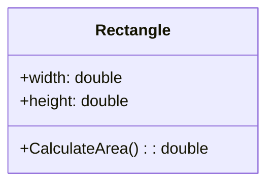
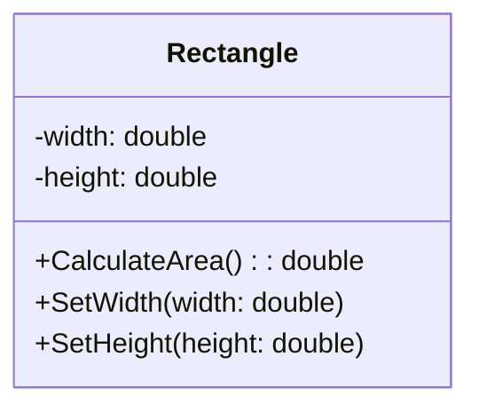
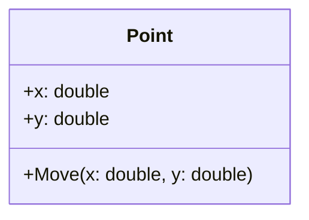
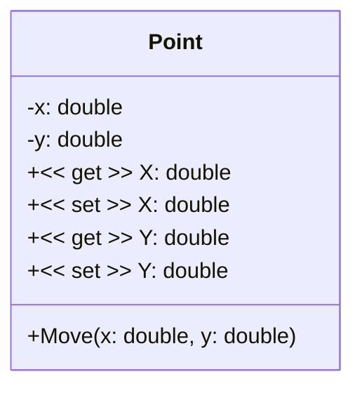
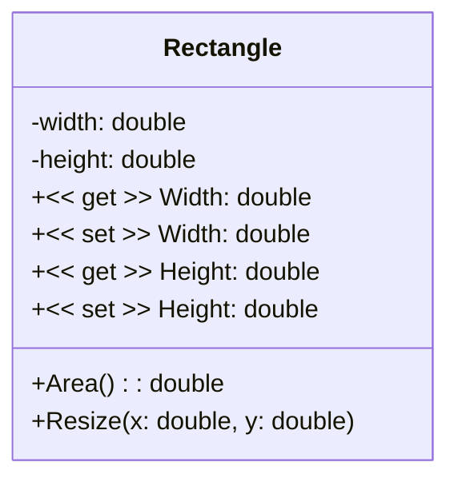

```mermaid
classDiagram
  class Rectangle {
    +width: double
    +height: double
    +CalculateArea(): double
  }
```

```mermaid
classDiagram
  class Rectangle {
    -width: double
    -height: double
    +CalculateArea(): double
    +SetWidth(width: double) 
    +SetHeight(height: double)
  }
```

```mermaid
classDiagram
  class Point {
    +x: double
    +y: double
    +Move(x: double, y: double)
  }
```

```mermaid
classDiagram
  class Point {
    -x: double
    -y: double
    +<< get >> X: double
    +<< set >> X: double
    +<< get >> Y: double
    +<< set >> Y: double
    +Move(x: double, y: double)
  }
```

```mermaid
classDiagram
  class Rectangle {
    -width: double
    -height: double
    +<< get >> Width: double
    +<< set >> Width: double
    +<< get >> Height: double
    +<< set >> Height: double
    +Area(): double
    +Resize(x: double, y: double)
  }
```