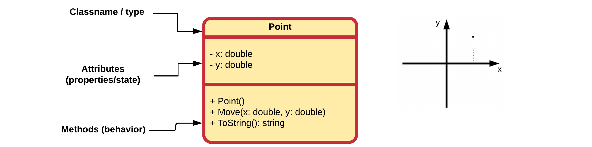
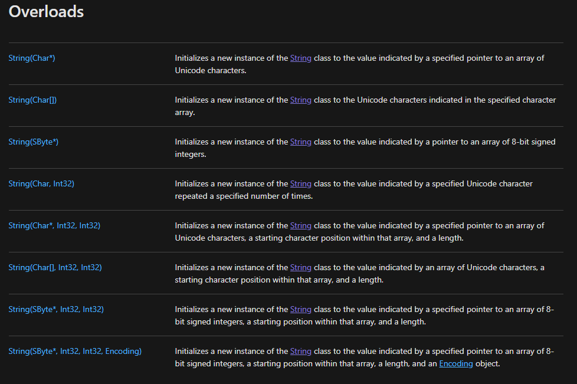

::: danger ☠️ First draft
Please note that this chapter is not finished yet. It may contain errors, typos, irregularities and even unfinished sections.
:::

# Chapter 26 - Constructors

In object-oriented programming, a constructor is a special type of method called to create an object. It prepares the new object for use, often accepting arguments that the constructor uses to set required member variables. Constructors are special methods that belong to classes and **take care of the creation of objects of that class**. They are **responsible for the initialization** of the newly created objects and they make sure that the freshly created objects are left in a stable and readily usable state.

A constructor resembles an instance method, but it differs from a method in that it has **no explicit return type, not even void**. In C# constructors have the **exact same name as the declaring class**. They have the task of initializing the object's data members. A properly written constructor leaves the resulting object in a **valid and usable state**.

Most languages **allow overloading** the constructor in that there can be more than one constructor for a class, with differing parameters. C# is one of those languages.

## A default constructor

When a programmer does not define his/her own constructor(s), C# creates one for us, called a **default constructor**. This constructor is not called the default constructor because it is created by default for us, but because **it does not take any arguments**. This constructor is called by default in many situations (from which it gets it name) as will be seen later in this course.

::: warning Default Constructor
Important to know is that once you create your own constructor for a class, you lose the default constructor created by C#. This means that if you wish your class to have a default constructor (one that takes no arguments), you should add one yourself. However, more on this later.
:::

In UML class diagrams the constructors are also added to the list of methods. Constructors are most of the time placed on top in the method list. This because they are the first methods you will need when making use of the class. Also notice the plus sign `+` in front of the constructor. This means that constructor is also `public`.



### Creating new Objects

When creating new objects (instances) from classes in C# you need a couple of things:

* Most of the time you need a place to store the reference to the new object in the form of a variable
* The `new` keyword to indicate that you wish to create a new object from a certain class
* The type of the variable (which is in most cases the name of the class)
* The name of the constructor that needs to be called to initialize the new object.


As mentioned before a class can have multiple constructors. Take for example the `String` class from C# [https://docs.microsoft.com/en-us/dotnet/api/system.string.-ctor?view=netframework-4.8](https://docs.microsoft.com/en-us/dotnet/api/system.string.-ctor?view=netframework-4.8).



These give the freedom to the user of the class to tailor the initialization of the new objects to his/her needs. Do note that the constructors do not differ in name but do differ in the arguments that they take. Either the number of arguments or the types need to be different so C# can determine which constructor you are actually requesting.

## Custom Constructor

When defining a constructor you should first determine what information is minimally required to initialize a new object of the class.

Let us take a look at a class `Player` that has an attribute `nickname` of type `string`. Because a player object is considered invalid if it has no nickname, a constructor is added that takes the nickname as an argument. A player also has a `score`. However if a player object is created, the score is initialized to `0`. There is no need to take this value in as an argument.

```csharp
class Player {

  // Constructor with arguments
  public Player(String nickname) {
    this.nickname = nickname;
  }

  // Attributes
  private String nickname;
  private int score = 0;
}
```

When creating Player objects the developer is required to provide a nickname for the `Player` object as is shown next:

```csharp
Player lebowski = new Player("The Big Lebowski");
```

## The Default Constructor

The default constructor is a special constructor that **takes no arguments**. It initializes the object in a default state.

If you do not provide a constructor for a class, C# will automatically create a default constructor that has no arguments. This default constructor is called if you specify the new keyword without passing arguments. For example:

```csharp
Player unknown = new Player();
```

**If you explicitly declare any constructors for a class, C# does not create a default constructor for the class**. As a result, if you declare a constructor that accepts arguments and still want to have a default constructor (with no arguments), you must explicitly declare a default constructor for the class.

Taking the previous Player example the code will not compile in the current state because we added a constructor to the class and thereby lost the default (no-argument) constructor:

```csharp
Player guest = new Player();
```

So to fix this we can add a default constructor to the class that for example generates a random nickname if none is provided:

```csharp
class Player {

  // Constructor with arguments
  public Player(String nickname) {
    this.nickname = nickname;
  }

  // Default constructor
  public Player() {
    Random generator = new Random();
    nickname = "guest_" + generator.Next(1000);
  }

  // Attributes
  private String nickname;
  private int score = 0;
}
```

This would allow us to create objects using both a constructor with a nickname as wel as the default constructor.

For Example

```csharp
static void Main(string[] args)
{
  // Initialization constructor with nickname
  Player lebowski = new Player("The Big Lebowski");

  // Default constructor
  Player guest = new Player();
}
```

## Constructor Overloading

Constructor overloading is a technique in C# in which a **class can have any number of constructors** that differ in parameter lists. The compiler differentiates these constructors by taking into account the number of parameters in the list and their type.

Let us for example take the `Point` class from the previous chapter as an example and implement both an initialization constructor and a default constructor:

```csharp{4-8,11-15}
  class Point
  {
    // Initialization constructor
    public Point(double x, double y)
    {
      this.x = x;
      this.y = y;
    }

    // Default constructor
    public Point()
    {
      x = 0;
      y = 0;
    }

    // A method called Move that allows us to relocate the point
    public void Move(double x, double y)
    {
      this.x = x;
      this.y = y;
    }

    public override string ToString()
    {
      return $"[{x},{y}]";
    }

    // Both x and y are attributes of the class Point
    public double x = 0;
    public double y = 0;
  }
```

Note how the constructors differ in the arguments they take. C# must be able to differentiate between the constructors in order to be able to select the correct constructor.

```csharp{4,8}
static void Main(string[] args)
{
  // Creating a Point using the default constructor
  Point origin = new Point();
  Console.WriteLine($"Origin is @ {origin}");

  // Creating a Point using the initialization constructor
  Point end = new Point(13, 45);
  Console.WriteLine($"End is @ {end}");
}
```

::: codeoutput
```
Origin is @ [0,0]
End is @ [13,45]
```
:::

Do note that the names of the arguments have no meaning for the compiler to differentiate between different constructors, only the types and number of arguments count. This means that adding the following constructors to a class will fail:

```csharp
class Rectangle {
  // ...

  public Rectangle(int width, int height) {
    // ....
  }

  public Rectangle(int x, int y) {
    // ....
  }
}
```

Both constructors look the same for C#. They both take two arguments, each of type `int` and thats it.

<!-- TODO: Call another constructor? -->
