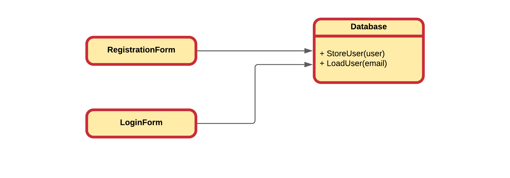
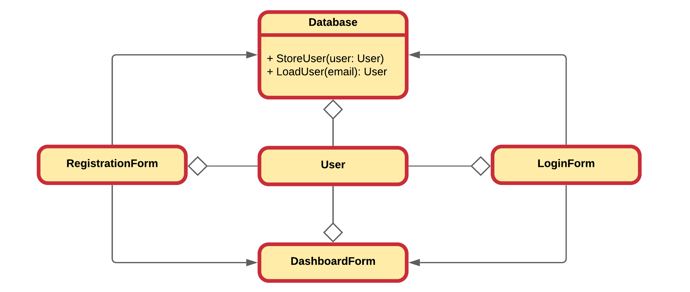
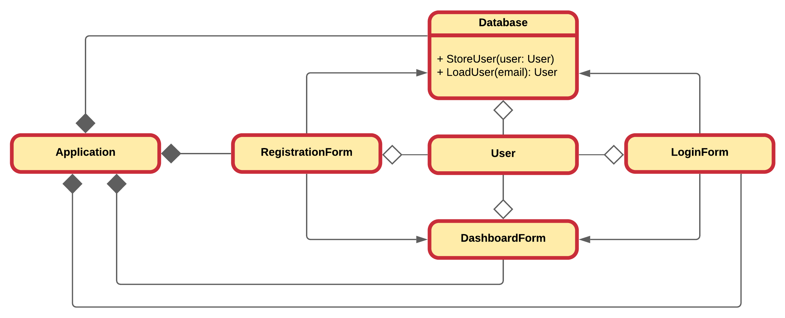
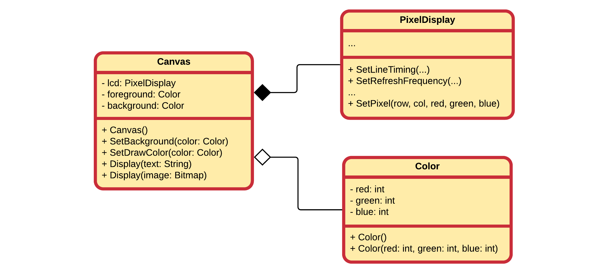
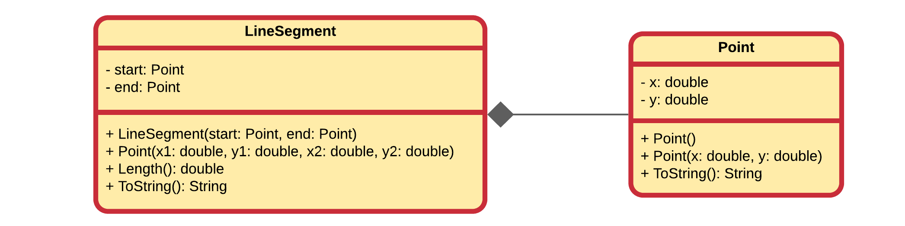
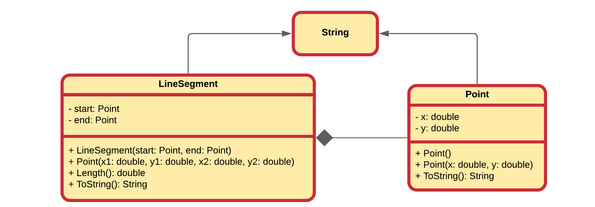

::: danger ☠️ First draft
Please note that this chapter is not finished yet. It may contain errors, typos, irregularities and even unfinished sections.
:::

<!-- Source: https://www.visual-paradigm.com/guide/uml-unified-modeling-language/uml-aggregation-vs-composition/ -->

# Chapter 27 - Composition

It's natural to think of **objects as collections of other objects**. Think about a television which contains a tuner, a screen, a power supply, an embedded system, ... We say that a television object is **composed** of these other objects.

Luckily this same concept is available to us in an object oriented programming language. We can also create objects by bundling other objects. This has the big advantage that we can use objects from classes that someone else made or are part of the language libraries. This saves us a lot of time and effort and is considered one of the major advantages of object oriented languages.

By using composition one builds **objects that consist of other objects**. Think of it as creating a new type of object by packaging together other objects.

Composition also allows one to hide complexity behind the simplicity of objects. In other words, objects allow one to create new levels of abstraction.

Composition comes with a great deal of flexibility. Member objects of the new class can be made private, making them inaccessible to client programmers. This means that there can be changes without disturbing existing client code.

Because inheritance is one of the main pillars of object oriented design, it is often over-estimated and over-used. When used wrongly, it can result in awkward and overly-complicated designs. A good practice is to look at composition first when creating new classes as it is **simpler and more flexible**.

## Association

When **an object of one class may use services/methods provided by an object of another class**, the relationship between those objects is termed as an **association**. An association represents a relationship between two or more objects where all objects **have their own lifecycle** and there is **no owner**.

::: warning No Owner
Do note that when stating that there is no ownership in the context of the association, this is only true for the association itself. Other objects may, and probable will, own the objects involved in the association.
:::

The name of an association specifies the nature of relationship between the objects. An association is represented in UML by a solid line and an optional arrow indicating which object is using services of the other object.



The previous UML class diagram shows a typical association where a `RegistrationForm` object **uses** the `Database` object to store new users into. The `LoginForm` on the other hand uses the same object to load existing users from when they are trying to login. As stated before, there is no ownership in this relation. If the `RegistrationForm` instance is destroyed, it has no implications on the state of the `Database` object.

In schoolbooks, the association relationship is often explained using the `Teacher` and `Student` example. The `Student` could for example associate with a `Teacher` object by being able to ask a question to the `Teacher`. Both exist independently - there is no ownership between the objects and both have their own lifecycle.


## Composition and Aggregation

Aggregation and Composition are **subsets of association** meaning they are specific cases of association. In both aggregation and composition object of one class "own" object of another class. There is however a **subtle difference**.

### Aggregation

**Aggregation** is a **specialized form of association** between two or more objects in which each object has its **own life cycle** but there exists an **ownership** as well. Aggregation is a typical whole/part or parent/child relationship but it may or may not denote physical containment. An essential property of an aggregation relationship is that the whole or parent (i.e. the owner) can exist without the part or child and vice versa.

It's important to note that the aggregation relation does not state in any way that `Class A` exclusively owns `Class B`. Actually, quite the opposite. The aggregation link is usually used to stress the point that the `Class A` instance is not the exclusive container of the `Class B` instance, as in fact the same `Class B` instance may have another container/s.

In UML this is represented by a hollow diamond followed by a line. The hollow diamond is placed on the "owner" side of the relationship.



Building upon the `Database` application, a typical **aggregation** relationship is shown between the `LoginForm`, `RegistrationForm`, `Database` and `User` instances. A `RegistrationForm` may create a `User` object an pass it on to be stored in the `Database`. The `LoginForm` may check the user's authentication information by retrieving a `User` object from the `Database`.

Neither the `LoginForm` or `RegistrationForm` instances exclusively own the `User` object. Both of them will pass it on to the `DashboardForm` which will also act as a container for the same instance.

In schoolbooks, an aggregation relationship is often explained using the `Teacher` and `School` example. A `Teacher` may give courses in different `School` instances. However, if a `School` is closed, the `Teacher` keeps on existing and keeps teaching at the other `School` instances to which the `Teacher` belongs. Note that the relationships between objects participating in an aggregation cannot be reciprocal - i.e., a `School` may "own" a `Teacher`, but the `Teacher` does not own the `School`.


### Composition

**Composition** implies a relationship where the **child cannot exist independent of the parent**. In this relationship there is a **strong lifecycle dependency** between the child objects and the parent object. If a parent object is destroyed, its composed child objects will also be destroyed.

In UML this is represented by a solid diamond followed by a line. The solid diamond is placed on the "owner" side of the relationship.



Advancing further with the `Database` example may introduce an `Application` that owns the different form instances and the `Database`. When the `Application` instance is destroyed, so will all the form objects and the `Database` instance.

In schoolbooks, a composition relationship is often explained using the `School` and `Department` example. A `School` can consist of one or more `Departments`. Here a strong lifecycle dependency exist as the different `Department` instances cannot exist without the `School`. Closing the `School` means closing the `Departments`.


### In Practice

While a clear distinction is made here between aggregation and composition, it is not always done so in practice. In practice, one does often speak of composition even if he/she were to mean aggregation. As a result this course may also use the word composition where aggregation is meant. Of course in cases where a clear distinction is needed, the correct term will be used.

::: tip Definition - Association, Composition and Aggregation
To sum it up association is a very generic term used to represent when one class uses the functionalities provided by another class. It is sayed it's a composition if one parent class object owns another child class object and that child class object cannot meaningfully exist without the parent class object. If it can then it is called aggregation.
:::

## Creating new Classes through Composition

While maybe not yet apparent, but you have probable been using composition more than you imagine. Consider the `String` class which we use daily in our other classes. Everytime we add a `String` instance as an attribute to our class, we are basically composing our custom class of `String` objects. Most of the time this will not be denoted in UML, as done below for educational purposes, but at its core this is composition. Deleting the `User` object will also mean destroying the `String` instances `username`, `email` and `password`.


When composing objects of other objects, the *sub objects* are generally made private. This hides implementation and allows the designer of the class to change the implementation if needed.



By hiding the `PixelDisplay` object inside the `Canvas`, one hides the complexity of the hardware dependent class. This class may have methods for setting and resetting pixels, for changing hardware timings, for setting pixel to a specific RGB value, and so on. All that complexity is hidden; only the ability to show some text, through `Display(text:String)`, and display a bitmap, through `Display(image:Bitmap)` is made publicly available via the `Canvas`. This keeps the `Canvas` simple and very user friendly.

Also if one ever wanted to switch from a backlit LCD pixel display to an OLED display, the classes that use the `Canvas` never even have to change, only the internal implementation of the `Canvas` class may have to be changed.

## Example Composing a LineSegment of Points

Let's apply all this knowledge on a class `LineSegment` that models a line from a start point to an end point.

First a `Point` class will need to be modeled that represents both an `x` and `y` coordinate within 2D space.

```csharp
public class Point
{
  // Default constructor
  // Point point = new Point();
  public Point()
  {
    X = 0;
    Y = 0;
  }

  // Constructor with arguments
  // Point point = new Point(3, 12.5);
  public Point(double x, double y)
  {
    X = x;
    Y = y;
  }

  // String representation of a Point object
  // Console.WriteLine(point);
  public override string ToString()
  {
    return $"[{X}, {Y}]";
  }

  // Attributes through properties
  public double X { get; set; }       // point.X = 12;          (set)
  public double Y { get; set; }       // double y = point.Y;    (get)
}
```

Next up is the `LineSegment` that is composed of two instances of class `Point`, both a `start` and `end`.

```csharp
public class LineSegment
{
  // We do not provide default constructor,
  // only constructor with arguments
  public LineSegment(Point start, Point end)
  {
    Start = start;
    End = end;
  }

  // Don't want to work with Point but with coordinates
  public LineSegment(double x1, double y1, double x2, double y2)
  {
    Start = new Point(x1, y1);
    End = new Point(x2, y2);
  }

  // Determine the length of the line segment
  public double Length()
  {
    return Math.Sqrt(
      (Start.X - End.X) * (Start.X - End.X)
      +
      (Start.Y - End.Y) * (Start.Y - End.Y)
    );
  }

  public override string ToString()
  {
    return $"{Start} => {End} with a length of {Length()}";
  }

  // Attributes through properties
  public Point Start { get; set; }
  public Point End { get; set; }
}
```

Using a small demo application we see how the `LineSegment` is used.

```csharp
static void Main(string[] args)
{
  Console.WriteLine("Line Segment demo");

  LineSegment line0 = new LineSegment(new Point(7, 11), new Point(-1, 5));
  Console.WriteLine(line0);

  LineSegment line1 = new LineSegment(1, 3, -2, 9);
  Console.WriteLine(line1);
}
```

::: codeoutput
```
Line Segment demo
[7, 11] => [-1, 5] with a length of 10
[1, 3] => [-2, 9] with a length of 6.708203932499369
```
:::

Modeling this in UML would result in the class diagram shown next.



For educational purposed the next UML class diagrams shows that both `LineSegment` as well as `Point` have an association with the `String` class. This is because both classes actually implement the `ToString()` method which creates a `String` object and returns it. Neither class has ownership of those instance, they just create the objects and pass them on to the instance requesting a `String` representation of the object in question. In reality, we would not draw these basic associations.



::: warning Not composition?
One could argue that this is not 100% composition since the `Point` instances can actually be created inside `Main` and passed to a new `LineSegment`, while those same `Point` instances could than also be passed to for example a `Circle` object. That's true, but that would not be a good idea, because changing the coordinates of that single `Point` would result in moving both the `LineSegment` as well as the `Circle`. On top of that, `Point` should probable be immutable (not changeable).

It's also a bit this way because of how the way C# uses references to objects. For example C++ would make shallow copies of the objects when passing or copying them.

Basically this is the reason why in practice we almost always talk about composition and not aggregation, because in practice the distinction is much harder to make than in theory.
:::
