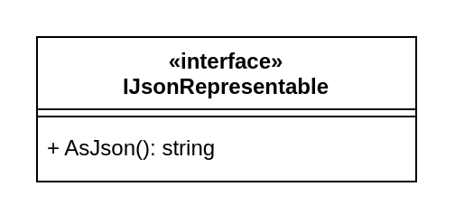
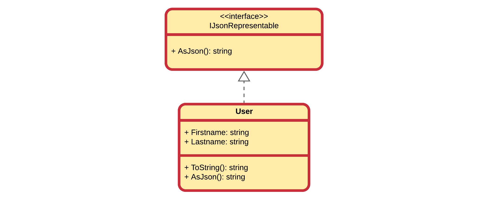

::: danger ☠️ First draft
Please note that this chapter is not finished yet. It may contain errors, typos, irregularities and even unfinished sections.
:::

# Chapter 27 - Interfaces

Interfaces are a tool that allow us to **decouple classes** from a particular implementation. When one module of code isn't directly connected to another module of code, that code is said to be **loosely coupled**.

Code can be said to be decoupled when your classes are designed in such a way that they don't depend on the concrete implementations of other classes.

Two classes are loosely coupled when they know as little about each other as possible, the dependencies between them are as thin as possible, and the communication lines between them are as simple as possible.

In other words, decoupling is the process of limiting your dependencies to abstractions as much as possible. If you want to write good, clean code, you will try to couple only to abstractions - for example to interfaces. This is critical to writing good code that is easy to maintain.

Tight coupling means one class is dependent on another class. Loose coupling means one class is dependent on an interface rather than a class. In tight coupling, there are hard-coded dependency declared in methods. In loose coupling, we must pass dependency externally at runtime instead of hard-coding them.

::: tip Class Interface
**The interface of a class** consists of the public methods and properties of that class. It defines what behavior that class provides and how it can be used from another class. It is not the same as the `interface` that can be implemented by a class - of course the methods defined in the `interface` will then become part of the interface of that class.
:::

## What is an Interface

An interface **defines a contract**. Any class that implements that contract **must provide an implementation of the members defined in the interface.** Interfaces specify **what a class must do and not how**.

An interface contains definitions for a **group of related functionalities that a non-abstract class must implement**.  An interface **may not declare instance data** such as attributes. An interface may also define static methods, which must have an implementation.

These preceding member declarations typically do not contain a body. Beginning with C# 8.0, an interface member may declare a body. This is called a **default implementation**. Members with bodies permit the interface to provide a "default" implementation for classes that don't provide an overriding implementation.

An interface may contain:

* instance methods
* properties
* static members

An interface cannot contain:

* instance fields (attributes)
* instance constructors

## Defining an Interface

Let's for example create an interface `IJsonRepresentable`, which will allow classes to implement this interface to provide a JSON representation of their objects.

::: tip JSON
JSON (JavaScript Object Notation) is an open standard file format and data interchange format that uses human-readable text to store and transmit data objects consisting of attribute-value pairs and arrays (or other serializable values). It is a common data format with diverse uses in electronic data interchange, including that of web applications with servers.

JSON is a language-independent data format. It was derived from JavaScript, but many modern programming languages include code to generate and parse JSON-format data.
:::

One can define an interface by using the `interface` keyword as the following example shows.

```csharp
public interface IJsonRepresentable
{
  string AsJson();
}
```

The name of an interface must be a valid C# identifier name. By convention, interface names begin with a capital `I`.

In UML an interface is represented using a rectangle with the label `<<interface>>` prefixing the name of the interface.



## Implementing Interfaces

Any class that implements the `IJsonRepresentable` interface must contain a definition for an `AsJson()` method that matches the signature that the interface specifies. As a result, you can count on a class that implements `IJsonRepresentable` to contain an `AsJson()` method.

To implement an interface member, the corresponding member of the implementing class must have the same signature as the interface member. When a class implements an interface, the class must provide an implementation for all of the members that the interface declares. 

<!-- The definition of `IJsonRepresentable` doesn't provide an implementation for `AsJson()`. -->
<!-- Interface members are public by default, and you can explicitly specify accessibility modifiers, such as public, protected, internal, private, protected internal, or private protected. A private member must have a default implementation. -->

The following example shows an implementation of the `IJsonRepresentable` interface. The implementing class, `Circle`, must provide an implementation of the `AsJson()` method.

```csharp
class Circle : IJsonRepresentable
{
  public Circle(double radius)
  {
    Radius = radius;
  }

  public double GetArea()
  {
    return Math.PI * Radius * Radius;
  }

  private double radius;
  public double Radius
  {
    get { return radius; }
    set { radius = Math.Abs(value); }
  }

  public string AsJson()
  {
    return $"{{ \"radius\": \"{Radius}\", "
    + $"\"area\": \"{GetArea()}\"}}";
  }
}
```

::: warning Abstract Classes
Actually it is possible to not or only partially implement an interface. However in that case the class is considered to be abstract (incomplete). Later on this course will go into more detail regarding abstract classes.
:::

In UML, implementing an interface is represented by using an arrow notation connected using a striped line.



Let us take a look at a simple example program where we call both the `ToString()` method on a `User` as well as the `AsJson()` method.

```csharp
Circle circle = new Circle(12.3);

Console.WriteLine(circle.AsJson());     // JSON Representation
```

::: codeoutput
<pre>
{ "radius": "12,3", "area": "475,2915525615999"}
</pre>
:::

While a `User` class has nothing in common with a `Circle` class it is perfectly possible to make users JSON representable by implementing the `IJsonRepresentable` interface.

```csharp
public class User : IJsonRepresentable
{
  public User(string firstname, string lastname)
  {
      Firstname = firstname;
      Lastname = lastname;
  }

  public string AsJson()
  {
      return $"{{ \"firstname\": \"{Firstname}\", "
          + $"\"lastname\": \"{Lastname}\"}}";
  }

  public string Firstname { get; set; }
  public string Lastname { get; set; }
}
```

Using the same `Main` but also including a `User` object we can represent both objects as JSON:

```csharp
Circle circle = new Circle(12.3);
Console.WriteLine(circle.AsJson());     // JSON Representation

User user = new User("Nico", "De Witte");
Console.WriteLine(user.AsJson());
```

:::codeoutput
<pre>
{ "radius": "12,3", "area": "475,2915525615999"}
{ "firstname": "Nico", "lastname": "De Witte"}
</pre>
:::

