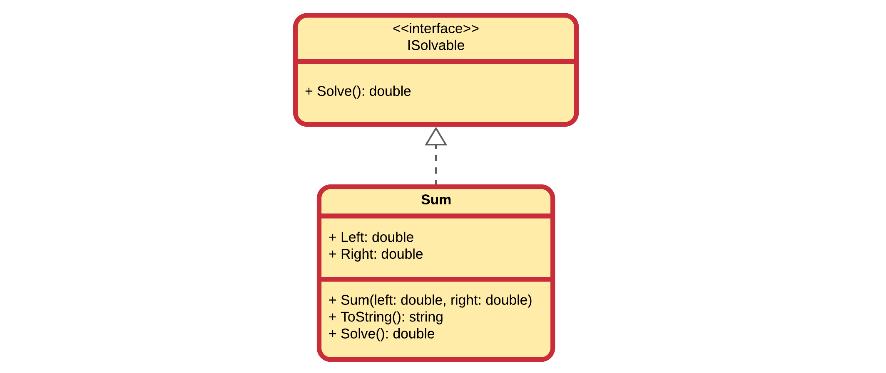
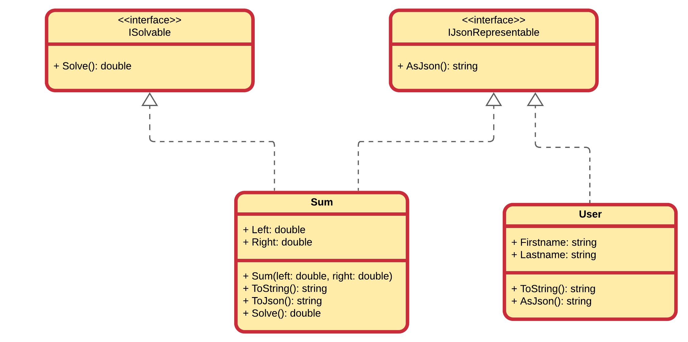

## Implementing Multiple Interfaces

**A class can implement multiple interfaces**.

Let's consider another interface that can be implemented by mathematical classes that are *solvable* to a single resulting `double` value.

```csharp
public interface ISolvable
{
    public double Solve();
}
```

Now consider a class `Sum` that implements the `ISolvable` interface:

```csharp
public class Sum : ISolvable
{
    public Sum(double left, double right)
    {
        Left = left;
        Right = right;
    }

    public override string ToString()
    {
        return $"{Left} + {Right} = {Solve()}";
    }

    public double Solve()
    {
        return Left + Right;
    }

    public double Left { get; set; }
    public double Right { get; set; }
}
```

<!--  -->

Now if we want to represent the `Sum` objects as JSON objects, we can simply implement the interface `IJsonRepresentable`:

```csharp
public class Sum : ISolvable, IJsonRepresentable
{
    public Sum(double left, double right)
    {
        Left = left;
        Right = right;
    }

    public override string ToString()
    {
        return $"{Left} + {Right} = {Solve()}";
    }

    public double Solve()
    {
        return Left + Right;
    }

    public string AsJson()
    {
        return $"{{\n\t\"left\": {Left}," +
            $"\n\t\"right\": {Right}," +
            $"\n\t\"result\": {Solve()}\n}}";
    }

    public double Left { get; set; }
    public double Right { get; set; }
}
```

<!--  -->

Using a simple demo program we can demonstrate the behavior of the `sum` object:

```csharp
Sum sum = new Sum(12.3, 32.2);
Console.WriteLine(sum);
double result = sum.Solve();
Console.WriteLine("Or via Solve(): " + result);
Console.WriteLine("As JSON:\n" + sum.AsJson());
```

::: codeoutput
<pre>
12.3 + 32.2 = 44.5
Or via Solve(): 44.5
As JSON:
{
    "left": 12.3,
    "right": 32.2,
    "result": 44.5
}
</pre>
:::

The clue of this whole example is the fact that the `User` and `Sum` classes have almost nothing in common, except for the fact that both can be represented as JSON strings.

## Polymorphism

Solving the whole puzzle is the last piece, namely polymorphism.

Just as with the base class with inheritance, also an interface can be used as a type for storing object references to objects implementing that interface in question.

This means that both objects of class `Sum` as well as objects of class `User` can be stored in variables declared with the type `IJsonRepresentable`.

```csharp
IJsonRepresentable first = new User("Nico", "De Witte");
IJsonRepresentable second = new Sum(12.3, 32.2);

Console.WriteLine(first.AsJson());
Console.WriteLine(second.AsJson());
```

::: codeoutput
<pre>
{ "firstname": "Nico", "lastname": "De Witte"}
{
        "left": 12.3,
        "right": 32.2,
        "result": 44.5
}
</pre>
:::

## Inheritance

Interfaces can inherit from one or more interfaces. The derived interface inherits the members from its base interfaces. A class that implements a derived interface must implement all members in the derived interface, including all members of the derived interface's base interfaces. That class may be implicitly converted to the derived interface or any of its base interfaces.

<!-- A class might include an interface multiple times through base classes that it inherits or through interfaces that other interfaces inherit. However, the class can provide an implementation of an interface only one time and only if the class declares the interface as part of the definition of the class (class ClassName : InterfaceName). If the interface is inherited because you inherited a base class that implements the interface, the base class provides the implementation of the members of the interface. However, the derived class can reimplement any virtual interface members instead of using the inherited implementation. When interfaces declare a default implementation of a method, any class implementing that interface inherits that implementation. Implementations defined in interfaces are virtual and the implementing class may override that implementation. -->

A base class can also implement interface members by using virtual members. In that case, a derived class can change the interface behavior by overriding the virtual members.

## Summary

An interface has the following properties:

* An interface is typically like an abstract base class with only abstract members. Any class that implements the interface must implement all its members.
* Optionally, an interface may define default implementations for some or all of its members.
* An interface can't be instantiated directly. Its members are implemented by any class that implements the interface.
* A class can implement multiple interfaces. A class can inherit a base class and also implement one or more interfaces.

## Abstract Classes vs Interfaces - What to use When

Abstract classes

* An abstract class is a great choice if you are bringing into account the inheritance concept, because it provides the common base class implementation to the derived classes.
* An abstract class is also good if you want to declare non-public members. In an interface, all methods must be public.
* If you want to add new methods in the future, then it is great to go with the abstract class. Because if you add new methods to the interface, then all of the classes that are already implemented in the interface will have to be changed in order to implement these new methods.
* An abstract class is used if you want to provide a common, implemented functionality among all the implementations of the component. Abstract classes will allow you to partially implement your class, whereas interfaces would have no implementation for any members whatsoever.

Interfaces

* If you are creating functionality that will be useful across a wide range of objects, then you must use an interface. Abstract classes, at the end of the day, should be used for objects that are closely related. But the interfaces are best suited for providing common functionality to the unrelated cases.
* Interfaces are a great choice if you think that the API won’t be changing for a while.
* Interfaces are also a great choice. If you want to have something similar to the multiple inheritances, then you can implement various interfaces.
* If we are going to design the small, concise bits of functionality, then you must use interfaces. But if you are designing the large functional units, then you must use an abstract class.
