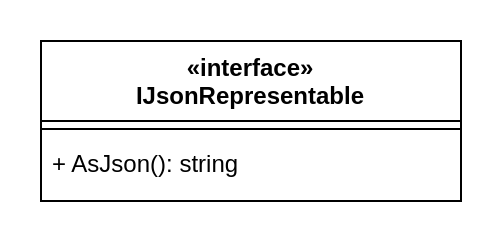

::: danger ☠️ First draft
Please note that this chapter is not finished yet. It may contain errors, typos, irregularities and even unfinished sections.
:::

# Chapter 28 - Interfaces

Interfaces are a tool that allow us to **decouple classes** from a particular implementation. When one module of code isn't directly connected to another module of code, that code is said to be **loosely coupled**.

Code can be said to be decoupled when your classes are designed in such a way that they don't depend on the concrete implementations of other classes.

Two classes are loosely coupled when they know as little about each other as possible, the dependencies between them are as thin as possible, and the communication lines between them are as simple as possible.

In other words, **decoupling is the process of limiting your dependencies to abstractions as much as possible**. If you want to write good, clean code, you will try to couple only to abstractions - for example to interfaces. This is critical to writing good code that is easy to maintain.

Tight coupling means one class is dependent on another class. Loose coupling means one class is dependent on an interface rather than a class. In tight coupling, there are hard-coded dependencies declared in methods. In loose coupling, we must pass a dependency externally at runtime instead of hard-coding them.

::: tip Class Interface
**The interface of a class** consists of the public methods and properties of that class. It defines what behavior that class provides and how it can be used from another class. It is not the same as the `interface` that can be implemented by a class - of course the methods defined in the `interface` will then become part of the interface of that class.
:::

## What is an Interface

An interface **defines a contract**. Any class that implements that contract **must provide an implementation of the members defined in the interface.** Interfaces specify **what a class must do and not how**.

::: tip Definition
Interfaces are an abstract definition of functionality.
:::

An interface contains definitions for a **group of related functionalities that a non-abstract class must implement**.  An interface **may not declare instance data** such as attributes. An interface may however define static methods, which must have an implementation.

::: warning Default Implementation
These preceding member declarations typically do not contain a body. Beginning with C# 8.0, an interface member may declare a body. This is called a **default implementation**. Members with bodies permit the interface to provide a "default" implementation for classes that don't provide an overriding implementation.
:::

An interface may contain:

* instance methods
* properties
* static members

An interface cannot contain:

* instance fields (attributes)
* instance constructor

::: warning Auto-implemented Attributes
Interface properties typically don't have a body. The accessors indicate whether the property is read-write, read-only, or write-only. Unlike in classes and structs, **declaring the accessors without a body doesn't declare an auto-implemented property**. Beginning with C# 8.0, an interface may define a default implementation for members, including properties. Defining a default implementation for a property in an interface is rare because interfaces may not define instance data fields.
:::

## Declaration of an Interface

An interface declaration defines a set of properties and methods that you can use for a specific purpose. Interfaces declare and require no particular implementation for that purpose. They define what a class can do and limit the exposure of a class to only those things defined by the interface.

Let's for example create an interface `IJsonRepresentable`, which will allow classes to implement this interface to provide a JSON representation of their objects.

::: tip JSON
JSON (JavaScript Object Notation) is an open standard file format and data interchange format that uses human-readable text to store and transmit data objects consisting of attribute-value pairs and arrays (or other serializable values). It is a common data format with diverse uses in electronic data interchange, including that of web applications with servers.

JSON is a language-independent data format. It was derived from JavaScript, but many modern programming languages include code to generate and parse JSON-format data.
:::

One can define an interface by using the `interface` keyword as the following example shows.

```csharp
public interface IJsonRepresentable
{
  string AsJson();
}
```

The name of an interface must be a valid C# identifier name. By convention, interface names begin with a capital `I`.

In UML an interface is represented using a rectangle with the label `<<interface>>` prefixing the name of the interface.



## Implementing Interfaces

Of course, an interface must be implemented to be useful. And when you use an interface, you ultimately don't care about how it is implemented; you just know that you can call the methods and properties on the interface and the functionality you need will be provided.

Any class that implements the `IJsonRepresentable` interface must contain a definition for an `AsJson()` method that matches the signature that the interface specifies. As a result, you can count on a class that implements `IJsonRepresentable` to contain an `AsJson()` method.

To implement an interface member, the corresponding member of the implementing class must have the same signature as the interface member. When a class implements an interface, the class must provide an implementation for all of the members that the interface declares. 

<!-- The definition of `IJsonRepresentable` doesn't provide an implementation for `AsJson()`. -->
<!-- Interface members are public by default, and you can explicitly specify accessibility modifiers, such as public, protected, internal, private, protected internal, or private protected. A private member must have a default implementation. -->

The following example shows an implementation of the `IJsonRepresentable` interface. The implementing class, `Circle`, must provide an implementation of the `AsJson()` method.

```csharp
using System.Globalization;

class Circle : IJsonRepresentable
{
  public Circle(double radius)
  {
    Radius = radius;
  }

  public double GetArea()
  {
    return Math.PI * Radius * Radius;
  }

  private double radius;
  public double Radius
  {
    get { return radius; }
    set { radius = Math.Abs(value); }
  }

  public string AsJson()
  {
    return "{ "
      + $"\"radius\": {Radius.ToString(CultureInfo.InvariantCulture)}, "
      + $"\"area\": {GetArea().ToString(CultureInfo.InvariantCulture)}"
      + " }";
  }
}
```

<!-- `CultureInfo.InvariantCulture` outputs culture invariant decimal notation output. -->

::: warning Abstract Classes
Actually it is possible to not or only partially implement an interface. However in that case the class is considered to be abstract (incomplete). Later on this course will go into more detail regarding abstract classes.
:::

In UML, implementing an interface is represented by using an arrow notation connected using a striped line.


Let us take a look at a simple example program where we call the `AsJson()` method on a `Circle`object.

```csharp
Circle circle = new Circle(12.3);

Console.WriteLine(circle.AsJson());     // JSON Representation
```

::: codeoutput
```
{ "radius": 12.3, "area": 475.2915525615999 }
```
:::

While a `User` class has nothing in common with a `Circle` class it is perfectly possible to make users JSON representable by implementing the `IJsonRepresentable` interface.

```csharp
public class User : IJsonRepresentable
{
  public User(string firstname, string lastname)
  {
      Firstname = firstname;
      Lastname = lastname;
  }

  public string AsJson()
  {
      return $"{{ \"firstname\": \"{Firstname}\", "
          + $"\"lastname\": \"{Lastname}\"}}";
  }

  public string Firstname { get; set; }
  public string Lastname { get; set; }
}
```


Using the same `Main` but also including a `User` object we can represent both objects as JSON:

```csharp
Circle circle = new Circle(12.3);
Console.WriteLine(circle.AsJson());

User user = new User("Nico", "De Witte");
Console.WriteLine(user.AsJson());
```

:::codeoutput
```
{ "radius": 12.3, "area": 475.2915525615999 }
{ "firstname": "Nico", "lastname": "De Witte"}
```
:::

## Loosely Coupling using Interfaces

When you use interfaces, you can decouple classes from any particular implementation. When one module of code isn't directly connected to another module of code, that code is said to be **loosely coupled**. The more loosely coupled your code is, the less likely it is that a change in one place will affect code in another.

### Interfaces as a Type

Before we can continue on our journey there is something important that you need to understand. The objects of the classes that implement an interface can also be seen as entities of that interface type.

For example, the `Circle` class that implements the `IJsonRepresentable` interface, can also be stored in a reference of type `IJsonRepresentable`. The same goes for the `User` class.

That means that the following code is perfectly legal and is actually very powerful for the continuation of our decoupling:

```csharp
// Reference of type IJsonRepresentable
// Instance of Circle
IJsonRepresentable circle = new Circle(12.3);
Console.WriteLine(circle.AsJson());

// Reference of type IJsonRepresentable
// Instance of User
IJsonRepresentable user = new User("Nico", "De Witte");
Console.WriteLine(user.AsJson());
```

:::codeoutput
```
{ "radius": 12.3, "area": 475.2915525615999 }
{ "firstname": "Nico", "lastname": "De Witte"}
```
:::

This code outputs exactly the same as the previous implementation. The big difference however here is that the reference `circle` can now only be used to access the methods and properties declared in the `IJsonRepresentable` interface. While the object itself is still of type `Circle`, the variable has a type of `IJsonRepresentable`.

### Tightly Coupled MessageSender

Let's take this a step further and consider a class called `MessageSender` that fakes sending a message across the internet containing a JSON representation of objects.

We could provide two `Send()` methods, one for `User` and one for `Circle` and more if need be for other classes that can be represented as a JSON string.

```csharp
class MessageSender
{
  public void Send(User user)
  {
    Console.Write("Beep Boop Ping Pong ... ");
    Console.WriteLine(user.AsJson());
  }

  public void Send(Circle circle)
  {
    Console.Write("Beep Boop Ping Pong ... ");
    Console.WriteLine(circle.AsJson());
  }
}
```

Now let's send both our objects into the scare Internet:

```csharp
Circle circle = new Circle(12.3);
User user = new User("Nico", "De Witte");

MessageSender internet = new MessageSender();
internet.Send(circle);
internet.Send(user);
```

:::codeoutput
```
Beep Boop Ping Pong ... { "radius": 12.3, "area": 475.2915525615999 }
Beep Boop Ping Pong ... { "firstname": "Nico", "lastname": "De Witte"}
```
:::

The big problem here is that the class `MessageSender` is tightly coupled with the classes `User` and `Circle`. Every class that we would want to able to send would require a separate method in the `MessageSender` class.

In a real world situation, this class may even be provided by an external library which we do not control.

### Loosely Coupled MessageSender

How can we decouple this class from the specific implementation of `User` and `Circle`? Actually pretty simple, by making it dependent on the abstract interface `IJsonRepresentable` instead of the class implementation itself.

Instead of a reference to a `User` object and a reference to a `Circle` object, we can just take in a reference to a `IJsonRepresentable` entity.

```csharp
class MessageSender
{
  public void Send(IJsonRepresentable target)
  {
    Console.Write("Beep Boop Ping Pong ... ");
    Console.WriteLine(target.AsJson());
  }
}
```

Note that we also need to remove the second `Send()` method.

We have much cleaner design now. We can create new classes that implement the `IJsonRepresentable` interface and can then be transmitted as a message using the `MessageSender` class. On top of that, the `MessageSender` class does not need to know what *new* classes are created and only knows about the `IJsonRepresentable` interface.
