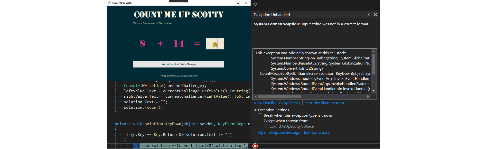

# Chapter 30 - Exceptions

One of the main goals to keep in mind when developing software - being it an application for users or a library for developers - is to make it user-friendly. When software is not user-friendly, the clients of our software will not use it.

## Examples

To make software user-friendly the developer needs to try to handle exceptional cases as good as possible. Let's take a couple of examples of problems that may arise with systems and how they should or could be handled.

### Requesting Input

Imagine an application that requests the user to enter a numeric size for a font-size. What happens when the user does not enter a number or mistypes? When the developer of the application did not foresee this situation, the application would crash. This is one of the worst outcomes for the end-user. What if he/she has been inputting data for more than 20 minutes and all that is lost. Would you use that application daily?

This situation needs to be handled better. The application should catch this mistake and request a valid value from the user.

### Cloud Settings

Games these days often store their configurations in the cloud. Think about your video-card settings, key-bindings and all such configuration options.

Now take for example that the internet connection drops while this configuration is being synced to the cloud. What if the game does not handle this situation correctly and does not keep a backup locally. Then the user may have lost all his/her personalized settings.

There is also another side to this story. If the cloud-side does not handle this situation the user-configuration may even become corrupt. A good solution here would be to validate the configuration cloud-side before storing it in for example the database.

### Printing

Consider printing a document of 50 pages. However your printer only has 49 sheets of paper. The developer of the printer-driver did not give this situation to much attention and the driver just restarts the printing process once paper is provided. As a user you did not get any option to continue printing where you left of. You are stuck with 99 sheets of paper on the table.

### Video Streaming

Imagine yourself watching your favorite movie on Netflix on a smartphone on the train. There is no WiFi in the train so you watch it on 4G. The moment you enter the train station your smartphone detects the free WiFi network and switches over to it. The Netflix app loses it's internet connection for a moment and fails to restore the video stream. It crashes. You are annoyed but restart the app. It could not save the video-timestamp. To continue watching the movie where you left of, you need to skip through half the movie.

By the time you found the scene you we're watching the train leaves the current station and the internet connection switches back to 4G.

