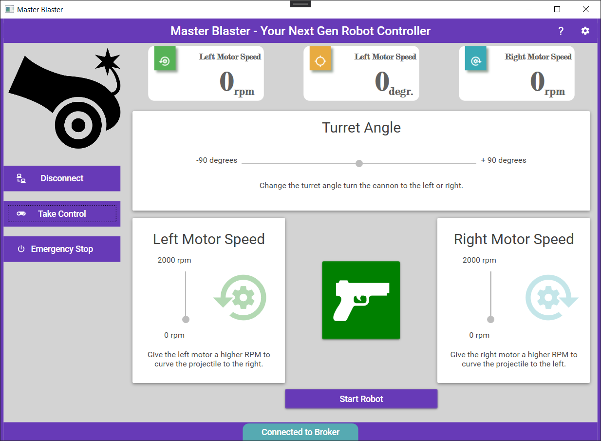

# Chapter 40 - Introduction to WPF

WPF or Windows Presentation Foundation is a microsoft GUI (Graphical User Interface) framework used with the .NET framework.

A GUI framework allows you to create the graphical user interface of an application with a wide range of readily-available GUI components, like buttons, textboxes, labels, images, ... and many more. Without a GUI framework you would have to draw these elements manually and handle all of the user interaction scenarios like text and mouse input yourself.

This is not a feasible approach in this modern day of age. So instead, developers will use a GUI framework which will do all the basic work and allow the developers to focus on making great looking applications.

There are a lot of GUI frameworks out there, but for .NET developers, the most commonly used ones at the moment are WinForms and WPF. WPF is the newest, but Microsoft is still maintaining and supporting WinForms.

WPF uses the eXtensible Application Markup Language (XAML) to provide a declarative model for application programming.

## Getting Started with WPF

WPF is way to extensive to try to explain all components, layouts and such in a single document.

A better approach is to follow along with some nice YouTube video's that explain the nooks and crannies of the framework basics.

<YoutubeVideo videoId="gSfMNjWNoX0" />

