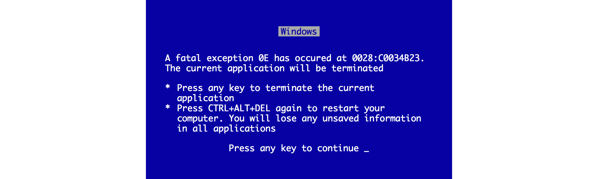
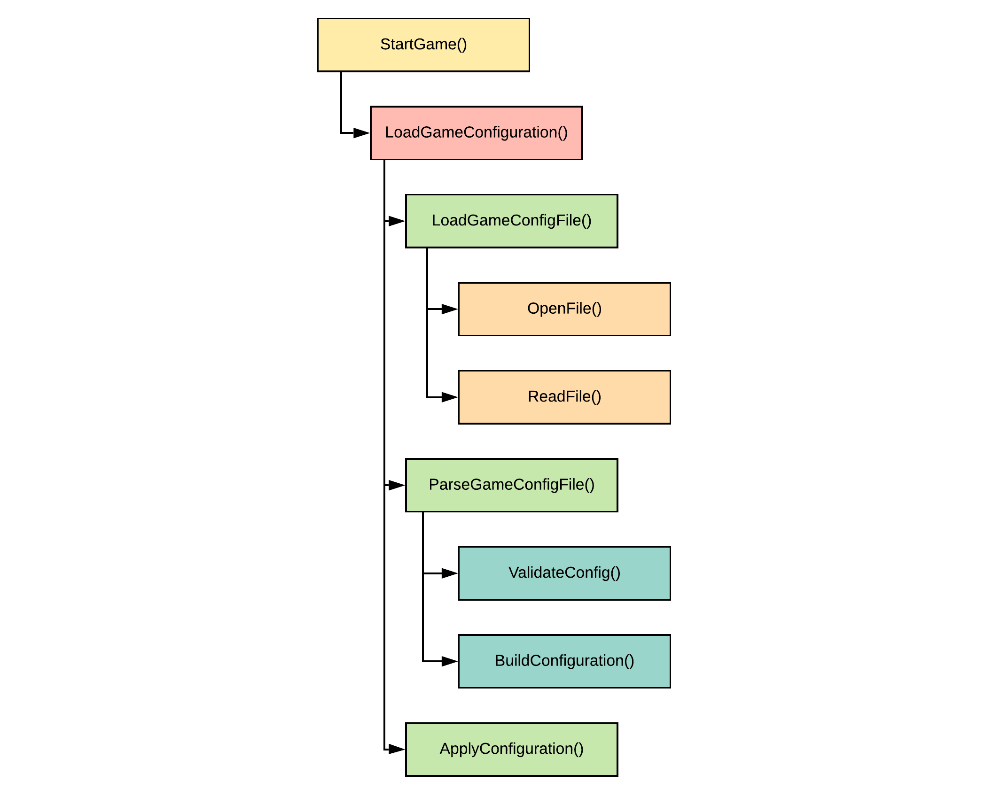
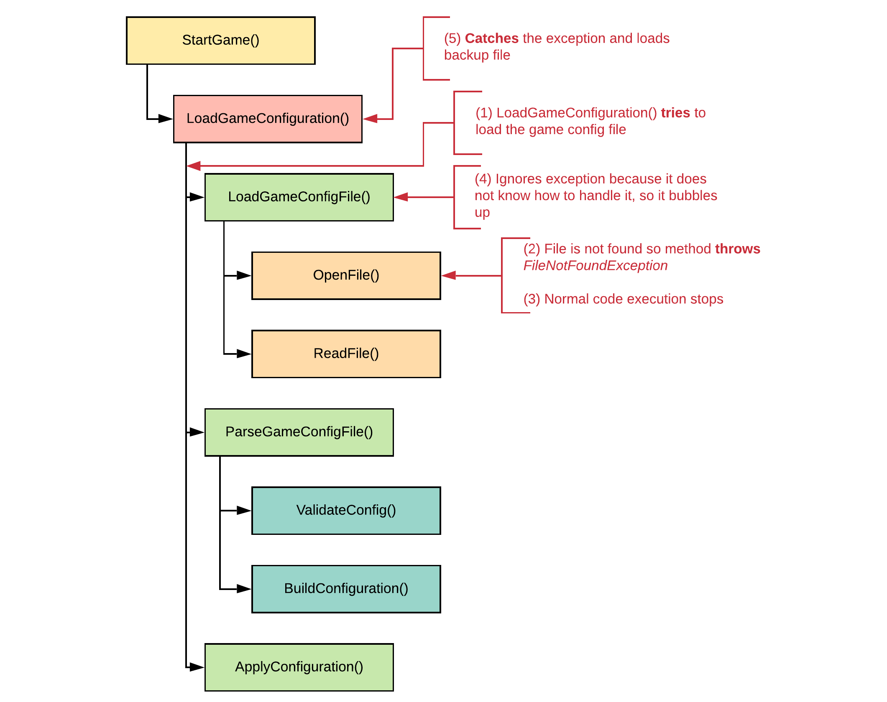
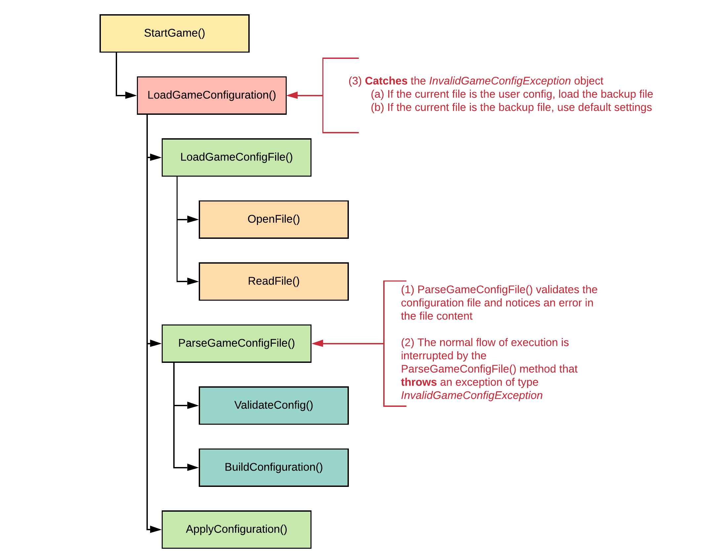
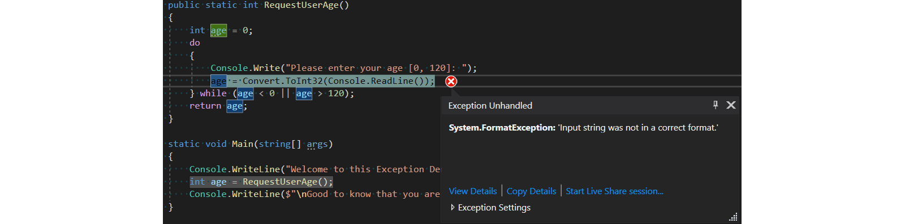
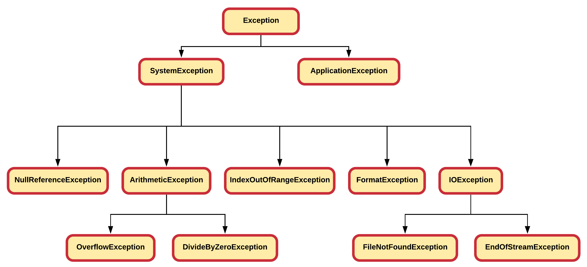

::: danger ☠️ First draft
Please note that this chapter is not finished yet. It may contain errors, typos, irregularities and even unfinished sections.
:::

# Chapter 41 - Handling Exceptions

One of the main goals to keep in mind when developing software - being it an application for users or a library for developers - is to make it user-friendly. When software is not user-friendly, the clients of our software will not use it.

To make software user-friendly the developer needs to try to handle exceptional cases as good as possible. Of course not all situations can be handled, but those that can be foreseen should be handled with care. For the rest a safety net should be provided so the user at least does not suffer data loss.

## Examples

Let's take a couple of examples of problems that may arise with systems and how they should or could be handled.

### Requesting Input

Imagine an application that requests the user to enter a numeric size for a font-size. What happens when the user does not enter a number or mistypes? When the developer of the application did not foresee this situation, the application would crash. This is one of the worst outcomes for the end-user. What if he/she has been inputting data for more than 20 minutes and all that is lost. Would you use that application daily?

This situation needs to be handled better. The application should catch this mistake and request a valid value from the user.


### Cloud Settings

Games these days often store their configurations in the cloud. Think about your video-card settings, key-bindings and all such configuration options.

Now take for example that the internet connection drops while this configuration is being synced to the cloud. What if the game does not handle this situation correctly and does not keep a backup locally. Then the user may have lost all his/her personalized settings.

There is also another side to this story. If the cloud-side does not handle this situation the user-configuration may even become corrupt. A good solution here would be to validate the configuration cloud-side before storing it in for example the database.


### Printing

Consider printing a document of 50 pages. However your printer only has 49 sheets of paper. The developer of the printer-driver did not give this situation to much attention and the driver just restarts the printing process once paper is provided. As a user you did not get any option to continue printing where you left of. You are stuck with 99 sheets of paper on the table.


### Video Streaming

Imagine yourself watching your favorite movie on Netflix on a smartphone on the train. There is no WiFi in the train so you watch it on 4G. The moment you enter the train station your smartphone detects the free WiFi network and switches over to it. The Netflix app loses it's internet connection for a moment and fails to restore the video stream. It crashes. You are annoyed but restart the app. It could not save the video-timestamp. To continue watching the movie where you left of, you need to skip through half the movie.

By the time you found the scene you we're watching the train leaves the current station and the internet connection switches back to 4G.


## C-style Languages

Not all programming languages have dedicated mechanisms for handling error cases. Take for example the C-language. Typically in these languages, functions will return error codes to indicate if the function executed successfully or an error has occurred. This often leads to extreme ugly code. It can also lead to very unuser-friendly application crashes.



Take some pseudo-code as an example

```text
read_file(filename, lines):
  file_does_not_exist?  => return -1;
  could_not_read_file?  => return -2;
  file_empty?           => return -3;
  not_ascii_text?       => return -4;

  all_ok?
    | => read into lines
    | => return number_of_lines

  return -255;  // Unknown error occurred
```

C applications are notoriously known for their long listings of global error codes. Take an example from a Linux kernel.

```cpp
#define EPERM            1      /* Operation not permitted */
#define ENOENT           2      /* No such file or directory */
#define ESRCH            3      /* No such process */
#define EINTR            4      /* Interrupted system call */
#define EIO              5      /* I/O error */
#define ENXIO            6      /* No such device or address */
#define E2BIG            7      /* Arg list too long */
#define ENOEXEC          8      /* Exec format error */
#define EBADF            9      /* Bad file number */
#define ECHILD          10      /* No child processes */
#define EAGAIN          11      /* Try again */
...
#define EMEDIUMTYPE     124     /* Wrong medium type */
```

So basically the programmer needs to invent a numeric value for every situation that could go wrong. The error value is then returned by the function to the function that called this one. That code might look something like this:

```text

result = read_file(user_file, 100)

if result > 0: print file to terminal
if result == -1: request file name again from user
else if result == -2: output "Please check if permissions are correct", retry
else if result == -3: output "File is empty"
else if result == -4: output "File did not contain text"
```

What a mess indeed. And this is no fiction, often one will find these constructs in applications written in the C-language. The error handling code often becomes very complicated because each error needs to be handled differently.

On top of that, often multiple functions are called to handle more complex tasks, take the following pseudo-code example where a configuration file is downloaded, read and parsed:

```text
call download_file()
if (errors) {
  handle them
} else {
  call read_file()
  if (errors) {
    handle them
  } else {
    call parse_file()
    if (errors) {
      handle them
    } else {
      ...
    }
  }
}
```

So every time a function is called that is needed in a more complex function, the possible errors need to be handled.

Another disadvantage of this approach is the fact that it is really hard to pass errors from deeper functions up the call stack to the higher functions. Why is this required? Because an error often occurs in deeper nested functions in a place where it cannot be handled correctly, so it needs to bubble up the call chain to the higher functions where the error can be handled accordingly.

So while the C-programming language has no constructs to handle errors better, the approach of using return values as error code, there are some **serious drawbacks to this approach**:

* Error codes are not always clear, often cryptic.
* Distinction between error code and valid value is not always clear.
* Functions can only return a single value.
* Hard/Messy to pass error codes upward if it cannot be handled.
* Often leads to nasty error handling code.
* This approach does not integrate well with constructors (do not return values).
* Error handling code is mixed with normal control flow of code.

## Exceptions

Because of all these drawbacks, higher programming languages provide a special mechanism especially for handling error cases. In modern programming languages like C#, these "problems" are typically modeled using **exceptions**.

::: tip Exceptions
Jeff Atwood (of StackOverflow fame) once called exceptions "the bread and butter of modern programming languages." That should give you an idea of how important this construct is.
:::

Exceptions (exceptional events) are **problems that occur during the execution of an application**, which **disrupt the normal flow** of the application's code. If the exception is not handled by the application code itself, the process terminates abnormally.

Exceptions are a type of problem that occurs during the execution of an application. Errors are typically problems that are not expected. Whereas, exceptions are expected to happen within the application’s code for various reasons. Applications use exception handling logic to explicitly handle the exceptions when they happen.

An exception can occur on many different occasions. Some common reasons are:

* A user has entered invalid data.
* A file that needs to be opened cannot be found.
* A network connection has been lost in the middle of communications.
* A number is being divided by zero.

Most exceptions are caused by the user providing wrong input or by physical resources that have failed in some manner.

## Why is this Topic Important

Unfortunately, the management of errors and other problems in the code is one of the most neglected topics in the education of new software developers. In most tutorials or lessons that feature the creation of a demo app, when it comes the time to deal with error management it's always the same story: "In a real application, you'd handle the exceptions and probably log them, but we're skipping that, for brevity's sake."

And this is a shame since we could argue that software development is all about handling those kinds of situations. For "brevity's sake", many programming students become programming professionals who have no clue how exception handling works in the real world.

## The Exception Process

Exceptions provide **a way to transfer control from one part of a program to another**. C# exception handling is built upon four keywords: `try`, `catch`, `finally`, and `throw`.

Let us take a closer look at a fictional example of a game that is started and needs to load a configuration file from the local filesystem. Methods that are nested in other methods are indented towards the right.



What might happen if the `OpenFile()` method fails because the configuration file could not be found on the local filesystem?

1. The method `LoadGameConfiguration()` **tries** to load the game config file by called the method `LoadGameConfigFile().
2. However the file could not be opened and the method `OpenFile()` indicates this by **throwing** an exception object of type `FileNotFoundException` (real C# exception class). If something goes wrong in the code, it can warn the higher methods by *throwing* a special object of an exception class.
3. The rest of the code stops from executing and the exception is handed to the method that called the `OpenFile()` method, in other words the exception object is handed to `LoadGameConfigFile()`.
4. The `LoadGameConfigFile()` actually has no solution for the problem here. It should ignore the exception object. In that case the object **bubbles upward** to the calling method `LoadGameConfiguration()`.
5. The method `LoadGameConfiguration()` **catches** the exception object of type `FileNotFoundException` because it can handle the problem. The system has a backup config stored in a special directory for these types of problems. The `LoadGameConfiguration()` methods calls the `LoadGameConfigFile()` again but this time with a different path for the file.
6. All goes well and the rest of the application executes.



Now what might happen if the configuration file is loaded and read successfully, but the actual content is not a valid configuration?

1. The configuration file has been loaded from the filesystem and the `ParseGameConfigFile()` is called from the method `LoadGameConfiguration()`. It validates the configuration file using the `ValidateConfig()` method and notices the file misses content and will be parsable.
2. The method `ParseGameConfigFile()` **throws** an exception of type `InvalidGameConfigException` (not a standard C# exception, this is a custom class) and thereby interrupts the normal flow of execution. It throws an exception because this method cannot solve the issue at this level. That is the responsibility of the `LoadGameConfiguration()` method.
3. The exception bubbles up towards the `LoadGameConfiguration()` method which **catches** exceptions of type `InvalidGameConfigException` because it knows how to solve it. There are two options depending on the current situation:
  a. If the current file is the user config file, then the whole process needs to tried again but with the backup configuration file
  b. If the current file is the backup configuration file, then the game will use a default config defined in code



Note that a method can catch different types of exceptions. In this example the method `LoadGameConfiguration()` can both catch `FileNotFoundException` exceptions as well as `InvalidGameConfigException`.

The next sections will demonstrate how to do this all.

<!-- Refactor this next year. Approach is good I think but we should also close the file. -->
<!-- We should also explain the finally keyword -->

## Trying and Catching Exceptions

Basically to catch exceptions three things are required:

* code that *throws* an exception: this can be a library method or a custom method.
* a `try` block: A try block is used to encapsulate a region of code. If any code throws an exception within that try block, the exception will be handled by the corresponding `catch`.
* a `catch` block: When an exception occurs, the catch block of code is executed. This is where you are able to handle the exception, log it, or ignore it.

The next code example requests the user's age and requires it to be an integer value between `0` and `120`. If execute the code and carefully type a number into the terminal all goes well. It also handles out of range values by requesting the user's age again.

```csharp
class Program
{
   public static int RequestUserAge()
   {
     int age = 0;
     do
     {
        Console.Write("Please enter your age [0, 120]: ");
        age = Convert.ToInt32(Console.ReadLine());
     } while (age < 0 || age > 120);
     return age;
   }

   static void Main(string[] args)
   {
     Console.WriteLine("Welcome to this Exception Demo\n");
     int age = RequestUserAge();
     Console.WriteLine($"\nGood to know that you are {age} years old.");
   }
}
```

::: codeoutput
```
Welcome to this Exception Demo

Please enter your age [0, 120]: 150
Please enter your age [0, 120]: -3
Please enter your age [0, 120]: 15

Good to know that you are 15 years old.
```
:::

But what happens when the user enters for example `a` or `twelve`? Well in that cases an exception is thrown by the `ToInt32()` method of type `FormatException` as can be seen from the screenshot.



Now to catch this exception instead of letting the application crash, the code that throws the exception should be surrounded with a `try-catch` block. The syntax for a `try-catch` block is the following:

```csharp
try
{
  // Dangerous code goes here
}
catch (Exception e)
{
  // Solving the problem goes here
}
```

So to catch exceptions one needs to

* place a try-block with the code inside that may generate the exception
* the type of the exception (name of the class) that will be thrown
* a catch-block that needs to be executed in case the specific type of exception is thrown

So, the previous example refactored with exceptions may look like:

```csharp{9,13,17}
class Program
{
   public static int RequestUserAge()
   {
     int age = 0;
     do
     {
        Console.Write("Please enter your age [0, 120]: ");
        try
        {
          age = Convert.ToInt32(Console.ReadLine());
        }
        catch (FormatException fe)
        {
          // By setting age to -1 we make sure that the while
          // loop iterates again
          age = -1;
        }
     } while (age < 0 || age > 120);
     return age;
   }

   static void Main(string[] args)
   {
     Console.WriteLine("Welcome to this Exception Demo\n");
     int age = RequestUserAge();
     Console.WriteLine($"\nGood to know that you are {age} years old.");
   }
}
```

Note that the type of the exception is `FormatException`. This information can be found online at [https://docs.microsoft.com/en-us/dotnet/api/system.convert.toint32?view=netframework-4.8#System_Convert_ToInt32_System_String_](https://docs.microsoft.com/en-us/dotnet/api/system.convert.toint32?view=netframework-4.8#System_Convert_ToInt32_System_String_).

Solving the problem here is actually quite easy. By setting the value of `age` to `-1` we ensure that the while-loop iterates again and thereby requests new input from the user.

::: codeoutput
```
Welcome to this Exception Demo

Please enter your age [0, 120]: -5
Please enter your age [0, 120]: -1
Please enter your age [0, 120]: q
Please enter your age [0, 120]: twelfe
Please enter your age [0, 120]: 12

Good to know that you are 12 years old.
```
:::

It is really important to understand that statements, inside the try-block, that follow after the method that has thrown an exception are not executed anymore. Execution jumps to a matching catch-block instead.

```csharp{13-14}
class Program
{
   public static int RequestUserAge()
   {
     int age = 0;
     do
     {
        Console.Write("Please enter your age [0, 120]: ");
        try
        {
          age = Convert.ToInt32(Console.ReadLine());

          // This statement will not execute if ToInt32() throws an exception
          Console.WriteLine("Thank you for providing your age");
        }
        catch (FormatException fe)
        {
          // By setting age to -1 we make sure that the while
          // loop iterates again
          age = -1;
        }
     } while (age < 0 || age > 120);
     return age;
   }

   static void Main(string[] args)
   {
     Console.WriteLine("Welcome to this Exception Demo\n");
     int age = RequestUserAge();
     Console.WriteLine($"\nGood to know that you are {age} years old.");
   }
}
```

This can be seen in the output. Notice how the `Console.WriteLine("Thank you for providing your age");` statement is not executed when the user entered `twenty` and thereby triggered the exception.

::: codeoutput
```
Welcome to this Exception Demo

Please enter your age [0, 120]: -12
Thank you for providing your age
Please enter your age [0, 120]: twenty
Please enter your age [0, 120]: 88
Thank you for providing your age

Good to know that you are 88 years old.
```
:::

## Catching More Exceptions

A keen eye may have noticed that the `ToInt32()` method in the previous example actually throws more than one exception. Next to the `FormatException` it can also throw an `OverflowException`: [https://docs.microsoft.com/en-us/dotnet/api/system.convert.toint32?view=netframework-4.8#System_Convert_ToInt32_System_String_](https://docs.microsoft.com/en-us/dotnet/api/system.convert.toint32?view=netframework-4.8#System_Convert_ToInt32_System_String_).

Basically if the user types something that cannot be converted to a numeric value the method throws a `FormatException`. If the value is numeric but to large to store in a 32-bit integer type, the methods throws an `OverflowException`.

To catch multiple exceptions and handle each one accordingly (different problems often require different solutions), multiple `catch` blocks can be placed after each other as shown in the next syntax-example.

```csharp
try
{
  // Dangerous code goes here
}
catch (ExceptionType1 e1)
{
  // Solving the problem goes here
}
catch (ExceptionType2 e2)
{
  // Solving the problem goes here
}
catch (ExceptionType3 e3)
{
  // Solving the problem goes here
}
```

Important to know here is that the **first catch block that matches the thrown exception is executed** and the rest is skipped. This means that you can only have a single catch block for 1 type of exception.

So to catch the `OverflowException` from the `ToInt32()` method, the code needs to be refactored.

```csharp{9,16,22}
class Program
{
   public static int RequestUserAge()
   {
     int age = 0;
     do
     {
        Console.Write("Please enter your age [0, 120]: ");
        try
        {
          age = Convert.ToInt32(Console.ReadLine());

          // This statement will not execute if ToInt32() throws an exception
          Console.WriteLine("Thank you for providing your age");
        }
        catch (FormatException fe)
        {
          // By setting age to -1 we make sure that the while
          // loop iterates again
          age = -1;
        }
        catch (OverflowException oe)
        {
          // By setting age to -1 we make sure that the while
          // loop iterates again
          age = -1;
        }
     } while (age < 0 || age > 120);
     return age;
   }

   static void Main(string[] args)
   {
     Console.WriteLine("Welcome to this Exception Demo\n");
     int age = RequestUserAge();
     Console.WriteLine($"\nGood to know that you are {age} years old.");
   }
}
```

That a user-friendly and crash-proof application.

::: codeoutput
```
Welcome to this Exception Demo

Please enter your age [0, 120]: -12
Thank you for providing your age
Please enter your age [0, 120]: a
Please enter your age [0, 120]: 123123123123
Please enter your age [0, 120]: 18
Thank you for providing your age

Good to know that you are 18 years old.
```
:::

## Build in Exceptions

The build-in types of Exceptions in C# actually follow a hierarchical design using inheritance (more on this later). The more generic types are found at the top of the inheritance tree, while the more specific exception class are found at the bottom. Why is this important?



Looking back at the previous code syntax example. Remember that the **first catch block that matches the thrown exception is executed** and the rest is skipped. Now take a fictional method `DetermineResult()` that throws two exceptions: an `ArithmeticException` if it could not calculate its result or an `OverflowException` is the result could not fit an integer.

If we were to require two catch-blocks to handle each situation differently, then the most specific catch block would need to placed first and the more generic catch block later. More specific types are lower in the hierarchical tree.

```csharp
try
{
  DetermineResult();    // throws two types of exceptions
}
catch (OverflowException oe)   // More specific type first
{
  // Solving the problem goes here
}
catch (ArithmeticException ae)   // More general type later
{
  // Solving the problem goes here
}
```

If these two catch-block were to be switched, than the first one, `catch (ArithmeticException ae)`, would trigger for both the exceptions. That is because with inheritance one can actually state that that `OverflowException` is an `ArithmeticException`; and the first catch block that matches is executed.

This actually allows the age-example to be refactored to a single catch-block. By catching the more generic `SystemException` all thrown exceptions are handled.

```csharp{9,16}
class Program
{
   public static int RequestUserAge()
   {
     int age = 0;
     do
     {
        Console.Write("Please enter your age [0, 120]: ");
        try
        {
          age = Convert.ToInt32(Console.ReadLine());

          // This statement will not execute if ToInt32() throws an exception
          Console.WriteLine("Thank you for providing your age");
        }
        catch (SystemException fe)
        {
          // By setting age to -1 we make sure that the while
          // loop iterates again
          age = -1;
        }
     } while (age < 0 || age > 120);
     return age;
   }

   static void Main(string[] args)
   {
     Console.WriteLine("Welcome to this Exception Demo\n");
     int age = RequestUserAge();
     Console.WriteLine($"\nGood to know that you are {age} years old.");
   }
}
```

Than why not just catch `Exception`? Well in this case it would not be a mistake, and this is actually sometimes done in practice. However, one should only catch the exceptions that can be handled at that time. Exceptions that cannot be handled should bubble upwards the call stack to a level where they can be handled.

## The Exception Object

The exception object that is thrown can provide additional information on what happened. The previous examples were actually quite straight-forward but sometimes a developer will encounter exceptions that are not that clear or less obvious what caused it.

All exceptions have some useful methods and properties that are particularly useful when logging the exceptions that have taken place.

```csharp{21}
class Program
{
   public static int RequestUserAge()
   {
     int age = 0;
     do
     {
        Console.Write("Please enter your age [0, 120]: ");
        try
        {
          age = Convert.ToInt32(Console.ReadLine());

          // This statement will not execute if ToInt32() throws an exception
          Console.WriteLine("Thank you for providing your age");
        }
        catch (SystemException fe)
        {
          // By setting age to -1 we make sure that the while
          // loop iterates again
          age = -1;
          Console.WriteLine(fe.Message);
        }
     } while (age < 0 || age > 120);
     return age;
   }

   static void Main(string[] args)
   {
     Console.WriteLine("Welcome to this Exception Demo\n");
     int age = RequestUserAge();
     Console.WriteLine($"\nGood to know that you are {age} years old.");
   }
}
```

The `Message` property actually contains a *human-readable* description of the exception. This can often be useful when logging the exception or may even be passed to the user as extra information.

::: codeoutput
```
Welcome to this Exception Demo

Please enter your age [0, 120]: dd
Input string was not in a correct format.
Please enter your age [0, 120]: 12
Thank you for providing your age

Good to know that you are 12 years old.
```
:::

The `StackTrace` property will display the stack-trace as is shown in Visual Studio when the application encounters an exception. For example

```text
   at System.Number.ThrowOverflowOrFormatException(ParsingStatus status, TypeCode type)
   at System.Number.ParseInt32(ReadOnlySpan`1 value, NumberStyles styles, NumberFormatInfo info)
   at System.Convert.ToInt32(String value)
   at Exceptional.Program.RequestUserAge() in C:\Users\nicod\source\repos\Exceptional\Exceptional\Program.cs:line 16
```

## To Catch or Not To Catch

An important rule to remember is **only catch the exceptions you can handle**. Let the rest bubble up to higher methods where they can be handled.

Below is an example of a demo application that divides two integer numbers, both coming from the user. There are two statements here that can generate exceptions.

The first is the `Convert.ToInt32()` method which can throw a `FormatException` or `OverflowException` if the user enters invalid input. This exception can be caught in the `RequestIntegerFromUser()` method because that is the point where input can be requested again from the user.

The statement `dividend / divisor` can generate a `DivideByZeroException` inside the `Divide()` method. However it cannot be properly handled there. There is nothing that can be done about it at that level. That is why, the exception is allowed to bubble upwards to the `Main()` method, where it can be caught and handled accordingly. The solution can be as simple as outputting an appropriate message to the user stating that the result is infinite.

```csharp{12,25}
class Program
{
  public static int RequestIntegerFromUser(string message)
  {
    int value = 0;
    bool valid = false;
    do
    {
      Console.Write(message);
      try
      {
        value = Convert.ToInt32(Console.ReadLine());
        valid = true;
      }
      catch (SystemException se)
      {
        // Don't need to do anything here, just catch exception
      }
    } while (!valid);
    return value;
  }

  public static int Divide(int dividend, int divisor)
  {
    return dividend / divisor;
  }

  static void Main(string[] args)
  {
    Console.WriteLine("Welcome to this Division Demo\n");

    int dividend = RequestIntegerFromUser("Please enter the dividend: ");
    int divisor = RequestIntegerFromUser("Please enter the divisor: ");

    try
    {
      int result = Divide(dividend, divisor);
      Console.WriteLine($"The result of {dividend}/{divisor} = {result}");
    }
    catch (DivideByZeroException dbze)
    {
      Console.WriteLine($"The result of {dividend}/{divisor} = infinite");
    }
  }
}
```

<!-- ## Common Mistakes -->

<!-- ### Solving Everything with Exceptions -->

<!-- ### Logging Everything - Solving Nothing -->

<!-- More complex systems should log exceptions that take place. This is a good idea to track down bugs or situations that were not yet foreseen. -->

<!-- However, more than often, programmers will log all exceptions and considered this the same as handling the exception. That is a wrong assumption. Handling an exception means solving or taking care of the problem, not just logging what happened. -->

<!-- ### Catching Exception -->

<!-- Do not catch all exceptions in deeper nested methods because this  -->
