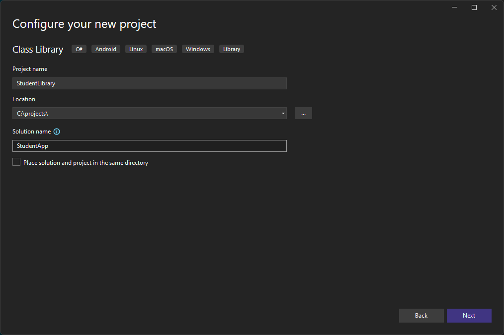

# Chapter 42 - Creating Libraries

TODO: Need a nice image here

Sharing libraries between projects is a fundamental requirement in all but the most simple applications. This chapter looks at how to create a library that can be shared between applications.

## Starting with a Library

When creating a new application it's a good idea to immediately considering also creating a library for your classes. Basically you cannot go wrong by doing so.

Start by creating a new Project of type `Class Library` (targeting .NET and .NET Standard).


Make sure to name you class library different from you solution, to avoid confusion.



Finish it up and behold your own library.


Note that a demo class `Class1` is automatically added to the library as a means of demonstration. Also note that the class has been made `public` so other projects can access it.

### Creating Classes

Adding classes to the library is no different than adding classes to console application or WPF application. Just right click the project and select `Add => Class`.

But let's start by renaming the `Class1` in the library to `Student` and add the following implementation:

```csharp
namespace StudentLibrary
{
    public class Student
    {
        public Student(string firstname, string lastname)
        {
            Firstname = firstname;
            Lastname = lastname;
        }

        public string Firstname { get; set; }
        public string Lastname { get; set; }

        public string Email()
        {
            return $"{Firstname}.{Lastname}@student.vives.be";
        }
    }
}
```

### Moving Existing Classes to a Library

Sometimes we also need to create libraries when an application is already in development. In that case we have a number of existing classes that have to be placed in a library.

In that case we just need to create a new project of type `Class Library` (targeting .NET and .NET Standard) in the existing solution and move the classes from the application project to the library (by process of dragging and dropping).

There are however a couple of things that may have to be changed:

* Make sure that the classes that need to be accessible from the application are made `public`.
* Make sure that the classes are added to the correct namespace if you choose to have use a different namespace for the library.

## Referencing the Library

When using libraries in a C# application, we need to add the library as a reference to the project in which we want to make use of that library.

Let's for example make a new `Console Application` called `RegisterApp`. Your current solution in Visual Studio should look like this:


Use the following implementation for the `Program.cs` of the `RegisterApp` project:

```csharp
using System;

namespace RegisterApp
{
    class Program
    {
        static void Main(string[] args)
        {
            Console.WriteLine("Welcome to VIVES registration app.");

            Console.Write("Please enter your firstname: ");
            string firstname = Console.ReadLine();

            Console.Write("Please enter your lastname: ");
            string lastname = Console.ReadLine();

            Student newStudent = new Student(firstname, lastname);

            Console.WriteLine("Welcome VIVES University College of Applied Sciences");
            Console.WriteLine($"Your personal email address is {newStudent.Email()}");
        }
    }
}
```

As you may notice, the Visual Studio linter will complain it does not know of a class `Student`.

We first will have to reference our fancy library from our console application to indicate that the application depends on that particular library. You can achieve this by right clicking on your application's `Dependencies` and selecting `Add Project Reference ...`.


Now mark the `StudentLibrary` and hit `Ok`.


Last but not least we must include the namespace we have used in the `Student` class by specifying  the statement `Using StudentLibrary` at the top of `Program.cs`.

```csharp{2}
using System;
using StudentLibrary;

namespace RegisterApp
{
    class Program
    {
        static void Main(string[] args)
        {
            Console.WriteLine("Welcome to VIVES registration app.");

            Console.Write("Please enter your firstname: ");
            string firstname = Console.ReadLine();

            Console.Write("Please enter your lastname: ");
            string lastname = Console.ReadLine();

            Student newStudent = new Student(firstname, lastname);

            Console.WriteLine("Welcome VIVES University College of Applied Sciences");
            Console.WriteLine($"Your personal email address is {newStudent.Email()}");
        }
    }
}
```

Before you will be able to run the `RegisterApp` project, you will also need to set the `RegisterApp` as the default project to start. You can do this by right clicking the project and selecting `Set as Startup Project`.

In a later stage you will also be able to add `Unit Test` and `WPF` projects which make use of this same library.
