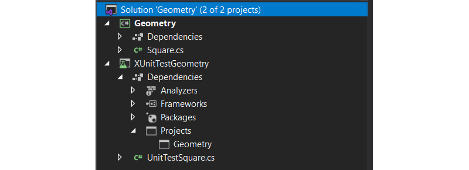
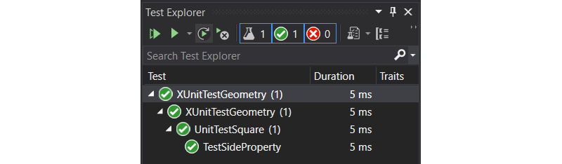
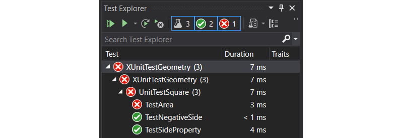
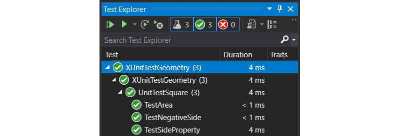

::: danger ☠️ First draft
Please note that this chapter is not finished yet. It may contain errors, typos, irregularities and even unfinished sections.
:::

# Chapter 43 - Unit Testing

::: warning Early draft
This chapter is an early draft.
:::

Unit Testing is a type of software testing where individual units or components of a software are tested. The purpose is to validate that each unit of the software code performs as expected. Unit Testing is most often done during the development (coding phase) of an application by the developers.

Unit tests are typically automated tests written and run by software developers to ensure that a section of an application (known as the "unit") meets its design and behaves as intended. In procedural programming, a unit could be an entire module, but it is more commonly an individual function or procedure.

## Why should we write unit tests

* Because we want our code to work properly
* Because we want our code to **keep** working properly
* Because we want to speed up the development process
* Because we want to have more confidence that our code works properly
* Because we want fewer regressions
* Because we make mistakes

::: tip Regression
A software regression is a software bug that makes a feature stop functioning as intended after a certain event (for example bug fixes, software enhancements, configuration changes, and even substitution of electronic components). A software performance regression is a situation where the software still functions correctly, but performs more slowly or uses more memory or resources than before.

Regressions are often caused by encompassed bug fixes included in software patches. One approach to avoiding this kind of problem is regression testing. A properly designed test plan aims at preventing this possibility before releasing any software. Automated testing and well-written test cases can reduce the likelihood of a regression.
:::

<!-- ## Test Driven Development -->

## Creating a Unit Test Project

For this we will be creating a small library that provides a `Square` class that allows the user of the class to determine the area and circumference of a square.

### Basic Solution Setup

Start by creating a new `Class Library (.NET Core)` called `Geometry`. You can rename the `Class1.cs` to `Square`.

The end result should be the following:


Now it is time to add a unit test project. Create a new `xUnit Test Project (.NET Core)` within your current solution. Call it for example `XUnitTestGeometry`. You can rename the `UnitTest1` to `UnitTestSquare` because it will be the `Square` class that will be tested by this unit test.

Also make sure to add a project reference dependency from the test project to the library.



::: warning No App
Note that we are not creating an application project. While this is of course possible we will not be needing an application here.
:::

## Writing Tests for Square

We'll take two approaches here:

* Write tests for functionality that already exists
* Write tests for functionality that does not exist yet, and implement it after.

### Writing Tests for Existing Functionality

Use the following implementation for the `Square` class where the `Side` property has already been implemented.

```csharp
using System;

namespace Geometry
{
    public class Square
    {
        public int Side { get; set; }
    }
}
```

> Properties (getters/setters in Java) are good examples of code that usually doesn’t contain any logic, and doesn’t require testing. But watch out: once you add any check inside the property, you’ll want to make sure that logic is being tested.
>
> *Roy Osherove in his famous book 'The Art Of Unit Testing'*

We do not expect much trouble from this code as it is fairly simple.

So let's write some unit tests to make sure that it works as expected.

In our first test we will check if the property stores the value that was provided and returns the same value:

```csharp{1,10,12-14}
using Geometry;
using System;
using Xunit;

namespace XUnitTestGeometry
{
    public class UnitTestSquare
    {
        [Fact]
        public void TestSideProperty()
        {
            Square square = new Square();
            square.Side = 3;
            Assert.Equal(3, square.Side);
        }
    }
}
```

::: tip Running All Tests
To run all the unit tests, navigate to `Test => Run All Tests` or press `CTRL-R, A`. The *Test Explorer* window should pop up and show you the results of all the unit tests
:::

Now run the tests. The results should be all green.



Ok, time to test an edge case. What if we set the `Side` to a negative case. This is not really preferred behavior. We expect the `Side` property to always be positive. Instead of looking at the implementation of the class, we will just test it and check if it fails.

Let us set the `Side` to `-3` and check if the resulting `Side` property returns `3`. That seems like a logical result.

```csharp
[Fact]
public void TestNegativeSide()
{
    Square square = new Square();
    square.Side = -3;
    Assert.Equal(3, square.Side);
}
```

Run the tests and watch the results:


Looks like the new test is failing. We never thought about the fact that the `Side` could of been set to a negative value.

Since we have our unit tests having our back, we will be more confident changing the existing code.

So let's fix the implementation of `Square` so the `Side` setter always stores a positive value:

```csharp
public class Square
{
    private int side = 0;
    public int Side
    {
        get { return side; }
        set {
            if (value < 0)
            {
                side = -value;
            }
            else
            {
                side = value;
            }
        }
    }
}
```

Let us check if it works by running the unit tests again.


Life is good again.

### Refactoring Existing Code

Weeks later you come across this code again and notice that it could probable be simplified a lot. If there were no unit tests, you would probable not touch that code again, because **it works now and you might break it**. But luckily enough we do have unit tests (and otherwise you should create them).

So let us refactor the code and check if the unit tests keep succeeding. Instead of that ugly `if-else` structure, we can just use `Math.Abs`:

```csharp
public class Square
{
    private int side = 0;
    public int Side
    {
        get { return side; }
        set { side = Math.Abs(value);  }
    }
}
```

Run the tests to make sure you did not break anything:


Don't you just feel the confidence ? That's what is all about.

### Writing Tests before Implementing Functionality

This is actually called Test Driven Development (TDD). You first write the tests and then you write the code. It makes you focus on the results and allows you to understand the functionality you will need to implement later better. TDD is development methodology that is becoming more and more popular.

While it does require you to put effort in the tests first, it will allow you to write the implementation faster, because:

* you already thought about the functionality
* you have tests that give you confidence
* the tests will show you really quick if something is wrong
* the tests will have your back later on if you want to refactor or change some other part of the code

So let us write a test for the `Area()` method that will determine the area of the square:

```csharp
[Fact]
public void TestArea()
{
    Square square = new Square();
    square.Side = 5;
    Assert.Equal(25, square.Area());
}
```

Following the TDD mantra (red, green, refactor) we should:

* first write the test (test-first)
* watch it fail (red)
* fix the code to make it succeed (green)
* refactor the code if needed

So next up is watching it fail. For this we will need to add the `Area()` method to the `Square` but we will not be calculating the result just yet. Let us just return `0`:

```csharp
public class Square
{
    // ...

    public int Area()
    {
        return 0;
    }
}
```

Perfect, our test is failing as expected:



If no tests need to be added anymore, its time to implement the `Area()` method and try to make the tests succeed.

```csharp
public class Square
{
    // ...

    public int Area()
    {
        return Side * Side;
    }
}
```

If all went well, you should now have all tests succeed:



::: tip Circumference
Try using a TDD approach to implement a `Circumference()` method.
:::

## Some Good information

Eliotte Rusty Harold gives a nice presentation on why and how we should unit test.

<YoutubeVideo videoId="fr1E9aVnBxw" />
