::: danger ☠️ First draft
Please note that this chapter is not finished yet. It may contain errors, typos, irregularities and even unfinished sections.
:::

# Chapter 50 - Introduction to WPF

WPF or Windows Presentation Foundation is a Microsoft GUI (Graphical User Interface) framework used with the .NET framework.

A GUI framework allows you to create the graphical user interface of an application with a wide range of readily-available GUI components, like buttons, text boxes, labels, images, ... and many more. Without a GUI framework you would have to draw these elements manually and handle all of the user interaction scenarios like text and mouse input yourself.

This is not a feasible approach in this modern day of age. So instead, developers will use a GUI framework which will do all the basic work and allow the developers to focus on making great looking applications.

There are a lot of GUI frameworks out there, but for .NET developers, the most commonly used ones at the moment are WinForms and WPF. WPF is the newest, but Microsoft is still maintaining and supporting WinForms.

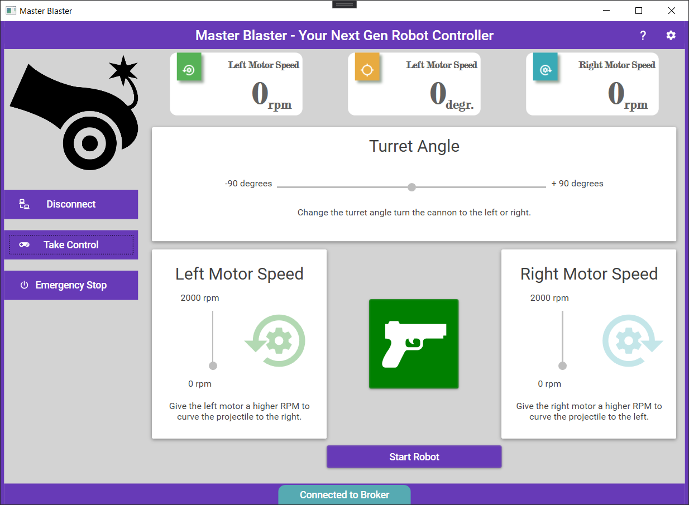

WPF uses the eXtensible Application Markup Language (XAML) to provide a declarative model for application programming.

```xml
<Grid Grid.Column="1" Grid.Row="0" Grid.RowSpan="3"
      Background="#FF56B256"
      Width="35" Height="40"
      HorizontalAlignment="Center" VerticalAlignment="Top">
    <Grid.Effect>
        <DropShadowEffect BlurRadius="6" Color="DarkGreen" Opacity="0.4" />
    </Grid.Effect>
    <materialDesign:PackIcon Kind="CogCounterclockwise"
      HorizontalAlignment="Center" VerticalAlignment="Bottom"
      Margin="5" Foreground="White" Width="20" Height="20" />
</Grid>

<TextBlock Grid.Column="2" Grid.Row="1" Grid.ColumnSpan="2"
            Text="Left Motor Speed"
            HorizontalAlignment="Right" VerticalAlignment="Center"
            FontFamily="Modern No. 20" FontWeight="Bold"
            Foreground="#FF616161" />

<TextBlock Grid.Column="2" Grid.Row="2" Grid.RowSpan="2"
            Text="{Binding LeftMotorSpeed, FallbackValue=0}"
            VerticalAlignment="Bottom" HorizontalAlignment="Right"
            FontFamily="Modern No. 20" FontWeight="Bold" FontSize="48"
            Foreground="#FF616161" />
```

## Getting Started with WPF

WPF is way to extensive to try to explain all components, layouts and such in a single document. It's also quite daunting to learn it from reading.

A better approach is to follow along with some nice YouTube video's that explain the nooks and crannies of the framework basics.

<YoutubeVideo videoId="gSfMNjWNoX0" />

The rest of this document provides some reference documentation and extra topics not covered in the video.

## Creating a Project

To create a new WPF application select the `WPF Application` project template.

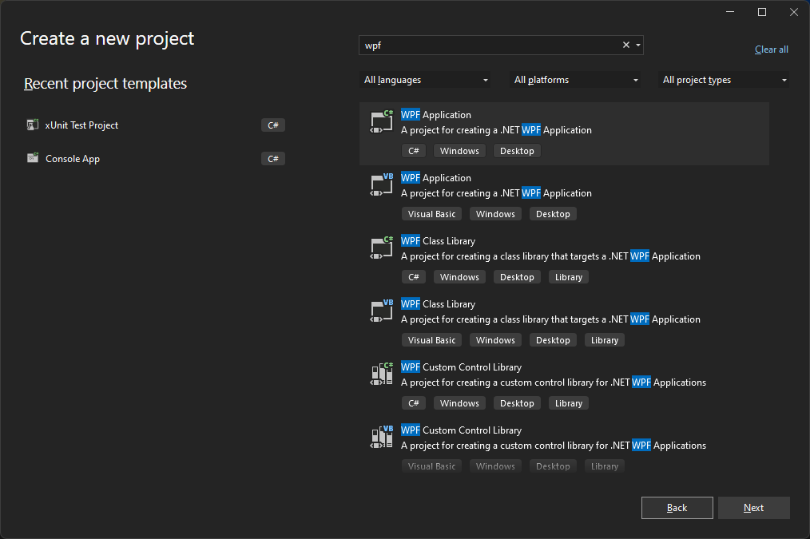

## Window

When creating a new WPF application, the first thing you encounter is the `<Window>` element. It serves as the root element of a window and provides the standard border, title bar and maximize, minimize and close buttons. A WPF window is a combination of a XAML (`.xaml`) file, where the `<Window>` element is the root, and a CodeBehind (`.cs`) file.

```xml
<Window x:Class="WpfTest.MainWindow"
        xmlns="http://schemas.microsoft.com/winfx/2006/xaml/presentation"
        xmlns:x="http://schemas.microsoft.com/winfx/2006/xaml"
        xmlns:d="http://schemas.microsoft.com/expression/blend/2008"
        xmlns:mc="http://schemas.openxmlformats.org/markup-compatibility/2006"
        xmlns:local="clr-namespace:WpfTest"
        mc:Ignorable="d"
        Title="MainWindow" Height="450" Width="800">
    <Grid>

    </Grid>
</Window>
```

Some important things about `Window`:

* `x:Class="WpfTest.MainWindow"` contains the fully qualified **name of the class** in the code behind file. If you change the name of the Window make sure sure to change the name of the class as well and match it up in the XAML file.
* `Title="MainWindow"` allows you to change the **title** of the Window
* `Height="450"` and `Width="800"` set the **dimensions** of the Window
* By default VS will populate the Window with a `Grid` component, a popular layout container element.
* A `Window` can have **only 1 child element** inside. So a layout control, which in turn can contain multiple child controls, is usually a good choice.

The matching code behind file contains a partial class with a default constructor that initializes the visual components.

```csharp
namespace WpfTest
{
    public partial class MainWindow : Window
    {
        public MainWindow()
        {
            InitializeComponent();
        }
    }
}
```

::: tip 🧩 Partial Classes
It is possible to split the definition of a `class`, a `struct`, an `interface` or a method over two or more source files. Each source file contains a section of the type or method definition, and all parts are combined when the application is compiled.
:::

## Finding your way

When first starting out with WPF it might be a bit overwhelming. There are a lot of components, the XAML can be a bit of a mess if you allow it to be, and there are hundredths of properties for the components and thats only the visible stuff.

Below are some tips that will help along the way:

* **Don't drag and drop components from the toolbox to the visual editor.** This will really make your XAML a mess and introduces much more properties than often needed. Drag and drop it inside the XAML or type up the component tag by hand.

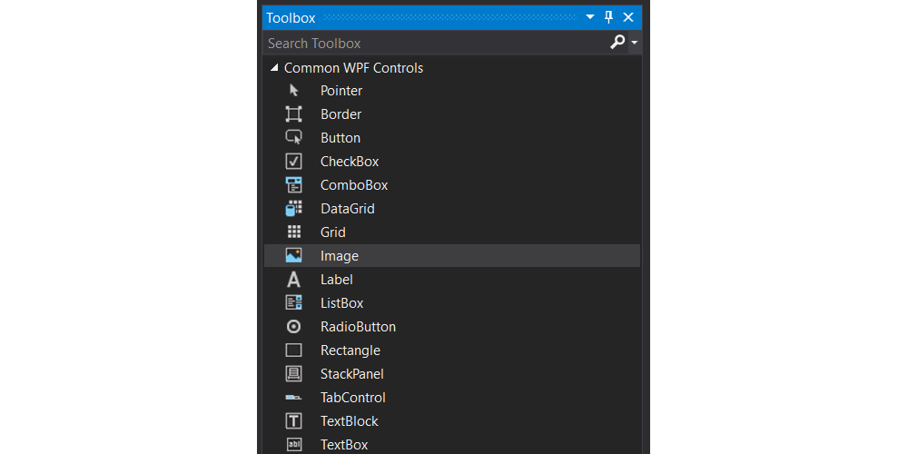

* **Learn the properties of the different components** by snooping through the properties via the visual listing in VS. Just set your cursor in the correct XAML tag or select the component in the visual editor and open the properties panel.

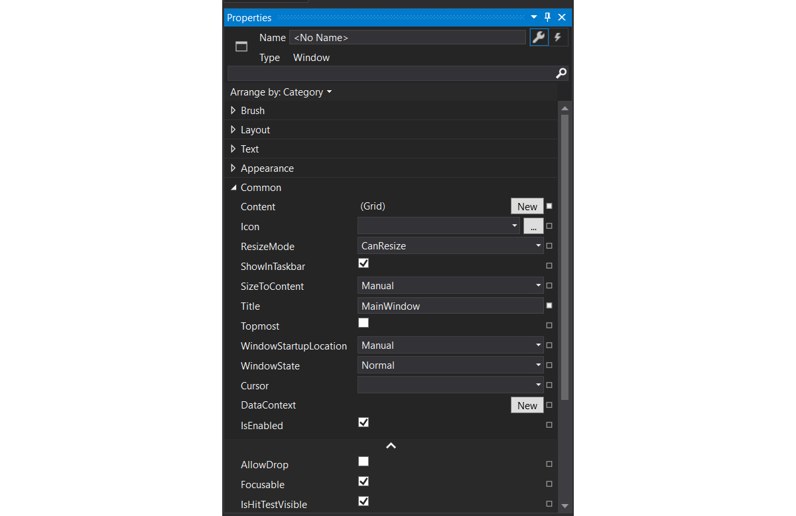

::: tip 🛠️ Toolbox
If you can't seem to find the toolbox, make sure it is enabled via `View => Toolbox`.
:::

* **Give the components that you'll need in code a decent name.** Often input and output controls will require intervention from the code behind. Make sure to give these a good name using the `x:Name=".."` property.

```xml
<TextBlock x:Name="playerScore" Text="0" />
```

::: tip 😕 `Name` versus `x:Name`
There really is only one name in XAML, the `x:Name`. A framework, such as WPF, can optionally map one of its properties to XAML's `x:Name`.

The reason this was done was to allow for frameworks that already have a concept of "Name" at runtime, such as WPF.

In general, a class does not need to store the name for `x:Name` to be useable. All `x:Name` means to XAML is generate a field to store the value in the code behind class. What the runtime does with that mapping is framework dependent.
:::

* **Place comments in your XAML.** Some basic comments in your XAML can often help you find your way much faster through a larger markup. Do make sure to update your comments if you change things in such a way that the comments are not correct anymore.

```xml
<!-- ... -->
<Grid.ColumnDefinitions>
    <!--Border margin-->
    <ColumnDefinition Width="20"></ColumnDefinition>
    <!--Image column-->
    <ColumnDefinition Width="*"></ColumnDefinition>
    <!--User input and result-->
    <ColumnDefinition Width="*"></ColumnDefinition>
    <!--Border margin-->
    <ColumnDefinition Width="20"></ColumnDefinition>
</Grid.ColumnDefinitions>
<Grid.RowDefinitions>
    <!--Border margin-->
    <RowDefinition Height="20"></RowDefinition>
    <!--Title-->
    <RowDefinition Height="auto"></RowDefinition>
    <!--Content-->
    <RowDefinition Height="*"></RowDefinition>
    <!--Footer-->
    <RowDefinition Height="auto"></RowDefinition>
    <!--Border margin-->
    <RowDefinition Height="20"></RowDefinition>
</Grid.RowDefinitions>
<!-- ... -->
```

## Basic Components

The basic components allow us the make the most basic applications and contain 90% of the components used in any application UI.

### TextBlock and Label

The `TextBlock` control is one of the most fundamental controls in WPF, yet it's very useful. It allows you to **put text on the screen**, much like a `Label` control does, but in a simpler and less resource demanding way. A common understanding is that a `Label` is for short, one-line texts (but may include e.g. an image), while the `TextBlock` works very well for multiline strings as well, but can only contain text (strings). Both the `Label` and the `TextBlock` offer their own unique advantages, so what you should use very much depends on the situation.

::: warning 🔤 TextBlock is not a control
Even though `TextBlock` lives in the `System.Windows.Controls namespace`, it is not a control. It derives directly from `FrameworkElement`. `Label`, on the other hand, derives from `ContentControl`.

This means that `Label` can:

* Be given a custom control template (via the Template property).
* Display data other than just a string (via the Content property).
* Apply a `DataTemplate` to its content (via the `ContentTemplate` property).
* Do whatever else a `ContentControl` can do that a `FrameworkElement` cannot.
* `Label` text is grayed out when disabled
* `Label` supports access keys
* `Label` is much heavier than `TextBlock`
:::

So basically, most of the time if we wish to display some sort of text to the user, we'll often just need a `TextBlock`.

Example of a `TextBlock` that has blue text and wraps the text in the control:

```xml
<TextBlock Margin="10" TextWrapping="Wrap" Foreground="Blue">
  This is a TextBlock control with automatically wrapped text,
  using the TextWrapping property.
</TextBlock>
```

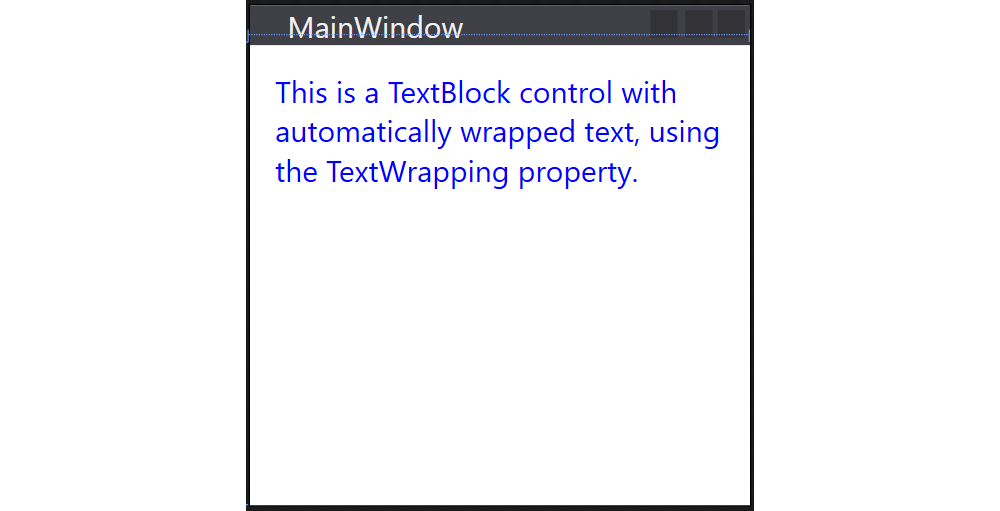

<!-- Some fun example using icons: https://www.wpf-tutorial.com/basic-controls/the-label-control/ -->

### TextBox

The `TextBox` control is the most **basic text-input** control found in WPF, allowing the end-user to input plain text, either on a single line, for dialog input, or in multiple lines, like an editor.

Single line `TextBox`:

```xml
<TextBox Text="Hello World from C#" />
```

The `AcceptsReturn` makes the `TextBox` into a multi-line control by allowing the use of the Enter/Return key to go to the next line, and the `TextWrapping` property, which will make the text wrap automatically when the end of a line is reached.

```xml
<TextBox AcceptsReturn="True" TextWrapping="Wrap" />
```

::: tip Spelling
You can even enable spellchecking on the TextBox using the properties `SpellCheck.IsEnabled="True"` and `Language="en-US"`
:::

### Button

No GUI framework would be complete without a `Button` control, so of course WPF has a nice one included, and just like the rest of the framework controls, it's very flexible and will allow you to accomplish almost anything. But let's start out with some basic examples.

Just like many other WPF controls, a `Button` can be displayed simply by adding a `Button` tag to your Window. If you put text between the tags (or another control), it will act as the content of the `Button`:

```xml
<Button>Hello There</Button>
```

### Image

The WPF `Image` control allows us to display an image on the UI. All one has to do is to set the `Source` property of the image.

In most circumstances the images are included with the application. Follow theses best practice steps to make sure your images can be loaded wherever the application is run.

1. Create a directory `images` on the same level as you solution file (next to the `bin` and `obj` directories)
2. Add your images to this directory
3. Refresh the solution in Visual Studio. You `images` directory should appear.

  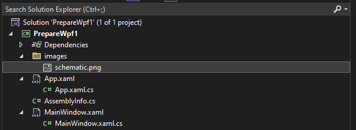

4. Select all the images and open the properties in Visual Studio (by clicking them for example and selecting `Properties`)
5. Set the the `Build Action` to `Resource` and the `Copy to Output Directory` to `Copy always`

  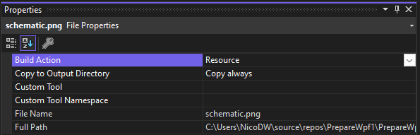

6. Next set the `Source` property of the `Image` control to a relative path such as for example `Source="images/schematic.png"`

::: tip 🌐 Image Source
It is also possible to use online hosted images. All one needs to do is set the `Source` to the URI of the image. For example `Source="https://image.coolblue.be/max/500x500/products/1496051"`. While this seems the perfect solution, it is not always the case. If the application is run in an environment without Internet, no image is shown.
:::

#### Loading Images in Code

Specifying the image source directly in your XAML will work out in a lot of cases, but sometimes you need to load an image dynamically from code. This can be done as shown in the code snippet below.

```csharp
imageControl.Source = new BitmapImage(
  new Uri("./images/name_of_image", UriKind.Relative)
);       
```

#### The Stretch Property

The stretch property controls what happens when the dimensions of the image loaded doesn't completely match the dimensions of the `Image` control. This will happen all the time, since the size of your `Window` can be controlled by the user and unless your layout is very static, this means that the size of the `Image` control(s) will also change.

The following options are available for the `Stretch` property:

* `Uniform`: This is the default mode. The image will be automatically scaled so that it fits within the Image area. The Aspect ratio of the image will be preserved.
* `UniformToFill`: The image will be scaled so that it completely fills the Image area. The Aspect ratio of the image will be preserved.
* `Fill`: The image will be scaled to fit the area of the Image control. Aspect ratio might NOT be preserved, because the height and width of the image are scaled independently.
* `None`: If the image is smaller than the Image control, nothing is done. If it's bigger than the Image control, the image will simply be cropped to fit into the Image control, meaning that only part of it will be visible.

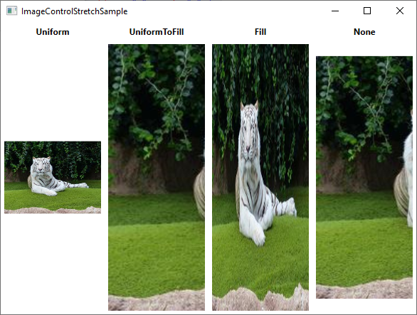

## Layout Containers aka Panels

Panels are one of the most important control types of WPF. They **act as containers for other controls** and **control the layout of your windows/pages**. Since a window can only contain ONE child control, a panel is often used to divide up the space into areas, where each area can contain a control or another panel (which is also a control, of course).

Panels come in several different flavors, with each of them having its own way of dealing with layout and child controls. Picking the right panel is therefore essential to getting the behavior and layout you want, and especially in the start of your WPF career, this can be a difficult job.

However, 99% of all window layouts can be achieved using the most popular panels, namely `WrapPanel`, `StackPanel` and `Grid`. Knowing these by heart will get you over the finish.

### WrapPanel

The WrapPanel will position each of its child controls next to the other, horizontally (default) or vertically, until there is no more room, where it will wrap to the next line and then continue. Use it when you want a vertical or horizontal list controls that automatically wraps when there's no more room.

```xml
<WrapPanel Orientation="Horizontal">
    <TextBlock Foreground="Blue" Background="LightGray">
      This is a fairly larger text.
    </TextBlock>

    <TextBlock Foreground="White" Background="Black">
      This is a smaller text.
    </TextBlock>

    <TextBlock Foreground="Green" Background="LightGray">
     Very Small.
    </TextBlock>
</WrapPanel>
```

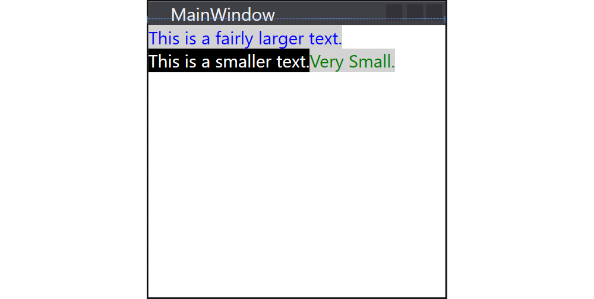

### StackPanel

The `StackPanel` acts much like the `WrapPanel`, but instead of wrapping if the child controls take up too much room, it simply expands itself, if possible. Just like with the `WrapPanel`, the orientation can be either horizontal or vertical, but instead of adjusting the width or height of the child controls based on the largest item, each item is stretched to take up the full width or height. Use the `StackPanel` when you want a list of controls that takes up all the available room, without wrapping.

```xml
<StackPanel Orientation="Vertical">
    <TextBlock Foreground="Blue" Background="LightGray">
      This is a fairly larger text.
    </TextBlock>
    
    <TextBlock Foreground="White" Background="Black">
      This is a smaller text.
    </TextBlock>

    <TextBlock Foreground="Green" Background="LightGray">
     Very Small.
    </TextBlock>
</StackPanel>
```

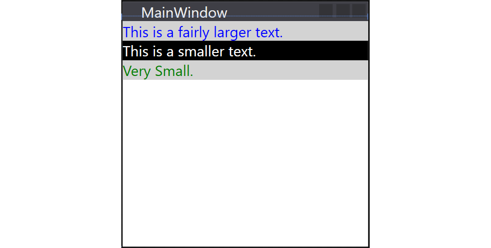

### Grid

The Grid is probably the most complex of the panel types. A Grid can contain multiple rows and columns. You define a height for each of the rows and a width for each of the columns, in either an absolute amount of pixels, in a percentage of the available space or as `auto`, where the row or column will automatically adjust its size depending on the content.

```xml
<Grid>
  <Grid.ColumnDefinitions>
    <ColumnDefinition Width="20" />
    <ColumnDefinition Width="auto" />
    <ColumnDefinition Width="*" />
    <ColumnDefinition Width="20" />
  </Grid.ColumnDefinitions>
  <Grid.RowDefinitions>
    <RowDefinition Height="20" />
    <RowDefinition Height="auto" />
    <RowDefinition Height="*" />
    <RowDefinition Height="2*" />
    <RowDefinition Height="20" />
  </Grid.RowDefinitions>

  <TextBlock
    Grid.Column="1" Grid.Row="1"
    Margin="5" Padding="5"
    Background="LightGray">Hello There
  </TextBlock>

</Grid>
```

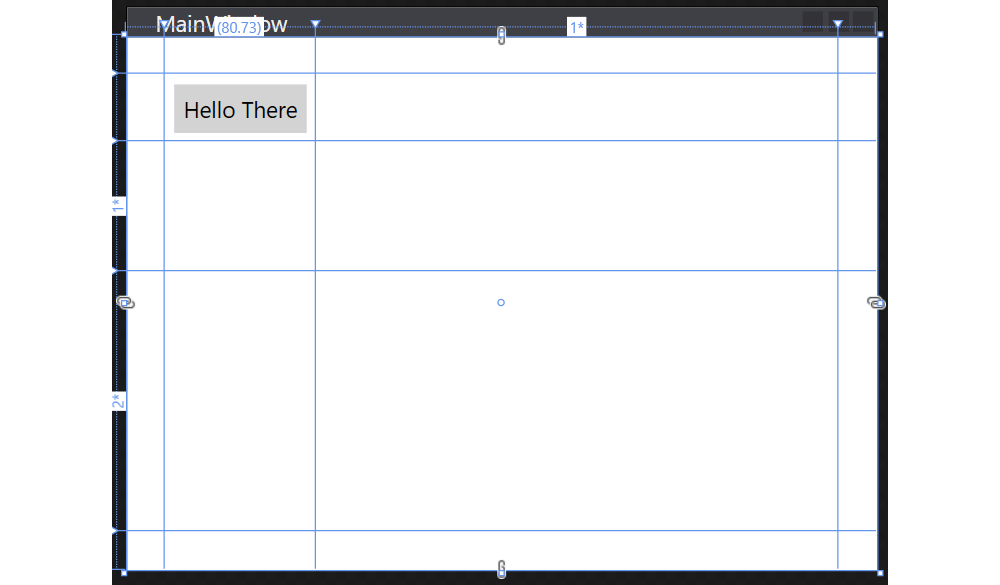

Note that child components are assigned cells by setting the properties `Grid.Column="..."` and `Grid.Row="..."` where the value is a zero-based index.

To specify the width of a column or the height of a row there are three options:

* **Pixels**: this is an absolute value is should be avoided as much as possible because it does not scale well. However for example for margin space and absolutely sized components it can be used. In this case we just specify a number for the size. For example `20`.
* **`auto`**: this will indicate that the size will grow as required to host the child components.
* **Percentage**: the remaining space that is left over after the absolute space and `auto` space has been allocated can be divided among the columns/rows that have their size set using `*`-notation. For this all the stars are summed and divided using the indicated weight. For example two columns: one has `*` and the other `3*`. The remaining space will be divided as `1/4` and `3/4`.

Note that when using `auto`, the width/height will be set based on the required space of the child components:

```xml
<Grid>
  <Grid.ColumnDefinitions>
    <ColumnDefinition Width="20" />
    <ColumnDefinition Width="auto" />
    <ColumnDefinition Width="auto" />
    <ColumnDefinition Width="*" />
    <ColumnDefinition Width="20" />
  </Grid.ColumnDefinitions>
  <Grid.RowDefinitions>
    <RowDefinition Height="20" />
    <RowDefinition Height="auto" />
    <RowDefinition Height="*" />
    <RowDefinition Height="20" />
  </Grid.RowDefinitions>

  <TextBlock
    Grid.Column="1" Grid.Row="1"
    Margin="5" Padding="5"
    Background="LightGray">Hello There. This is a longer text.
  </TextBlock>

  <TextBlock
    Grid.Column="2" Grid.Row="1"
    Margin="5" Padding="5"
    Background="LightGray">Small Text
  </TextBlock>

</Grid>
```

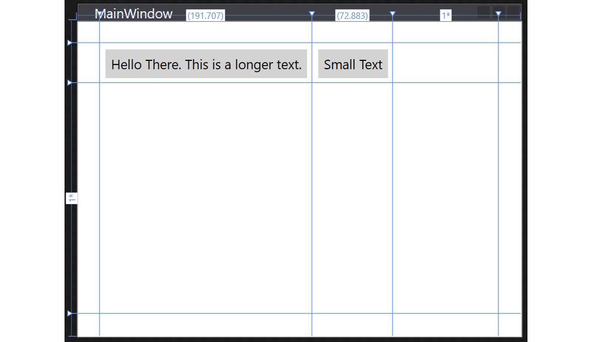

When using the percentage indication, the child components take up the full space of the cell - expanding or cropping as needed.

```xml
<Grid>
  <Grid.ColumnDefinitions>
    <ColumnDefinition Width="20" />
    <ColumnDefinition Width="*" />
    <ColumnDefinition Width="*" />
    <ColumnDefinition Width="*" />
    <ColumnDefinition Width="20" />
  </Grid.ColumnDefinitions>
  <Grid.RowDefinitions>
    <RowDefinition Height="20" />
    <RowDefinition Height="*" />
    <RowDefinition Height="*" />
    <RowDefinition Height="20" />
  </Grid.RowDefinitions>

  <TextBlock
    Grid.Column="1" Grid.Row="1"
    Margin="5" Padding="5"
    Background="LightGray">Hello There. This is a longer text.
  </TextBlock>

  <TextBlock
    Grid.Column="2" Grid.Row="1"
    Margin="5" Padding="5"
    Background="LightGray">Small Text
  </TextBlock>

</Grid>
```

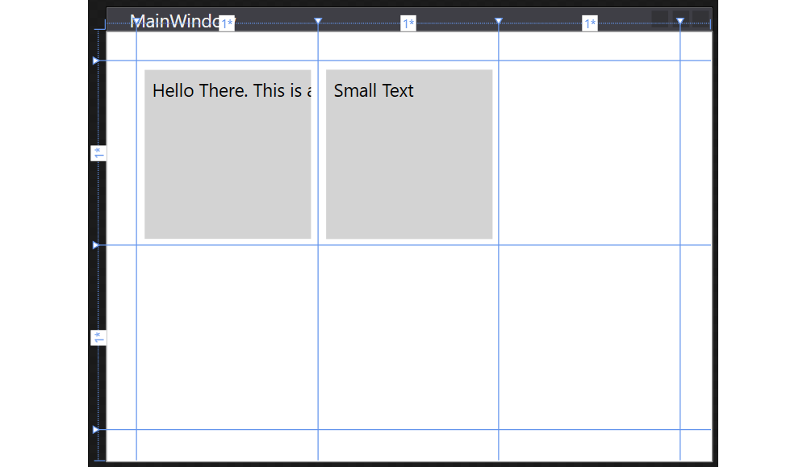

### Spanning Multiple Cells

Sometimes certain controls need to span multiple columns or rows. In that case one can set the `Grid.ColumnSpan` and/or `Grid.RowSpan` properties to the number of columns/rows it should span.

```xml
<!--Title-->
<TextBlock
  Text="LED Series Resistor Calculator"
  Grid.Column="1" Grid.Row="1" Grid.ColumnSpan="2"
  TextAlignment="Center" Foreground="#FFC31919" FontSize="24"
  Padding="12"
/>
```

Which results in the title spanning two columns:

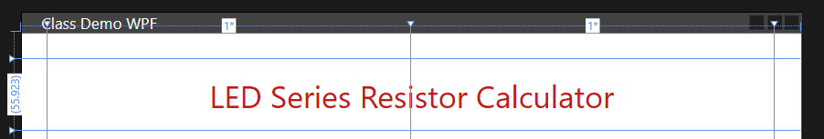


## Event Handling

When programming an application with a graphical UI, compared to a console application, we switch to **event driven programming**. Actions in our applications happen on the rhythm of events happening (user types something, hovers the mouse over a control, clicks something, ...).

**Methods that respond/handle these events are called event handlers**. We register event handlers on specific events, so when the events happen, the appropriate event handler is called.

### Button Click Event

As a beginning WPF programmer the best way to learn event handling is to use buttons. Do something when the user clicks a button.

Let's create a small example application using a `Button` and `TextBlock`:

```xml
<StackPanel Orientation="Vertical">
  <Button Margin="10" x:Name="sayHello">Say Hello</Button>
  <TextBlock x:Name="message"
    HorizontalAlignment="Center">
    Please hit the button
  </TextBlock>
</StackPanel>
```

::: tip Name the Components
Before adding any events handlers make sure to name your components so the automatically generated event handlers are named accordingly. Otherwise your events handlers are named like `Button1_Click` which is bad.
:::

The most general way to all event handling is selecting the required source control, the `Button` in this case, and open the `Properties` panel. Now select the small lightning symbol in the top right corner of the properties panel to get an overview off all possible control events. Next just double click inside the input box of the desired event to automatically generate an event handler:

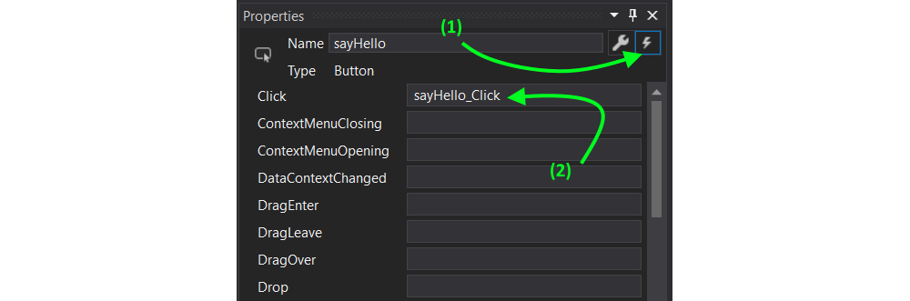

You will automatically be taken to the code behind file to the correct event handler method:

```csharp
private void sayHello_Click(object sender, RoutedEventArgs e)
{

}
```

Named components will automatically become available inside your code as attributes. This means that we can set the `Text` property of the `TextBlock` component (named `message` here) as shown below:

```csharp
private void sayHello_Click(object sender, RoutedEventArgs e)
{
  message.Text = "Well hello there";
}
```


## Fitting the Layout

When looking to create a layout for your application it is always a good idea build a mockup first using some sort of graphical application or on paper. Than try to apply some layout containers to your design.

Using this approach will prove to be most succesfull when starting out UI design with WPF.

Let us try building something fancy like this registration form:

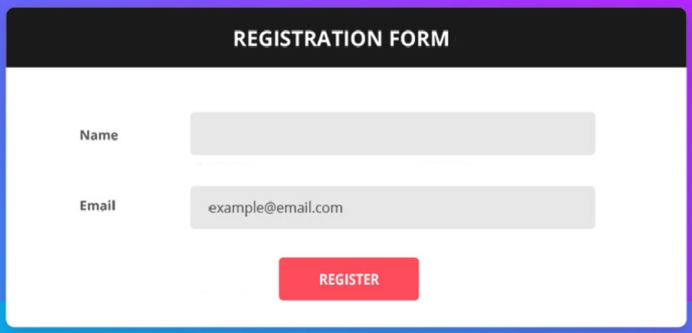

### Step 1 - Mapping to Panel Containers

In this step try to map panel containers to the UI. This is a bit trial and error. There is only 1 rule - keep it simple. You are allowed to nest layouts, but don't overdo it.

A first attempt might be to use just StackPanels:

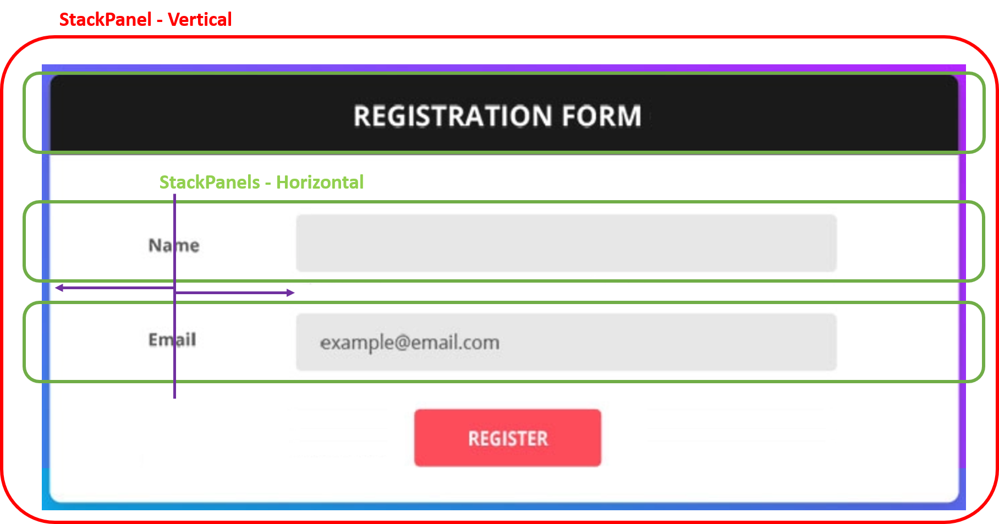

There is however a minor problem here. It is a bit harder here to line-up the `name` and `email` TextBlock's. They do look about the same size, but we should not rely on that as it may change a bit with font-settings. So to get both of them layed out with the same center, it would require you to fix the width of the TextBlock which is not the best idea.

A second approach uses a `Grid` panel yielding a bit complexer layout but much more progressive towards size-changes.

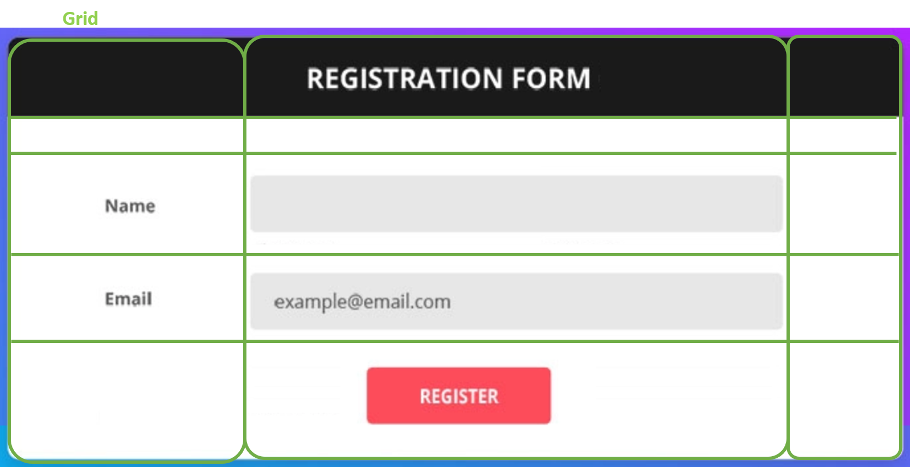

```xml
<Window x:Class="WpfTest.MainWindow"
        xmlns="http://schemas.microsoft.com/winfx/2006/xaml/presentation"
        xmlns:x="http://schemas.microsoft.com/winfx/2006/xaml"
        xmlns:d="http://schemas.microsoft.com/expression/blend/2008"
        xmlns:mc="http://schemas.openxmlformats.org/markup-compatibility/2006"
        xmlns:local="clr-namespace:WpfTest"
        mc:Ignorable="d"
        Title="MainWindow" Height="300" Width="600">
    <Grid>
        <Grid.ColumnDefinitions>
            <ColumnDefinition Width="2*" />
            <ColumnDefinition Width="4*" />
            <ColumnDefinition Width="*" />
        </Grid.ColumnDefinitions>

        <Grid.RowDefinitions>
            <RowDefinition Height="auto" />
            <RowDefinition Height="10" />
            <RowDefinition Height="2*" />
            <RowDefinition Height="2*" />
            <RowDefinition Height="2*" />
        </Grid.RowDefinitions>

        <TextBlock Grid.Column="0" Grid.Row="0" Grid.ColumnSpan="3"
            Text="Registration Form" TextAlignment="Center" Padding="10"
            Background="Black" Foreground="White" />

        <TextBlock Grid.Row="2" Grid.Column="0"
                   VerticalAlignment="Center"
                   Text="Name" TextAlignment="Center" />

        <TextBlock Grid.Row="3" Grid.Column="0"
                   VerticalAlignment="Center"
                   Text="Email" TextAlignment="Center" />

        <TextBox Grid.Row="2" Grid.Column="1"
                 x:Name="name"
                 Background="LightGray"
                 Padding="5"
                 VerticalAlignment="Center"
                 Text="Name ..." />

        <TextBox Grid.Row="3" Grid.Column="1"
                 x:Name="email"
                 Padding="5"
                 Background="LightGray"
                 VerticalAlignment="Center"
                 Text="Email ..." />

        <Button x:Name="register"
                Grid.Column="0" Grid.Row="4" Grid.ColumnSpan="3"
                VerticalAlignment="Center" HorizontalAlignment="Center"
                Foreground="White" Background="DarkRed"
                Padding="50, 5">
            Register
        </Button>

    </Grid>
</Window>
```

This results in the following UI:

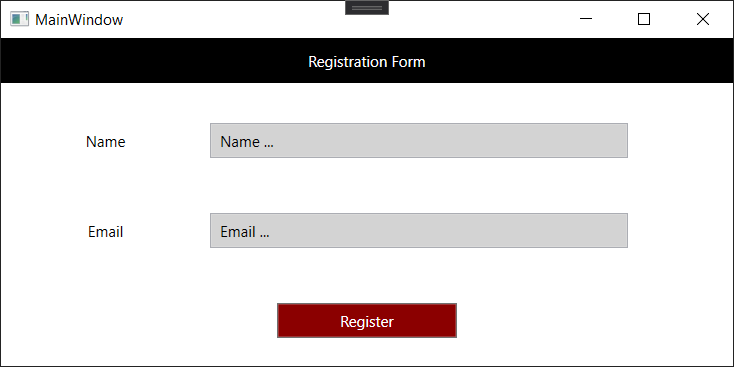

<!-- Passing data between forms -->
<!-- Grid Row/Col spanning -->
<!-- Styling -->
<!-- Data Binding -->
<!-- Margin and padding -->
<!-- Other useful components? Span -->
<!-- Good to Know: grid elements can be stacked upon each other -->
<!-- Some snippets: -->
<!-- Rounding buttons for example -->
