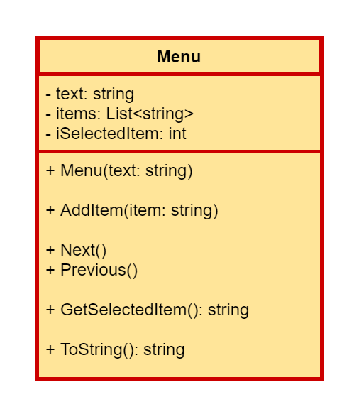
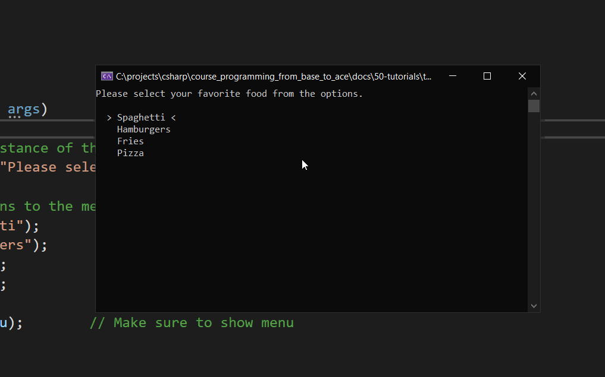

<!-- TODO: Turn it into a library that we can use in other apps -->

::: danger ☠️ First draft
Please note that this is a very early first draft. It may contain errors, typos, irregularities and even unfinished sections.
:::

# Tutorial - Terminal Selection Menu

This tutorial will guide you through the process of making a dynamic selection menu for a terminal application that can be controlled using the arrow-keys.

<!-- TODO: Add GIF example here of the end result -->

## First Things First

First of we'll need to think about what the application should do and how we will tackle this problem.

* The idea is to show a menu to the user that consists of a couple of options and a title or question.
* The user should be able to use the arrow keys to select one of the options and hit `ENTER` to confirm.
* The currently selected option should be visually indicated as being currently selected.

Let's take a look at some examples. First of the general menu idea:

```
What option would you like to pick?

  > The first option <
    The second option
    The fourth option
    The last option

Press the up and down arrows to choose an option.
Hit ENTER to confirm and continue.
```

Pressing the down key should result in the selection moving to the new option:

```
What option would you like to pick?

    The first option
  > The second option <
    The fourth option
    The last option

Press the up and down arrows to choose an option.
Hit ENTER to confirm and continue.
```

Once the user has made a choice we should be able to identify the selected item:

```
Thank you for choosing "The second option".
```

This is basically what the menu should be able to do.

## Object Oriented Design

The first step into designing a solution for this problem is to identify some classes and determine a starting point on what to work first.

Basically we are building a **Menu** here, so the most logical thing to do is provide a `Menu` class.

Let's try to identify what information the objects should hold and what functionality the `Menu` class should provide:

* It should have a text/title/question. This is part of the state of the class so we can store it as an attribute of type `string`.
  * We can take this information in via the constructor as a menu without a text does not have much use.
* It should allow us to add items to the menu.
  * This can be achieved by providing a method for it, for example `AddItem()`.
  * The type of the items can be kept simple for the time being and can be of type `string`
  * The items themselves should most likely best be stored in a container like for example a `List`. Not a good idea to use an array here as we actually do not know how many items will be stored in the menu beforehand.
* It should have methods for changing the selected item
  * Changing the selected item should be requestable from the outside of the class. It's not good design to bind to the terminal and arrow-keys internally in this class.
  * This can be achieved by adding for example a `Next()` and `Previous()` method.
  * This also implies that the currently selected item should be tracked. An index attribute is probable most appropriate here.
* It should allow the currently selected item to be retrieved
  * By providing for example a method `GetSelectedItem()`, the currently selected item can easily be requested from the object.
* The state of the menu should be representable as a `string`.
  * This allows for easy output to the terminal.
  * By adding a `ToString()` method to the class this can be easily achieved.

```csharp{10-13}
public class Menu
{
  public Menu(string text)
  {
    SetText(text);
  }

  public void AddItem(string item)
  {
    if (item == null)
    {
      return;
    }

    items.Add(item);
  }

  public override string ToString()
  {
    string output = text + "\n";

    for (int i = 0; i < items.Count; i++)
    {
      output += $"\n    {items[i]}";
    }

    return output;
  }

  private void SetText(string text)
  {
    if (text != null)
    {
      this.text = text;
    }
  }

  private string text = "";
  private List<string> items = new List<string>();
}
```

While this is already a serious list, it's not as complex as it seems.

Let's throw some of this information into a UML class diagram. That will probable give us a better overview.



How we will be controlling this menu using the arrow keys will be the next step. Let's first design this `Menu` class.

## Creating a Menu Class

Start by creating a new .NET Core console application and give it an appropriate name.

Next add a new class to the project called `Menu`:

```csharp
using System;
using System.Collections.Generic;
using System.Text;

namespace TerminalSelectionMenu
{
    public class Menu
    {
    }
}
```

Note that the access modifier is set to `public` here as we will create a library at the end of this tutorial.

### The Text

The easiest thing to do first is to add a `text` to the menu. This can be implemented as an attribute of type `string`. At the moment it should not be changeable  after its been initialized or it should not be accessed from the outside, so we can basically just add an attribute without a property.

```csharp{3}
public class Menu
{
  private string text = "";
}
```

To initialize the `text` attribute, we will provide a constructor that takes in this text when an object of the class `Menu` is instantiated.

```csharp{3-9}
public class Menu
{
  public Menu(string text)
  {
    if (text != null)
    {
      this.text = text;
    }
  }

  private string text = "";
}
```

Note that we added a safe-guard to make sure that the provided `text` is not `null`. If it is, the attribute is not altered and the `text` attribute will keep it's original value, an empty string `""`.

Looking at this code, it is a bit ugly to place this safe-guard inside the constructor. A better solution is to add a `private` setter for the `text` attribute.

```csharp{5,8-14}
public class Menu
{
  public Menu(string text)
  {
    SetText(text);
  }

  private void SetText(string text)
  {
    if (text != null)
    {
      this.text = text;
    }
  }

  private string text = "";
}
```

Note that a property with private setter and getter would also have been an option. You can pick the solution you find cleanest.

### ToString

To be able to test the `Menu` class, we can add an initial implementation of the `ToString()` method. That way we can instantiate an object in our `Main` and print out the result to the terminal.

```csharp{8-11}
public class Menu
{
  public Menu(string text)
  {
    SetText(text);
  }

  public override string ToString()
  {
    return text;
  }

  private void SetText(string text)
  {
    if (text != null)
    {
      this.text = text;
    }
  }

  private string text = "";
}
```

At this moment, all the `ToString()` method is required to do is return the `text` of the `Menu`.

To test if the `Menu` class is up to its task, a small application can be implemented in the `Main`:

```csharp
static void Main(string[] args)
{
  Console.WriteLine("Welcome to the Tutorial - Terminal Selection Menu\n");

  // Let's create an instance of the class menu with a certain text
  Menu menu = new Menu("Please select your favorite food from the options.");

  // Let's print the result to the terminal
  Console.WriteLine(menu);
}
```

The result should be

::: codeoutput
```
Welcome to the Tutorial - Terminal Selection Menu

Please select your favorite food from the options.
```
:::

Congratulations. We are of to a good start.

## Tracking Items

To keep track of the menu items we need some sort of collection. Since we do not know beforehand how many items the menu will hold, it is not an option to use a plain array.

A perfect candidate is the `List<T>` class of C# found in `System.Collection.Generic`. It's a dynamic collection that represents a strongly typed list of objects that can be accessed by index - just like an array. It also provides methods to search, sort, and manipulate the items in the list.

::: tip 📝 List
Find more info and examples of `List<T>` at [https://docs.microsoft.com/en-us/dotnet/api/system.collections.generic.list-1?view=net-6.0](https://docs.microsoft.com/en-us/dotnet/api/system.collections.generic.list-1?view=net-6.0).
:::

Creating an object of this generic container class requires us to also specify the type of the data we will be putting inside the container. That is what the `T` stands for. Basically, the `List` acts as a dynamic array, and just as with a plain array we need to specify the type of the elements, we also need to do this with a `List`.

So to declare a variable and initialize it with a reference to a new object, we need to use the following statement:

```csharp
List<T> myList = new List<T>();
```

where `T` is the type of the objects/values we want to store. In the case of this menu application, it will be `string` objects.

So let us add an attribute `items` to the `Menu` class to hold the menu items:

```csharp{22}
public class Menu
{
  public Menu(string text)
  {
    SetText(text);
  }

  public override string ToString()
  {
    return text;
  }

  private void SetText(string text)
  {
    if (text != null)
    {
      this.text = text;
    }
  }

  private string text = "";
  private List<string> items = new List<string>();
}
```

## Adding Items to Menu

The next step is to allow menu items to be added to a menu. This can be achieved my implementing the `AddItem()` method which takes in a `string` argument.

All this method has to do is add the argument string to the list of `items` inside our `Menu`. Adding items to a `List` can be accomplished by calling the `Add()` method on the object and passing in the element.

So basically our `AddItem()` method just needs to call the `Add()` method on `items` and pass the argument value.

```csharp{8-11}
public class Menu
{
  public Menu(string text)
  {
    SetText(text);
  }

  public void AddItem(string item)
  {
    items.Add(item);
  }

  public override string ToString()
  {
    return text;
  }

  private void SetText(string text)
  {
    if (text != null)
    {
      this.text = text;
    }
  }

  private string text = "";
  private List<string> items = new List<string>();
}
```

To actually add items to our demo menu, we will also need to extend our `Main` and add some items to the menu:

```csharp
static void Main(string[] args)
{
  Console.WriteLine("Welcome to the Tutorial - Terminal Selection Menu\n");

  // Let's create an instance of the class menu with a certain text
  Menu menu = new Menu("Please select your favorite food from the options.");

  // Add possible options to the menu
  menu.AddItem("Spaghetti");
  menu.AddItem("Hamburgers");
  menu.AddItem("Fries");
  menu.AddItem("Pizza");

  // Let's print the result to the terminal
  Console.WriteLine(menu);
}
```

If you run the application in it's current state you will not see the items being printed to the terminal window. That is because we have not yet altered the `ToString()` method to take the list of items into account. That is our next step.

The `ToString()` method needs to return the `text` and all the items currently held by the menu as a string representation. We can achieve this using a for-loop construct to iterate over the `List` of items we are holding. The number of items held by the `List` object, can be retrieved via the property `Count`. By creating a local variable `output`, we can append the items and even add some extra formatting. This way we can already add some indentation to the items.

```csharp{15-22}
public class Menu
{
  public Menu(string text)
  {
    SetText(text);
  }

  public void AddItem(string item)
  {
    items.Add(item);
  }

  public override string ToString()
  {
    string output = text + "\n";

    for (int i = 0; i < items.Count; i++)
    {
      output += $"\n    {items[i]}";
    }

    return output;
  }

  private void SetText(string text)
  {
    if (text != null)
    {
      this.text = text;
    }
  }

  private string text = "";
  private List<string> items = new List<string>();
}
```

Note how we can access the elements of the `List` just as it were a basic array using the square brackets `[]`. This makes `List` very intuitive.

::: tip ➰ Foreach
Why not use a foreach-loop construct here ? At this point we actually could. But looking a bit forward, we will need to be able to identify the selected item later on. Since this item will be tracked using an index, we will also require the item index while adding the items to the output. The item index is not available with a foreach-loop, therefore we use a for-loop construct here.
:::

When we run this, we should get the following output in the terminal:

::: codeoutput
```
Welcome to the Tutorial - Terminal Selection Menu

Please select your favorite food from the options.

    Spaghetti
    Hamburgers
    Fries
    Pizza
```
:::

One last thing to take into account is a safe-guard for the `AddItem()` method. Currently the method allows `null` references to be inserted into the menu, which might give problems later on. In the case of a menu, a `null` reference can be considered invalid, so we should handle this case and make sure no `null` references can be inserted into the `List`.

By adding a safe-guard in the `AddItem()` method that checks if the incoming `item` is not `null` we can filter them out an not add them to the `List`:

```csharp{10-13}
public class Menu
{
  public Menu(string text)
  {
    SetText(text);
  }

  public void AddItem(string item)
  {
    if (item == null)
    {
      return;
    }

    items.Add(item);
  }

  public override string ToString()
  {
    string output = text + "\n";

    for (int i = 0; i < items.Count; i++)
    {
      output += $"\n    {items[i]}";
    }

    return output;
  }

  private void SetText(string text)
  {
    if (text != null)
    {
      this.text = text;
    }
  }

  private string text = "";
  private List<string> items = new List<string>();
}
```

In practice we often first check validity of the incoming data and if it is invalid we generate an error or ignore the value. Here we can implement this by checking if `item` is `null` and if it is, we return from the method call, basically doing nothing and ignoring the `null` reference. If the arguments passes the check, we can safely add it to the `List`.

We can actually test this by adding some `null` references in `Main` and check if anything is outputted to the terminal. If the `null` references are still in the `List`, we should get extra empty lines in the item listing.

```csharp
static void Main(string[] args)
{
  Console.WriteLine("Welcome to the Tutorial - Terminal Selection Menu\n");

  // Let's create an instance of the class menu with a certain text
  Menu menu = new Menu("Please select your favorite food from the options.");

  // Add possible options to the menu
  menu.AddItem("Spaghetti");
  menu.AddItem("Hamburgers");
  menu.AddItem("Fries");
  menu.AddItem("Pizza");
  menu.AddItem(null);
  menu.AddItem(null);

  // Let's print the result to the terminal
  Console.WriteLine(menu);
}
```

It seems like everything is working as expected:

::: codeoutput
```
Welcome to the Tutorial - Terminal Selection Menu

Please select your favorite food from the options.

    Spaghetti
    Hamburgers
    Fries
    Pizza
```
:::

## The Selected Item

The next step in the implementation of the menu consists in tracking what item is currently selected and also representing this in the `ToString()` method.

As indicated before, the selected item can be tracked using an index attribute. This can than later be manipulated to select another item. It can also be used directly to provide the selected string item to the user of our class via the `GetSelectedItem()` method.

So let us start by adding an attribute `iSelectedItem` of type `int`. Since our menu item list can be empty, we should probable initialize this to `-1` to indicate that no item is selected at the moment.

```csharp{40}
public class Menu
{
  public Menu(string text)
  {
    SetText(text);
  }

  public void AddItem(string item)
  {
    if (item == null)
    {
      return;
    }

    items.Add(item);
  }

  public override string ToString()
  {
    string output = text + "\n";

    for (int i = 0; i < items.Count; i++)
    {
      output += $"\n    {items[i]}";
    }

    return output;
  }

  private void SetText(string text)
  {
    if (text != null)
    {
      this.text = text;
    }
  }

  private string text = "";
  private List<string> items = new List<string>();
  private int iSelectedItem = -1;
}
```

We can now alter the `ToString()` method so the selected item is highlighted between `<>`.

```csharp{24-31}
public class Menu
{
  public Menu(string text)
  {
    SetText(text);
  }

  public void AddItem(string item)
  {
    if (item == null)
    {
      return;
    }

    items.Add(item);
  }

  public override string ToString()
  {
    string output = text + "\n";

    for (int i = 0; i < items.Count; i++)
    {
      if (i == iSelectedItem)
      {
        output += $"\n  > {items[i]} <";
      }
      else
      {
        output += $"\n    {items[i]}";
      }
    }

    return output;
  }

  private void SetText(string text)
  {
    if (text != null)
    {
      this.text = text;
    }
  }

  private string text = "";
  private List<string> items = new List<string>();
  private int iSelectedItem = -1;
}
```

At this time we do not have any selected item yet and we do not provide methods yet to change the currently selected item.

A good start would be to select the first item by default when the first item is added to the menu. This can be implemented by checking the `Count` property of `items` in the `AddItem()` method. If only one item is present after adding the new item, `items.Count` is `1`, than we have added the first menu item. In this case we can set the `iSelectedItem` value to `0`, which will automatically select the first item in the list after one is added.

```csharp{17-20}
public class Menu
{
  public Menu(string text)
  {
    SetText(text);
  }

  public void AddItem(string item)
  {
    if (item == null)
    {
      return;
    }

    items.Add(item);

    if (items.Count == 1)
    {
      iSelectedItem = 0;
    }
  }

  public override string ToString()
  {
    string output = text + "\n";

    for (int i = 0; i < items.Count; i++)
    {
      if (i == iSelectedItem)
      {
        output += $"\n  > {items[i]} <";
      }
      else
      {
        output += $"\n    {items[i]}";
      }
    }

    return output;
  }

  private void SetText(string text)
  {
    if (text != null)
    {
      this.text = text;
    }
  }

  private string text = "";
  private List<string> items = new List<string>();
  private int iSelectedItem = -1;
}
```

If we run the application again we should see the first item of the list as being highlighted as selected.

::: codeoutput
```
Welcome to the Tutorial - Terminal Selection Menu

Please select your favorite food from the options.

  > Spaghetti <
    Hamburgers
    Fries
    Pizza
```
:::

## Altering the Selection

It is time to allow the user of the class to change the selected item. There are two strategies here:

* We could allow the user access to `iSelectedItem` from the outside, via getters and setters for example or via a property. However the menu is intended to be traversed, meaning we travel downward or upward in the menu, item by item. If we provide this type of access to the `iSelectedItem` property, most of the logic for traversing the menu would have to be implemented by the user.
* A second approach is more user-friendly (where user is the person using our `Menu` class). We could provide a `Next()` and `Previous()` method that selects the next or previous item in the list. This way we can also include boundary checks and make sure when `Next()` is called while the last item is selected, we wrap back to the first menu item.

### The Next Method

For the `Next()` method, we need need to increment the `iSelectedItem` iterator. We do need to make sure that we do not go past the end of our `items.Count`. In that case we should go back to the top of the menu, crf. the first item.

```csharp{23-30}
public class Menu
{
  public Menu(string text)
  {
    SetText(text);
  }

  public void AddItem(string item)
  {
    if (item == null)
    {
      return;
    }

    items.Add(item);

    if (items.Count == 1)
    {
      iSelectedItem = 0;
    }
  }

  public void Next()
  {
    iSelectedItem++;
    if (iSelectedItem >= items.Count)
    {
      iSelectedItem = 0;
    }
  }

  public override string ToString()
  {
    string output = text + "\n";

    for (int i = 0; i < items.Count; i++)
    {
      if (i == iSelectedItem)
      {
        output += $"\n  > {items[i]} <";
      }
      else
      {
        output += $"\n    {items[i]}";
      }
    }

    return output;
  }

  private void SetText(string text)
  {
    if (text != null)
    {
      this.text = text;
    }
  }

  private string text = "";
  private List<string> items = new List<string>();
  private int iSelectedItem = -1;
}
```

A check should also be placed in the method in case `iSelectedItem` is `-1`. In that case no items are present in the menu and we should do nothing.

```csharp{25-28}
public class Menu
{
  public Menu(string text)
  {
    SetText(text);
  }

  public void AddItem(string item)
  {
    if (item == null)
    {
      return;
    }

    items.Add(item);

    if (items.Count == 1)
    {
      iSelectedItem = 0;
    }
  }

  public void Next()
  {
    if (iSelectedItem == -1)
    {
      return;
    }

    iSelectedItem++;
    if (iSelectedItem >= items.Count)
    {
      iSelectedItem = 0;
    }
  }

  public override string ToString()
  {
    string output = text + "\n";

    for (int i = 0; i < items.Count; i++)
    {
      if (i == iSelectedItem)
      {
        output += $"\n  > {items[i]} <";
      }
      else
      {
        output += $"\n    {items[i]}";
      }
    }

    return output;
  }

  private void SetText(string text)
  {
    if (text != null)
    {
      this.text = text;
    }
  }

  private string text = "";
  private List<string> items = new List<string>();
  private int iSelectedItem = -1;
}
```

We can test this behavior in our `Main` using the following code:

```csharp
static void Main(string[] args)
{
  Console.WriteLine("Welcome to the Tutorial - Terminal Selection Menu\n");

  // Let's create an instance of the class menu with a certain text
  Menu menu = new Menu("Please select your favorite food from the options.");

  menu.Next();        // Should do nothing. Menu is still empty
  Console.WriteLine(menu);

  // Add possible options to the menu
  menu.AddItem("Spaghetti");
  menu.AddItem("Hamburgers");
  menu.AddItem("Fries");
  menu.AddItem("Pizza");
  menu.AddItem(null);
  menu.AddItem(null);

  // Let's print the result to the terminal
  Console.WriteLine(menu + "\n");

  // Calling Next() 3x should land us on "Pizza"
  menu.Next();
  menu.Next();
  menu.Next();
  Console.WriteLine(menu + "\n");

  // Calling Next() once more should wrap back to the top
  menu.Next();
  Console.WriteLine(menu);
}
```

::: codeoutput
```
Please select your favorite food from the options.

Please select your favorite food from the options.

  > Spaghetti <
    Hamburgers
    Fries
    Pizza

Please select your favorite food from the options.

    Spaghetti
    Hamburgers
    Fries
  > Pizza <

Please select your favorite food from the options.

  > Spaghetti <
    Hamburgers
    Fries
    Pizza
```
:::

Very nice.

### The Previous Method

Basically the `Previous()` method is the inverse of the `Next()` method. Here we need to subtract one from `iSelectedItem` and make sure we wrap back to the end when we go past the start of the menu items by setting `iSelectedItem` equal to the `items.Count - 1` (`-1` because we need the index of the last item). We also need to make sure not to take any action when no items are present in the `List`.

```csharp{37-49}
public class Menu
{
  public Menu(string text)
  {
    SetText(text);
  }

  public void AddItem(string item)
  {
    if (item == null)
    {
      return;
    }

    items.Add(item);

    if (items.Count == 1)
    {
      iSelectedItem = 0;
    }
  }

  public void Next()
  {
    if (iSelectedItem == -1)
    {
      return;
    }

    iSelectedItem++;
    if (iSelectedItem >= items.Count)
    {
      iSelectedItem = 0;
    }
  }

  public void Previous()
  {
    if (iSelectedItem == -1)
    {
      return;
    }

    iSelectedItem--;
    if (iSelectedItem < 0)
    {
      iSelectedItem = items.Count - 1;
    }
  }

  public override string ToString()
  {
    string output = text + "\n";

    for (int i = 0; i < items.Count; i++)
    {
      if (i == iSelectedItem)
      {
        output += $"\n  > {items[i]} <";
      }
      else
      {
        output += $"\n    {items[i]}";
      }
    }

    return output;
  }

  private void SetText(string text)
  {
    if (text != null)
    {
      this.text = text;
    }
  }

  private string text = "";
  private List<string> items = new List<string>();
  private int iSelectedItem = -1;
}
```

We can now test this using the following `Main` code:

```csharp
static void Main(string[] args)
{
  Console.WriteLine("Welcome to the Tutorial - Terminal Selection Menu\n");

  // Let's create an instance of the class menu with a certain text
  Menu menu = new Menu("Please select your favorite food from the options.");

  menu.Next();        // Should do nothing. Menu is still empty
  menu.Previous();        // Should do nothing. Menu is still empty
  Console.WriteLine(menu);

  // Add possible options to the menu
  menu.AddItem("Spaghetti");
  menu.AddItem("Hamburgers");
  menu.AddItem("Fries");
  menu.AddItem("Pizza");
  menu.AddItem(null);
  menu.AddItem(null);

  // Let's print the result to the terminal
  Console.WriteLine(menu + "\n");

  // Calling Next() 3x should land us on "Pizza"
  menu.Next();
  menu.Next();
  menu.Next();
  Console.WriteLine(menu + "\n");

  // Calling Next() once more should wrap back to the top
  menu.Next();
  Console.WriteLine(menu + "\n");

  // Calling Previous() should land us on the last item
  menu.Previous();
  Console.WriteLine(menu + "\n");

  // Calling Previous() 3x should land us on the first item
  menu.Previous();
  menu.Previous();
  menu.Previous();
  Console.WriteLine(menu);
}
```

::: codeoutput
```
Welcome to the Tutorial - Terminal Selection Menu

Please select your favorite food from the options.

Please select your favorite food from the options.

  > Spaghetti <
    Hamburgers
    Fries
    Pizza

Please select your favorite food from the options.

    Spaghetti
    Hamburgers
    Fries
  > Pizza <

Please select your favorite food from the options.

  > Spaghetti <
    Hamburgers
    Fries
    Pizza

Please select your favorite food from the options.

    Spaghetti
    Hamburgers
    Fries
  > Pizza <

Please select your favorite food from the options.

  > Spaghetti <
    Hamburgers
    Fries
    Pizza
```
:::

## Getting Selected Item

One of the last things we need to do is return the selected item from a menu using the method `GetSelectedItem()`. This can be achieved by returning the string from `items` where we index in the `List` using the index `iSelectedItem`. We just need to make sure not to index with `-1`. In that case we can return an empty `string`.

```csharp{51-59}
public class Menu
{
  public Menu(string text)
  {
    SetText(text);
  }

  public void AddItem(string item)
  {
    if (item == null)
    {
      return;
    }

    items.Add(item);

    if (items.Count == 1)
    {
      iSelectedItem = 0;
    }
  }

  public void Next()
  {
    if (iSelectedItem == -1)
    {
      return;
    }

    iSelectedItem++;
    if (iSelectedItem >= items.Count)
    {
      iSelectedItem = 0;
    }
  }

  public void Previous()
  {
    if (iSelectedItem == -1)
    {
      return;
    }

    iSelectedItem--;
    if (iSelectedItem < 0)
    {
      iSelectedItem = items.Count - 1;
    }
  }

  public string GetSelectedItem()
  {
    if (iSelectedItem == -1)
    {
      return "";
    }

    return items[iSelectedItem];
  }

  public override string ToString()
  {
    string output = text + "\n";

    for (int i = 0; i < items.Count; i++)
    {
      if (i == iSelectedItem)
      {
        output += $"\n  > {items[i]} <";
      }
      else
      {
        output += $"\n    {items[i]}";
      }
    }

    return output;
  }

  private void SetText(string text)
  {
    if (text != null)
    {
      this.text = text;
    }
  }

  private string text = "";
  private List<string> items = new List<string>();
  private int iSelectedItem = -1;
}
```

Adding some calls to this method in `Main` shows if this is working as intended:

```csharp{12,45}
static void Main(string[] args)
{
  Console.WriteLine("Welcome to the Tutorial - Terminal Selection Menu\n");

  // Let's create an instance of the class menu with a certain text
  Menu menu = new Menu("Please select your favorite food from the options.");

  menu.Next();        // Should do nothing. Menu is still empty
  menu.Previous();        // Should do nothing. Menu is still empty
  Console.WriteLine(menu);

  Console.WriteLine("Selected Item: " + menu.GetSelectedItem());

  // Add possible options to the menu
  menu.AddItem("Spaghetti");
  menu.AddItem("Hamburgers");
  menu.AddItem("Fries");
  menu.AddItem("Pizza");
  menu.AddItem(null);
  menu.AddItem(null);

  // Let's print the result to the terminal
  Console.WriteLine(menu + "\n");

  // Calling Next() 3x should land us on "Pizza"
  menu.Next();
  menu.Next();
  menu.Next();
  Console.WriteLine(menu + "\n");

  // Calling Next() once more should wrap back to the top
  menu.Next();
  Console.WriteLine(menu + "\n");

  // Calling Previous() should land us on the last item
  menu.Previous();
  Console.WriteLine(menu + "\n");

  // Calling Previous() 3x should land us on the first item
  menu.Previous();
  menu.Previous();
  menu.Previous();
  Console.WriteLine(menu);

  Console.WriteLine("Selected Item: " + menu.GetSelectedItem());
}
```

ANd it seems to work fine.

::: codeoutput
```
Welcome to the Tutorial - Terminal Selection Menu

Please select your favorite food from the options.

Selected Item:
Please select your favorite food from the options.

  > Spaghetti <
    Hamburgers
    Fries
    Pizza

Please select your favorite food from the options.

    Spaghetti
    Hamburgers
    Fries
  > Pizza <

Please select your favorite food from the options.

  > Spaghetti <
    Hamburgers
    Fries
    Pizza

Please select your favorite food from the options.

    Spaghetti
    Hamburgers
    Fries
  > Pizza <

Please select your favorite food from the options.

  > Spaghetti <
    Hamburgers
    Fries
    Pizza
Selected Item: Spaghetti
```
:::

## Keyboard Input

While the `Menu` class has all the intended functionality and works like a charm, we still need to implement the selection mechanism for the user of the application to use. The idea is that the user can use the arrow keys to go up and down the menu and hit `ENTER` to confirm his/her choice.

Doing some research leads us to the `Console.ReadKey()` method that allows us to read characters and even function key presses from the keyboard. Basically using `Console.ReadKey().Key` we can get the `ConsoleKey` that was pressed which in turn can be compared to an enumeration of console keys like so:

```csharp
ConsoleKey key = Console.ReadKey().Key;
if (key == ConsoleKey.UpArrow)
{
  Console.WriteLine("The UP arrow was pressed");
}
```

More info can be found at [https://docs.microsoft.com/en-us/dotnet/api/system.console.readkey?view=net-6.0](https://docs.microsoft.com/en-us/dotnet/api/system.console.readkey?view=net-6.0).

To allow the user to keep traversing in the menu until he/she made his/her choice, we also need to implement some sort of loop structure. We can use a do-while loop that exists once the user pressed the `ENTER` key:

```csharp
ConsoleKey key;
do
{
  key = Console.ReadKey().Key;

} while (key != ConsoleKey.Enter);
```

So combining both snippets allows us to manipulate the menu selection:

```csharp{6-13}
ConsoleKey key;
do
{
  key = Console.ReadKey().Key;

  if (key == ConsoleKey.UpArrow)
  {
    menu.Previous();
  }
  else if (key == ConsoleKey.DownArrow)
  {
    menu.Next();
  }

} while (key != ConsoleKey.Enter);
```

Not that the `UpArrow` does not invoke the `Next()` method call, but rather the `Previous()` method as we need to go towards the top of the menu in that case. And of course vice versa for the `DownArray`.

Before we can wrap this up, we also need to write the current menu state to the terminal as it changes everytime the user presses the up or down arrow keys. By calling `WriteLine(menu)` after altering the selected item we can achieve this:

```csharp{9,14}
ConsoleKey key;
do
{
  key = Console.ReadKey().Key;

  if (key == ConsoleKey.UpArrow)
  {
    menu.Previous();
    Console.WriteLine(menu);
  }
  else if (key == ConsoleKey.DownArrow)
  {
    menu.Next();
    Console.WriteLine(menu);
  }

} while (key != ConsoleKey.Enter);
```

So now let's implement this in our `Main` application and also get rid of all the test code that is no use anymore:

```csharp
static void Main(string[] args)
{
  // Let's create an instance of the class menu with a certain text
  Menu menu = new Menu("Please select your favorite food from the options.");

  // Add possible options to the menu
  menu.AddItem("Spaghetti");
  menu.AddItem("Hamburgers");
  menu.AddItem("Fries");
  menu.AddItem("Pizza");

  Console.WriteLine(menu);        // Make sure to show menu

  ConsoleKey key;
  do
  {
    key = Console.ReadKey().Key;

    if (key == ConsoleKey.UpArrow)
    {
      menu.Previous();
      Console.WriteLine(menu);
    }
    else if (key == ConsoleKey.DownArrow)
    {
      menu.Next();
      Console.WriteLine(menu);
    }

  } while (key != ConsoleKey.Enter);
}
```

Feel free to play with it a bit. It's fun.

## Finishing Up

To finish up our tutorial, we still need to make a few small improvements to our `Main` application.

It would be nice if the menu is shown in a fresh terminal instead of showing the previous menu outputs while pressing the up and down arrow keys. This can be achieved by using the `Console.Clear()` method which clears the terminal.

```csharp{22,28}
static void Main(string[] args)
{
  // Let's create an instance of the class menu with a certain text
  Menu menu = new Menu("Please select your favorite food from the options.");

  // Add possible options to the menu
  menu.AddItem("Spaghetti");
  menu.AddItem("Hamburgers");
  menu.AddItem("Fries");
  menu.AddItem("Pizza");

  Console.WriteLine(menu);        // Make sure to show menu

  ConsoleKey key;
  do
  {
    key = Console.ReadKey().Key;

    if (key == ConsoleKey.UpArrow)
    {
      menu.Previous();
      Console.Clear();
      Console.WriteLine(menu);
    }
    else if (key == ConsoleKey.DownArrow)
    {
      menu.Next();
      Console.Clear();
      Console.WriteLine(menu);
    }

  } while (key != ConsoleKey.Enter);
}
```

And of course last but not least we should retrieve the selected item from the menu:

```csharp{34}
static void Main(string[] args)
{
  // Let's create an instance of the class menu with a certain text
  Menu menu = new Menu("Please select your favorite food from the options.");

  // Add possible options to the menu
  menu.AddItem("Spaghetti");
  menu.AddItem("Hamburgers");
  menu.AddItem("Fries");
  menu.AddItem("Pizza");

  Console.WriteLine(menu);        // Make sure to show menu

  ConsoleKey key;
  do
  {
    key = Console.ReadKey().Key;

    if (key == ConsoleKey.UpArrow)
    {
      menu.Previous();
      Console.Clear();
      Console.WriteLine(menu);
    }
    else if (key == ConsoleKey.DownArrow)
    {
      menu.Next();
      Console.Clear();
      Console.WriteLine(menu);
    }

  } while (key != ConsoleKey.Enter);

  Console.WriteLine($"Mmmm {menu.GetSelectedItem()}, a very good choice!");
}
```

Seeing the end result in action is very satisfying.


