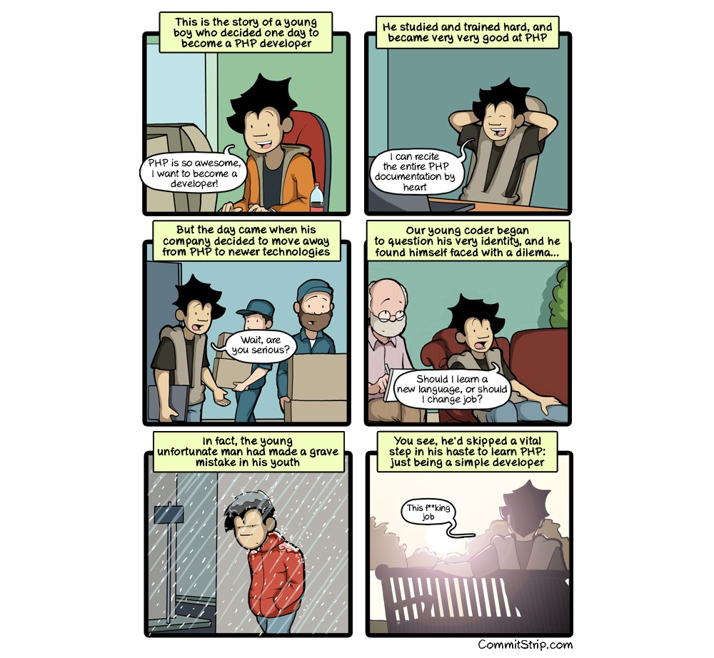

# About this Course

<!-- TODO: Needs a good update -->

Welcome to the course **Programming - From Base to Ace**. This course aims to guide you to become a good programmer by teaching you the core concepts required for object oriented programming. While the language used here is C#, any or most other OOP programming languages can be used in combination with this course.

The material is split into two courses:

* [Introduction to Programming](./introduction/README.md): learn about the core concepts of programming
* [Object Oriented Programming](./oop/README.md): learn about using objects, classes and how to create them yourselves

The GitHub repo of this course is available at [https://github.com/BioBoost/course_programming_from_base_to_ace](https://github.com/BioBoost/course_programming_from_base_to_ace). Feel free to contribute or report spelling errors, unclear explanations or others concerns/ideas.

## Requirements

To follow along you will at least need to install Visual Studio (Community edition is fine) and git. You can find a tutorial for the installation of both in the [Software Installation Guide @ http://software-installation-guide.netlify.app/](http://software-installation-guide.netlify.app/).

## About this course

This course is not about learning to use all sorts of tools or fancy integrated development environments (IDEs). It's also not about learning to manage projects or design methodologies.

The main focus lies in learning to think in an object oriented way and in the meantime learn some object oriented languages. While learning all these great things about objects we are not responsible for the fact that you might learn a thing or two about tools and project management.

### Keep Learning

Most of the ideas, knowledge and understanding is achieved by reading books, tutorials and watching YouTube videos. It can only be encouraged to read books and broaden your horizon. Challenge yourself and others with your newly acquired knowledge.

But don't only become book-smart. Also become do-smart. Make exercises, solve problems, create programs, beat challenges, test new things, ... You cannot become a programmer without actually programming yourself.

### Theory

While all you need to know for the exam is in this course, not all you should know is in here. **It is extremely preferable to take notes in the lessons.** And of course you are also encouraged to search the Internet and books for extra knowledge.

Feel free to ask questions in the lessons, via email or via Slack @ [https://eo-ict-vives.slack.com](https://eo-ict-vives.slack.com).

### LABs, assignments and tests

The LABs are there to practice what you have learned in the lessons. You will get some assignments through the semester on which you will be graded.

This course also contains extra exercises to practice your skills in C#.

There may be occasions for tests but these will mostly be announced.

### ECTS

For the exact details on the LABs, exams and tests you should take a look at the ECTS fiche of this course which can be found via [http://onderwijsaanbod.vives-noord.be/syllabi/n/B3N066N.htm#activetab=doelstellingen_idp13827904](http://onderwijsaanbod.vives-noord.be/syllabi/n/B3N066N.htm#activetab=doelstellingen_idp13827904) for Introduction to Programming and via [http://onderwijsaanbod.vives-noord.be/syllabi/n/B3N005N.htm#activetab=doelstellingen_idm2920400](http://onderwijsaanbod.vives-noord.be/syllabi/n/B3N005N.htm#activetab=doelstellingen_idm2920400) for Object Oriented Programming 1.

## Extra practice

While this course does contain a lot of exercises and things to try, you are encouraged to find extra practice or inspiration on the Internet. A good source is [https://www.sololearn.com/](https://www.sololearn.com/). SoloLearn has a large collection of FREE code learning content, from beginner to pro! Choose from thousands of programming topics to learn coding. They also host a heap of challenges. While most solutions are also available they have not been checked and approved by the teacher of this course. Be critical about the solutions and try to apply the things you have learned in this course.

## License

 This work is licensed under a <a rel="license" href="http://creativecommons.org/licenses/by-sa/4.0/">Creative Commons Attribution-ShareAlike 4.0 International License</a>.
