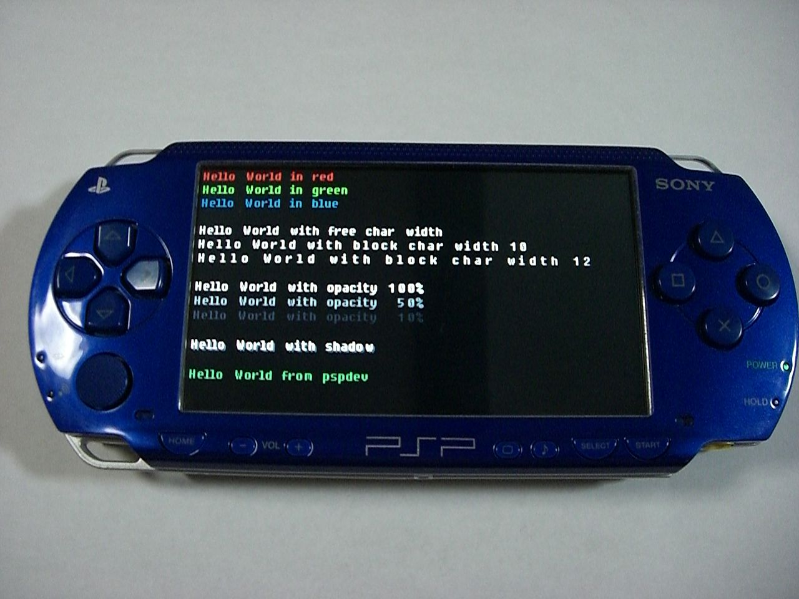
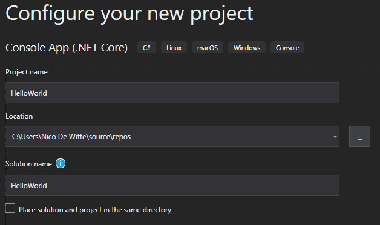

# Chapter 03 - Starting in C#

<!-- TODO
Maybe some general things about C#? -->

## Hello World

A "Hello World!" program is a computer program that outputs or displays "Hello World!" to the user. Being a **very simple program** in most programming languages, it is often used to **illustrate the basic syntax of a programming language** for a working program. It is often the very first program people write when they are new to the language.


A "Hello world!" program is often used to **introduce novice programmers to a programming language**. In general, it is simple enough to be understood easily, especially with the guidance of a teacher or a written guide.

In addition, "Hello world!" can be a **useful sanity test** to make sure that a language's compiler, development environment, and run-time environment are correctly installed. Configuring a complete programming toolchain from scratch to the point where even trivial programs can be compiled and run can involve substantial amounts of work. For this reason, a simple program is used first when testing a new toolchain.

"Hello world!" is also used by computer hackers as a **proof of concept** that arbitrary code can be executed through an exploit where the system designers did not intend code to be executed - for example, on Sony's PlayStation Portable. This is the first step in using homemade content ("home brew") on such a device.



## Hello World in C#

Let's jump right in and create a "Hello World" application in C#.

::: warning Naming Things
Naming things correctly is one of the main responsibilities of a programmer. By giving things (applications, variables, methods, ...) decent names, you will make your own life and that of fellow programmers a lot easier.
:::

Open Visual Studio and create a new project of the type `Console Application (.NET Core)`. Give it a sensible name such as `HelloWorld`.



::: tip Console Applications
When developing applications a choice must be made between a GUI and a console application. As discussed earlier, a console application has no real graphical user interface and interacts with the user via the terminal (console). The default options for input and output are essentially text. This course will first focus on console applications after which it will introduce WPF allowing the creation of graphical applications.
:::

Once the wizard is finished it will automatically generate a basic "Hello World" application with the code shown below.

```csharp
using System;

namespace HelloWorld
{
    class Program
    {
        static void Main(string[] args)
        {
            Console.WriteLine("Hello World!");
        }
    }
}
```

Starting the application can be achieved by navigating to `Debug => Start Debugging` or by pressing `F5`. This will open a terminal windows and output the text `Hello World!` as shown below.

```text
Hello World!

C:\Program Files\dotnet\dotnet.exe (process 12088) exited with code 0.
To automatically close the console when debugging stops,
enable Tools->Options->Debugging->Automatically close the console when debugging stops.
Press any key to close this window . . .
```

Notice that the application terminates after outputting the text to the terminal. The window of the terminal stays open for our convenience, so the developer can see what was outputted to the terminal. The terminal can be closed by pressing a key on your keyboard.

While not diving into many details here, there are however a couple of things which can be clarified about the code above.
