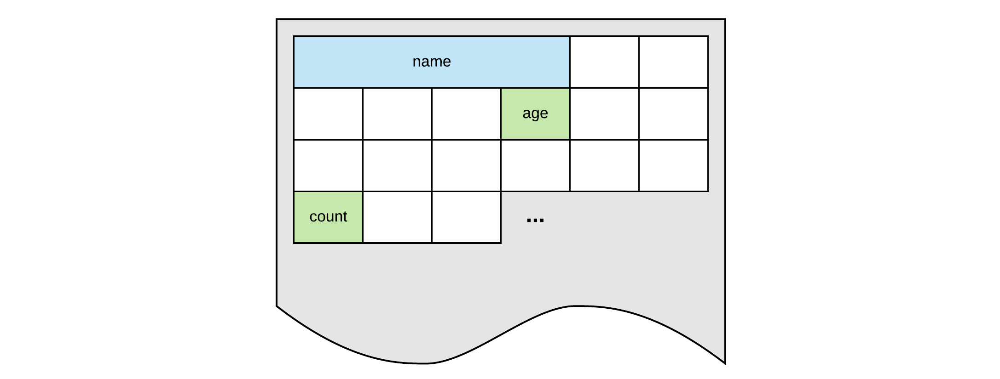

# Chapter 04 - Storing and Processing Data

The programs that we create need to store all sorts of data. From basic information such as numbers, characters and strings to complex data types that a programmer can define for himself.

| Type | Examples | Description |
| --- | --- | --- |
| integer numbers | `123`, `-12`, `0` | This is the set of all whole numbers plus all the negatives of the natural numbers. |
| floating point numbers | `0.323`, `-15.0`, `0.0001` | This includes all numbers that can be written as a decimal. |
| characters | `'a'`, `'Z'`, `'$'`, `'\n'` | Single unicode characters that are used to represent most of the written languages throughout the world. |
| strings | `"Hello World"`, `"Nico De Witte"`, `"X"` | A sequential collection of characters that represent a text. |

::: tip Representations
Note that integer numbers are written without a point, while floating point numbers are represented with a decimal point `.` (not a comma). Single characters are always placed between single quotes `'` while strings are placed between double quotes `"`.
:::

This data is read, stored, manipulated and outputted through the application. The data itself is stored inside the memory of the computer or system the program is running on. Inside the application one does not need to access the memory directly, for this the programmer can make use of variables.

## Variables

A variable is a **symbolic name** associated with a memory location that stores the actual data which may be changed through the variable. The variable's name should represent what information the variable references. They are called variables because they represent **information that can change**.

Computer memory can be thought of a huge cabinet with millions of small drawers. The content of the drawers is the information stored in memory that we use inside our application. While it is perfectly possible to refer to a drawer using its location (for example second row, third column), it is a lot harder to remember. There is also no link between the location and the actual content of the drawer. Now if we place a label on the drawer that is descriptive enough of its content, which is the analogy of our **variable name**, it is much easier to refer to the drawer using the descriptive name (for example `count`, `age`, `name`).



Something to be aware of is that every memory cell in a computer has the same fixed size (expressed in a number of bytes) depending on the hardware architecture of that system. However, the data that is stored may be bigger than the size of single memory cell. Take for example a piece of text or a floating point number.

Basically as a programmer you need to tell the computer what type of data you wish to store in memory. This will inform the compiler how much memory is required. This can be achieved by specifying what is called the **datatype of the variable**.

Both the datatype and the name of variable are specified when the variable is **declared**.

## Declaring a Variable

Before a variable can be used inside an application, it needs be **declared**. Declaring a variable can be thought of as stating to the C# compiler that is needs to request memory for data and make it accessible using a symbolic **variable name**. Because the C# compiler needs to know how much memory to set aside, you as a programmer need to specify what **type of data** the variable will hold.

The type of the variable determines the size and layout of the variable's memory; the range of values that can be stored within that memory; and the set of operations that can be applied to the variable.

Once you provided the type and name, the variable can be used to store data.

Take a look at the following example where a variable stores the age of a person. In this case a variable can be declared of an **integral type**. In C# the data type is `int` (integer) for this, which can store **whole signed numbers**.

```csharp{5}
static void Main(string[] args)
{
  // Declaring a variable of type integer
  // and make it accessible using the symbolic name ageOfPerson
  int ageOfPerson;

  // Assign a value to the variable
  ageOfPerson = 33;

  // The variable name can also be used to retrieve the data
  Console.WriteLine("I am " + ageOfPerson + " years old ");
  Console.WriteLine("and I am a teacher at VIVES University");
}
```

The data referred to by the variable can be changed using the **assignment operator** `=`. This is basically the same as in math. On the left hand side you have the variable which you want to assign and on the right hand side the value.

When you wish to use the content of the variable, all you need to do is state the symbolic name where you would otherwise use a value.

This also means that one variable can be used to assign a value to another.

```csharp{7}
static void Main(string[] args)
{
  int numberOfStudents;
  numberOfStudents = 36;

  int numberOfEmailAddresses;
  numberOfEmailAddresses = numberOfStudents;

  Console.WriteLine("We have " + numberOfStudents + " students"
    + " meaning we also have "
    + numberOfEmailAddresses + " email addresses");
}
```

::: tip Splitting Lines of Text
Note how the long string can be split up by concatenating it using the `+` operator. The same could of been achieved using multiple `Console.Write()` statements, but it would of been more work to type.
:::

### Declaration is Mandatory

**In C#, a variable always needs to be declared** (created by stating a type and name) before it can be used. The following code is therefore flawed and will not run. Try it for yourself.

```csharp
static void Main(string[] args)
{
  // Trying to assign a value to an undeclared variable
  ageOfPerson = 33;

  // Trying to request a value from an undeclared variable
  Console.WriteLine("I am " + ageOfPerson + " years old.");
}
```

::: warning Declare a variable before using it
In C# you must declare a variable before it can be used. This is a rule for many programming languages but not for all. Some programming languages will automatically create variables as they are used.
:::

## Initializing a Variable

While the code below is working perfectly, you will not often see it being written like this by a more experienced programmer.

```csharp
static void Main(string[] args)
{
  int ageOfPerson;
  ageOfPerson = 33;
}
```

This because when a variable is declared, you can **immediately initialize it** with a value in a single line of code as shown below.

```csharp
public static void main(String[] args) {
  int ageOfPerson = 33;
}
```

The process of initialization is the act of **giving a variable a sensible value**. This is often done together with the declaration. Forgetting to initialize a variable can have severe consequences and create hard to track bugs. Luckily the C# compiler and Visual Studio will not allow you to use an uninitialized variable and throw the error `Use of unassigned local variable 'ageOfPerson'`. This safety net is not provided by all programming languages. For example C++ will allow you to use uninitialized variables. In this case their value is undetermined and often contains garbage data.

Try running the following code:

```csharp
static void Main(string[] args)
{
  int ageOfPerson;
  Console.WriteLine("I am " + ageOfPerson + " years old.");
}
```

Visual Studio will display squiggly lines below `ageOfPerson` and forcing to run this application will result in an error:


