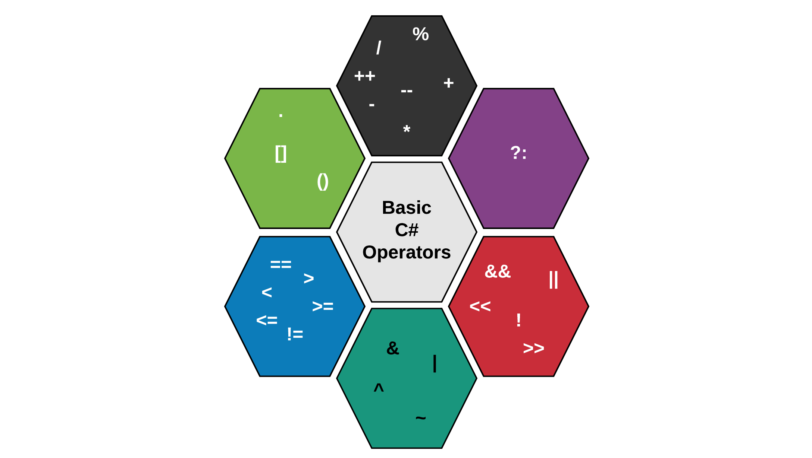

# Chapter 05 - Processing Data



Operators are symbolic representations of operations that can be applied to data. An operator tells the compiler to perform a specific mathematical, logical or relational operation on data and produce a single result.

The C# programming language supports many operators that allow the developer to manipulate the built-in data types. The main categories are:

* Arithmetic operators, which perform mathematical operations with numeric operands.
* Logical operators, which perform logical operations with the boolean operands.
* Relational operators, which allow comparison operations to be performed between all built-in data types.

This chapter will introduce the arithmetic operators. The other operators will be covered as needed.

## Arithmetic Operators

The C# programming language has quitte an extensive list of operators. Two operators have already been discussed, namely the assignment operator `=` and the string concatenation operator `+`.

The most basic operators are the arithmetic operators. They are easy to understand because they have the same functionality as in math. The following operators are available to do basic math operations:

* `+` Additive operator
* `-` Subtraction operator
* `*` Multiplication operator
* `/` Division operator
* `%` Remainder operator

::: warning ➕ Additive Operator
Take note that the additive operator uses the same symbol as the string concatenation operator. The symbol is interpreted by the compiler based on the context in which it is used. If either of the operands is a string, concatenation will be performed.
:::

The mathematical operators are part of the **binary operators** because they take **two operands**, namely a left and a right operator. For example in the summation below `L` is the left operand and `R` is the right operand. The result of the operation is stored in the variable `sum`.

```csharp
int R = 14;
int L = 12;

int result = L + R;     // result is now 26
```

The `+`, `-` and `*` operators function the same as in math. Their use can be seen in the following code example.

```csharp
int a = 2 + 3;      // a = 5
int b = a + 5;      // b = 10

int c = 6 * b;      // c = 60
int d = c - 120;    // d = -60
```

::: tip ▶️ Debug Mode
Feel free to run all the code examples in debug mode. This allows you to inspect each variable and operation. Place some breakpoints on the statements you wish to inspect.
:::

The division `/` and remainder `%` operators deserve some special attention.

### The Devision Operator

The division operator `/` has a different result based on the types of its left and right operand. If both are of an integral type (`short`, `int`, `byte`) then a whole division will be performed. Meaning that `3 / 2` will result in `1`. If either operand is a floating point operand (`float` or `double`) than the division operator will perform a real division: `3.0 / 2` will result in `1.5`.

If both operands are of integral type and you wish to perform a real division, you can always multiply one of the operands with `1.0` to explicitly convert it to a floating point number without having to change its actual data type. Take a look at the next example for a couple of use cases.

```csharp
int x = 5;
int y = 2;

int z = x / y;              // z = 2 (whole division)
double w = x / y;           // w = 2.0 (still whole division)
double q = 1.0 * x / y;     // w = 2.5 (real division)

double a = 3.0;
double b = 2;       // 2 will actually be converted to 2.0

double k = a / b;   // k = 1.5 (real division)
```

Notice that even `double w = x / y;` results in `2.0`. The reason behind this is that `x / y` equals to `2` as it is a whole division since both operands are of integral type. The result is then implicitly converted to a `double`, and stored in `w`.

### The Remainder Operator

The remainder (modulo) operator `%` calculates the remainder after dividing its left-hand operand by its right-hand operand.

```csharp
int x = 5;
int y = 2;

int q = x / y;    // q = 2 (whole division)
int r = x % y;    // r = 1 (remainder)
```

The sign of the non-zero remainder is the same as that of the left-hand operand.

| Example | Result |
| --- | --- |
| `3 % 2` | `1` |
| `3 % -2` | `1` |
| `-3 % 2` | `-1` |
| `-3 % -2` | `-1` |

The remainder operator is often used to let the value of an operation wrap around. A good analogy is the clock. If its `22:00`, `4 hours` later it will be `02:00`. This can be expressed in code as shown in the next code snippet.

```csharp
int hour = 22;

hour = (hour + 4) % 24;     // (22 + 4) = 26
                            // 26 % 24 = 2
```


### Increment and Decrement Operators

Incrementing `+1` and decrementing `-1` a variable is done very often in a programming language. It is one of the most used operations on integral values. It is a very common practice in loop-constructs as will become clear later in this course.

Because of this a shorter syntax has been introduced using an increment `++` or decrement `--` operator as shown in the next example.

```csharp
int i = 5;

i++;    // Same as writing i = i + 1;
i--;    // Same as writing i = i - 1;
```

There is however a caveat to keep in mind. Both operators come in a **suffix** (e.g. `i++`) and a **prefix** (e.g. `++i`) version. The end result of both versions is exactly the same, but there is a difference if you assign their value to another variable while using the increment or decrement operator.

Let us take a look at two examples. First we take a look at the prefix version. In this case the value of `i` will be incremented to `6` before its value is assigned to the variable `b`. Meaning at the end of this code both `i` and `b` will have a value of `6`.

```csharp
int i = 5;
int b = ++i;
```

Next we take a look at the suffix version. In this case the value of `i` will first be assigned to `b` before it is incremented. This results in a `b` having a value of `5` and `i` having a value of `6` at the end of the example.

```csharp
int i = 5;
int b = i++;
```

While this may not seem all that important at the moment we will require to know this once we start to work with arrays (lists).

## Compound Operators

Programmers are very lazy creatures that are always looking for ways to make their life's easier. That is why the compound operators were invented. They are a way to write shorter mathematical operations on the same variable as the result should be stored in.

```csharp
int x = 5;

x += 4;   // Same as writing x = x + 4;
x -= 4;   // Same as writing x = x - 4;
x *= 4;   // Same as writing x = x * 4;
x /= 4;   // Same as writing x = x / 4;
x %= 4;   // Same as writing x = x % 4;
```

Most operators (even non-arithmetical) have a shorter compound-operator representation.

## Operator Precedence

While the precedence (order) in which mathematical operations are performed is defined in C#, most programmers do not know all of them by heart. It is much more clear and simpler to use parentheses `()` to enforce the precedence of calculations.

Consider the following code example:

```csharp
int a = 5;
int b = 6;
int c = 10;
int d = 2;

int result = a * b + c - d * a / 5 - 3;     // result = 35

Console.WriteLine("The result is " + result);
```

::: codeoutput
<pre>
The result is 35
</pre>
:::

Would you have known that the result is `35`? By using parentheses this becomes much clearer and the chance of making a mistake is a lot smaller.

```csharp
int a = 5;
int b = 6;
int c = 10;
int d = 2;

int result = (a * b) + c - (d * a / 5) - 3;     // result = 35

Console.WriteLine("The result is " + result);
```

::: codeoutput
<pre>
The result is 35
</pre>
:::

More info on operator precedence and associativity can be found at [https://docs.microsoft.com/en-us/dotnet/csharp/language-reference/operators/](https://docs.microsoft.com/en-us/dotnet/csharp/language-reference/operators/).

## Train Yourself

### Multiple Choice

1. What has the same result as `counter++`?

    * `counter += 2;`
    * `counter += counter + 1;`
    * `counter = counter + 2;`
    * `counter = counter + 1;`

2. What is the result of `89 % 4`?

    * `1`
    * `2`
    * `4`
    * `5`

3. What is the result of `number` after `int number = 7.0 / 2.0;`?

    * `3.5`
    * `3.0`
    * `3`
    * `4`

4. What is the result of `11 / 5`?

    * `0`
    * `1`
    * `2`
    * `3`

5. What is the result of `83 % 4`?

    * `0`
    * `1`
    * `2`
    * `3`

6. What is the resulting value in `q`?

    ```java
    int x = 5;
    int y = 2;
    double q = (double) x / y;
    ```

    * `2`
    * `2.0`
    * `2.5`
    * `3`

7. Why are the operators `+`, `-`, `*`, `/`, ... called binary operators?

    * Because they are also applicable on binary numbers
    * Because they operandi are represented as binary numbers internally
    * Because they require two operandi
    * Because they exist in two versions, a prefix notation and postfix notation

8. Which of the following code blocks makes use of compound operators?

    ```csharp
    // Code block A
    int x = ( 25 / 3 ) * (15 % 4);
    ```

    ```csharp
    // Code block B
    int z = 0;
    for (int i = 0; i < 5; i++) {
      int y = i + 5;
      z++;
    }
    ```

    ```csharp
    // Code block C
    double vatPercent = 21;
    double priceTag = 55;
    double vat = priceTag * vatPercent / 100;
    ```

    ```csharp
    // Code block D
    int x = 32;
    int y = 88;

    while (x <= 1000) {
      x += 5;
    }
    ```

    * Code block A
    * Code block B
    * Code block C
    * Code block D

9. Which of the following code snippets will not result in the value of `b` incrementing with `1`?

    * Snippet A

    ```csharp
    int x = 15;
    int b = 3;
    x = b++;
    ```

    * Snippet B

    ```csharp
    int x = 15;
    int b = 3;
    x += (++b);
    ```

    * Snippet C

    ```csharp
    int x = 15;
    int b = 3;
    x = (b + 1);
    ```

    * Snippet D

    ```csharp
    int x = 15;
    int b = 3;
    b += 1;
    ```

### Exercises and Challenges

Checkout the exercises and challenges which can be found at [https://github.com/BioBoost/csharp_practical](https://github.com/BioBoost/csharp_practical).
