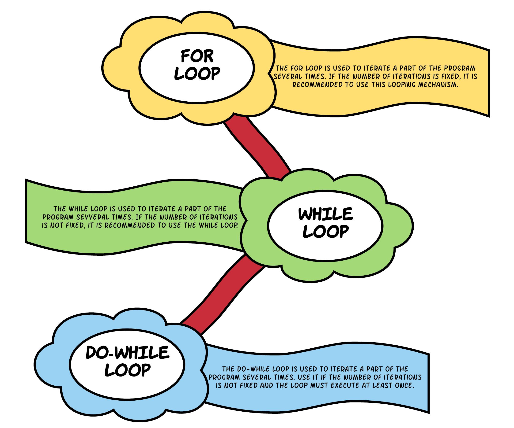
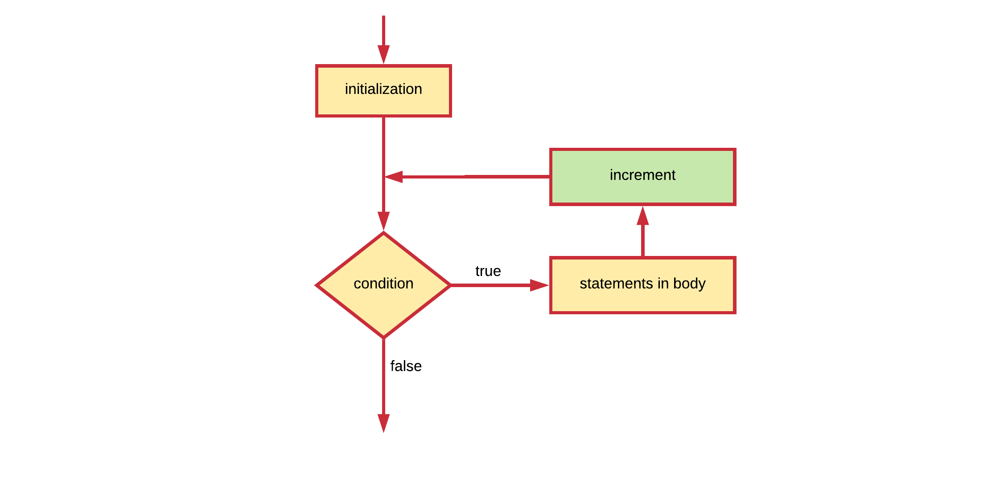
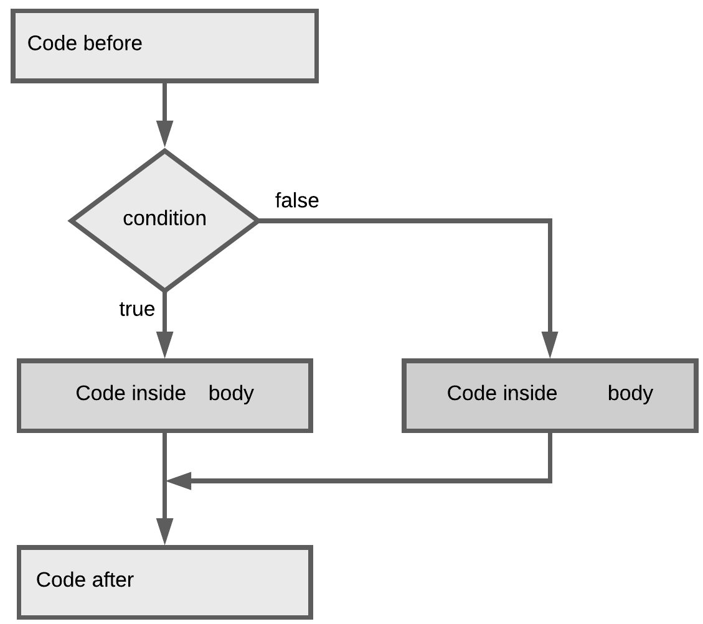

# Chapter 09 - Iterating



In general, **statements are executed sequentially**: The first statement in a block is executed first, followed by the second, and so on. These **statements are also only executed once by default**. There may however be situations where you need to execute a block of code several number of times.

Programming languages provide various structures that allow you to **loop a block of statements**. The C# programming language provides the following types of loops to handle looping requirements:

* a **for loop**: Execute a code block multiple times and simplify the code that manages the loop variable. Typically used if the **number of iterations is fixed**.
* a **while loop**: Repeats a code block while a given condition is `true`. It **tests the condition before executing the body of the loop**, meaning that it **may never execute** if the condition is not satisfied from the beginning.
* a **do-while loop**: Like a while loop, except that it **tests the condition at the end of the loop body**. This effectively means that the body of the loop will **execute at least once**.

:::tip Iteration
A single execution of the loop body is called an iteration.
:::

## The for loop

Basically a for loop is most often used when the number of **iterations is pre-determined**.

Some typical usage examples are:

* execute some code a specific number of times - for example: a countdown timer from 10 to 0.
* iterate a list of items - for example: determine the biggest number in a list

The for loop adheres to the following construction template:

```csharp
for (initialization ; condition ; increment)
{
  // This is called the body of the for loop
  // It contains the statements that need to be executed every iteration
}
```

* The **initialization** statement is executed only once before the loop mechanism is started. It is often used to initialize an iteration variable.
* The **condition** is checked before each iteration and will determine if the code block is executed (in case the condition resolves to `true`) or not (in case the condition resolves to `false`).
* The **increment** statement is invoked after each iteration through the loop. Most often this statement is used to increment or decrement a condition variable.

The next flowchart models the basic structure of a for loop.



Each of these can be left empty. For example an endless loop can be written as:

```csharp
for ( ; ; )
{
  // Do something forever
}
```

Let's see the most basic example possible. A for loop construct that outputs the text `"Hello World"` 5 times to the terminal.

```csharp
for (int i = 0; i < 5; i++)
{
  Console.WriteLine("Hello World");
}
```

:::codeoutput
<pre>
Hello World
Hello World
Hello World
Hello World
Hello World
</pre>
:::

In the example above the initialization step is used to create a local variable `i` which serves as an **iteration counter**. Next the condition is checked and the text is outputted to the terminal. Next `i` is incremented (1 is added). Before the next iteration the value of `i` is checked in the condition and the loop continues.

:::tip ℹ️ Incrementing
Note that the *increment* part can also be written `i = i + 1` or `i += 1` but most often the increment operator is used as it is shorter. This also implies that it is perfectly possible to increase the iteration counter by an arbitrary number. For example by 2: `i += 2`. This is perfectly legal.
:::

The final iteration happens when `i` was incremented to 4. The loop is executed a last time and the value of `i` is incremented a last time to 5. Next the condition is checked but not met. The loop is **terminated** and **execution jumps after the for loop**.

Want to see the values of i? Use the following code:

```csharp
for (int i = 0; i < 5; i++)
{
  Console.WriteLine(i + ": Hello World");
}
```

:::codeoutput
<pre>
0: Hello World
1: Hello World
2: Hello World
3: Hello World
4: Hello World
</pre>
:::

Important to note is that the variable `i` used here has what is called **local scope**. This means that it only exists in the for loop. If you wish to know the last value of `i` you can create a variable before the for loop and skip the initialization step in the for loop header. The code below shows an example of this. Do note that you still need to add a semicolon in the for loop header to separate the initialization from the condition part.

```csharp
int i = 0;
Console.WriteLine("i = " + i + " before for loop");
for (; i < 5; i++)
{
  Console.WriteLine(i + ": Hello World");
}
Console.WriteLine("i = " + i + " after for loop");
```

:::codeoutput
<pre>
i = 0 before for loop
0: Hello World
1: Hello World
2: Hello World
3: Hello World
4: Hello World
i = 5 after for loop
</pre>
:::

## The while loop

A while loop statement in the C# programming language **repeatedly executes a statement block** as long as a given condition is `true`. The condition is **checked before the code block is executed**. This means that the code block of the while loop may not even run at all if the condition is not met from the beginning.

The while loop adheres to the following construction template:

```csharp
while (condition)
{
  // Code block
}
```

This can also be translated into the next flow chart.


Below is an example application that rolls a die (randomly generated number) and adds it to a total sum. This is repeated as long as the sum is lower than the requested total from the user.

```csharp
static void Main(string[] args)
{
  Console.WriteLine("Welcome to the die thrower app.");

  Console.Write("What is the total number you are looking for? ");
  int total = Convert.ToInt32(Console.ReadLine());

  // Generate random die throws
  Random generator = new Random();
  int thrownTotal = 0;
  while (thrownTotal < total)
  {
    int dieThrow = generator.Next(1, 4);    // [1,3]
    Console.WriteLine($"Throwing {dieThrow}");
    thrownTotal += dieThrow;
  }

  // Check if total is reached or too much
  if (thrownTotal == total)
  {
    Console.WriteLine("Perfect match");
  } else
  {
    Console.WriteLine($"Sorry, overshot it, total = {thrownTotal}");
  }
}
```

:::codeoutput
<pre>
Welcome to the die thrower app.
What is the total number you are looking for? 9
Throwing 3
Throwing 1
Throwing 1
Throwing 1
Throwing 3
Perfect match
</pre>
:::

Now notice that if the user inputs `0` (or a negative number for that fact) as the total number, the body of the while loop is never executed (as the condition evaluates to `false` in that case) and execution jumps directly after the while loop.

:::codeoutput
<pre>
Welcome to the die thrower app.
What is the total number you are looking for? 0
Perfect match
</pre>
:::

## The do while loop

A do while loop is used when the code block (body of the loop) needs to be **executed at least once**. **After the first iteration the condition is checked** which determines if the code block should be executed again or not.

The do-while loop adheres to the following construction template:

```csharp
do
{
  // Code block
} while (condition);
```

Note that after the closing parentheses `)` of a condition, a **semicolon** `;` is required.

The matching representation for a do while is shown in the next flowchart.


The next code example requests the user to input a strict positive integral value. If the user inputs a number equal or lower than 0, the question is asked again. If the user inputs a correct positive number, the loop is terminated. This construct can be used to check user input and make sure the user inputs a value in the requested range.

```csharp
static void Main(string[] args)
{
  int number = 0;
  do
  {
    Console.Write("Please enter a positive number: ");
    number = Convert.ToInt32(Console.ReadLine());
  } while (number <= 0);

  Console.WriteLine("\nYou entered the value " + number);
}
```

:::codeoutput
<pre>
Please enter a positive number: -12
Please enter a positive number: -554
Please enter a positive number: 0
Please enter a positive number: 112

You entered the value 112
</pre>
:::

For the `number` variable to be accessible inside the condition (between the parentheses `()`) and also after the loop construct, it must be declared before the loop construct.

Consider another example where the user is asked to enter values that are added to a total sum. The summing process continues as long as the user keeps entering values different from `0`.

```csharp
static void Main(string[] args)
{
  Console.WriteLine("Welcome to summator - the place for all your summings.\n");

  int sum = 0;   // Initialize sum 0 !
  int number = 0;

  do
  {
    Console.Write("Please enter a number to add to sum (0 to quit): ");
    number = Convert.ToInt32(Console.ReadLine());
    sum += number;      // Add number to sum
  } while (number != 0);

  Console.WriteLine("\nThe sum of all these numbers is " + sum + ".");
}
```

:::codeoutput
<pre>
Welcome to summator - the place for all your summings.

Please enter a number to add to sum (0 to quit): 12
Please enter a number to add to sum (0 to quit): 33
Please enter a number to add to sum (0 to quit): -12
Please enter a number to add to sum (0 to quit): 45
Please enter a number to add to sum (0 to quit): 99
Please enter a number to add to sum (0 to quit): 0

The sum of all these numbers is 177.
</pre>
:::

## Nesting control structures

Each of the control structures (if, for, while, do-while, switch, ...) discussed in the previous sections can actually be nested. This means that we can place a loop inside an if code block, an if inside another if or a loop inside another loop.

Take a close look at the code below where the user is asked to input positive and negative integers. By setting the condition of the do-while loop to `number != 0`, the loop iterates until the user enters `0`. Each retrieved number is then added to a `totalPositive` or `totalNegative` based on whether it's greater or less than zero. If the condition for the do while is not met anymore (user enters `0`), the loop finishes and the results are shown to the user.

```csharp
static void Main(string[] args)
{
  Console.WriteLine("Welcome to the app that can sum positive " +
    "and negative numbers\n");

  int totalPositive = 0;
  int totalNegative = 0;
  int number = 0;

  do
  {
    Console.Write("Please enter a positive or negative integer [0 to stop]: ");
    number = Convert.ToInt32(Console.ReadLine());

    if (number < 0)
    {
      totalNegative += number;
    }
    else
    {
      totalPositive += number;
    }
  } while (number != 0);

  Console.WriteLine("\nTotal Positive: " + totalPositive);
  Console.WriteLine("Total Negative: " + totalNegative);
}
```

:::codeoutput
<pre>
Welcome to the app that can sum positive and negative numbers

Please enter a positive or negative integer [0 to stop]: 12
Please enter a positive or negative integer [0 to stop]: -90
Please enter a positive or negative integer [0 to stop]: 33
Please enter a positive or negative integer [0 to stop]: -44
Please enter a positive or negative integer [0 to stop]: -2
Please enter a positive or negative integer [0 to stop]: 9
Please enter a positive or negative integer [0 to stop]: 0

Total Positive: 54
Total Negative: -136
</pre>
:::

The previous example shows how an if-else construct can be nested inside a while loop. While the number of times you can nest a structure inside another is not directly limited it should be kept to a minimum. The deeper structures get nested the more complex your code starts to become.

## Which to use when

All for loops can be written as while loops, and vice-versa. Just use whichever loop seems more appropriate to the task at hand. In general, you should use a for loop when you know how many times the loop should run. If you want the loop to break based on a condition other than the number of times it runs, you should use a while or a do-while loop.

## Train Yourself

### Multiple Choice

1. What type of loop should we use to request `10` numbers from the user as input?

    * A while loop
    * A for loop
    * A do while loop
    * You do not need a loop for this

2. What type of loop is depicted below?

    

    * A while loop
    * A for loop
    * A do while loop
    * This is not a loop

3. How do we call the part `int i = 0` in the code snippet below?

    ```csharp
    for (int i = 0; i < 10; i++) {
      Console.WriteLine("Hello");
    }
    ```

    * The increment step
    * The initialization
    * The conditional check
    * The iteration

4. You wish to generate random numbers until you reach a number that is divisible by 9. What type of loop statement would your require for this?

    * A do while loop
    * A for loop
    * A while loop
    * You do not need a loop for this

5. What is the output of the following code snippet?

    ```csharp
    for (int i = 0; i < 10; i+=3) {
      Console.Write(i + " ");
    }
    ```

    * `0 1 2 3 4 5 6 7 8 9`
    * `0 3 6 9 12`
    * `0 3 6 9`
    * `3 6 9`

6. This is a(n) ...

    ```csharp
    while (true)
    {
      // Do something
    }
    ```

    * endless loop
    * bug
    * syntax error
    * a loop that will never execute

7. To what does the output of this code snippet refer?

    ```csharp
    for (int i = 1; i < 8; i++)
    {
      if (i % 7 == 0)
      {
        Console.Write(" ... Ba");
      }
      else
      {
        Console.Write("NaN");
      }
    }
    if (5 * 5 >= 25)
    {
      Console.Write("tm");
    }
    Console.WriteLine("an");
    ```

    * Something important that happened in Belgium
    * A song of *Samson en Gert*
    * The history of the Internet
    * A movie

8. What is the last value of `i` that will be outputted to the terminal?

    ```csharp
    int i = 0;
    do
    {
      Console.WriteLine("i = " + i);
      i += 5;
    } while (i < 88);
    ```

    * `0`
    * `85`
    * `88`
    * `90`

9. Which construct is preferred in the following situation?

    > I wish to read a file line by line and stop at the first line that starts with the word `"The"`.

    * A for loop
    * A while loop
    * A foreach loop (enhanced for loop)
    * A switch case

10. What is the output of the following piece of code?

    ```csharp
    int i = 0;
    Console.WriteLine("i = " + i + " before for loop");
    for (; i < 3; i++)
    {
      Console.WriteLine(i + ": Hello");
    }
    Console.WriteLine("i = " + i + " after for loop");
    ```

    * Option A:

    ```text
    i = 0 before for loop
    0: Hello
    1: Hello
    2: Hello
    i = 3 after for loop
    ```

    * Option B:

    ```text
    i = 0 before for loop
    0: Hello
    1: Hello
    2: Hello
    i = 2 after for loop
    ```

    * Option C:

    ```text
    i = 0 before for loop
    0: Hello
    1: Hello
    2: Hello
    3: Hello
    i = 3 after for loop
    ```

    * None of the above

11. What is the problem with the code below?

    ```csharp
    static void Main(string[] args)
    {
      for (int i = 0; i < 5; i++)
      {
        Console.Write("Please enter number: ");
        int number = Convert.ToInt32(Console.ReadLine());
        sum += number;
      }

      Console.WriteLine("\nTotal = " + sum);
    }
    ```

    * A variable that was not declared
    * A syntax error
    * An uninitialized variable
    * An incorrect datatype for the variable

12. What construction is depicted below?

    

    * A for loop
    * A while loop
    * An if statement
    * An if-else statement

13. Take the code construct below as a reference. In what order are the different parts of a for-loop executed/evaluated?

    ```csharp
    for (<Initialization>; <Condition>; <Increment>)
    {
      // <Code block>
    }
    ```

    * Option A

    ```text
    (1) Initialization
    (2) Condition
    (3) Code block
    (4) Increment
    ```

    * Option B

    ```text
    (1) Initialization
    (2) Code block
    (3) Increment
    (4) Condition
    ```

    * Option C

    ```text
    (1) Initialization
    (2) Condition
    (3) Increment
    (4) Code block
    ```

    * Option D

    ```text
    (1) Initialization
    (2) Increment
    (3) Code block
    (4) Condition
    ```

14. What condition is required (in place of `<condition_here>`) to get a list of all even numbers between 0 (inclusive) and 100 (exclusive)?

    ```csharp
    Console.WriteLine("All even numbers between 0 and 100: ");
    for (int i = 0; i < 100; i++) {
        if (<condition_here>) {
            Console.WriteLine(i + " ");
        }
    }
    ```

    * `i / 2 == 0`
    * `i * 2 == 0`
    * `i - 2 == i + 2`
    * `i % 2 == 0`

### Exercises and Challenges

Checkout the exercises and challenges which can be found at [https://github.com/BioBoost/csharp_practical](https://github.com/BioBoost/csharp_practical).
