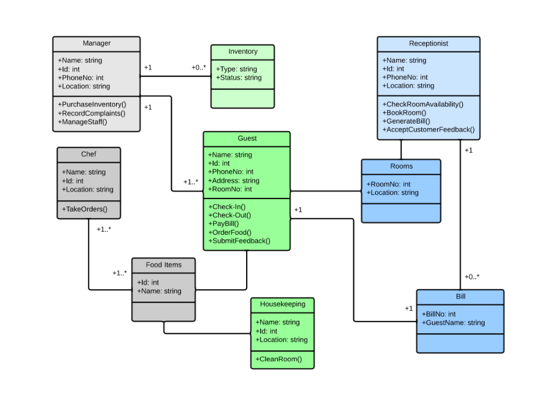

# Chapter 03 - Defining Custom Classes

Creating custom classes is one of the main responsibilities of an object oriented programmer. As stated before, an application is a collection of objects that interact with each other. These objects are created based on a class developed by a programmer. If we wish to implement some functionality that is not yet available in the language or it is not exactly what we need, we are required to build it ourselves.

<!-- Luckily even if a class is not readily available for us, we will be able to reuse other classes which contain a partial functionality of the class we which to create. -->

It's natural to think of **objects as collections of other objects**. Think about a television which contains a tuner, a screen, a power supply, an embedded system, ... We say that a television object is **composed** of these other objects. Luckily this same concept is available to us in an object oriented programming language. We can also create objects by bundling other objects. This has the big advantage that we can use objects from classes that someone else made or are part of the language libraries. This saves us a lot of time and effort. This sort of code reuse is one of the major advantages of object oriented languages.

## UML Class Diagrams

When creating an application it can often be useful to put some diagrams on paper on how you are going to take on the problem. One of the most used diagrams in the world of object oriented programming is the UML (Unified Modeling Language) class diagram.

UML is a general-purpose, modeling language in the field of software engineering, that is intended to provide a standard way to visualize the design of a system.

A class diagram is a static diagram that describes the attributes and methods of a class and the also the relationships between the different classes in an application. Class diagrams are widely used in the modeling of object oriented systems because they are the only UML diagrams, which can be mapped directly with object-oriented languages.

While methods can be made private, often these are omitted from the UML diagram. This is often the case because most programmers find them cluttering the class diagram and they are often created as needed and not important for the outside user.

When modeling software it's normal that not all details are available from the start. For example the type of the attributes should also be documented in the UML diagram, as are the arguments and return types of the methods. However sometimes those details haven't been decided yet. In that case we just leave them out and add them later.

As an example take a look at the UML class diagram of a Hotel Management System below.



<!-- Another example would be nice. Maybe something with IoT -->

Even if your are not an experienced programmer yet, you should be able to understand the concept of the application (not the details, only the general idea) just by looking at the diagram. If that is the case, its usefulness has just been proven.

## Creating a Class

When creating custom classes in Java it is convention to place the whole class and nothing but the class inside its own Java file. In NetBeans this can be achieved by traversing to `File => New File => Java => Java Class`.

Consider a class that represents a simple lightbulb in your house. The class is called `LightBulb` because the convention in Java for class names is that they should be named using **Pascal Case**.

::: tip Pascal Case and camel Case
Pascal case is a subset of Camel Case where the first letter is capitalized. That is, userAccount is a camel case and UserAccount is a Pascal case. In Java the convention is that methods names are camel cased while class names are Pascal cased. It is easy to remember. Pascal is a proper noun so capitalize the first letter, while camel is a common noun, so you do not capitalize the first letter.
:::

::: tip snake_case
Snake case (or snake_case) is the practice of writing compound words or phrases in which the elements are separated with one underscore character `_` and no spaces, with each element's initial letter usually lowercased within the compound and the first letter either upper or lower case - as in "foo_bar" and "Hello_world".
:::

```java
package javalightbulbapplication;

public class LightBulb {

}
```

The first line of code states the name of the package to which the class belongs. This allows a programmer to bundle classes together that logically belong together.

> **INFO** - **Packages**
>
> A Java package organizes Java classes into namespaces, providing a unique namespace for each type it contains. Classes in the same package can access each other's package-private and protected members. Java packages can be stored in compressed files called JAR files, allowing classes to be downloaded faster as groups rather than individually. A package allows a developer to group classes (and interfaces) together. These classes will all be related in some way – they might all have to do with a specific application or perform a specific set of tasks. Programmers also typically use packages to organize classes belonging to the same category or providing similar functionality.

Notice the `public` keyword which is called an **access modifier**. An access modifier is a special Java keyword that states **who can access the specified resource**. Access modifiers can be applied to classes, attributes and methods. Java allows a programmer to choose from the following access modifiers when declaring a class:

* The **default Java access modifier**, which is declared **by not writing any access modifier at all**. This means that class can only be used by other resources included in the same package. This is why it is also often referred to as package access.
* `public`, meaning that any other resource can make use of this class.

### UML Class Diagram of LightBulb

In its current state the `LightBulb` class can be visualized using the class diagram shown below.


The class shape in a class diagram consists of a rectangle with three rows. The top row contains the **name of the class**, the middle row contains the **attributes of the class** (the data of the objects), and the bottom section expresses the **methods and/or constructors** (the behavior) that the class has. In a class diagram, classes and subclasses are grouped together to show the relationship between objects of these classes.

## Creating Objects

To create objects from the `LightBulb` class one just needs to follow the object creation syntax:

```java
ClassName variableName = new ClassName();
```

With this a new object will be created of the class and a reference to it will be stored inside of the variable.

Consider the example shown below for the `LightBulb` class. Here a new instance of the class is requested using the `new` keyword and a reference to it is stored inside of a variable called `kitchen`.

```java
public static void main(String[] args) {
  // Creating a LightBulb object and storing its reference inside a variable
  LightBulb kitchen = new LightBulb();
}
```

Notice the similarity with creating an object of the class `Random` or `Scanner`.

For the moment this is all the functionality that LightBulb has. Not much use for us like this.

## Adding Data

Attributes hold the information and properties required by the object. They define the **data** that the object is holding or the state that it is in. Attributes are very similar to the variables that we already know. That is why attributes are also often referred to as **instance variables**, meaning variables of a class instance (aka object).

Just as variables, attributes can be of any primitive data type or they can contain references to other objects. They also need a name which allows them to be used inside the methods of the objects.

Remember that Java knows the following primitive types:


Different from a normal local variable, an attribute also requires an **access modifier** to specify who can access the attribute. This can be any of the following:

* `public`: anyone can access the attribute - depicted with a plus sign `+` in UML.
* The default Java access modifier, which is declared by not writing any access modifier at all. This means that attribute can only be used by other classes included in the same package. This is why it is also often referred to as package access. There is no equivalent sign in UML for this (leave empty).
* `protected`: only the class itself or classes derived from this class can access the attributes - depicted with a hashtag `#` in UML. More on this later.
* `private`: only the class itself can access the attribute - depicted with a minus sign `-` in UML.

This leads to the following syntax template for adding attributes to a class:

```java
class ClassName {
  // Attributes of the class
  <access_modifier> <data_type> attributeName = <init_value>;
}
```

Notice how the **access modifier is placed before the declaration** of the instance variable.

Consider the example below of a class Point that holds the two coordinate values of a point in a 2D space. For now, the attributes are made accessible from the outside of the object declaring them `public`.

```java
class Point {
  // Both x and y are attributes of the class Point
  public double x = 0;
  public double y = 0;
}
```

The declaration of attributes is very similar to the declaration of local variables. They just need to be placed inside the curly braces of the class they belong to.

It is also perfectly legal to initialize instance variables when declaring them by assigning them a value. This will make sure that when an object of the class is created, the attributes have a valid value.

Instance variables are initialized by Java to default values:

* whole numbers (`integer`, `long`, `char`, ...) default to `0`
* real numbers (`float` and `double`) default to `0.0`
* `boolean` values default to `false`
* object references default to `null`

:::warning Initialize Attributes
While Java makes sure that all variables and instance variables are initialized, it is most of the time a good idea to do it yourself. That way you will always think about which is a sane default value for each attribute. On top of that, it is a good habit as not every programming language will initialize variables for you, take C++ for example. Do always at least make sure to **initialize object references** as calling methods on `null` will crash your application.
:::

Public attributes can be accessed from outside of the object using the member operator `.`. This means that one can create a Point object and access the `x` and `y` attributes as shown in the following code snippet.

```java
public static void main(String[] args) {
  Point center = new Point();
  System.out.println("[" + center.x + ", " + center.y + "]");
  center.x = 15.66;
  center.y = -3.12;
  System.out.println("[" + center.x + ", " + center.y + "]");
}
```

Which outputs:

```text
[0.0, 0.0]
[15.66, -3.12]
```

The previous example shows that the values of attributes can both be retrieved and changed from outside of the class if they are `public`.

The `LightBulb` class can also be extended by adding an attribute to it to keep its current state: on or off. The easiest choice here is to add an attribute called `state` of `boolean` type.

```java
public class LightBulb {
  // Attributes (instance variables) of the class
  public boolean state = false;
}
```

### UML Class Diagrams of Point

In its current state the `Point` class can be visualized using the class diagram shown below.


The second row of the class rectangle is this time populated with a list of attributes. Both attributes are `public` so they are preceded with a plus sign `+`.

## Adding Behavior

The nicest part about objects is that they **can contain both data and behavior**. This makes them **standalone entities** that have a state and a way to change or act upon that state using methods.

Consider the previous code example of the `Point` class.

```java
public static void main(String[] args) {
  Point center = new Point();
  System.out.println("[" + center.x + ", " + center.y + "]");
  center.x = 15.66;
  center.y = -3.12;
  System.out.println("[" + center.x + ", " + center.y + "]");
}
```

Would this code not be nicer if one could request from the center `Point` to print itself? This would lead to code that looks like this:

```java
public static void main(String[] args) {
  Point center = new Point();
  center.print();
  center.x = 15.66;
  center.y = -3.12;
  center.print();
}
```

A `print()` method would make a logical part of the class `Point`.

### Adding a print method

Adding a simple `print()` method to the `Point` class is not that hard. Custom methods can be added to a class by placing them between the curly braces of the class as shown next:

```java
class Point {
  // Both x and y are attributes of the class Point
  public double x = 0;
  public double y = 0;

  // A method called print
  public void print() {
    System.out.println("[" + x + ", " + y + "]");
  }
}
```

Most of the syntax shown previous will be explained in the next chapters. An important thing to notice here is that the method also needs to be made `public` if you wish to be able to call it from main.

Another important thing to note is that the `center.` notation is removed from the `x` and `y` variables inside the `println()` call. This is not needed anymore as the attributes can be accessed directly by their name inside a method of that same class.

Now the code below should output exactly the same as previously, but it is structured much more logically. All the data and behavior of a point is encapsulated inside of the class `Point`.

```java
public static void main(String[] args) {
  Point center = new Point();
  center.print();
  center.x = 15.66;
  center.y = -3.12;
  center.print();
}
```

### UML Class Diagram of Point

In its current state the `Point` class can be visualized using the class diagram shown below.


The third row of the class rectangle is this time populated with a list of methods. The `print()` method is `public` so it is preceded with a plus sign `+`.

## Access Modifiers - Data Hiding

While perfectly legal, in most cases it is considered blasphemy to make attributes `public` unless they are `final`.

::: tip Final (instance) variables
Final variables can only be assigned once. That means that they can only be initialized after which their value cannot be changed anymore. Variables and attributes can be made final by placing the keyword `final` before the data type.
:::

Why would one not make everything public and allow the user of the class access to everything? Because objects should NOT be able to directly change attributes of other objects. This is a necessity for two reasons: to **protect the user of the class** from himself and to **protect the class from the user**. *Things that are hidden cannot be misused*.

Restricting access to attributes and certain methods is called **data hiding**. The attributes of a class should almost always be made private. A user of your class should never be able to change the inner properties directly from outside the class. If you allow users access to the inner workings of your objects they will misuse it. **Declaring an attribute as public breaks data hiding.**

Then how can one than change the state of objects? Simple, by **regulating the access to the state of the object using methods**. This allows the developer of the class to place safeguards where needed.

Take for example a class `Rectangle` which has a `width` and a `height` attribute. If these were public, there would be nothing to stop the user from assigning negative values to these attributes. This would be illogical. In many cases this can introduce bugs that the developer of the class never saw coming. By adding methods to set these attributes, the values can be checked for sanity.

<!-- Just dropped in the methods chapter from gitbook on java. Needs full refactor. Most has already been discussed in chapter on methods. -->

## Chapter 12 - Methods

Methods allow us to **group blocks of code** together and **separate** them from the rest of our code. Using the name of the method we can then ask the compiler/interpreter to execute the code inside of it. This is also known as **calling the method**. Why would we want to do this? Several reasons:

* It **makes our code more clear** to the reader/developer of it, if we name the methods correctly and clearly
* It allows us to call the method from different places, so actually we **reuse parts of our code**. **Code duplication is bad** and easily leads to bugs and what is called spaghetti code (a mess of code).

The fun thing about programming is that a lot of libraries are already available for us packed with things we can use. Take for example the `Scanner` and `String` classes we have been using for some time. On the other hand we, as programmers, can also create our own methods. This allows us to make our code more maintainable and reusable.

Ideally a method should **do only one thing**, for example:

* display an array
* calculate the area of a shape
* determine the minimal of two numbers
* make the sum of an array of numbers
* ...

A method can be though of as a building block of your application that performs some sort of processing.

* It can take input data to use inside the method via arguments
* It can produce an output value which the called of the method can use


## General Form of a Method

The general structure of a method in Java looks like:

```java
<access_modifier> <return_data_type> nameOfTheMethod(<list_of_parameters>) {
   // Code inside method (this is called the body)
   // return <value> or do not return a value in which case the <return_data_type> is void
}
```

* **access_modifier** - It defines the access type of the method (`public`, `protected` or `private`) and it defaults to package access if you specify none;
  
  * `public`: everyone can use the method - depicted with a plus sign `+` in UML.
  * none specified - package access, meaning only other classes in the same package can call the method - there is no equivalent sign in UML for this (leave empty).
  * `protected`: only classes that inherit from this class can use the method - depicted with a hashtag `#` in UML. More on this later.
  * `private`: the method can only be used inside the class itself - depicted with a minus sign `-` in UML. Most often private methods are excluded from the UML class diagram as they are part of the inner workings of the class.

* **return_data_type** - A method **may or may not return a value** (a single result value of the method). This can be any of the data types used for variables (e.g. `int`, `double`, `char`, references to objects such as `String` and any other types, even arrays such as for example `int[]`). If no value is returned, the *return_data_type* should be set to `void`.

* **nameOfTheMethod** - This is the name of the method. Make it **clear and informative**. Methods should always **start with a lower case letter** and use **camel casing** (an uppercase letter for each following word).

* **list_of_parameters** - Arguments (also called parameters) are **similar to the variables** we have been using.
  * They allow the code that is calling the method to pass data to the method. The arguments can then be used as variables and their usage is **contained to the method itself**.
  * The different arguments in the parameter list are separated from each other using a comma `,`. Both a type and a name need to be specified for every parameter.
  * Arguments are optional, methods may require zero arguments.
  * The argument variables only exist within the scope of the method itself (between the curly braces).

* The parenthesis `()` **are mandatory** even if no arguments are defined.

* **The method body** - The part from the starting curly brace `{` till the closing curly brace `}` is called the body of the method. You should place the code statements that execute the task of the method between these two curly braces.

* The name of the method and the parameter list are together called the **signature** of the method.

Remember the `main` method where most of our code is placed. Let us take a look at it.

```java
public static void main(String[] args) {
    // TODO code application logic here
}
```

The name of this method is `main` and it is `public`. It also takes an array of Strings named `args` as argument. These are actually parameters that you can pass to the method when you start your application. Notice that the main method does not return a value and therefore has its return type set to `void`. The `static` keyword you can ignore for the time being.

The main method is what is called the **entry point** of your application. It is the first method that is executed when you start your application.

> **INFO** - **Command Arguments**
>
> An example of arguments that are passed to an application can be seen in the command `git clone https://github.com/BioBoost/object-oriented-programming-using-java`. Here `git` is the name of the application. `clone` and `https://github.com/BioBoost/object-oriented-programming-using-java` are two arguments that are passed to the application so it can act upon this data.

## Calling methods

Calling a method is not that hard. Actually you have already called a couple of methods without realizing it. To call a method you need to state it's name, supply the correct arguments and place parentheses around those arguments. Last but not least you need to place a semicolon `;` at the end.

Important to note is that **methods are most of the time called on objects**. This means that an action is requested from that object.

> **INFO** - **Functions and Procedures**
>
> Some programmers also talk about functions and procedures. Functions are blocks of named code that can be called on their own, without an object. Functions and procedures are part of functional programming languages such as C. In those languages a procedure is a function that does not return a result value. In object oriented programming this distinction is not made and they are all called methods. Of course some object oriented languages allow you to define methods that are not part of a class, in which case the name function can be considered correct.

### The println method

Let us take a look at the `println` method you have been calling for some time.

```java
System.out.println("Hello and welcome to Java");
```

The actual name of the method here is `println`. The use of `System.out` is not important for the moment. The `println` method takes a single argument, namely a String that will be printed to the terminal. This is information that is passed when the method is called. To be able to print something to the terminal, the `println` must know what to print.

### The substring method of String

Take a look at a more complicated example of method of the class `String` called `substring`. The following information has been grabbed from the official Java API [https://docs.oracle.com/javase/10/docs/api/java/lang/String.html](https://docs.oracle.com/javase/10/docs/api/java/lang/String.html):

```text
public String substring(int beginIndex, int endIndex)

Returns a new string that is a substring of this string. The substring begins at the specified beginIndex and extends to the character at index endIndex - 1. Thus the length of the substring is endIndex-beginIndex.

Examples:
 "hamburger".substring(4, 8) returns "urge"
 "smiles".substring(1, 5) returns "mile"

Parameters:
  beginIndex - the beginning index, inclusive.
  endIndex - the ending index, exclusive.

Returns:
  the specified substring.
```

A graphical representation of this method is shown below. The method can extract a piece of String from a larger String based on the start and end positions you provide the method. The method is called on an object of type `String`, in other words, the method belongs to the class `String`. Also note from the description of the method above that the method is `public` is therefor be used from outside of the `String` class.

It takes two pieces of information as arguments (input data):

* `beginIndex` (of type `int`) that provides the starting point from where the extraction should start
* `endIndex` (of type `int`) that provides the ending point from where the extraction should stop


The result of the method is again a value of type `String` that contains a part of the full string.

To call the method we first need to create an object of type `String`. Next we need to provide the input data (arguments) required by the method to perform it's job. Last we need to save the result that the method returns. This is again a `String` reference.

```java
public static void main(String[] args) {
  // We need a string object
  String helloWorld = "Hello World!";

  // Next we call the substring method on the String object and save the
  // result inside another String
  String hello = helloWorld.substring(0, 5);

  // Now we can use the result from the method
  System.out.println(hello);
}
```

which will output:

```text
Hello
```

### The nextInt method of Scanner

Another example is the Scanner method `nextInt()`. An example is shown below.

```java
Scanner console = new Scanner(System.in);

System.out.print("Please enter a number: ");
int number = console.nextInt();
```

The `nextInt()` method does not take any arguments, however you do need to place the empty parentheses behind its name. It does however return a value of type `int`. This can be assigned to a variable so it can be used later in our code.

### Java API

A lot of information about all the methods that are available in Java can be found at the API website of Oracle: [https://docs.oracle.com/javase/10/docs/api/](https://docs.oracle.com/javase/10/docs/api/). Try to look up some information on the `Scanner` class and the methods that it has available.

## Creating our own Methods

A method should be kept **as small as possible** to **do a single task**. Often it is stated that a perfect method has no more than 5 lines of code. The shorter the method the easier it will be to understand what it is doing. However, as a beginning programmer this will be hard to achieve.

A method will most often use some sort of input data, do some processing on it and return a result based on it's findings. The input data is often supplied using arguments passed to the method when it is called.


As stated before, arguments are very similar to a variable you create inside your main. They require both a **type** and a **name**. If you wish your method to take multiple arguments, you can separate them using a comma `,`. Important to note is that every argument needs a type, even if multiple arguments have the same type.

### Where to place your own methods

For the moment there are two places where custom methods can be placed:

* Inside the classes you created such as `LightBulb` and `Point`.
* Inside the application class where `main` resides. More on this later

All methods need to be placed between the curly braces `{}` of the class itself. Make sure not to place methods inside the body of other methods. Some examples are shown below.

```java
public class Demo {
  public void someMethod() {
    // This is ok!
  }
}
```

Is does not matter if you place methods before or after the attributes. The order of the methods has no influence. You can place them in any order inside the class body.

**Example below is wrong**, the method is inside the body of another method.

```java
public class Demo {
  public void someMethod() {
    public void anotherMethod() {
      // This is NOT OK!
    }
  }
}
```

### Naming your Methods

Giving your methods a **clear name** is very important. Methods that have names like *doSomething*, *process*, *count*, ... have no meaning at all. A method should always have a name that **says exactly what it is doing**. Do not be afraid of longer method names (do however be sensible about it).

There are some rules that are followed by all Java programmers concerning naming things. For methods the **rules** are:

* always start with a lowercase letter
* don't place spaces, underscores or other special characters between words
* start each consecutive word after the first with a capital letter (this is called **camel casing**)

Some good examples are (each is preceded with a variable containing a reference to an object):

* numberList.determineSum()
* square.calculateArea()
* circle.getRadius()
* player.isAlive()
* ...

Method names should also **reflect the result that they generate**. For example `isAlive()` suggests that it returns a `boolean`, `getRadius()` suggests that it returns a `double`. That does however not mean that you should name methods as `getRadiusAsDouble()`. Bad idea.

### Methods that do not return a value and take no input

The perfect example of a method that does not return a value and takes no input is a method that prints something to to the terminal. For example a welcome message or instructions on how to use the application.

```java
public class Demo {
  // Method without return value and no arguments
  public void printWelcome() {
    System.out.println("Hello and Welcome to this program.");
    System.out.println("Here we print a simple message stating the purpose of the program.");
    System.out.println("This application is made by none other than mister Java Himself.");
  }
}
```

Notice that the return type is set to `void` - because the method actually does not return anything. It just prints some text to the terminal. Also notice that no arguments are required as the method does not need any data from outside of the method.

Calling this method inside your main would result in the following code:

```java
public static void main(String[] args) {
  Demo demo = new Demo();
  demo.printWelcome();
}
```

First an object of the class `Demo` is created. After which the method can be called on the object.

#### Turning the LightBulb on and off

Returning to the `LightBulb` class, this can also be used to change the internal state of a class, in other words to turn the light on or off. More importantly, by adding `on()` and `off()` methods to the `LightBulb` class, the internal state of the class can be made `private`. This will make sure that we adhere to the data hiding principle.

So the previous implementation:

```java
public class LightBulb {
  // Attributes (instance variables) of the class
  public boolean state = false;
}
```

can be changed to:

```java
public class LightBulb {
  // The methods of our class
  public void on() {
    state = true;
  }

  public void off() {
    state = false;
  }

  // Attributes (instance variables) of the class
  private boolean state = false;
}
```

The attributes have been moved to the bottom of the class. It is common practice to place the things that the user of the requires first at the top of the class. Since the user of our `LightBulb` class should not interact with the internal `state` directly, it is placed at the bottom.

To use these methods, first an object needs to be instantiated upon which the methods can be called. The methods do not require any external data so they do not take any arguments. The parentheses can therefore be left empty.

An example application might be:

```java
public static void main(String[] args) {
  LightBulb kitchen = new LightBulb();
  kitchen.on();
  kitchen.off();
}
```

Now how can one check if the light is on or off. The `state` cannot be accessed directly from the main. The most elegant solution that can be provisioned at the moment is to add a method that prints the current state of the light to the terminal.

```java
public class LightBulb {
  // The methods of our class
  public void on() {
    state = true;
  }

  public void off() {
    state = false;
  }

  public void print() {
    if (state) {
      System.out.println("The light is turned on");
    } else {
      System.out.println("The light is turned off");
    }
  }

  // Attributes (instance variables) of the class
  private boolean state = false;
}
```

Take note on how the `state` attribute can be accessed inside the `print()` method. This is because the method is part of the class and can therefore access all the attributes of the `LightBulb`, even the private ones.

As a demo:

```java
public static void main(String[] args) {
  LightBulb kitchen = new LightBulb();
  kitchen.print();
  kitchen.on();
  kitchen.print();
  kitchen.off();
  kitchen.print();
}
```

Which outputs:

```text
The light is turned off
The light is turned on
The light is turned off
```

The `on()` and `off()` methods are an elegant way of letting us control the internal state of the `LightBulb`. The code in main is also much cleaner. All behavior of the LightBulb is now nicely available through the `on()` and `off()` methods.

At the moment the `LightBulb` class can be visualized in UML using the following class diagram:


Notice how the attribute prefix has been changed to `-` to denote that the attribute has become `private.

### Methods that return a value but take no input

Most methods will have some sort of result that they want to share with the code that made the call to the method. It is stated that the method **returns a value**. This is achieved using the `return` keyword in Java followed by a value or the name of a variable or attribute.

Methods can return a value without taking arguments. The most simple example would be the previous `print()` method of the class `LightBulb`. However instead of printing the message to the screen we could return it as a value allowing the code that calls the method to decide what to do with it (you could for example write it to a file, send it to a printer or put it into an html file).

```java
public class LightBulb {
  // The methods of our class
  public void on() {
    state = true;
  }

  public void off() {
    state = false;
  }

  public String getString() {
    if (state) {
      return "The light is turned on";
    } else {
      return "The light is turned off";
    }
  }

  // Attributes (instance variables) of the class
  private boolean state = false;
}
```

Important to note is that the return type of the method needs to be changed from `void` to `String`.

Once the interpreter encounters a return statement it returns the result from the method and jumps back to the place where the method is originally called. This example also shows that it is perfectly legal to have multiple return statements.

The name of the method has also been changed from `print` to `getString`. This because the method does something else compared to the previous one, so it requires to be renamed.

Calling this method inside your main would result in the following code:

```java
public static void main(String[] args) {
  // With a variable to store the return value of the method
  LightBulb kitchen = new LightBulb();
  String result = kitchen.getString();
  System.out.println(result);

  // Or without a variable
  System.out.println(kitchen.getString());
}
```

Two ways to print the return value of the `getString()` are shown in the code above. A first stores the return value inside a variable and then prints the value of the variable. A second option consists of immediately passing the return value of `getString()` to the `println` method. Either way works. It is up to you as a developer to decide which of these two options to use.

> **WARNING** - **Don't print inside Classes**
>
> Unless you have a good reason, it's most of the time a bad idea to place `System.out.println()` statements inside your custom classes. This limits their use. What if the user of your class wanted to format the output differently. If you decide to send it to the terminal directly instead of returning the actual String, you are limiting the capabilities of your classes.

#### The toString method

In Java every object that is created automatically gets a number of methods that are provided by the Java language. One of these methods is the `toString()` method which is **implicitly called when an object reference is placed inside a String context** as for example:

```java
public static void main(String[] args) {
  LightBulb kitchen = new LightBulb();

  // Here an implicit call to kitchen.toString() is made by Java
  System.out.println(kitchen);

  // You can explicitly call the toString() method
  System.out.println(kitchen.toString());
}
```

The Java `toString()` method is used when we need a `String` representation of an object. It is defined in the special class `Object`.

For some classes that are part of the Java library, this method generates a sensible result. However custom classes created by ourselves return a cryptic text consisting of the name of the class and a hashed value of its internal state as shown below.

```text
exampleprogram.LightBulb@15db9742
exampleprogram.LightBulb@15db9742
```

The result should be a concise but informative representation that is easy for a person to read. It is recommended that all classes override this method and add their own implementation.

This can be achieved by adding the following method to your class (the method signature must be exact and the `override` annotation must also be present):

```java
@Override
public String toString() {
    return "Some String representation of your object";
}
```

Of course the return statement `return "Some String representation of your object";` must be changed according to the representation you wish to return.

For the `LightBulb` class we can actually refactor the `getString()` method to the `toString()` method. This will remove the need for the explicit method call in main.

For example:

```java
public class LightBulb {
  // The methods of our class
  public void on() {
    state = true;
  }

  public void off() {
    state = false;
  }

  @Override
  public String toString() {
    if (state) {
      return "The light is turned on";
    } else {
      return "The light is turned off";
    }
  }

  // Attributes (instance variables) of the class
  private boolean state = false;
}
```

This allows our main to be refactored to:

```java
public static void main(String[] args) {
    LightBulb kitchen = new LightBulb();
    System.out.println(kitchen);
    kitchen.on();         // Turn the light on
    System.out.println(kitchen);
    kitchen.off();         // Turn the light off
    System.out.println(kitchen);
}
```

Resulting in the following UML class diagram:


Notice how the return datatype of the `toString()` method is also specified in the UML diagram, in the same way as an attribute, by placing a colon `:` after the method and then stating the datatype (`String` in this case).

#### Getters

Methods that take no arguments and return a value are often used to provide read access to the internal state of objects. In this case these methods are often called **getters** while prefixed with `get....()`.

Take for example the class `Point`. If its internal coordinates are kept private, they are inaccessible from the main. The `toString()` method is handy to print its coordinates to the terminal, but not really for further processing.

It would be much more convenient if the coordinates were accessible via two methods: `getX()` and `getY()`. This is the common practice.

```java
class Point {

  public void print() {
    System.out.println("[" + x + ", " + y + "]");
  }

  public double getX() {
    return x;
  }

  public double getY() {
    return y;
  }

  // Both x and y are attributes of the class Point
  private double x = 0;
  private double y = 0;
}
```

While the implementation of these methods is simplistic at most, they do provide access to the private internal values.

### Methods that take arguments and return nothing

Almost all methods do some sort of processing based on data. This data can be the attributes encapsulated in the class itself or it can be external information that is **passed via arguments** to the method.

This type of methods are often used to change the internal state of objects. They can be used to safeguard the attributes for invalid values, while still allowing the user of the class to change them. In this context these methods are called **setters**. Their name most often starts with the prefix `set...()`, while not mandatory.

Take for example the `setName()` method shown below of the class `Teacher`. It takes two pieces of external information via arguments:

* the `firstname` of the teacher (as a String)
* the `lastname` of the teacher (as a String)

This information is then assigned to the internal attributes.

```java
public class Teacher {

  public void setName(String firstname, String lastname) {
    this.firstname = firstname;
    this.lastname = lastname;
  }

  @Override
  public String toString() {
    return firstname + " " + lastname;
  }

  // Attributes
  private String firstname;
  private String lastname;
}
```

The implementation of the `setName()` method might look a bit strange in the beginning, but its less confusing than you think. The problem is that both the arguments and attributes have the same name. So to store the value of the arguments in the attributes one cannot simply write `firstname = firstname`. This would actually assign the argument to itself.

To make it clear to Java that you wish to assign the argument to the attribute, you need to explicitly select the attribute with `this.firstname`. `this` is a special keyword that is available inside a method of class and it holds a reference to the object on which the method is called.

One could give the arguments different names, but this is considered **bad practice**. It denotes the same information, so it should not be given a different name.

By adding a simple `toString()` method one can easily print the full name of a teacher.

Now the private attributes of the Teacher objects can be altered using the `setName()` method as shown below:

```java
public static void main(String[] args) {
  Teacher mark = new Teacher();
  mark.setName("Mark", "Hennep");
  System.out.println(mark);
}
```

As can be seen from the example code above, you can pass values to the method. Do note that you have to pass them in the **correct order** and make sure they are of the **correct type**, otherwise your program will not run.

Consider the following example where a private method is added to the `Teacher` class that generates a mail address for the teacher. Since the method is private it cannot be called from the main. However, it can be called from the `setName()` method. By automatically calling this method internally, we do not burden the user with the task.

```java
public class Teacher {

  public void setName(String firstname, String lastname) {
    this.firstname = firstname;
    this.lastname = lastname;
    generateEmail();
  }

  @Override
  public String toString() {
    return firstname + " " + lastname + " <" + email + ">";
  }

  // A private method can only be used inside the class
  private void generateEmail() {
    this.email = firstname + "." + lastname + "@vives.be";
  }

  // Attributes
  private String firstname;
  private String lastname;
  private String email;
}
```

Which would output:

```text
Mark Hennep <Mark.Hennep@vives.be>
```

Private methods are often omitted from UML class diagrams as they are cannot be used from outside of the class anyways. However, it's not wrong to include them if needed.


Arguments of methods are placed between the parentheses following the same conventions of attributes, namely the *name* followed by a colon `:` and a *datatype*.

#### A Dimmable LedLight

Consider an advanced version of the previous `LightBulb` class, called `LedLight`. While still being a sort of light, this `LedLight` does not have an on/off state, but it has a brightness value.

The `LedLight` also has `on()` and `off()` methods which turn it full on or complete off respectively. To dim the light, the `dim()` method can be used. This method takes an integer value which represents the percentage used to determine the actual brightness.

```java
public class LedLight {

  public void on() {
    brightness = 100;
  }

  public void off() {
    brightness = 0;
  }

  public void dim(int percentage) {
    if (percentage < 0) {
      percentage = 0;
    } else if (percentage > 100) {
      percentage = 100;
    }

    brightness = percentage;
  }

  @Override
  public String toString() {
    if (brightness == 0) {
      return "Currently the light is turned off";
    } else if (brightness == 100) {
      return  "Currently the light is turned on";
    } else {
      return  "Currently the light is dimmed to a brightness of " + brightness;
    }
  }

  // Attributes (instance variables) of the class
  private int brightness = 0;
}
```

This is where the power of data hiding is shown again. Notice how we first check if the brightness percentage is contained within the valid range. If not we limit the brightness to its extreme's.

These safeguards can only be placed when access to internal state is regulated via methods. It makes the objects more resilient to errors and also more user-friendly.

Note that the names of the arguments have no relation with the variables in the code that calls the method. They are local to the method itself. `percentage` is a local variable (actually an argument) inside the `dim()` method. It only exists within the body of the dim method and can be changed and manipulated as required without actually changing the variable/value that was passed to the method in the calling code. This is because a copy of the actual value is made into the argument.
 
This only works as-is because percentage is of a primitive datatype. The same is not true when passing objects to methods. In this case the object is not copied but the reference to the original object is. That means that the method to which the object reference is passed, has access to the original object and not to a copy of it. More on this later.

Check out the following example which allows the `LedLight` to be dimmed:

```java
public static void main(String[] args) {
    LedLight lightLivingRoom = new LedLight();
    System.out.println(lightLivingRoom);
    lightLivingRoom.dim(50);          // Turn the light on for 50%
    System.out.println(lightLivingRoom);
    lightLivingRoom.dim(500);         // Turn the light on for 500% !!!!!
    System.out.println(lightLivingRoom);
    lightLivingRoom.off();            // Turn the light off
    System.out.println(lightLivingRoom);
}
```

Which would output:

```text
Currently the light is turned off
Currently the light is dimmed to a brightness of 50
Currently the light is turned on
Currently the light is turned off
```

When the percentage exceeds the valid range, the brightness is set to its legal maximum (100). This results in the output text stating that bulb is turned on.

### Methods that take arguments and return a result

Last but not least methods can take arguments and return a value. The example code below shows a method `square()` of a class `MathHelper` that calculates the square of a number.  The input data is a number of type `int` and the return value would be `number * number` also of type `int`.

```java
public class MathHelper {
  public int square(int number) {
    return number * number;
  }
}
```

Notice that no variable is created to hold the value of `number * number` inside the method. Instead, the value is immediately returned. While it would not have been wrong to create a temporary variable to hold the result, it would make the code longer than needed.

Calling this method inside your main would result in the following code:

```java
public static void main(String[] args) {
  MathHelper helper = new MathHelper();
  System.out.println("The square of 5 is " + helper.square(5));
}
```