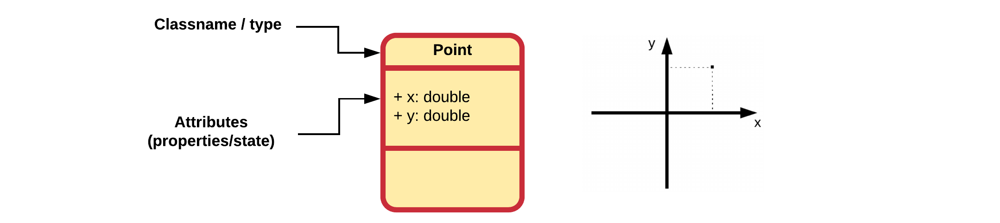
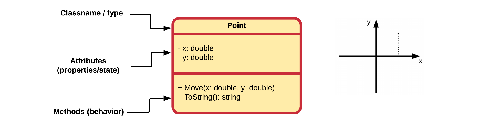

# Chapter 23 - Defining Custom Classes

Creating custom classes is one of the main responsibilities of an object oriented programmer. As stated before, an application is a collection of objects that interact with each other. These objects are created based on a class developed by a programmer. If we wish to implement some functionality that is not yet available in the language or it is not exactly what we need, we are required to build it ourselves.

<!-- Luckily even if a class is not readily available for us, we will be able to reuse other classes which contain a partial functionality of the class we which to create. -->

It's natural to think of **objects as collections of other objects**. Think about a television which contains a tuner, a screen, a power supply, an embedded system, ... We say that a television object is **composed** of these other objects. Luckily this same concept is available to us in an object oriented programming language. We can also create objects by bundling other objects. This has the big advantage that we can use objects from classes that someone else made or are part of the language libraries. This saves us a lot of time and effort. This sort of code reuse is one of the major advantages of object oriented languages.

## UML Class Diagrams

When creating an application it can often be useful to put some diagrams on paper on how you are going to take on the problem. One of the most used diagrams in the world of object oriented programming is the UML (Unified Modeling Language) class diagram.

UML is a general-purpose, modeling language in the field of software engineering, that is intended to provide a standard way to visualize the design of a system.

A class diagram is a static diagram that describes the attributes and methods of a class and the also the relationships between the different classes in an application. Class diagrams are widely used in the modeling of object oriented systems because they are the only UML diagrams, which can be mapped directly with object-oriented languages.

While methods can be made private, often these are omitted from the UML diagram. This is often the case because most programmers find them cluttering the class diagram and they are often created as needed and not important for the outside user.

When modeling software it's normal that not all details are available from the start. For example the type of the attributes should also be documented in the UML diagram, as are the arguments and return types of the methods. However sometimes those details haven't been decided yet. In that case we just leave them out and add them later.

As an example take a look at the UML class diagram of a Hotel Management System below.


<!-- Another example would be nice. Maybe something with IoT -->

Even if your are not an experienced programmer yet, you should be able to understand the concept of the application (not the details, only the general idea) just by looking at the diagram. If that is the case, its usefulness has just been proven.

## Creating a Class

When creating custom classes in C# it is convention to place the whole class and nothing but the class inside its own `cs` file. In Visual Studio this can be achieved by right clicking on your project and selecting `Add => Class`.

Consider a class that represents a point in 2D space. The class can simply be called `Point`. It is convention in C# for class names to be named using **Pascal Case**.

::: tip Pascal Case and camel Case
Pascal case is a subset of Camel Case where the first letter is capitalized. That is, userAccount is a camel case and UserAccount is a Pascal case. In C# the convention is that both method names and class names are Pascal cased. It is easy to remember. Pascal is a proper noun so capitalize the first letter, while camel is a common noun, so you do not capitalize the first letter.
:::

When adding a new class `Point` in a C# project, Visual Studio will generate the following code for you:

```csharp
using System;
using System.Collections.Generic;
using System.Text;

namespace Geometry
{
  class Point
  {
  }
}
```

The first three lines are stating which libraries we wish to be able to use. Basically at the moment we only need the `System` library but you can leave it as is.

```csharp{1-3}
using System;
using System.Collections.Generic;
using System.Text;

namespace Geometry
{
  class Point
  {
  }
}
```

Next is the `namespace` to which the class belongs. A namespace is like a container that can contain all sorts of entities such as classes. `System` is actually also a namespace. By using these containers, collisions are avoided between class names. There can for example exist a class `Point` in the namespace `Geometry` and a class `Point` in the namespace `2DGraphics`. By placing classes in namespaces we don't have to invent unique names for our classes. Namespaces also allow developers to bundle classes together that logically belong together. Visual Studio will automatically add all your classes to a namespace with the same name as the application. You can change the names of these namespaces as you wish.

```csharp{5,6,10}
using System;
using System.Collections.Generic;
using System.Text;

namespace Geometry
{
  class Point
  {
  }
}
```

Last but not least is the actual class definition. To define a class all you need is the keyword `class` followed by a name (in PascalCase) and curly braces for the body of the class.

```csharp{7-9}
using System;
using System.Collections.Generic;
using System.Text;

namespace Geometry
{
  class Point
  {
  }
}
```

<!-- TODO: For a class in C#, Internal is the default if no access modifier is specified. -->

### UML Class Diagram of Point

In its current state the `Point` class can be visualized using the class diagram shown next.


The class shape in a class diagram consists of a rectangle with three rows. The top row contains the **name of the class**, the middle row contains the **attributes of the class** (the data of the objects), and the bottom section expresses the **methods and/or constructors** (the behavior) that the class has. In a class diagram, classes and subclasses are grouped together to show the relationship between objects of these classes.

## Creating Objects

To create objects from the `Point` class one just needs to follow the object creation syntax:

```csharp
ClassName variableName = new ClassName(<arguments_if_needed>);
```

With this a new object will be created of the class and a reference to it will be stored inside of the variable.

Consider the example shown below for the `Point` class. Here a new instance of the class is requested using the `new` keyword and a reference to it is stored inside of a variable called `center`.

```csharp{4}
static void Main(string[] args)
{
  // Creating a Point object and store its reference inside a variable
  Point center = new Point();
}
```

Notice the similarity with creating an object of the class `Random`.

For the moment this is all the functionality that Point has. Not much use for us like this.

## Adding Data

Attributes hold the information and properties required by the object. They define the **data** that the object is holding or the state that it is in. Attributes are very similar to the variables that we already know. That is why attributes are also often referred to as **instance variables**, meaning variables of a class instance (aka object).

Just as variables, attributes can be of any simple data type or they can contain references to other objects. They also need a name which allows them to be used inside the methods of the objects.

Different from a normal local variable, an attribute also requires an **access modifier** to specify who can access the attribute. This can be any of the following:

* `public`: anyone can access the attribute - depicted with a plus sign `+` in UML.
* `private`: only the class itself can access the attribute - depicted with a minus sign `-` in UML.
* `protected`: only the class itself or classes derived from this class can access the attributes - depicted with a hashtag `#` in UML. More on this later.

<!-- Are there any other in C#? -->

The **default access modifier for attributes and methods** in C# is `private`. This means that if one does not specify an access modifier for the member it will only be accessible from within the class itself.

This leads to the following syntax template for adding attributes to a class:

```csharp
class ClassName {
  // Attributes of the class
  <access_modifier> <data_type> attributeName = <init_value>;
}
```

Notice how the **access modifier is placed before the declaration** of the instance variable.

Consider the example below of the class `Point` that holds the two coordinate values of a point in a 2D space. For now, the attributes are made accessible from the outside of the object declaring them `public`.

```csharp{3-4}
class Point {
  // Both x and y are attributes of the class Point
  public double x = 0;
  public double y = 0;
}
```

The declaration of attributes is very similar to the declaration of local variables. They just need to be placed inside the curly braces of the class they belong to.

It is also perfectly legal to initialize instance variables when declaring them by assigning them a value. This will make sure that when an object of the class is created, the attributes have a valid value.

Instance variables are initialized by C# to default values:

* whole numbers (`integer`, `long`, `char`, ...) default to `0`
* real numbers (`float` and `double`) default to `0.0`
* `boolean` values default to `false`
* object references default to `null`

:::warning Initialize Attributes
While C# makes sure that all variables and instance variables are initialized, it is most of the time a good idea to do it yourself. That way you will always think about which is a sane default value for each attribute. On top of that, it is a good habit as not every programming language will initialize variables for you, take C++ for example. Do always at least make sure to **initialize object references** as calling methods on `null` will crash your application.
:::

Public attributes can be accessed from outside of the object using the member operator `.`. This means that one can create a `Point` object and access the `x` and `y` attributes as shown in the following code snippet.

```csharp
static void Main(string[] args)
{
  // Creating a Point object and store its reference inside a variable
  Point center = new Point();

  // Output current location of the point
  Console.WriteLine($"[{ center.x},{ center.y}]");

  // Move the point to a new location and output it
  center.x = 15.66;
  center.y = -3.12;
  Console.WriteLine($"[{ center.x},{ center.y}]");
}
```

::: codeoutput
<pre>
[0, 0]
[15.66,-3.12]
</pre>
:::

The previous example shows that the values of attributes can both be retrieved and changed from outside of the class if they are `public`.

### UML Class Diagrams of Point

In its current state the `Point` class can be visualized using the class diagram shown below.



The second row of the class rectangle is this time populated with a list of attributes. Both attributes are `public` so they are preceded with a plus sign `+`. Also their type is specified after the name and separated by a colon `:`.

## Adding Behavior

The nice part about objects is that they **can contain both data and behavior**. This makes them **standalone entities** that have a state and a way to change or act upon that state using methods.

Consider the previous code example of the `Point` class.

```csharp
static void Main(string[] args)
{
  // Creating a Point object and store its reference inside a variable
  Point center = new Point();

  // Output current location of the point
  Console.WriteLine($"[{ center.x},{ center.y}]");

  // Move the point to a new location and output it
  center.x = 15.66;
  center.y = -3.12;
  Console.WriteLine($"[{ center.x},{ center.y}]");
}
```

Would this code not be a lot cleaner if we could request a `move` action from the `Point` to a certain x,y location? This would lead to code that looks like this:

```csharp{10}
static void Main(string[] args)
{
  // Creating a Point object and store its reference inside a variable
  Point center = new Point();

  // Output current location of the point
  Console.WriteLine($"[{ center.x},{ center.y}]");

  // Move the point to a new location and output it
  center.Move(15.66, -3.12);
  Console.WriteLine($"[{ center.x},{ center.y}]");
}
```

Instead of changing the state from the outside of the object, it's better to use a method to request a change in the objects state. A `Move()` method also makes a logical part of the class `Point`. The advantage is also that this functionality may come in handy in other place too.

### Adding a Move method to Point

Adding a `Move()` method to the `Point` class is actually not that hard. Custom methods can be added to a class by placing them between the curly braces of the class as shown next:

```csharp{3-6}
class Point {
  // A method called Move that allows us to relocate the point
  public void Move(double toX, double toY) {
    x = toX;
    y = toY;
  }

  // Both x and y are attributes of the class Point
  public double x = 0;
  public double y = 0;
}
```

::: warning static
Note that the methods that are being added to the class `Point` are **not** `static`. This is because these methods will **act on the object created from the class** `Point`. Remember that `static` methods don't require objects and are called on the classes itself.
:::

Some important things to note about the implementation of the `Move()` method are:

* If the methods needs to be accessible from outside of the class `Point`, it needs be declared `public`. So in this case, the method will be called from `Main()`, so it needs to be made public.
* Attributes can be placed at the bottom of the class or at the top. Many developers prefer that they are placed at the bottom of the class. This because most of the time a user of a class only needs to know the methods.
* Two arguments, `toX` and `toY`, are defined between the parentheses `()` of the method. These will contain the new values that are passed to the method when it is called.
* `x` and `y` are the attributes of the object. If we wish to update these with the new values in the arguments, we need to assign the arguments to the attributes.
* The return type of the `Move()` method is `void`. It does not return anything.

The implementation of the `Move()` method still needs some tweaking. Consider the names of the arguments, `toX` and `toY`. While not wrong, its often a bad idea to invent new named for things that are the same. These arguments contain the x and y coordinates to which the `Point` should be move. So it would be more obvious to call them `x` and `y`. Its perfectly legal to do this, but there is a small hiccup in the implementation because if we were to change it like that, the arguments would be assigned to themselves.

```csharp{5-6}
class Point {
  // A method called Move that allows us to relocate the point
  public void Move(double x, double y) {
    // WRONG - Arguments are assigned to themselves
    x = x;
    y = y;
  }

  // Both x and y are attributes of the class Point
  public double x = 0;
  public double y = 0;
}
```

To fix this, we need to explicitly state that the left-hand side of the assignment should be the attribute. This can be achieved by using `this.` in front of the attribute name. `this` is a reference to the current object of this class and the point operator `.` allows us to access its members, even the private ones because we are using it internally in the class.

This leads to a generally accepted implementation:

```csharp{4-5}
class Point {
  // A method called Move that allows us to relocate the point
  public void Move(double x, double y) {
    this.x = x;
    this.y = y;
  }

  // Both x and y are attributes of the class Point
  public double x = 0;
  public double y = 0;
}
```

To use the `Move()` method in `Main()` all we need to do is call it with an `x` and `y` coordinate as shown in the next code example:

```csharp{10,14}
static void Main(string[] args)
{
  // Creating a Point object and store its reference inside a variable
  Point center = new Point();

  // Output current location of the point
  Console.WriteLine($"[{ center.x},{ center.y}]");

  // Move the point to a new location and output it
  center.Move(15.66, -3.12);
  Console.WriteLine($"Moving the point to [{ center.x},{ center.y}]");

  // Move point again - wow it's so easy
  center.Move(12, 10);
  Console.WriteLine($"Moving the point to [{ center.x},{ center.y}]");
}
```

::: codeoutput
<pre>
[0, 0]
Moving the point to [15.66,-3.12]
Moving the point to [12,10]
</pre>
:::

### A ToString Method

In C# every object that is created automatically gets a number of methods that are provided by the C# language. One of these methods is the `ToString()` method which is **implicitly called when an object reference is placed inside a String context** as for example:

```csharp{7,10}
static void Main(string[] args)
{
  // Create Point object and place reference in center variable
  Point center = new Point();

  // Here an implicit call to center.ToString() is made by C#
  Console.WriteLine(center);

  // You can also explicitly call the ToString() method
  Console.WriteLine(center.ToString());
}
```

::: codeoutput
<pre>
Geometry.Point
Geometry.Point
</pre>
:::

The C# `ToString()` method is used when we need a `string` representation of an object. It is defined in the special class `Object`.

For some classes that are part of the C# library, this method generates a sensible result. However custom classes created by ourselves return the fully qualified name of the class.

The result should be a concise but informative representation of the object that is easy for a person to read. It is recommended that all classes override this method and add their own implementation.

This can be achieved by adding the following method to your class (the method signature must be exact and the `override` keyword must also be present):

```csharp{12-15}
class Point
{
  // A method called Move that allows us to relocate the point
  public void Move(double x, double y)
  {
    this.x = x;
    this.y = y;
  }

  // The ToString() method is called when an object of Point
  // is placed inside of a string context
  public override string ToString()
  {
    return "Some String representation of your object";
  }

  // Both x and y are attributes of the class Point
  public double x = 0;
  public double y = 0;
}
```

Of course the return statement `return "Some String representation of your object";` must be changed according to the representation you wish to return.

For the `Point` class the representation could be the format in which we've been outputting the points thus far: `[x, y]`. This would lead to the following implementation:

```csharp{14}
class Point
{
  // A method called Move that allows us to relocate the point
  public void Move(double x, double y)
  {
    this.x = x;
    this.y = y;
  }

  // The ToString() method is called when an object of Point
  // is placed inside of a string context
  public override string ToString()
  {
    return $"[{x},{y}]";
  }

  // Both x and y are attributes of the class Point
  public double x = 0;
  public double y = 0;
}
```

This results in a much cleaner `Main()` method:

```csharp{7,11,15}
static void Main(string[] args)
{
  // Creating a Point object and store its reference inside a variable
  Point center = new Point();

  // Output current location of the point
  Console.WriteLine(center);

  // Move the point to a new location and output it
  center.Move(15.66, -3.12);
  Console.WriteLine($"Moving the point to {center}");

  // Move point again - wow it's so easy
  center.Move(12, 10);
  Console.WriteLine($"Moving the point to {center}");
}
```

::: codeoutput
<pre>
[0,0]
Moving the point to [15.66,-3.12]
Moving the point to [12,10]
</pre>
:::

::: warning Don't print inside Classes
As a teacher, I'm already hearing you think, "Why didn't we put the `Console.WriteLine()` inside the Point class in a Print() method or something similar?" Unless you have a good reason, it's most of the time a bad idea to place `Console.WriteLine()` statements inside your custom classes. This limits their use. What if the user of your class wanted to format the output differently or output its string representation to a log file or to an API in the cloud. If you decide to send it to the terminal directly instead of returning the actual string, you are limiting the capabilities of your classes.
:::

### UML Class Diagrams of Point

In its current state the `Point` class can be visualized using the class diagram shown below.


The third row of the class rectangle is this time populated with a list of methods.

Both methods are `public` so they are preceded with a plus sign `+`.

The `Move()` method takes two arguments. Both arguments are separated using a comma. The argument themselves are represented by their name, a colon `:` followed by their type.

Notice how the return datatype of the `ToString()` method is also specified in the UML diagram, in the same way as an attribute, by placing a colon `:` after the method and then stating the datatype (`String` in this case).

## Access Modifiers - Data Hiding

While perfectly legal, in most cases it is considered blasphemy to make attributes `public` unless they are `const`.

::: tip Constant (instance) variables
Constant variables can only be assigned once. That means that they can only be initialized after which their value cannot be changed anymore. Variables and attributes can be made constant by placing the keyword `const` before the data type. So for example `public const double PI = 3.14;`.
:::

Why would one not make everything `public` and allow the user of the class access to everything? Because objects should NOT be able to directly change attributes of other objects. This is a necessity for three reasons:

* to **protect the user of the class** from himself
* to **protect the class from the user**. *Things that are hidden cannot be misused*.
* to make the code that uses the class less dependant on the internals of the class. It's better to be dependant on behavior than on data. This is one of the **SOLID** principles.
<!-- TODO: More info on this -->

Restricting access to attributes and certain methods is called **data hiding**. The attributes of a class should almost always be made `private`. A user of your class should never be able to change the inner properties directly from outside the class. If you allow users access to the inner workings of your objects they will misuse it. **Declaring an attribute as public breaks data hiding.**

Then how can one than change the state of objects? Simple, by **regulating the access to the state of the object using methods**. This allows the developer of the class to place safeguards where needed.

Take for example a class `Rectangle` which has a `width` and a `height` attribute. If these were `public`, there would be nothing to stop the user from assigning negative values to these attributes. This would be illogical. In many cases this can introduce bugs that the developer of the class never saw coming. By adding methods to set these attributes, the values can be checked for sanity.

### Refactoring Point

With **data hiding** in mind the class `Point` should actually be refactored a bit. The attributes should be made `private` instead of public. If you take a closer look at the `Main()` method, you will see that we actually don't access the attributes of a `Point` directly. This is good programming practice.

```csharp{18-19}
class Point
{
  // A method called Move that allows us to relocate the point
  public void Move(double x, double y)
  {
    this.x = x;
    this.y = y;
  }

  // The ToString() method is called when an object of Point
  // is placed inside of a string context
  public override string ToString()
  {
    return $"[{x},{y}]";
  }

  // Both x and y are attributes of the class Point
  private double x = 0;
  private double y = 0;
}
```

### UML Class Diagrams of Point

In its current state the `Point` class can be visualized using the class diagram shown below.



Notice that the attributes switched from a plus sign `+` to a min sign `-` to indicate that they are private.
